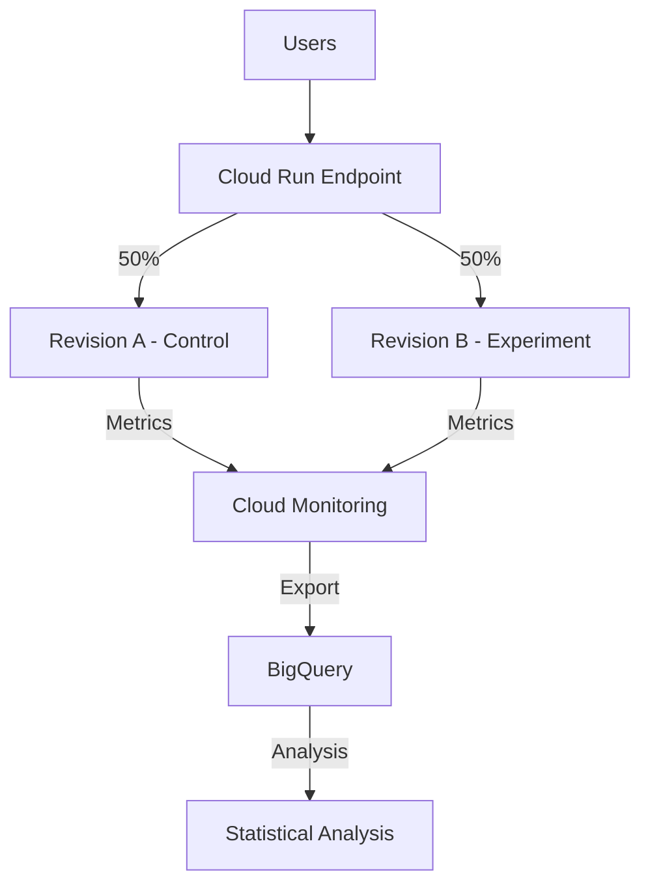

# How to Implement A/B Testing Deployments on Cloud Run Using Traffic Splitting and Cloud Monitoring

Author: [nawazdhandala](https://www.github.com/nawazdhandala)

Tags: GCP, Cloud Run, A/B Testing, Traffic Splitting, Cloud Monitoring

Description: Learn how to implement A/B testing deployments on Cloud Run using traffic splitting and Cloud Monitoring to make data-driven decisions about new features.

---

A/B testing lets you make decisions based on data instead of opinions. Instead of debating whether the new checkout flow is better, you deploy both versions, split traffic between them, and measure which one actually performs better.

Cloud Run's built-in traffic splitting makes this surprisingly simple. You can run multiple revisions simultaneously and route a percentage of traffic to each. Combined with Cloud Monitoring for metrics collection and BigQuery for analysis, you have a full A/B testing platform without any third-party tools.

## How It Works



## Step 1: Deploy the Control Version (A)

Start with your current production version as the control:

```bash
# Deploy version A (control) - this is your current production code
gcloud run deploy my-app \
  --image=gcr.io/my-project/my-app:v2.0.0 \
  --region=us-central1 \
  --platform=managed \
  --tag=control \
  --set-env-vars="VARIANT=control,EXPERIMENT_ID=checkout-flow-v2"
```

## Step 2: Deploy the Experiment Version (B)

Deploy the experimental version without sending traffic to it yet:

```bash
# Deploy version B (experiment) with no traffic
gcloud run deploy my-app \
  --image=gcr.io/my-project/my-app:v2.1.0-experiment \
  --region=us-central1 \
  --platform=managed \
  --no-traffic \
  --tag=experiment \
  --set-env-vars="VARIANT=experiment,EXPERIMENT_ID=checkout-flow-v2"
```

## Step 3: Add A/B Testing Instrumentation

Add metrics collection to your application so you can compare the two variants:

```python
# ab_metrics.py - A/B testing metrics collection
import os
import time
import uuid
from google.cloud import monitoring_v3
from flask import Flask, request, g

app = Flask(__name__)

VARIANT = os.environ.get('VARIANT', 'control')
EXPERIMENT_ID = os.environ.get('EXPERIMENT_ID', 'unknown')
PROJECT_ID = os.environ.get('GOOGLE_CLOUD_PROJECT', 'my-project')

metrics_client = monitoring_v3.MetricServiceClient()

def create_metric_descriptor():
    """Create custom metric descriptors for A/B testing (run once)."""
    project_name = f'projects/{PROJECT_ID}'

    # Conversion rate metric
    descriptor = monitoring_v3.MetricDescriptor()
    descriptor.type = 'custom.googleapis.com/ab_test/conversion'
    descriptor.metric_kind = monitoring_v3.MetricDescriptor.MetricKind.GAUGE
    descriptor.value_type = monitoring_v3.MetricDescriptor.ValueType.INT64
    descriptor.description = 'A/B test conversion events'
    descriptor.labels.append(
        monitoring_v3.LabelDescriptor(
            key='variant',
            value_type=monitoring_v3.LabelDescriptor.ValueType.STRING,
            description='A/B test variant (control or experiment)'
        )
    )
    descriptor.labels.append(
        monitoring_v3.LabelDescriptor(
            key='experiment_id',
            value_type=monitoring_v3.LabelDescriptor.ValueType.STRING,
            description='Experiment identifier'
        )
    )

    metrics_client.create_metric_descriptor(
        name=project_name,
        metric_descriptor=descriptor
    )

def track_event(event_name, value=1):
    """
    Track an A/B testing event.
    Sends a custom metric to Cloud Monitoring with the variant label.
    """
    project_name = f'projects/{PROJECT_ID}'

    series = monitoring_v3.TimeSeries()
    series.metric.type = f'custom.googleapis.com/ab_test/{event_name}'
    series.metric.labels['variant'] = VARIANT
    series.metric.labels['experiment_id'] = EXPERIMENT_ID
    series.resource.type = 'cloud_run_revision'
    series.resource.labels['project_id'] = PROJECT_ID

    now = time.time()
    point = monitoring_v3.Point()
    point.value.int64_value = value
    point.interval.end_time.seconds = int(now)
    series.points = [point]

    try:
        metrics_client.create_time_series(
            request={'name': project_name, 'time_series': [series]}
        )
    except Exception as e:
        # Do not let metric failures affect the user experience
        print(f"Metrics error: {e}")

@app.before_request
def assign_variant():
    """Add variant information to the request context."""
    g.variant = VARIANT
    g.experiment_id = EXPERIMENT_ID
    g.request_start = time.time()

@app.after_request
def track_request(response):
    """Track request metrics per variant."""
    latency_ms = (time.time() - g.request_start) * 1000

    # Add variant header so the client knows which version it got
    response.headers['X-Variant'] = VARIANT
    response.headers['X-Experiment'] = EXPERIMENT_ID

    return response
```

## Step 4: Implement Variant-Specific Features

Structure your code to handle both variants:

```python
# routes.py - API routes with A/B variant logic
from flask import jsonify, request
from ab_metrics import app, track_event, VARIANT

@app.route('/checkout', methods=['POST'])
def checkout():
    """
    Checkout endpoint that behaves differently based on the variant.
    Control uses the existing flow, experiment uses the new flow.
    """
    user_id = request.headers.get('X-User-ID', 'anonymous')
    order_data = request.json

    # Track that a user started the checkout
    track_event('checkout_started')

    if VARIANT == 'experiment':
        # New checkout flow - single page, streamlined
        result = process_streamlined_checkout(order_data)
    else:
        # Original checkout flow - multi-step
        result = process_standard_checkout(order_data)

    if result['success']:
        # Track successful conversion
        track_event('checkout_completed')
        track_event('revenue', value=int(result['total'] * 100))

    return jsonify(result)

@app.route('/api/product/<product_id>', methods=['GET'])
def get_product(product_id):
    """
    Product page - experiment variant shows a different layout.
    """
    product = fetch_product(product_id)

    track_event('product_viewed')

    if VARIANT == 'experiment':
        # Include extra fields for the new layout
        product['recommendations'] = get_recommendations(product_id)
        product['layout'] = 'v2'
    else:
        product['layout'] = 'v1'

    return jsonify(product)
```

## Step 5: Split Traffic Between Variants

Now route traffic between the two versions:

```bash
# Start with a small percentage to the experiment (10%)
gcloud run services update-traffic my-app \
  --region=us-central1 \
  --to-tags=control=90,experiment=10

# After initial validation, increase to 50/50 for statistical power
gcloud run services update-traffic my-app \
  --region=us-central1 \
  --to-tags=control=50,experiment=50
```

## Step 6: Monitor and Analyze Results

Set up a monitoring dashboard for the experiment:

```bash
# Create an A/B testing dashboard
gcloud monitoring dashboards create --config-from-file=- << 'EOF'
{
  "displayName": "A/B Test: Checkout Flow v2",
  "mosaicLayout": {
    "tiles": [
      {
        "width": 6,
        "height": 4,
        "widget": {
          "title": "Conversion Rate by Variant",
          "xyChart": {
            "dataSets": [{
              "timeSeriesQuery": {
                "timeSeriesFilter": {
                  "filter": "metric.type=\"custom.googleapis.com/ab_test/checkout_completed\" AND metric.labels.experiment_id=\"checkout-flow-v2\"",
                  "aggregation": {
                    "alignmentPeriod": "3600s",
                    "perSeriesAligner": "ALIGN_SUM",
                    "groupByFields": ["metric.labels.variant"]
                  }
                }
              }
            }]
          }
        }
      },
      {
        "width": 6,
        "height": 4,
        "widget": {
          "title": "Latency by Variant (P50)",
          "xyChart": {
            "dataSets": [{
              "timeSeriesQuery": {
                "timeSeriesFilter": {
                  "filter": "resource.type=\"cloud_run_revision\" AND metric.type=\"run.googleapis.com/request_latencies\"",
                  "aggregation": {
                    "alignmentPeriod": "300s",
                    "perSeriesAligner": "ALIGN_PERCENTILE_50",
                    "groupByFields": ["resource.labels.revision_name"]
                  }
                }
              }
            }]
          }
        }
      },
      {
        "width": 12,
        "height": 4,
        "widget": {
          "title": "Error Rate by Variant",
          "xyChart": {
            "dataSets": [{
              "timeSeriesQuery": {
                "timeSeriesFilter": {
                  "filter": "resource.type=\"cloud_run_revision\" AND metric.type=\"run.googleapis.com/request_count\" AND metric.labels.response_code_class=\"5xx\"",
                  "aggregation": {
                    "alignmentPeriod": "300s",
                    "perSeriesAligner": "ALIGN_RATE",
                    "groupByFields": ["resource.labels.revision_name"]
                  }
                }
              }
            }]
          }
        }
      }
    ]
  }
}
EOF
```

## Step 7: Export Data to BigQuery for Statistical Analysis

Export metrics to BigQuery for deeper analysis:

```bash
# Create a log sink that exports A/B test events to BigQuery
gcloud logging sinks create ab-test-export \
  bigquery.googleapis.com/projects/my-project/datasets/ab_testing \
  --log-filter='resource.type="cloud_run_revision" AND jsonPayload.experiment_id="checkout-flow-v2"'
```

Run statistical analysis in BigQuery:

```sql
-- Calculate conversion rates and statistical significance
WITH experiment_data AS (
  SELECT
    jsonPayload.variant AS variant,
    COUNT(DISTINCT jsonPayload.user_id) AS total_users,
    COUNTIF(jsonPayload.event = 'checkout_completed') AS conversions,
    SUM(CASE WHEN jsonPayload.event = 'revenue'
        THEN CAST(jsonPayload.value AS INT64) / 100.0
        ELSE 0 END) AS total_revenue
  FROM `my-project.ab_testing.run_googleapis_com_requests`
  WHERE jsonPayload.experiment_id = 'checkout-flow-v2'
    AND timestamp >= TIMESTAMP_SUB(CURRENT_TIMESTAMP(), INTERVAL 7 DAY)
  GROUP BY variant
)
SELECT
  variant,
  total_users,
  conversions,
  ROUND(conversions / total_users * 100, 2) AS conversion_rate_pct,
  ROUND(total_revenue, 2) AS total_revenue,
  ROUND(total_revenue / total_users, 2) AS revenue_per_user
FROM experiment_data
ORDER BY variant;
```

## Step 8: Conclude the Experiment

Once you have statistically significant results:

```bash
# If experiment wins - route all traffic to experiment
gcloud run services update-traffic my-app \
  --region=us-central1 \
  --to-tags=experiment=100

# Then deploy the experiment code as the new default
gcloud run deploy my-app \
  --image=gcr.io/my-project/my-app:v2.1.0 \
  --region=us-central1

# If control wins - revert to control
gcloud run services update-traffic my-app \
  --region=us-central1 \
  --to-latest
```

## Wrapping Up

A/B testing on Cloud Run is straightforward because traffic splitting is a first-class feature. Deploy two revisions, split traffic, collect metrics, and let the data decide. The combination of Cloud Run's traffic management, Cloud Monitoring for real-time metrics, and BigQuery for statistical analysis gives you a complete experimentation platform without any additional infrastructure.

Run experiments for at least a week to account for day-of-week patterns, and make sure you have enough traffic for statistical significance before drawing conclusions. The goal is to replace gut feelings with data-driven decisions.
