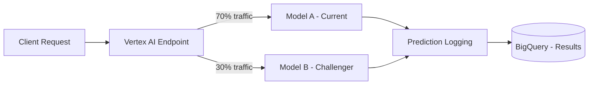

# How to Implement A/B Testing for Machine Learning Models on Vertex AI Endpoints

Author: [nawazdhandala](https://www.github.com/nawazdhandala)

Tags: Vertex AI, A/B Testing, MLOps, Model Deployment, Google Cloud

Description: Learn how to implement A/B testing for machine learning models using Vertex AI Endpoints with traffic splitting and statistical significance analysis.

---

You have trained a new model that looks better on your test set. The metrics are up, the loss is down, and everything looks great in your evaluation notebook. But will it actually perform better in production? Test metrics and production performance are not always the same thing. The only way to know for sure is to run an A/B test - serve both the old and new models to real traffic and compare the results.

Vertex AI Endpoints make this straightforward with built-in traffic splitting. In this post, I will show you how to set up an A/B test between model versions, collect the results, and make a statistically sound decision about which model to keep.

## How Traffic Splitting Works on Vertex AI

A Vertex AI Endpoint can serve multiple deployed models simultaneously. You control what percentage of traffic goes to each model. When a prediction request comes in, the endpoint routes it to one of the deployed models based on the traffic split percentages.



## Step 1: Deploy Both Models to the Same Endpoint

First, deploy your current production model (Model A) and the challenger model (Model B) to the same endpoint with a traffic split.

```python
# setup_ab_test.py
from google.cloud import aiplatform

aiplatform.init(project="my-project", location="us-central1")

# Get or create the endpoint
endpoint = aiplatform.Endpoint("ENDPOINT_ID")

# Deploy Model A (the current production model) with 70% traffic
model_a = aiplatform.Model("projects/my-project/locations/us-central1/models/MODEL_A_ID")

endpoint.deploy(
    model=model_a,
    deployed_model_display_name="model-a-control",
    machine_type="n1-standard-4",
    min_replica_count=2,
    max_replica_count=10,
    traffic_percentage=70,
)

# Deploy Model B (the challenger) with 30% traffic
model_b = aiplatform.Model("projects/my-project/locations/us-central1/models/MODEL_B_ID")

endpoint.deploy(
    model=model_b,
    deployed_model_display_name="model-b-challenger",
    machine_type="n1-standard-4",
    min_replica_count=2,
    max_replica_count=10,
    traffic_percentage=30,
)

print(f"A/B test configured on endpoint: {endpoint.resource_name}")
print("Model A (control): 70% traffic")
print("Model B (challenger): 30% traffic")
```

## Step 2: Enable Prediction Logging

To analyze the A/B test results, you need to log which model served each prediction and what the outcome was. Enable request-response logging on the endpoint.

```python
# enable_logging.py
from google.cloud import aiplatform

endpoint = aiplatform.Endpoint("ENDPOINT_ID")

# Enable prediction request-response logging to BigQuery
endpoint.update(
    traffic_split={
        "model-a-control": 70,
        "model-b-challenger": 30,
    },
    # Enable logging of prediction requests and responses
    predict_request_response_logging_config={
        "enabled": True,
        "sampling_rate": 1.0,  # Log all requests during the test
        "bigquery_destination": {
            "output_uri": "bq://my-project.ml_experiments.prediction_logs"
        }
    }
)

print("Prediction logging enabled")
```

## Step 3: Build a Custom Logging Wrapper

For richer logging that includes the model version identifier, build a wrapper around your prediction calls.

```python
# prediction_client.py
from google.cloud import aiplatform
from google.cloud import bigquery
import uuid
import time
import json

class ABTestPredictionClient:
    """Client that makes predictions and logs results for A/B analysis."""

    def __init__(self, endpoint_id, project_id, log_table):
        aiplatform.init(project=project_id, location="us-central1")
        self.endpoint = aiplatform.Endpoint(endpoint_id)
        self.bq_client = bigquery.Client()
        self.log_table = log_table

    def predict_and_log(self, instance, user_id=None):
        """Make a prediction and log the details for A/B analysis."""
        request_id = str(uuid.uuid4())
        start_time = time.time()

        # Make the prediction
        response = self.endpoint.predict(
            instances=[instance],
        )

        latency_ms = (time.time() - start_time) * 1000

        # The response includes which deployed model served the request
        deployed_model_id = response.deployed_model_id

        # Determine which model group this belongs to
        model_group = self._get_model_group(deployed_model_id)

        # Log the prediction details
        log_entry = {
            "request_id": request_id,
            "user_id": user_id,
            "model_group": model_group,
            "deployed_model_id": deployed_model_id,
            "prediction": json.dumps(response.predictions[0]),
            "latency_ms": latency_ms,
            "timestamp": time.time(),
            "input_features": json.dumps(instance),
        }

        self._write_log(log_entry)

        return {
            "prediction": response.predictions[0],
            "request_id": request_id,
            "model_group": model_group,
        }

    def log_outcome(self, request_id, outcome):
        """Log the actual outcome for a previous prediction.
        Call this when you know the ground truth."""
        update_query = f"""
        UPDATE `{self.log_table}`
        SET actual_outcome = @outcome,
            outcome_timestamp = CURRENT_TIMESTAMP()
        WHERE request_id = @request_id
        """

        job_config = bigquery.QueryJobConfig(
            query_parameters=[
                bigquery.ScalarQueryParameter("outcome", "STRING", json.dumps(outcome)),
                bigquery.ScalarQueryParameter("request_id", "STRING", request_id),
            ]
        )

        self.bq_client.query(update_query, job_config=job_config).result()

    def _get_model_group(self, deployed_model_id):
        """Map a deployed model ID to its test group."""
        # Look up the deployed model to get its display name
        for dm in self.endpoint.list_models():
            if dm.id == deployed_model_id:
                if "control" in dm.display_name:
                    return "control"
                elif "challenger" in dm.display_name:
                    return "challenger"
        return "unknown"

    def _write_log(self, entry):
        """Write a log entry to BigQuery."""
        errors = self.bq_client.insert_rows_json(self.log_table, [entry])
        if errors:
            print(f"Error writing log: {errors}")
```

## Step 4: Analyze the A/B Test Results

After running the test for a sufficient period, analyze the results to determine which model performs better.

```sql
-- Compare prediction accuracy between model groups
-- This assumes you have logged actual outcomes
SELECT
    model_group,
    COUNT(*) AS total_predictions,
    -- Calculate accuracy for classification models
    COUNTIF(JSON_EXTRACT_SCALAR(prediction, '$.class') =
            JSON_EXTRACT_SCALAR(actual_outcome, '$.class')) AS correct_predictions,
    ROUND(
        COUNTIF(JSON_EXTRACT_SCALAR(prediction, '$.class') =
                JSON_EXTRACT_SCALAR(actual_outcome, '$.class'))
        / COUNT(*) * 100, 2
    ) AS accuracy_pct,
    -- Calculate average latency
    ROUND(AVG(latency_ms), 2) AS avg_latency_ms,
    ROUND(APPROX_QUANTILES(latency_ms, 100)[OFFSET(95)], 2) AS p95_latency_ms,
    ROUND(APPROX_QUANTILES(latency_ms, 100)[OFFSET(99)], 2) AS p99_latency_ms
FROM
    `ml_experiments.prediction_logs`
WHERE
    actual_outcome IS NOT NULL
    AND timestamp > UNIX_SECONDS(TIMESTAMP_SUB(CURRENT_TIMESTAMP(), INTERVAL 7 DAY))
GROUP BY
    model_group;
```

## Step 5: Run Statistical Significance Tests

Do not just look at the raw numbers - make sure the difference is statistically significant before making a decision.

```python
# analyze_ab_test.py
from google.cloud import bigquery
from scipy import stats
import numpy as np

def analyze_ab_test(log_table, metric="accuracy"):
    """Perform statistical analysis of A/B test results."""
    client = bigquery.Client()

    # Fetch outcomes for each model group
    query = f"""
    SELECT
        model_group,
        CASE
            WHEN JSON_EXTRACT_SCALAR(prediction, '$.class') =
                 JSON_EXTRACT_SCALAR(actual_outcome, '$.class')
            THEN 1 ELSE 0
        END AS correct
    FROM `{log_table}`
    WHERE actual_outcome IS NOT NULL
    """

    df = client.query(query).to_dataframe()

    control = df[df["model_group"] == "control"]["correct"]
    challenger = df[df["model_group"] == "challenger"]["correct"]

    print(f"Control group (Model A):")
    print(f"  Sample size: {len(control)}")
    print(f"  Accuracy: {control.mean():.4f}")

    print(f"\nChallenger group (Model B):")
    print(f"  Sample size: {len(challenger)}")
    print(f"  Accuracy: {challenger.mean():.4f}")

    # Run a two-proportion z-test
    # This tells us if the difference in accuracy is statistically significant
    count_a = control.sum()
    nobs_a = len(control)
    count_b = challenger.sum()
    nobs_b = len(challenger)

    z_stat, p_value = stats.proportions_ztest(
        [count_a, count_b],
        [nobs_a, nobs_b],
        alternative="two-sided"
    )

    print(f"\nStatistical Test Results:")
    print(f"  Z-statistic: {z_stat:.4f}")
    print(f"  P-value: {p_value:.6f}")

    # Use significance level of 0.05
    alpha = 0.05
    if p_value < alpha:
        winner = "challenger" if challenger.mean() > control.mean() else "control"
        print(f"\n  Result: SIGNIFICANT difference detected (p < {alpha})")
        print(f"  Winner: {winner}")
    else:
        print(f"\n  Result: No significant difference (p >= {alpha})")
        print(f"  Recommendation: Continue the test or keep the control model")

    return {
        "control_accuracy": control.mean(),
        "challenger_accuracy": challenger.mean(),
        "p_value": p_value,
        "significant": p_value < alpha,
    }
```

## Step 6: Promote the Winner

Once you have a statistically significant winner, update the traffic split to give it 100% of the traffic.

```python
# promote_winner.py
from google.cloud import aiplatform

def promote_model(endpoint_id, winner_model_name, loser_model_name):
    """Shift all traffic to the winning model and undeploy the loser."""
    aiplatform.init(project="my-project", location="us-central1")

    endpoint = aiplatform.Endpoint(endpoint_id)

    # Get the deployed model IDs
    deployed_models = {dm.display_name: dm.id for dm in endpoint.list_models()}

    winner_id = deployed_models[winner_model_name]
    loser_id = deployed_models[loser_model_name]

    # Route 100% traffic to the winner
    endpoint.update(
        traffic_split={winner_id: 100, loser_id: 0}
    )
    print(f"All traffic routed to {winner_model_name}")

    # Wait for traffic to drain, then undeploy the loser
    import time
    print("Waiting 5 minutes for traffic to drain...")
    time.sleep(300)

    endpoint.undeploy(deployed_model_id=loser_id)
    print(f"Undeployed {loser_model_name}")

# Example usage
results = analyze_ab_test("ml_experiments.prediction_logs")
if results["significant"]:
    if results["challenger_accuracy"] > results["control_accuracy"]:
        promote_model("ENDPOINT_ID", "model-b-challenger", "model-a-control")
    else:
        promote_model("ENDPOINT_ID", "model-a-control", "model-b-challenger")
```

## Sample Size Considerations

Before starting an A/B test, calculate how many predictions you need to detect a meaningful difference. Running the test too briefly leads to inconclusive results.

```python
# sample_size_calculator.py
from scipy.stats import norm
import math

def required_sample_size(
    baseline_rate,
    minimum_detectable_effect,
    alpha=0.05,
    power=0.80,
):
    """Calculate the minimum sample size for each group.
    This ensures you can detect the specified effect with statistical confidence."""
    z_alpha = norm.ppf(1 - alpha / 2)
    z_beta = norm.ppf(power)

    p1 = baseline_rate
    p2 = baseline_rate + minimum_detectable_effect
    p_avg = (p1 + p2) / 2

    n = (
        (z_alpha * math.sqrt(2 * p_avg * (1 - p_avg))
         + z_beta * math.sqrt(p1 * (1 - p1) + p2 * (1 - p2))) ** 2
        / minimum_detectable_effect ** 2
    )

    return math.ceil(n)

# Example: detect a 2% improvement over 85% baseline accuracy
n = required_sample_size(0.85, 0.02)
print(f"Required sample size per group: {n}")
# This tells you how long to run the test based on your traffic volume
```

## Wrapping Up

A/B testing ML models on Vertex AI Endpoints is straightforward thanks to built-in traffic splitting. The process is: deploy both models with a traffic split, log predictions and outcomes, run the test until you have enough data, perform a statistical significance test, and promote the winner. The critical part is patience - do not cut the test short just because early results look promising. Statistical significance takes time, and premature decisions based on small samples can lead you to deploy a worse model.
