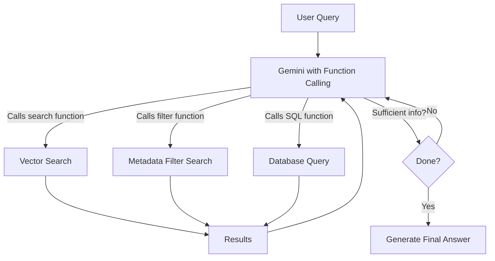

# How to Implement Agentic RAG with LangChain and Vertex AI Function Calling

Author: [nawazdhandala](https://www.github.com/nawazdhandala)

Tags: GCP, LangChain, Vertex AI, Agentic RAG, Function Calling

Description: Learn how to build agentic RAG systems using LangChain and Vertex AI function calling to create intelligent retrieval that adapts based on query complexity.

---

Standard RAG follows a fixed pattern: retrieve documents, stuff them into a prompt, generate an answer. It works, but it breaks down when the query is ambiguous, requires information from multiple sources, or needs filtering that the retrieval step cannot handle on its own. Agentic RAG gives the language model control over the retrieval process itself. Using Vertex AI's function calling capabilities with LangChain, you can build a system where the model decides what to search for, evaluates results, and iterates until it has enough information.

This guide covers implementing agentic RAG where Gemini models actively drive the retrieval process through function calling.

## How Agentic RAG Differs from Standard RAG

In standard RAG, the pipeline looks like this: query goes in, top-k documents come out, LLM generates an answer. The model has no say in how retrieval happens.

In agentic RAG, the model acts as the orchestrator. It can:

- Decide which retrieval function to call
- Formulate the search query itself
- Inspect results and decide if they are sufficient
- Issue follow-up queries with refined terms
- Combine information from multiple retrieval calls



## Prerequisites

- Google Cloud project with Vertex AI API enabled
- Python 3.9+
- A document collection to search against

```bash
# Install required packages
pip install langchain langchain-google-vertexai langchain-community google-cloud-aiplatform faiss-cpu
```

## Setting Up the Knowledge Base

First, let us create a searchable knowledge base using FAISS as the vector store and Vertex AI for embeddings.

```python
from langchain_google_vertexai import VertexAIEmbeddings
from langchain_community.vectorstores import FAISS
from langchain_core.documents import Document

# Initialize embeddings
embeddings = VertexAIEmbeddings(
    model_name="text-embedding-004",
    project="your-project-id",
)

# Create a knowledge base with sample documents
documents = [
    Document(page_content="The standard plan costs $29 per month and includes 5 users, 10GB storage, and email support.", metadata={"category": "pricing", "plan": "standard"}),
    Document(page_content="The professional plan costs $79 per month and includes 25 users, 100GB storage, email and chat support, and API access.", metadata={"category": "pricing", "plan": "professional"}),
    Document(page_content="The enterprise plan has custom pricing based on usage. It includes unlimited users, unlimited storage, 24/7 phone support, dedicated account manager, and SLA guarantees.", metadata={"category": "pricing", "plan": "enterprise"}),
    Document(page_content="To reset your password, go to Settings > Security > Change Password. You will receive a confirmation email.", metadata={"category": "how-to", "topic": "account"}),
    Document(page_content="API rate limits are 100 requests per minute for standard, 500 for professional, and custom limits for enterprise plans.", metadata={"category": "technical", "topic": "api"}),
    Document(page_content="Our uptime SLA guarantees 99.9% for professional plans and 99.99% for enterprise plans. Standard plans do not include an SLA.", metadata={"category": "sla", "plan": "all"}),
    Document(page_content="Data is encrypted at rest using AES-256 and in transit using TLS 1.3. All data centers are SOC 2 Type II certified.", metadata={"category": "security", "topic": "encryption"}),
    Document(page_content="Refund requests must be submitted within 30 days of purchase. Enterprise contracts have custom refund terms.", metadata={"category": "billing", "topic": "refunds"}),
]

# Build the vector store
vector_store = FAISS.from_documents(documents, embeddings)
```

## Defining Retrieval Functions

The key to agentic RAG is defining multiple retrieval functions that the model can choose from. Each function serves a different purpose.

```python
from langchain_core.tools import tool

@tool
def semantic_search(query: str) -> str:
    """Search the knowledge base using semantic similarity. Use this for general
    questions where you need to find conceptually related information."""
    results = vector_store.similarity_search_with_score(query, k=3)
    formatted = []
    for doc, score in results:
        formatted.append(
            f"[Score: {score:.3f}] [{doc.metadata.get('category', '')}] {doc.page_content}"
        )
    return "\n\n".join(formatted) if formatted else "No relevant documents found."

@tool
def filtered_search(query: str, category: str) -> str:
    """Search the knowledge base with a category filter. Use this when the user's
    question is about a specific topic like pricing, security, billing, or technical details.
    Available categories: pricing, how-to, technical, sla, security, billing."""
    # Filter by metadata category
    results = vector_store.similarity_search(
        query,
        k=3,
        filter={"category": category},
    )
    formatted = [
        f"[{doc.metadata.get('category', '')}] {doc.page_content}"
        for doc in results
    ]
    return "\n\n".join(formatted) if formatted else f"No results found in category '{category}'."

@tool
def compare_plans(plan_names: str) -> str:
    """Compare specific plans by retrieving details for each. Use this when the user
    wants to compare features or pricing between plans. Pass plan names as comma-separated values."""
    plans = [p.strip().lower() for p in plan_names.split(",")]
    results = []
    for plan in plans:
        docs = vector_store.similarity_search(
            f"{plan} plan features pricing",
            k=2,
            filter={"plan": plan},
        )
        for doc in docs:
            results.append(f"[{plan} plan] {doc.page_content}")

    return "\n\n".join(results) if results else "Could not find details for the specified plans."
```

## Building the Agentic RAG System

Now we create an agent that uses these retrieval functions through Vertex AI function calling.

```python
from langchain_google_vertexai import ChatVertexAI
from langchain.agents import create_react_agent, AgentExecutor
from langchain_core.prompts import ChatPromptTemplate, MessagesPlaceholder

# Initialize Gemini with function calling support
llm = ChatVertexAI(
    model_name="gemini-1.5-pro",
    project="your-project-id",
    location="us-central1",
    temperature=0.1,
)

# Collect all retrieval tools
tools = [semantic_search, filtered_search, compare_plans]

# Create the agent prompt with retrieval strategy guidance
prompt = ChatPromptTemplate.from_messages([
    ("system", """You are a helpful assistant with access to a knowledge base through multiple search tools.

Retrieval strategy:
1. For general questions, start with semantic_search
2. For topic-specific questions (pricing, security, etc.), use filtered_search with the appropriate category
3. For plan comparisons, use compare_plans
4. If initial results are insufficient, try a different search approach or reformulate your query
5. Combine information from multiple searches when needed
6. Always base your answer on retrieved information, not your own knowledge
7. If the knowledge base does not contain the answer, say so clearly

Be thorough but avoid redundant searches."""),
    MessagesPlaceholder(variable_name="chat_history", optional=True),
    ("human", "{input}"),
    MessagesPlaceholder(variable_name="agent_scratchpad"),
])

# Create the agent
agent = create_react_agent(llm=llm, tools=tools, prompt=prompt)

agent_executor = AgentExecutor(
    agent=agent,
    tools=tools,
    verbose=True,
    max_iterations=5,
    handle_parsing_errors=True,
    return_intermediate_steps=True,
)
```

## Testing Different Query Types

```python
# Simple factual query - should use semantic_search
result1 = agent_executor.invoke({
    "input": "How do I reset my password?",
    "chat_history": [],
})
print(f"Answer: {result1['output']}")
print(f"Tools used: {[step[0].tool for step in result1['intermediate_steps']]}")

# Category-specific query - should use filtered_search
result2 = agent_executor.invoke({
    "input": "What security certifications do you have?",
    "chat_history": [],
})
print(f"Answer: {result2['output']}")
print(f"Tools used: {[step[0].tool for step in result2['intermediate_steps']]}")

# Comparison query - should use compare_plans
result3 = agent_executor.invoke({
    "input": "Compare the standard and professional plans for me",
    "chat_history": [],
})
print(f"Answer: {result3['output']}")
print(f"Tools used: {[step[0].tool for step in result3['intermediate_steps']]}")

# Complex multi-part query - should use multiple tools
result4 = agent_executor.invoke({
    "input": "I need a plan with API access and at least 99.9% uptime SLA. What are my options and how much do they cost?",
    "chat_history": [],
})
print(f"Answer: {result4['output']}")
print(f"Tools used: {[step[0].tool for step in result4['intermediate_steps']]}")
```

## Using Vertex AI Native Function Calling

For tighter integration with Vertex AI, you can use the native function calling API instead of LangChain's ReAct pattern.

```python
from langchain_google_vertexai import ChatVertexAI

# Gemini models support native function calling
llm_with_tools = ChatVertexAI(
    model_name="gemini-1.5-pro",
    project="your-project-id",
    location="us-central1",
    temperature=0.1,
)

# Bind tools directly to the model for native function calling
llm_with_tools = llm_with_tools.bind_tools(tools)

# The model will return tool calls in its response
response = llm_with_tools.invoke("What is the pricing for the professional plan?")

# Check if the model wants to call a tool
if response.tool_calls:
    for tool_call in response.tool_calls:
        print(f"Tool: {tool_call['name']}")
        print(f"Args: {tool_call['args']}")
```

## Adding Self-Reflection

A more advanced pattern has the agent evaluate its own retrieval quality before answering.

```python
@tool
def evaluate_retrieval(question: str, retrieved_info: str) -> str:
    """Evaluate whether the retrieved information is sufficient to answer the question.
    Returns 'SUFFICIENT' if the information is adequate, or a suggestion for what
    additional information is needed."""
    # In production, this could use a separate LLM call for evaluation
    # For simplicity, we check basic heuristics
    if len(retrieved_info) < 50:
        return "INSUFFICIENT - Very little information retrieved. Try a broader search."
    if "No relevant documents" in retrieved_info or "No results found" in retrieved_info:
        return "INSUFFICIENT - No matching documents. Try different search terms."
    return "SUFFICIENT - Retrieved information appears adequate to answer the question."
```

## Performance Considerations

Agentic RAG makes more LLM calls than standard RAG since the model reasons about each retrieval step. Here are ways to keep costs and latency manageable:

- Use `gemini-1.5-flash` for the retrieval reasoning steps and `gemini-1.5-pro` for the final answer generation
- Set `max_iterations` to prevent runaway loops
- Cache retrieval results for identical queries
- Pre-filter the vector store when possible to reduce search space

## Summary

Agentic RAG with LangChain and Vertex AI function calling gives your retrieval system the ability to think about what it needs before searching. Instead of blindly retrieving top-k documents, the model selects the right search strategy, evaluates results, and iterates. This produces better answers for complex queries at the cost of additional LLM calls. Start with a few well-defined retrieval tools, test the agent's routing decisions, and add more specialized tools as you find gaps in coverage.
