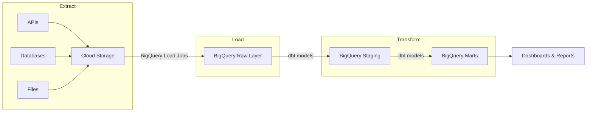

# How to Implement an ELT Pattern on GCP Using Cloud Storage BigQuery and dbt

Author: [nawazdhandala](https://www.github.com/nawazdhandala)

Tags: GCP, BigQuery, dbt, ELT, Cloud Storage, Data Engineering, Data Transformation

Description: A practical guide to building an ELT data pipeline on GCP where data is extracted to Cloud Storage, loaded into BigQuery, and transformed using dbt for analytics-ready output.

---

The ELT pattern flips the traditional ETL approach on its head. Instead of transforming data before loading it into the warehouse, you load the raw data first and transform it inside the warehouse. This works especially well on GCP because BigQuery is powerful enough to handle the transformation step at scale, and dbt gives you a clean framework for managing those transformations as code. Here is how to put it all together.

## Why ELT Over ETL

With ETL, you need a separate processing layer (like Dataflow or Spark) to transform data before loading. This adds infrastructure to maintain, and if the transformation logic needs to change, you have to redeploy a processing job. With ELT, the raw data lives in BigQuery, and transformations are just SQL models managed by dbt. Changing a transformation is as simple as editing a SQL file and running `dbt run`.



## Step 1: Extract Data to Cloud Storage

The first step is getting your source data into Cloud Storage. This could be database exports, API responses, or file drops from external systems.

Here is a Cloud Function that extracts data from a REST API:

```python
# extract_api_data.py - Cloud Function to extract data from an API to GCS
import functions_framework
from google.cloud import storage
from datetime import datetime
import requests
import json

@functions_framework.http
def extract_orders(request):
    """Extract order data from the source API and save to Cloud Storage."""
    client = storage.Client()
    bucket = client.bucket('my-project-raw-data')

    # Determine the date range to extract
    today = datetime.now().strftime('%Y-%m-%d')

    # Call the source API
    response = requests.get(
        'https://api.source-system.com/v1/orders',
        params={'date': today},
        headers={'Authorization': f'Bearer {get_api_key()}'}
    )
    response.raise_for_status()

    # Write the raw JSON response to Cloud Storage
    blob = bucket.blob(f'orders/{today}/orders.json')
    blob.upload_from_string(
        json.dumps(response.json()),
        content_type='application/json'
    )

    return f'Extracted {len(response.json())} orders for {today}', 200


def get_api_key():
    """Retrieve API key from Secret Manager."""
    from google.cloud import secretmanager
    client = secretmanager.SecretManagerServiceClient()
    name = "projects/my-project/secrets/source-api-key/versions/latest"
    response = client.access_secret_version(request={"name": name})
    return response.payload.data.decode("UTF-8")
```

For database sources, use a scheduled export:

```bash
# Export from Cloud SQL to Cloud Storage
gcloud sql export csv my-cloud-sql-instance \
  gs://my-project-raw-data/customers/$(date +%Y-%m-%d)/customers.csv \
  --database=production \
  --query="SELECT id, email, name, created_at, updated_at FROM customers WHERE updated_at >= CURRENT_DATE - INTERVAL 1 DAY"
```

## Step 2: Load Raw Data into BigQuery

Load the extracted data into BigQuery's raw layer with minimal transformation:

```bash
# Load JSON data from Cloud Storage into BigQuery
bq load \
  --source_format=NEWLINE_DELIMITED_JSON \
  --autodetect \
  --replace \
  my-project:raw.orders \
  gs://my-project-raw-data/orders/$(date +%Y-%m-%d)/orders.json

# Load CSV data
bq load \
  --source_format=CSV \
  --skip_leading_rows=1 \
  --autodetect \
  --replace \
  my-project:raw.customers \
  gs://my-project-raw-data/customers/$(date +%Y-%m-%d)/customers.csv
```

For a more automated approach, use BigQuery Data Transfer Service:

```bash
# Set up a scheduled transfer from Cloud Storage to BigQuery
bq mk --transfer_config \
  --data_source=google_cloud_storage \
  --display_name="Daily Orders Load" \
  --target_dataset=raw \
  --params='{
    "data_path_template": "gs://my-project-raw-data/orders/*/orders.json",
    "destination_table_name_template": "orders",
    "file_format": "JSON",
    "write_disposition": "APPEND"
  }' \
  --schedule="every 24 hours"
```

## Step 3: Set Up dbt for BigQuery

Initialize a dbt project configured for BigQuery:

```bash
# Install dbt with the BigQuery adapter
pip install dbt-bigquery

# Initialize a new dbt project
dbt init my_analytics
cd my_analytics
```

Configure the BigQuery connection in your dbt profile:

```yaml
# ~/.dbt/profiles.yml - dbt connection profile for BigQuery
my_analytics:
  target: dev
  outputs:
    dev:
      type: bigquery
      method: oauth
      project: my-project
      dataset: dbt_dev
      location: us-central1
      threads: 4
      timeout_seconds: 300

    prod:
      type: bigquery
      method: service-account
      project: my-project
      dataset: analytics
      location: us-central1
      threads: 8
      timeout_seconds: 300
      keyfile: /path/to/service-account.json
```

## Step 4: Create dbt Staging Models

Staging models clean and standardize the raw data. They are the dbt equivalent of the silver layer:

```sql
-- models/staging/stg_orders.sql
-- Clean and type-cast raw orders data
{{ config(
    materialized='view',
    schema='staging'
) }}

WITH source AS (
    SELECT *
    FROM {{ source('raw', 'orders') }}
),

-- Clean and standardize the raw data
cleaned AS (
    SELECT
        CAST(order_id AS STRING) AS order_id,
        CAST(customer_id AS STRING) AS customer_id,
        SAFE.PARSE_DATE('%Y-%m-%d', order_date) AS order_date,
        LOWER(TRIM(status)) AS order_status,
        CAST(total_amount AS NUMERIC) AS total_amount,
        CAST(item_count AS INT64) AS item_count,
        SAFE.PARSE_TIMESTAMP('%Y-%m-%dT%H:%M:%SZ', created_at) AS created_at,
        SAFE.PARSE_TIMESTAMP('%Y-%m-%dT%H:%M:%SZ', updated_at) AS updated_at
    FROM source
    WHERE order_id IS NOT NULL
)

SELECT * FROM cleaned
```

```sql
-- models/staging/stg_customers.sql
-- Clean and standardize raw customer data
{{ config(
    materialized='view',
    schema='staging'
) }}

WITH source AS (
    SELECT *
    FROM {{ source('raw', 'customers') }}
),

cleaned AS (
    SELECT
        CAST(id AS STRING) AS customer_id,
        LOWER(TRIM(email)) AS email,
        TRIM(name) AS customer_name,
        SAFE.PARSE_TIMESTAMP('%Y-%m-%d %H:%M:%S', created_at) AS created_at,
        SAFE.PARSE_TIMESTAMP('%Y-%m-%d %H:%M:%S', updated_at) AS updated_at
    FROM source
    WHERE id IS NOT NULL
)

SELECT * FROM cleaned
```

Define the source tables:

```yaml
# models/staging/sources.yml - Source table definitions
version: 2

sources:
  - name: raw
    database: my-project
    schema: raw
    tables:
      - name: orders
        description: "Raw order data loaded from the source API"
        loaded_at_field: _PARTITIONTIME
        freshness:
          warn_after: {count: 12, period: hour}
          error_after: {count: 24, period: hour}
      - name: customers
        description: "Raw customer data exported from Cloud SQL"
```

## Step 5: Create dbt Mart Models

Mart models create business-ready datasets for specific teams or use cases:

```sql
-- models/marts/fct_orders.sql
-- Fact table joining orders with customer data
{{ config(
    materialized='table',
    schema='marts',
    partition_by={
      "field": "order_date",
      "data_type": "date",
      "granularity": "month"
    },
    cluster_by=['order_status', 'customer_id']
) }}

WITH orders AS (
    SELECT * FROM {{ ref('stg_orders') }}
),

customers AS (
    SELECT * FROM {{ ref('stg_customers') }}
),

-- Join orders with customer information
final AS (
    SELECT
        o.order_id,
        o.customer_id,
        c.customer_name,
        c.email AS customer_email,
        o.order_date,
        o.order_status,
        o.total_amount,
        o.item_count,
        -- Calculate days since customer joined
        DATE_DIFF(o.order_date, DATE(c.created_at), DAY) AS days_since_signup,
        -- Determine if this is the customer's first order
        ROW_NUMBER() OVER (
            PARTITION BY o.customer_id
            ORDER BY o.order_date
        ) = 1 AS is_first_order,
        o.created_at,
        o.updated_at
    FROM orders o
    LEFT JOIN customers c ON o.customer_id = c.customer_id
)

SELECT * FROM final
```

```sql
-- models/marts/dim_customer_metrics.sql
-- Customer-level metrics for the marketing team
{{ config(
    materialized='table',
    schema='marts',
    cluster_by=['customer_segment']
) }}

WITH orders AS (
    SELECT * FROM {{ ref('fct_orders') }}
),

-- Aggregate customer-level metrics
customer_metrics AS (
    SELECT
        customer_id,
        customer_name,
        customer_email,
        COUNT(*) AS total_orders,
        SUM(total_amount) AS lifetime_value,
        AVG(total_amount) AS avg_order_value,
        MIN(order_date) AS first_order_date,
        MAX(order_date) AS last_order_date,
        DATE_DIFF(CURRENT_DATE(), MAX(order_date), DAY) AS days_since_last_order,
        COUNTIF(order_status = 'cancelled') AS cancelled_orders
    FROM orders
    GROUP BY 1, 2, 3
),

-- Assign customer segments
final AS (
    SELECT
        *,
        CASE
            WHEN lifetime_value >= 10000 THEN 'platinum'
            WHEN lifetime_value >= 5000 THEN 'gold'
            WHEN lifetime_value >= 1000 THEN 'silver'
            ELSE 'bronze'
        END AS customer_segment,
        CASE
            WHEN days_since_last_order <= 30 THEN 'active'
            WHEN days_since_last_order <= 90 THEN 'at_risk'
            ELSE 'churned'
        END AS activity_status
    FROM customer_metrics
)

SELECT * FROM final
```

## Step 6: Add dbt Tests

Validate your data quality with dbt tests:

```yaml
# models/marts/schema.yml - Test definitions for mart models
version: 2

models:
  - name: fct_orders
    description: "Fact table for order transactions"
    columns:
      - name: order_id
        description: "Unique order identifier"
        tests:
          - unique
          - not_null
      - name: customer_id
        tests:
          - not_null
      - name: total_amount
        tests:
          - not_null
          - dbt_utils.accepted_range:
              min_value: 0
```

## Step 7: Run and Schedule dbt

Run the full pipeline:

```bash
# Run all models
dbt run --target prod

# Run tests
dbt test --target prod

# Generate documentation
dbt docs generate
dbt docs serve
```

Schedule dbt runs with Cloud Composer or Cloud Scheduler:

```bash
# Use Cloud Scheduler to trigger dbt runs via Cloud Build
gcloud scheduler jobs create http dbt-daily-run \
  --schedule="0 6 * * *" \
  --uri="https://cloudbuild.googleapis.com/v1/projects/my-project/triggers/dbt-run:run" \
  --http-method=POST \
  --oauth-service-account-email=scheduler-sa@my-project.iam.gserviceaccount.com
```

The ELT pattern with dbt on BigQuery keeps your pipeline simple and maintainable. Transformations are version-controlled SQL, testing is built in, and BigQuery handles all the heavy lifting. Start with staging models for your most important source tables and build mart models as specific analytics needs arise.
