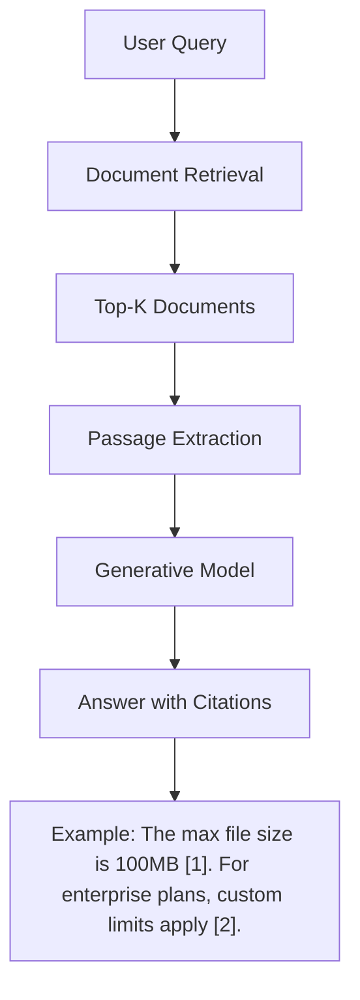

# How to Implement Answer Generation with Citations in Vertex AI Search

Author: [nawazdhandala](https://www.github.com/nawazdhandala)

Tags: GCP, Vertex AI Search, Answer Generation, Citations, Generative AI

Description: Learn how to use Vertex AI Search answer generation to produce AI-synthesized responses with source citations from your enterprise documents.

---

Search engines have traditionally returned a ranked list of documents. But what users actually want is an answer to their question. Vertex AI Search includes an answer generation feature that uses generative AI to synthesize a natural language response from your indexed documents, complete with citations pointing back to the source material. This is particularly valuable for enterprise search where users need quick, authoritative answers backed by verifiable sources.

This guide covers how to configure answer generation with citations, customize the generation behavior, and handle the responses in your application.

## How Answer Generation Works

When you enable answer generation in a search request, Vertex AI Search does the following:

1. Retrieves the most relevant documents for the query
2. Extracts key passages from those documents
3. Uses a generative AI model to synthesize a coherent answer
4. Embeds inline citations that reference the source documents

The result is a paragraph or two that directly answers the question, with numbered citations like [1], [2] that map to specific documents.



## Prerequisites

- A Vertex AI Search engine with indexed documents
- The LLM add-on enabled on your search engine
- Python 3.9+

```bash
pip install google-cloud-discoveryengine
```

## Basic Answer Generation

### Enabling the Summary Spec

Answer generation is controlled through the `SummarySpec` in your search request.

```python
from google.cloud import discoveryengine_v1 as discoveryengine

def search_with_answer_generation(
    project_id: str,
    location: str,
    engine_id: str,
    query: str,
):
    """Search with AI-generated answer and source citations."""
    client = discoveryengine.SearchServiceClient()

    serving_config = (
        f"projects/{project_id}/locations/{location}"
        f"/collections/default_collection/engines/{engine_id}"
        f"/servingConfigs/default_search"
    )

    # Configure answer generation
    summary_spec = discoveryengine.SearchRequest.ContentSearchSpec.SummarySpec(
        summary_result_count=5,       # Number of top results to consider for the summary
        include_citations=True,       # Include source citations in the answer
        ignore_adversarial_query=True,  # Skip summary for adversarial inputs
        ignore_non_summary_seeking_queries=True,  # Skip for navigation queries
    )

    request = discoveryengine.SearchRequest(
        serving_config=serving_config,
        query=query,
        page_size=10,
        content_search_spec=discoveryengine.SearchRequest.ContentSearchSpec(
            summary_spec=summary_spec,
            snippet_spec=discoveryengine.SearchRequest.ContentSearchSpec.SnippetSpec(
                return_snippet=True,
            ),
        ),
    )

    response = client.search(request)

    # Display the generated answer
    if response.summary:
        print("Generated Answer:")
        print(response.summary.summary_text)
        print()

        # Display citation sources
        if response.summary.summary_with_metadata:
            references = response.summary.summary_with_metadata.references
            if references:
                print("Sources:")
                for i, ref in enumerate(references):
                    print(f"  [{i+1}] {ref.title} - {ref.uri}")
    else:
        print("No summary generated for this query.")

    return response

# Generate an answer for a question
search_with_answer_generation(
    project_id="your-project-id",
    location="global",
    engine_id="enterprise-search",
    query="What is the process for requesting a refund?",
)
```

## Customizing the Generation Model

You can specify which model to use for answer generation and control its behavior.

```python
def search_with_custom_model(
    project_id: str,
    location: str,
    engine_id: str,
    query: str,
):
    """Search with a specific model version for answer generation."""
    client = discoveryengine.SearchServiceClient()

    serving_config = (
        f"projects/{project_id}/locations/{location}"
        f"/collections/default_collection/engines/{engine_id}"
        f"/servingConfigs/default_search"
    )

    # Specify the model for generation
    model_spec = discoveryengine.SearchRequest.ContentSearchSpec.SummarySpec.ModelSpec(
        version="gemini-1.5-flash-001/answer_gen/v1",  # Use a specific model version
    )

    summary_spec = discoveryengine.SearchRequest.ContentSearchSpec.SummarySpec(
        summary_result_count=5,
        include_citations=True,
        model_spec=model_spec,
        # Control the language of the generated answer
        language_code="en",
    )

    request = discoveryengine.SearchRequest(
        serving_config=serving_config,
        query=query,
        page_size=10,
        content_search_spec=discoveryengine.SearchRequest.ContentSearchSpec(
            summary_spec=summary_spec,
        ),
    )

    response = client.search(request)
    return response
```

## Parsing Citations

The citation data comes in a structured format. Here is how to parse it for display in your application.

```python
def parse_answer_with_citations(response) -> dict:
    """Parse the generated answer and extract citation details."""
    if not response.summary:
        return {"answer": None, "citations": []}

    answer_text = response.summary.summary_text

    # Build a map of citation index to source document
    citations = []
    source_map = {}

    # Get citation metadata if available
    if response.summary.summary_with_metadata:
        metadata = response.summary.summary_with_metadata

        # Extract references
        for i, ref in enumerate(metadata.references):
            citation = {
                "index": i + 1,
                "title": ref.title,
                "uri": ref.uri,
                "document_id": ref.document if hasattr(ref, "document") else None,
            }
            citations.append(citation)
            source_map[i + 1] = citation

        # Extract inline citation positions if available
        citation_metadata = metadata.citation_metadata
        if citation_metadata:
            for citation_info in citation_metadata.citations:
                start = citation_info.start_index
                end = citation_info.end_index
                sources = [s.reference_index for s in citation_info.sources]
                # This tells you which part of the answer text maps to which sources

    return {
        "answer": answer_text,
        "citations": citations,
        "source_map": source_map,
    }

# Example usage
response = search_with_answer_generation(
    project_id="your-project-id",
    location="global",
    engine_id="enterprise-search",
    query="What security certifications does the platform have?",
)

parsed = parse_answer_with_citations(response)
print(f"Answer: {parsed['answer']}")
print(f"\nCitations:")
for c in parsed['citations']:
    print(f"  [{c['index']}] {c['title']} - {c['uri']}")
```

## Building a Citation-Rich UI Component

Here is a pattern for rendering answers with clickable citations in a web application.

```python
import re

def format_answer_html(answer_text: str, citations: list) -> str:
    """Convert the answer text with citation markers into HTML with clickable links."""

    # Build a citation lookup
    citation_lookup = {c["index"]: c for c in citations}

    # Replace [N] markers with clickable links
    def replace_citation(match):
        index = int(match.group(1))
        citation = citation_lookup.get(index)
        if citation:
            title = citation["title"]
            uri = citation["uri"]
            return f'<sup><a href="{uri}" title="{title}" class="citation">[{index}]</a></sup>'
        return match.group(0)

    html = re.sub(r'\[(\d+)\]', replace_citation, answer_text)

    # Add the citation list at the bottom
    if citations:
        html += '<div class="citation-list"><h4>Sources</h4><ol>'
        for c in citations:
            html += f'<li><a href="{c["uri"]}">{c["title"]}</a></li>'
        html += '</ol></div>'

    return html
```

## Handling Edge Cases

### No Summary Available

Sometimes the model decides it cannot generate a good answer. Handle this gracefully.

```python
def get_answer_or_fallback(response) -> str:
    """Get the generated answer or fall back to extractive answers."""
    # Check for generated summary first
    if response.summary and response.summary.summary_text:
        summary = response.summary.summary_text
        # Check if the model declined to answer
        if "I don't have enough information" not in summary:
            return {"type": "generated", "text": summary}

    # Fall back to extractive answers from top result
    for result in response.results:
        doc_data = result.document.derived_struct_data
        answers = doc_data.get("extractive_answers", [])
        if answers:
            return {
                "type": "extractive",
                "text": answers[0].get("content", ""),
                "source": doc_data.get("title", "Unknown"),
            }

    return {"type": "none", "text": "No answer found for this query."}
```

### Adversarial Query Detection

The `ignore_adversarial_query` flag helps filter out attempts to manipulate the answer generation. When enabled, the model will skip generation for queries that appear to be prompt injection attempts.

```python
summary_spec = discoveryengine.SearchRequest.ContentSearchSpec.SummarySpec(
    summary_result_count=5,
    include_citations=True,
    ignore_adversarial_query=True,       # Filter prompt injection attempts
    ignore_non_summary_seeking_queries=True,  # Skip navigational queries like "login page"
)
```

## Combining with Conversation Follow-Up

For multi-turn conversations, you can use the answer generation to power a chat-like experience.

```python
def conversational_search(
    project_id: str,
    location: str,
    engine_id: str,
    query: str,
    conversation_id: str = None,
):
    """Search with conversational context for follow-up questions."""
    client = discoveryengine.ConversationalSearchServiceClient()

    serving_config = (
        f"projects/{project_id}/locations/{location}"
        f"/collections/default_collection/engines/{engine_id}"
        f"/servingConfigs/default_search"
    )

    # Build the conversation request
    text_input = discoveryengine.TextInput(input=query)

    request = discoveryengine.ConverseConversationRequest(
        name=f"{serving_config.replace('/servingConfigs/default_search', '')}/conversations/{conversation_id}" if conversation_id else "",
        serving_config=serving_config,
        query=text_input,
        summary_spec=discoveryengine.SearchRequest.ContentSearchSpec.SummarySpec(
            summary_result_count=3,
            include_citations=True,
        ),
    )

    response = client.converse_conversation(request)

    print(f"Answer: {response.reply.summary.summary_text}")
    print(f"Conversation ID: {response.conversation.name}")

    return response
```

## Summary

Answer generation with citations transforms Vertex AI Search from a document retrieval tool into a question-answering system. Users get direct, synthesized answers backed by verifiable sources, which builds trust and saves time. Configure the `SummarySpec` carefully, handle edge cases where generation is not appropriate, and build a UI that makes citations easy to follow. For the best results, ensure your indexed documents are well-structured and contain clear, factual information that the generative model can draw from.
