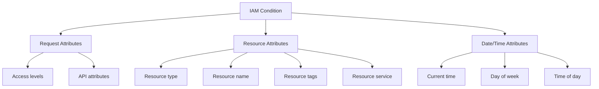

# How to Implement Attribute-Based Access Control with IAM Conditions in Google Cloud

Author: [nawazdhandala](https://www.github.com/nawazdhandala)

Tags: GCP, Google Cloud, IAM, IAM Conditions, ABAC, Access Control, Security

Description: Learn how to implement attribute-based access control (ABAC) using IAM conditions in Google Cloud for fine-grained, context-aware access policies.

---

Traditional role-based access control (RBAC) in Google Cloud works on a simple model: you grant a role to a principal on a resource, and that principal has those permissions all the time. But real-world access requirements are more nuanced. You might want an engineer to have access only during business hours, or only to resources with a specific tag, or only from a specific network. IAM conditions let you add these contextual requirements to role bindings, turning your access control from role-based into attribute-based.

IAM conditions use Common Expression Language (CEL) to evaluate attributes at request time. If the condition evaluates to true, the permission is granted. If false, the binding is ignored as if it does not exist.

## What You Can Condition On

IAM conditions can evaluate several types of attributes:



## Prerequisites

- A Google Cloud project or organization
- IAM Admin role
- Understanding of CEL (Common Expression Language)

## Step 1: Time-Based Access Control

Restrict access to specific time windows. This is useful for operations that should only happen during business hours:

```bash
# Grant compute admin access only during business hours (9 AM - 6 PM EST, weekdays)
gcloud projects add-iam-policy-binding my-project \
    --member="group:ops-team@example.com" \
    --role="roles/compute.admin" \
    --condition-title="business-hours-only" \
    --condition-description="Access limited to weekday business hours EST" \
    --condition-expression='
        request.time.getHours("America/New_York") >= 9 &&
        request.time.getHours("America/New_York") < 18 &&
        request.time.getDayOfWeek("America/New_York") >= 1 &&
        request.time.getDayOfWeek("America/New_York") <= 5
    '
```

This means the ops team can manage Compute Engine resources only from 9 AM to 6 PM Eastern Time on weekdays. Outside that window, the binding is effectively invisible.

## Step 2: Temporary Access with Expiration

Grant access that automatically expires on a specific date:

```bash
# Grant temporary project viewer access that expires on March 1, 2026
gcloud projects add-iam-policy-binding my-project \
    --member="user:contractor@external.com" \
    --role="roles/viewer" \
    --condition-title="temp-access-march-2026" \
    --condition-description="Temporary access for audit engagement" \
    --condition-expression='
        request.time < timestamp("2026-03-01T00:00:00Z")
    '
```

This is perfect for contractors, auditors, or anyone who needs temporary access. You do not need to remember to revoke it - the condition handles expiration automatically.

## Step 3: Resource-Name-Based Access

Restrict access to specific resources based on naming conventions:

```bash
# Grant access to only staging Compute Engine instances
# Instance names must start with "staging-"
gcloud projects add-iam-policy-binding my-project \
    --member="group:junior-devs@example.com" \
    --role="roles/compute.instanceAdmin.v1" \
    --condition-title="staging-instances-only" \
    --condition-description="Can only manage staging instances" \
    --condition-expression='
        resource.name.startsWith("projects/my-project/zones/") &&
        resource.name.contains("/instances/staging-")
    '
```

Now junior developers can manage instances that follow the staging naming convention but cannot touch production instances.

## Step 4: Tag-Based Access Control

Use resource tags for more structured attribute-based access. Tags are the recommended approach for resource-level conditions:

```bash
# First, create a tag key and values
gcloud resource-manager tags keys create environment \
    --parent=organizations/ORG_ID \
    --description="Deployment environment"

gcloud resource-manager tags values create development \
    --parent=organizations/ORG_ID/tagKeys/environment

gcloud resource-manager tags values create production \
    --parent=organizations/ORG_ID/tagKeys/environment

# Grant access only to resources tagged as development
gcloud projects add-iam-policy-binding my-project \
    --member="group:developers@example.com" \
    --role="roles/compute.admin" \
    --condition-title="dev-resources-only" \
    --condition-description="Access limited to development-tagged resources" \
    --condition-expression='
        resource.matchTag("ORG_ID/environment", "development")
    '
```

Tag-based conditions are powerful because they decouple access control from resource naming. You can change a resource's tag to move it between access boundaries without renaming anything.

## Step 5: Combined Conditions

Real-world policies often combine multiple conditions. CEL supports logical operators for this:

```bash
# Allow access to production resources only during business hours
# and only for senior engineers
gcloud projects add-iam-policy-binding my-project \
    --member="group:senior-engineers@example.com" \
    --role="roles/compute.admin" \
    --condition-title="prod-business-hours" \
    --condition-description="Production access during business hours only" \
    --condition-expression='
        resource.matchTag("ORG_ID/environment", "production") &&
        request.time.getHours("America/New_York") >= 9 &&
        request.time.getHours("America/New_York") < 18 &&
        request.time.getDayOfWeek("America/New_York") >= 1 &&
        request.time.getDayOfWeek("America/New_York") <= 5
    '
```

## Step 6: Access Level Conditions

Integrate with Access Context Manager to require specific network or device conditions:

```bash
# First, create an access level in Access Context Manager
gcloud access-context-manager levels create corp-network \
    --policy=POLICY_ID \
    --title="Corporate Network" \
    --basic-level-spec=corp-network-spec.yaml

# Then use the access level in an IAM condition
gcloud projects add-iam-policy-binding my-project \
    --member="group:all-employees@example.com" \
    --role="roles/bigquery.dataViewer" \
    --condition-title="corp-network-required" \
    --condition-description="BigQuery data access requires corporate network" \
    --condition-expression='
        "accessPolicies/POLICY_ID/accessLevels/corp-network" in request.auth.accessLevels
    '
```

This ensures that sensitive data can only be accessed from the corporate network or VPN, adding a network-based control to the IAM policy.

## Step 7: API-Specific Conditions

Some conditions are specific to particular APIs. For example, restricting Cloud Storage access to specific operations:

```bash
# Allow reading objects from a bucket but not listing them
# Useful for direct link access without directory browsing
gcloud storage buckets add-iam-policy-binding gs://sensitive-data-bucket \
    --member="group:analysts@example.com" \
    --role="roles/storage.objectViewer" \
    --condition-title="get-only-no-list" \
    --condition-description="Can get specific objects but cannot list bucket contents" \
    --condition-expression='
        api.getAttribute("storage.googleapis.com/objectListPrefix", "") != ""
    '
```

## Step 8: Validate and Test Conditions

Before applying conditions in production, validate them:

```bash
# Test a condition expression using the Policy Troubleshooter
gcloud policy-intelligence troubleshoot-iam-policy \
    --member="user:developer@example.com" \
    --resource="//compute.googleapis.com/projects/my-project/zones/us-central1-a/instances/staging-web-1" \
    --permission="compute.instances.stop" \
    --project=my-project
```

The troubleshooter shows you exactly why access would be granted or denied, including which conditions evaluated to true or false.

## Step 9: Manage Conditional Bindings at Scale

For organizations with many conditional bindings, use Terraform to manage them consistently:

```hcl
# main.tf
# Manage conditional IAM bindings with Terraform

resource "google_project_iam_member" "staging_compute_admin" {
  project = "my-project"
  role    = "roles/compute.admin"
  member  = "group:developers@example.com"

  condition {
    title       = "staging-only"
    description = "Access limited to staging resources"
    expression  = "resource.matchTag('${var.org_id}/environment', 'staging')"
  }
}

resource "google_project_iam_member" "temp_contractor_access" {
  project = "my-project"
  role    = "roles/viewer"
  member  = "user:contractor@external.com"

  condition {
    title       = "temp-access"
    description = "Access expires end of Q1 2026"
    expression  = "request.time < timestamp('2026-04-01T00:00:00Z')"
  }
}

resource "google_project_iam_member" "business_hours_admin" {
  project = "my-project"
  role    = "roles/compute.instanceAdmin.v1"
  member  = "group:ops-team@example.com"

  condition {
    title       = "business-hours"
    description = "Weekday business hours only"
    expression  = <<-EOT
      request.time.getHours("America/New_York") >= 9 &&
      request.time.getHours("America/New_York") < 18 &&
      request.time.getDayOfWeek("America/New_York") >= 1 &&
      request.time.getDayOfWeek("America/New_York") <= 5
    EOT
  }
}
```

## Limitations to Be Aware Of

Not all IAM roles support conditions. Specifically:

- Basic roles (Owner, Editor, Viewer) do not support conditions
- Some services have limited condition support
- Conditions add evaluation overhead, though it is typically negligible
- Conditional bindings count toward the same IAM policy size limits

Always check the documentation for the specific service you are working with to confirm condition support.

## Summary

IAM conditions transform Google Cloud's access control from simple role-based to context-aware attribute-based. By adding CEL expressions to role bindings, you can restrict access based on time, resource attributes, tags, network location, and more. The most practical uses are time-limited access for contractors, environment-scoped access using tags, and business-hours restrictions for sensitive operations. Start with a few high-value conditions on your most sensitive resources and expand as your team becomes comfortable with the CEL syntax and testing process.
