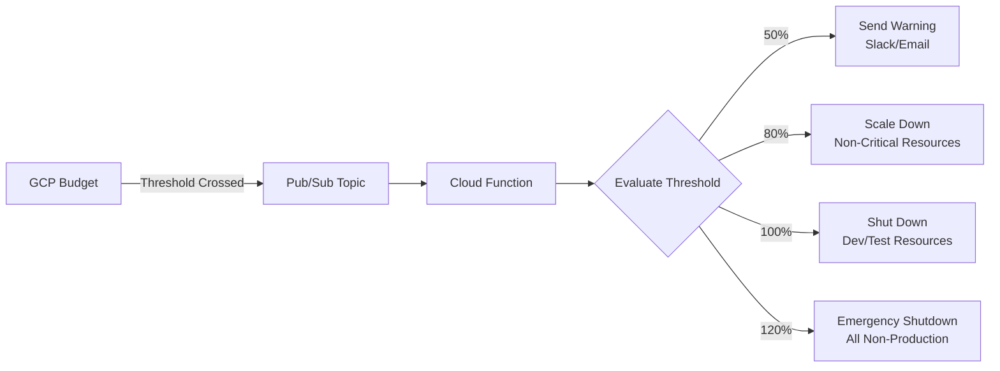

# How to Implement Automated Cost Controls on GCP Using Budget Alerts and Cloud Functions for Resource Shutdown

Author: [nawazdhandala](https://www.github.com/nawazdhandala)

Tags: GCP, Cost Controls, Budget Alerts, Cloud Functions, Pub/Sub, FinOps, Automation

Description: Learn how to set up automated cost controls on GCP that detect budget overruns and automatically shut down or scale back resources using budget alerts and Cloud Functions.

---

Budget alerts that send emails are nice, but they depend on someone reading and acting on that email before costs spiral further. Automated cost controls take the human out of the loop - when spending crosses a threshold, the system automatically takes action to contain costs. On GCP, you can wire budget alerts through Pub/Sub to Cloud Functions that shut down non-critical resources. Here is how to build it.

## The Automated Cost Control Flow



## Step 1: Create the Budget Alert Infrastructure

First, set up the Pub/Sub topic that will receive budget notifications:

```bash
# Create a Pub/Sub topic for budget alerts
gcloud pubsub topics create budget-alerts \
  --project=my-project

# Create a subscription for monitoring
gcloud pubsub subscriptions create budget-alerts-monitor \
  --topic=budget-alerts \
  --project=my-project
```

Now create the budget with programmatic notifications:

```bash
# Create a budget using the gcloud CLI
gcloud billing budgets create \
  --billing-account=BILLING_ACCOUNT_ID \
  --display-name="Monthly Project Budget" \
  --budget-amount=5000 \
  --filter-projects="projects/my-project" \
  --threshold-rule=percent=0.5,basis=current-spend \
  --threshold-rule=percent=0.8,basis=current-spend \
  --threshold-rule=percent=1.0,basis=current-spend \
  --threshold-rule=percent=1.2,basis=current-spend \
  --notifications-pubsub-topic="projects/my-project/topics/budget-alerts" \
  --notifications-pubsub-enable
```

For more granular control, create budgets per environment:

```python
# create_budgets.py - Create budgets for different environments
from google.cloud import billing_budgets_v1

client = billing_budgets_v1.BudgetServiceClient()

budgets = [
    {
        "name": "Production Budget",
        "amount": 3000,
        "labels": {"environment": "prod"},
        "thresholds": [0.8, 0.9, 1.0],
    },
    {
        "name": "Development Budget",
        "amount": 1000,
        "labels": {"environment": "dev"},
        "thresholds": [0.5, 0.8, 1.0, 1.2],
    },
    {
        "name": "Staging Budget",
        "amount": 500,
        "labels": {"environment": "staging"},
        "thresholds": [0.5, 0.8, 1.0],
    },
]

for budget_config in budgets:
    budget = billing_budgets_v1.Budget()
    budget.display_name = budget_config["name"]
    budget.amount = billing_budgets_v1.BudgetAmount(
        specified_amount={"units": budget_config["amount"], "currency_code": "USD"}
    )

    # Add threshold rules
    for pct in budget_config["thresholds"]:
        rule = billing_budgets_v1.ThresholdRule(
            threshold_percent=pct,
            spend_basis=billing_budgets_v1.ThresholdRule.Basis.CURRENT_SPEND,
        )
        budget.threshold_rules.append(rule)

    # Configure Pub/Sub notification
    budget.notifications_rule = billing_budgets_v1.NotificationsRule(
        pubsub_topic=f"projects/my-project/topics/budget-alerts",
        schema_version="1.0",
    )

    created = client.create_budget(
        parent=f"billingAccounts/BILLING_ACCOUNT_ID",
        budget=budget,
    )
    print(f"Created budget: {created.name}")
```

## Step 2: Build the Cost Control Cloud Function

This is the core of the automated system. The function receives budget alerts and takes action based on the threshold:

```python
# cost_control/main.py - Cloud Function for automated cost controls
import base64
import json
import logging
from google.cloud import compute_v1
from google.cloud import container_v1
import requests

# Configuration
PROJECT_ID = "my-project"
SLACK_WEBHOOK = "https://hooks.slack.com/services/YOUR/WEBHOOK/URL"

# Resources that are safe to shut down at each threshold
THRESHOLD_ACTIONS = {
    0.5: "warn",         # 50% - Just send a warning
    0.8: "scale_down",   # 80% - Scale down non-critical resources
    1.0: "shutdown_dev",  # 100% - Shut down dev/test resources
    1.2: "emergency",    # 120% - Emergency shutdown of all non-production
}

# Resources tagged with these labels are safe to shut down
SAFE_TO_STOP_LABELS = {
    "environment": ["dev", "test", "staging"],
    "auto-shutdown": ["true"],
}


def budget_alert_handler(event, context):
    """Handle budget alert notifications from Pub/Sub."""
    # Decode the Pub/Sub message
    pubsub_message = base64.b64decode(event["data"]).decode("utf-8")
    budget_data = json.loads(pubsub_message)

    budget_name = budget_data.get("budgetDisplayName", "Unknown")
    alert_threshold = budget_data.get("alertThresholdExceeded", 0)
    cost_amount = budget_data.get("costAmount", 0)
    budget_amount = budget_data.get("budgetAmount", 0)
    currency = budget_data.get("currencyCode", "USD")

    logging.info(
        f"Budget alert: {budget_name}, threshold: {alert_threshold}, "
        f"cost: {cost_amount} {currency}, budget: {budget_amount} {currency}"
    )

    # Determine the action based on threshold
    action = determine_action(alert_threshold)

    if action == "warn":
        send_warning(budget_name, cost_amount, budget_amount, alert_threshold)
    elif action == "scale_down":
        send_warning(budget_name, cost_amount, budget_amount, alert_threshold)
        scale_down_resources()
    elif action == "shutdown_dev":
        send_warning(budget_name, cost_amount, budget_amount, alert_threshold)
        shutdown_dev_resources()
    elif action == "emergency":
        send_warning(budget_name, cost_amount, budget_amount, alert_threshold)
        emergency_shutdown()


def determine_action(threshold):
    """Determine what action to take based on the alert threshold."""
    action = "warn"
    for t, a in sorted(THRESHOLD_ACTIONS.items()):
        if threshold >= t:
            action = a
    return action


def send_warning(budget_name, cost, budget, threshold):
    """Send a Slack notification about the budget alert."""
    pct = threshold * 100
    message = {
        "text": (
            f"*Budget Alert: {budget_name}*\n"
            f"Current spend: ${cost:.2f} / ${budget:.2f} ({pct:.0f}%)\n"
            f"Action level: {determine_action(threshold)}"
        )
    }
    requests.post(SLACK_WEBHOOK, json=message)


def scale_down_resources():
    """Scale down non-critical resources when hitting 80% budget."""
    logging.info("Scaling down non-critical resources")

    # Scale down GKE node pools in dev/staging
    gke_client = container_v1.ClusterManagerClient()
    clusters = gke_client.list_clusters(
        parent=f"projects/{PROJECT_ID}/locations/-"
    )

    for cluster in clusters.clusters:
        # Only touch non-production clusters
        labels = cluster.resource_labels or {}
        if labels.get("environment") in ["dev", "staging"]:
            for pool in cluster.node_pools:
                if pool.initial_node_count > 1:
                    logging.info(
                        f"Scaling down {cluster.name}/{pool.name} to 1 node"
                    )
                    gke_client.set_node_pool_size(
                        project_id=PROJECT_ID,
                        zone=cluster.location,
                        cluster_id=cluster.name,
                        node_pool_id=pool.name,
                        node_count=1,
                    )

    send_slack(f"Scaled down non-critical GKE node pools to 1 node each")


def shutdown_dev_resources():
    """Shut down dev and test resources when hitting 100% budget."""
    logging.info("Shutting down dev/test resources")

    # Stop Compute Engine instances in dev/test
    compute_client = compute_v1.InstancesClient()
    zones_client = compute_v1.ZonesClient()

    zones = zones_client.list(project=PROJECT_ID)
    stopped_count = 0

    for zone in zones:
        instances = compute_client.list(project=PROJECT_ID, zone=zone.name)
        for instance in instances:
            labels = instance.labels or {}
            # Only stop instances that are safe to shut down
            if (labels.get("environment") in ["dev", "test"]
                    or labels.get("auto-shutdown") == "true"):
                if instance.status == "RUNNING":
                    logging.info(f"Stopping {instance.name} in {zone.name}")
                    compute_client.stop(
                        project=PROJECT_ID,
                        zone=zone.name,
                        instance=instance.name,
                    )
                    stopped_count += 1

    send_slack(f"Stopped {stopped_count} dev/test Compute Engine instances")


def emergency_shutdown():
    """Emergency shutdown when budget is exceeded by 20%."""
    logging.info("EMERGENCY: Shutting down all non-production resources")

    # Stop all non-production Compute Engine instances
    shutdown_dev_resources()

    # Additionally, scale GKE staging to zero
    gke_client = container_v1.ClusterManagerClient()
    clusters = gke_client.list_clusters(
        parent=f"projects/{PROJECT_ID}/locations/-"
    )

    for cluster in clusters.clusters:
        labels = cluster.resource_labels or {}
        if labels.get("environment") != "prod":
            for pool in cluster.node_pools:
                logging.info(
                    f"EMERGENCY: Scaling {cluster.name}/{pool.name} to 0"
                )
                gke_client.set_node_pool_size(
                    project_id=PROJECT_ID,
                    zone=cluster.location,
                    cluster_id=cluster.name,
                    node_pool_id=pool.name,
                    node_count=0,
                )

    send_slack(
        "*EMERGENCY COST CONTROL ACTIVATED*\n"
        "All non-production resources have been shut down. "
        "Contact the platform team to restart."
    )


def send_slack(message):
    """Send a message to Slack."""
    requests.post(SLACK_WEBHOOK, json={"text": message})
```

## Step 3: Deploy the Cloud Function

```bash
# Deploy the cost control function
gcloud functions deploy budget-cost-control \
  --runtime=python311 \
  --trigger-topic=budget-alerts \
  --source=cost_control/ \
  --entry-point=budget_alert_handler \
  --region=us-central1 \
  --timeout=540 \
  --memory=256MB \
  --service-account=cost-control-sa@my-project.iam.gserviceaccount.com
```

The service account needs permissions to manage resources:

```bash
# Create the service account
gcloud iam service-accounts create cost-control-sa \
  --display-name="Cost Control Automation"

# Grant permissions to stop/start instances
gcloud projects add-iam-policy-binding my-project \
  --member="serviceAccount:cost-control-sa@my-project.iam.gserviceaccount.com" \
  --role="roles/compute.instanceAdmin.v1"

# Grant permissions to manage GKE node pools
gcloud projects add-iam-policy-binding my-project \
  --member="serviceAccount:cost-control-sa@my-project.iam.gserviceaccount.com" \
  --role="roles/container.clusterAdmin"
```

## Step 4: Set Up Scheduled Cost Checks

Budget alerts only fire when thresholds are crossed. For continuous monitoring, add a scheduled function that checks current spend:

```python
# scheduled_cost_check.py - Runs on a schedule to check spending rate
import functions_framework
from google.cloud import bigquery
from datetime import datetime
import requests

@functions_framework.http
def check_spending_rate(request):
    """Check if current spending rate will exceed the monthly budget."""
    client = bigquery.Client()

    query = """
    WITH daily_spend AS (
      SELECT
        DATE(usage_start_time) AS spend_date,
        SUM(cost + IFNULL((SELECT SUM(c.amount) FROM UNNEST(credits) c), 0)) AS daily_cost
      FROM `billing_export.gcp_billing_export_resource_v1_BILLING_ACCOUNT_ID`
      WHERE DATE(usage_start_time) >= DATE_TRUNC(CURRENT_DATE(), MONTH)
      GROUP BY 1
    )
    SELECT
      SUM(daily_cost) AS month_to_date,
      AVG(daily_cost) AS avg_daily_cost,
      -- Project the monthly total based on current rate
      AVG(daily_cost) * EXTRACT(DAY FROM LAST_DAY(CURRENT_DATE())) AS projected_monthly,
      5000 AS budget  -- Monthly budget
    FROM daily_spend
    """

    result = list(client.query(query).result())[0]

    projected = result.projected_monthly or 0
    budget = result.budget
    mtd = result.month_to_date or 0
    avg_daily = result.avg_daily_cost or 0

    if projected > budget * 1.1:  # Projected to exceed budget by 10%
        message = (
            f"*Spending Rate Warning*\n"
            f"Month-to-date: ${mtd:.2f}\n"
            f"Average daily: ${avg_daily:.2f}\n"
            f"Projected monthly: ${projected:.2f}\n"
            f"Budget: ${budget:.2f}\n"
            f"*Projected to exceed budget by {((projected/budget)-1)*100:.0f}%*"
        )
        requests.post(SLACK_WEBHOOK, json={"text": message})
        return f"Warning sent: projected ${projected:.2f} vs budget ${budget:.2f}", 200

    return f"On track: projected ${projected:.2f} vs budget ${budget:.2f}", 200
```

Schedule it to run daily:

```bash
# Run the spending rate check every morning
gcloud scheduler jobs create http daily-spending-check \
  --schedule="0 9 * * *" \
  --uri="https://us-central1-my-project.cloudfunctions.net/check-spending-rate" \
  --http-method=GET \
  --oidc-service-account-email=cost-control-sa@my-project.iam.gserviceaccount.com
```

## Step 5: Build Safety Guards

Automated resource shutdown is powerful but dangerous. Add safeguards:

```python
# safety.py - Safety checks before shutting down resources

# Never shut down resources with these labels
PROTECTED_LABELS = {
    "environment": ["prod", "production"],
    "critical": ["true"],
    "no-auto-shutdown": ["true"],
}

def is_resource_protected(labels):
    """Check if a resource should be protected from auto-shutdown."""
    if not labels:
        return True  # Unlabeled resources are protected by default

    for key, protected_values in PROTECTED_LABELS.items():
        if labels.get(key, "").lower() in [v.lower() for v in protected_values]:
            return True

    return False


# Rate limiting - do not shut down resources more than once per day
import hashlib
from google.cloud import storage

def check_rate_limit(action_name):
    """Prevent the same action from running multiple times in a day."""
    client = storage.Client()
    bucket = client.bucket("my-project-cost-control-state")

    today = datetime.now().strftime("%Y-%m-%d")
    blob_name = f"rate_limits/{action_name}/{today}"
    blob = bucket.blob(blob_name)

    if blob.exists():
        return False  # Already ran today

    blob.upload_from_string("executed")
    return True
```

## Testing the Setup

Test with a low-budget alert to verify everything works:

```bash
# Create a test budget with a very low amount
gcloud billing budgets create \
  --billing-account=BILLING_ACCOUNT_ID \
  --display-name="Test Budget" \
  --budget-amount=1 \
  --filter-projects="projects/my-test-project" \
  --threshold-rule=percent=0.01 \
  --notifications-pubsub-topic="projects/my-project/topics/budget-alerts" \
  --notifications-pubsub-enable
```

You can also publish a test message directly:

```bash
# Simulate a budget alert
gcloud pubsub topics publish budget-alerts --message='{
  "budgetDisplayName": "Test Budget",
  "alertThresholdExceeded": 0.5,
  "costAmount": 250,
  "budgetAmount": 500,
  "currencyCode": "USD"
}'
```

Automated cost controls give you a safety net for cloud spending. The key is getting the thresholds and protections right - too aggressive and you will shut down something important; too conservative and costs will still surprise you. Start with warnings and manual review, then gradually automate as you gain confidence in the system's behavior.
