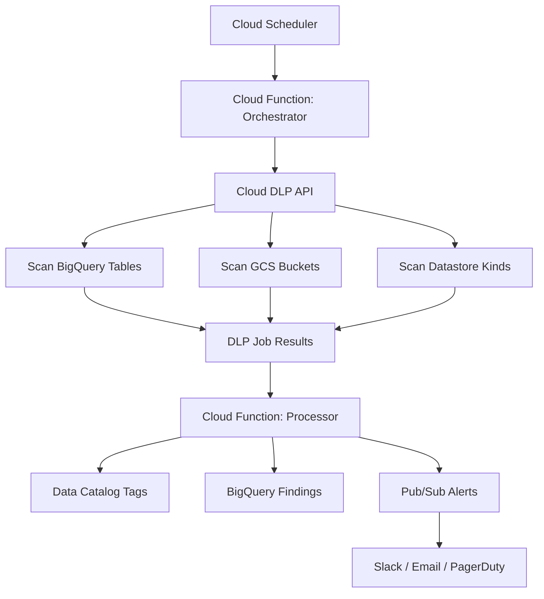

# How to Implement Automated Data Classification Scanning Pipelines with Cloud DLP

Author: [nawazdhandala](https://www.github.com/nawazdhandala)

Tags: GCP, Cloud DLP, Data Classification, Data Security, Sensitive Data

Description: Build automated data classification pipelines using Google Cloud DLP to scan, classify, and tag sensitive data across BigQuery, Cloud Storage, and Datastore.

---

Most organizations know they have sensitive data somewhere in their cloud environment. The problem is knowing exactly where. PII sitting in a BigQuery table that someone exported from a production database, credit card numbers in log files, medical records in a Cloud Storage bucket that was supposed to be temporary - these things happen. Cloud DLP (Data Loss Prevention) gives you the tools to find this data automatically, but building a scanning pipeline that runs continuously and acts on the results takes some thought.

This guide walks through building an end-to-end data classification pipeline that scans your GCP resources on a schedule, tags what it finds, and alerts you when sensitive data shows up where it shouldn't be.

## Pipeline Architecture



## Defining InfoTypes to Scan For

Cloud DLP has built-in detectors for common sensitive data types. Start with the ones most relevant to your compliance requirements:

```python
# dlp_config.py - Central configuration for DLP scanning

# InfoTypes to scan for, grouped by sensitivity level
INFOTYPE_CONFIG = {
    "critical": [
        {"name": "CREDIT_CARD_NUMBER"},
        {"name": "US_SOCIAL_SECURITY_NUMBER"},
        {"name": "US_BANK_ROUTING_MICR"},
        {"name": "IBAN_CODE"},
    ],
    "high": [
        {"name": "EMAIL_ADDRESS"},
        {"name": "PHONE_NUMBER"},
        {"name": "PERSON_NAME"},
        {"name": "STREET_ADDRESS"},
        {"name": "DATE_OF_BIRTH"},
    ],
    "medium": [
        {"name": "IP_ADDRESS"},
        {"name": "MAC_ADDRESS"},
        {"name": "URL"},
        {"name": "DOMAIN_NAME"},
    ]
}

# Combine all info types into a flat list for scanning
def get_all_infotypes():
    """Return all configured info types as a flat list"""
    all_types = []
    for level in INFOTYPE_CONFIG.values():
        all_types.extend(level)
    return all_types

# Map info type names to severity levels for alerting
def get_severity(infotype_name):
    """Look up the severity level for a given info type"""
    for level, types in INFOTYPE_CONFIG.items():
        if any(t["name"] == infotype_name for t in types):
            return level
    return "unknown"
```

## Building the Orchestrator Function

The orchestrator discovers resources to scan and kicks off DLP inspection jobs:

```python
import google.cloud.dlp_v2 as dlp
from google.cloud import bigquery
from google.cloud import storage
from dlp_config import get_all_infotypes

def orchestrate_scan(event, context):
    """Discover resources and create DLP inspection jobs"""
    dlp_client = dlp.DlpServiceClient()
    project_id = "your-project-id"
    parent = f"projects/{project_id}/locations/global"

    # Configure the inspection settings
    inspect_config = dlp.InspectConfig(
        info_types=get_all_infotypes(),
        # Set minimum likelihood to reduce false positives
        min_likelihood=dlp.Likelihood.LIKELY,
        # Include up to 100 findings per info type
        limits=dlp.InspectConfig.FindingLimits(
            max_findings_per_item=100,
            max_findings_per_request=1000,
        ),
        # Include the matched content snippet for review
        include_quote=True,
    )

    # Scan all BigQuery datasets
    scan_bigquery_datasets(dlp_client, parent, project_id, inspect_config)

    # Scan targeted GCS buckets
    scan_gcs_buckets(dlp_client, parent, project_id, inspect_config)

def scan_bigquery_datasets(dlp_client, parent, project_id, inspect_config):
    """Create DLP jobs for each BigQuery dataset"""
    bq_client = bigquery.Client(project=project_id)

    for dataset in bq_client.list_datasets():
        dataset_id = dataset.dataset_id

        # Skip known non-sensitive datasets to save on API costs
        if dataset_id.startswith("staging_") or dataset_id == "dlp_results":
            continue

        # Configure the BigQuery scanning job
        storage_config = dlp.StorageConfig(
            big_query_options=dlp.BigQueryOptions(
                table_reference=dlp.BigQueryTable(
                    project_id=project_id,
                    dataset_id=dataset_id,
                ),
                # Sample a percentage of rows for large tables
                rows_limit_percent=10,
                sample_method=dlp.BigQueryOptions.SampleMethod.RANDOM_START,
            ),
        )

        # Set up actions to perform when findings are detected
        actions = [
            dlp.Action(
                pub_sub=dlp.Action.PublishToPubSub(
                    topic=f"projects/{project_id}/topics/dlp-findings"
                )
            ),
            dlp.Action(
                save_findings=dlp.Action.SaveFindings(
                    output_config=dlp.OutputStorageConfig(
                        table=dlp.BigQueryTable(
                            project_id=project_id,
                            dataset_id="dlp_results",
                            table_id="findings",
                        )
                    )
                )
            ),
        ]

        # Create the DLP inspection job
        job = dlp_client.create_dlp_job(
            request={
                "parent": parent,
                "inspect_job": dlp.InspectJobConfig(
                    inspect_config=inspect_config,
                    storage_config=storage_config,
                    actions=actions,
                ),
            }
        )
        print(f"Started DLP job for {dataset_id}: {job.name}")
```

## Scanning Cloud Storage Buckets

For GCS, you can target specific buckets or scan everything:

```python
def scan_gcs_buckets(dlp_client, parent, project_id, inspect_config):
    """Create DLP scan jobs for Cloud Storage buckets"""
    storage_client = storage.Client(project=project_id)

    for bucket in storage_client.list_buckets():
        # Skip buckets that are already classified
        labels = bucket.labels or {}
        if labels.get("dlp_scanned") == "true":
            last_scan = labels.get("dlp_last_scan", "")
            # Only rescan if it's been more than 7 days
            if _recently_scanned(last_scan, days=7):
                continue

        storage_config = dlp.StorageConfig(
            cloud_storage_options=dlp.CloudStorageOptions(
                file_set=dlp.CloudStorageOptions.FileSet(
                    url=f"gs://{bucket.name}/**"
                ),
                # Only scan text-based files
                file_types=[
                    dlp.FileType.TEXT_FILE,
                    dlp.FileType.CSV,
                    dlp.FileType.JSON,
                    dlp.FileType.PDF,
                ],
                # Limit bytes scanned per file to control costs
                bytes_limit_per_file=1048576,  # 1 MB per file
                # Sample files rather than scanning everything
                files_limit_percent=25,
            ),
        )

        actions = [
            dlp.Action(
                pub_sub=dlp.Action.PublishToPubSub(
                    topic=f"projects/{project_id}/topics/dlp-findings"
                )
            ),
        ]

        job = dlp_client.create_dlp_job(
            request={
                "parent": parent,
                "inspect_job": dlp.InspectJobConfig(
                    inspect_config=inspect_config,
                    storage_config=storage_config,
                    actions=actions,
                ),
            }
        )
        print(f"Started DLP job for bucket {bucket.name}: {job.name}")
```

## Processing Scan Results

When a DLP job completes, it publishes results to Pub/Sub. The processor function handles classification tagging and alerting:

```python
import base64
import json
from google.cloud import datacatalog_v1
from dlp_config import get_severity

def process_dlp_findings(event, context):
    """Process completed DLP job findings"""
    message = base64.b64decode(event["data"]).decode("utf-8")
    finding_data = json.loads(message)

    # Extract findings details
    findings = finding_data.get("finding", {})
    infotype = findings.get("infoType", {}).get("name", "unknown")
    location = findings.get("location", {})
    resource_name = findings.get("resourceName", "")

    severity = get_severity(infotype)

    # Tag the resource in Data Catalog
    tag_resource_in_catalog(resource_name, infotype, severity)

    # Alert on critical and high severity findings
    if severity in ("critical", "high"):
        send_finding_alert(resource_name, infotype, severity, location)

def tag_resource_in_catalog(resource_name, infotype, severity):
    """Add classification tags to the resource in Data Catalog"""
    client = datacatalog_v1.DataCatalogClient()

    # Look up the Data Catalog entry for this resource
    entry = client.lookup_entry(
        request={"linked_resource": resource_name}
    )

    # Create or update the classification tag
    tag = datacatalog_v1.Tag()
    tag.template = (
        "projects/your-project/locations/us/tagTemplates/data_classification"
    )
    tag.fields["sensitivity_level"] = datacatalog_v1.TagField(
        string_value=severity
    )
    tag.fields["detected_infotypes"] = datacatalog_v1.TagField(
        string_value=infotype
    )
    tag.fields["last_scanned"] = datacatalog_v1.TagField(
        string_value=datetime.utcnow().isoformat()
    )

    # Create the tag on the entry
    client.create_tag(parent=entry.name, tag=tag)
```

## Setting Up the Schedule

Deploy everything and configure the scanning schedule:

```bash
# Create the Pub/Sub topic for DLP findings
gcloud pubsub topics create dlp-findings

# Create the BigQuery dataset for storing results
bq mk --dataset dlp_results

# Deploy the orchestrator function
gcloud functions deploy dlp-orchestrator \
    --runtime python311 \
    --trigger-topic dlp-scan-trigger \
    --timeout 540 \
    --memory 1GB

# Deploy the findings processor
gcloud functions deploy dlp-processor \
    --runtime python311 \
    --trigger-topic dlp-findings \
    --timeout 120

# Schedule weekly scans
gcloud scheduler jobs create pubsub dlp-weekly-scan \
    --schedule "0 2 * * 0" \
    --topic dlp-scan-trigger \
    --message-body '{"scan_type": "full"}'
```

## Querying Historical Findings

With results stored in BigQuery, you can track classification status over time:

```sql
-- Find the most common types of sensitive data in your org
SELECT
    info_type.name AS infotype,
    COUNT(*) AS finding_count,
    COUNT(DISTINCT resource_name) AS affected_resources
FROM `your-project.dlp_results.findings`
WHERE timestamp > TIMESTAMP_SUB(CURRENT_TIMESTAMP(), INTERVAL 30 DAY)
GROUP BY infotype
ORDER BY finding_count DESC

-- Find resources with critical sensitive data
SELECT
    resource_name,
    ARRAY_AGG(DISTINCT info_type.name) AS detected_types,
    MAX(likelihood) AS max_likelihood
FROM `your-project.dlp_results.findings`
WHERE info_type.name IN ('CREDIT_CARD_NUMBER', 'US_SOCIAL_SECURITY_NUMBER')
GROUP BY resource_name
```

## Wrapping Up

Automated data classification with Cloud DLP moves you from "we think we know where our sensitive data is" to "we know exactly where it is." The pipeline approach - discover, scan, classify, alert - gives you continuous visibility rather than point-in-time snapshots. Start with your most critical data types (PII, financial data), scan your highest-risk storage locations first, and expand coverage over time. The cost of DLP scanning is real, so use sampling and targeted scanning to keep it manageable while still maintaining good coverage.
