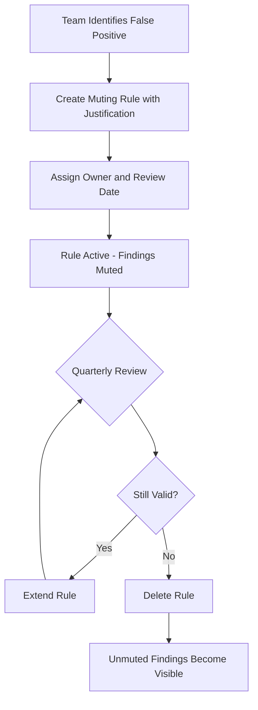

# How to Implement Automated Muting Rules for False Positive Findings in SCC

Author: [nawazdhandala](https://www.github.com/nawazdhandala)

Tags: GCP, Security Command Center, Muting Rules, False Positives, Cloud Security

Description: Learn how to create and manage muting rules in Security Command Center to automatically suppress false positive findings and reduce alert fatigue for your security team.

---

Security Command Center generates a lot of findings. That is by design - it is thorough. But thoroughness has a cost: alert fatigue. When your team is drowning in findings that do not represent real risks in your environment, the actual threats get buried. Muting rules solve this by automatically suppressing findings that match criteria you define, so your team can focus on what actually matters.

This guide covers how to build effective muting rules, manage them at scale, and avoid the trap of muting too aggressively.

## How Muting Works in SCC

Muting in SCC does not delete findings or stop detection. Muted findings still exist in the system and can be queried. What changes is their visibility - muted findings are filtered out of default views and dashboards. This is an important distinction because you can always unmute findings if your assessment changes.

There are two types of muting:

- **Static muting** - you manually mute individual findings
- **Dynamic muting rules** - you define filter criteria and SCC automatically mutes any finding (current or future) that matches

Dynamic muting rules are what you want for handling recurring false positives at scale.

## Creating Your First Muting Rule

Let's say your security team has determined that findings about public IP addresses on load balancer backends are expected in your environment because those are your public-facing services. Here is how to create a muting rule for that.

This command creates a muting rule that suppresses public IP findings for resources in your production load balancer project.

```bash
# Create a muting rule for expected public IP findings on load balancers
gcloud scc muteconfigs create public-lb-expected \
  --organization=123456789 \
  --description="Public IPs on load balancer backends are expected" \
  --filter='category="PUBLIC_IP_ADDRESS" AND resourceName : "projects/prod-lb-project/"' \
  --type=DYNAMIC
```

The filter syntax follows the same format used when listing SCC findings. You can combine multiple conditions with AND/OR operators.

## Common Muting Rule Patterns

Here are muting rules that address the most frequent false positive scenarios I have encountered.

### Development Environment Findings

Development projects often have relaxed security configurations intentionally. Rather than fixing every finding in dev, mute them.

```bash
# Mute all medium and low severity findings in development projects
gcloud scc muteconfigs create dev-environment-noise \
  --organization=123456789 \
  --description="Suppress low-priority findings in development projects" \
  --filter='(severity="MEDIUM" OR severity="LOW") AND resourceName : "projects/dev-"' \
  --type=DYNAMIC
```

### Expected Open Firewall Rules

Some services need specific ports open. If your team has reviewed and approved these, mute the corresponding findings.

```bash
# Mute firewall findings for approved public-facing services
gcloud scc muteconfigs create approved-firewall-rules \
  --organization=123456789 \
  --description="Approved public firewall rules for web services" \
  --filter='category="OPEN_FIREWALL" AND resource.projectDisplayName="web-services-prod" AND resourceName : "allow-https"' \
  --type=DYNAMIC
```

### Service Account Key Findings for Legacy Systems

Some legacy integrations require service account keys. If migration is planned but not immediate, mute the findings with a clear description.

```bash
# Mute SA key findings for legacy systems pending migration
gcloud scc muteconfigs create legacy-sa-keys \
  --organization=123456789 \
  --description="Legacy systems using SA keys - migration planned for Q3 2026" \
  --filter='category="SERVICE_ACCOUNT_KEY_NOT_ROTATED" AND resourceName : "projects/legacy-integration/"' \
  --type=DYNAMIC
```

## Managing Muting Rules with Terraform

For organizations that manage security configuration as code, Terraform provides a clean way to version control your muting rules.

```hcl
# Terraform configuration for SCC muting rules
# Each rule targets a specific class of expected findings

resource "google_scc_mute_config" "dev_projects" {
  mute_config_id = "dev-project-findings"
  parent         = "organizations/123456789"
  filter         = "(severity=\"LOW\" OR severity=\"MEDIUM\") AND resourceName : \"projects/dev-\""
  description    = "Suppress non-critical findings in development projects"
}

resource "google_scc_mute_config" "sandbox_projects" {
  mute_config_id = "sandbox-findings"
  parent         = "organizations/123456789"
  filter         = "resourceName : \"projects/sandbox-\""
  description    = "Suppress all findings in sandbox projects"
}

resource "google_scc_mute_config" "expected_public_buckets" {
  mute_config_id = "public-website-buckets"
  parent         = "organizations/123456789"
  filter         = "category=\"PUBLIC_BUCKET_ACL\" AND resourceName : \"projects/static-websites/\""
  description    = "Static website buckets are intentionally public"
}
```

## Building a Muting Rule Review Process

Muting rules need oversight. Without a review process, muted findings accumulate and eventually you are hiding real issues. Here is a process that works well.



## Auditing Muted Findings

You should periodically check what is being muted to make sure rules are not hiding real issues. This script lists all muted findings and groups them by muting rule.

```bash
# List all currently muted findings to audit muting coverage
gcloud scc findings list 123456789 \
  --source=- \
  --filter='mute="MUTED"' \
  --format="table(resourceName, category, severity, muteInfo.staticMute.applyTime)" \
  --limit=50
```

For a more detailed audit, use the API to pull muting rule details alongside finding counts.

```python
# Audit script that reports muting rule effectiveness
from google.cloud import securitycenter_v1

def audit_muting_rules(org_id):
    """List all muting rules and count findings muted by each."""
    client = securitycenter_v1.SecurityCenterClient()

    parent = f"organizations/{org_id}"

    # List all muting configurations
    mute_configs = client.list_mute_configs(
        request={"parent": parent}
    )

    for config in mute_configs:
        print(f"\nRule: {config.name}")
        print(f"  Description: {config.description}")
        print(f"  Filter: {config.filter}")
        print(f"  Created: {config.create_time}")

        # Count findings matching this rule's filter
        finding_count = 0
        findings = client.list_findings(
            request={
                "parent": f"{parent}/sources/-",
                "filter": f'mute="MUTED" AND ({config.filter})'
            }
        )
        for _ in findings:
            finding_count += 1

        print(f"  Muted Findings: {finding_count}")

audit_muting_rules("123456789")
```

## Handling Muting at Scale

Large organizations with hundreds of projects need a systematic approach to muting. Here is what I recommend.

### Use Naming Conventions

Prefix muting rule IDs with the category they address. This makes management easier when you have dozens of rules.

```bash
# Naming pattern: category-scope-reason
gcloud scc muteconfigs create public-ip-lb-expected \
  --organization=123456789 \
  --description="Load balancer public IPs" \
  --filter='category="PUBLIC_IP_ADDRESS" AND resourceName : "projects/prod-lb/"' \
  --type=DYNAMIC

gcloud scc muteconfigs create open-fw-cdn-origin \
  --organization=123456789 \
  --description="CDN origin server firewall rules" \
  --filter='category="OPEN_FIREWALL" AND resourceName : "projects/cdn-origin/"' \
  --type=DYNAMIC
```

### Create Folder-Level Rules

Instead of writing rules per project, use folder-scoped rules when multiple projects share the same exception.

```bash
# Mute findings across an entire folder of sandbox projects
gcloud scc muteconfigs create sandbox-folder-all \
  --folder=987654321 \
  --description="All findings in sandbox folder are informational" \
  --filter='severity="LOW" OR severity="MEDIUM"' \
  --type=DYNAMIC
```

### Track Muting Rule Metadata

Maintain a separate tracking document or database that records:
- Why each rule was created
- Who approved it
- When it should be reviewed
- What the remediation plan is (if applicable)

## Anti-Patterns to Avoid

There are several ways muting rules can go wrong:

1. **Muting by severity alone** - do not mute all LOW findings globally. Some low-severity findings contribute to attack paths.
2. **Muting without time-bound review** - every muting rule should have a review date. What was a false positive last quarter might not be one now.
3. **Muting instead of fixing** - muting should be for genuine false positives or accepted risks, not a substitute for remediation.
4. **Overly broad filters** - a filter like `category="OPEN_FIREWALL"` across the entire organization is too aggressive. Scope it down.

## Unmuting Findings

When a muting rule is no longer valid, delete it. Previously muted findings will automatically return to their unmuted state.

```bash
# Delete a muting rule - findings will become visible again
gcloud scc muteconfigs delete public-lb-expected \
  --organization=123456789
```

For individual findings that were statically muted, you can unmute them directly.

```bash
# Unmute a specific finding
gcloud scc findings set-mute FINDING_ID \
  --source=SOURCE_ID \
  --organization=123456789 \
  --mute=UNMUTED
```

Muting rules are a necessary part of operating SCC effectively. The goal is not zero findings - it is zero noise. Build your muting strategy deliberately, review it regularly, and you will keep your security team focused on the risks that actually matter.
