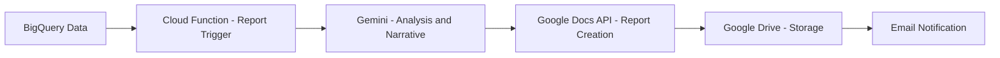

# How to Implement Automated Report Generation with Gemini and Google Workspace on GCP

Author: [nawazdhandala](https://www.github.com/nawazdhandala)

Tags: GCP, Gemini, Google Workspace, Automation, Report Generation, AI, Google Cloud

Description: Build an automated report generation pipeline that uses Gemini to analyze data and produce formatted reports in Google Docs and Sheets.

---

Monthly reports, quarterly reviews, incident summaries - every team generates them and nobody enjoys writing them. The data already exists in your databases and monitoring tools. The analysis follows a predictable pattern. The formatting is always the same template. This is a perfect candidate for automation. In this guide, I will show you how to build a pipeline that pulls data from BigQuery, uses Gemini to generate analysis and insights, and produces polished reports in Google Docs.

## Architecture Overview



## Prerequisites

You need a GCP project with a Google Workspace account. Enable the required APIs:

```bash
# Enable the APIs for data, AI, and Workspace integration
gcloud services enable \
    bigquery.googleapis.com \
    aiplatform.googleapis.com \
    docs.googleapis.com \
    drive.googleapis.com \
    sheets.googleapis.com \
    --project=your-project-id
```

Install the Python packages:

```bash
# Install all required packages
pip install google-cloud-aiplatform google-cloud-bigquery \
    google-api-python-client google-auth-httplib2 google-auth-oauthlib
```

## Step 1: Pull Data from BigQuery

Start by creating a module that fetches the data your report needs. Here is an example that pulls weekly performance metrics:

```python
# data_fetcher.py - Pull report data from BigQuery
from google.cloud import bigquery
from datetime import datetime, timedelta

client = bigquery.Client(project="your-project-id")

def fetch_weekly_metrics(end_date=None):
    """Fetch weekly performance metrics from BigQuery.
    Returns a dictionary with all the data sections needed for the report."""

    if end_date is None:
        end_date = datetime.utcnow()
    start_date = end_date - timedelta(days=7)

    # Query for key performance indicators
    kpi_query = """
    SELECT
        COUNT(DISTINCT user_id) AS active_users,
        COUNT(*) AS total_events,
        ROUND(AVG(response_time_ms), 2) AS avg_response_time,
        COUNTIF(status_code >= 500) AS error_count,
        ROUND(COUNTIF(status_code >= 500) / COUNT(*) * 100, 4) AS error_rate_pct,
        ROUND(SUM(revenue_usd), 2) AS total_revenue
    FROM `your-project.analytics.events`
    WHERE event_timestamp BETWEEN @start_date AND @end_date
    """

    # Query for daily breakdown
    daily_query = """
    SELECT
        DATE(event_timestamp) AS date,
        COUNT(DISTINCT user_id) AS daily_active_users,
        ROUND(AVG(response_time_ms), 2) AS avg_response_time,
        COUNTIF(status_code >= 500) AS errors
    FROM `your-project.analytics.events`
    WHERE event_timestamp BETWEEN @start_date AND @end_date
    GROUP BY 1
    ORDER BY 1
    """

    # Configure query parameters for date range
    job_config = bigquery.QueryJobConfig(
        query_parameters=[
            bigquery.ScalarQueryParameter("start_date", "TIMESTAMP", start_date),
            bigquery.ScalarQueryParameter("end_date", "TIMESTAMP", end_date),
        ]
    )

    # Execute both queries
    kpi_results = list(client.query(kpi_query, job_config=job_config).result())
    daily_results = list(client.query(daily_query, job_config=job_config).result())

    return {
        "period": f"{start_date.strftime('%Y-%m-%d')} to {end_date.strftime('%Y-%m-%d')}",
        "kpis": dict(kpi_results[0]) if kpi_results else {},
        "daily_breakdown": [dict(row) for row in daily_results],
    }
```

## Step 2: Generate Analysis with Gemini

Feed the data to Gemini and ask it to produce a written analysis:

```python
# report_generator.py - Use Gemini to generate report narrative
import vertexai
from vertexai.generative_models import GenerativeModel
import json

vertexai.init(project="your-project-id", location="us-central1")
model = GenerativeModel("gemini-2.0-flash")

def generate_report_narrative(metrics_data):
    """Use Gemini to analyze metrics and generate a written report section.
    The prompt provides context about what good vs. bad looks like."""

    prompt = f"""You are a technical writer producing a weekly performance report for the engineering team.

Here is this week's data:

Period: {metrics_data['period']}

KPIs:
{json.dumps(metrics_data['kpis'], indent=2, default=str)}

Daily Breakdown:
{json.dumps(metrics_data['daily_breakdown'], indent=2, default=str)}

Write a professional report that includes:
1. Executive Summary (2-3 sentences highlighting the most important findings)
2. Performance Overview (paragraph analyzing the KPIs, noting any concerning trends)
3. Daily Trends (brief analysis of day-over-day changes)
4. Recommendations (2-4 specific, actionable recommendations based on the data)

Guidelines:
- Write in a direct, professional tone
- Include specific numbers from the data
- Compare to reasonable industry benchmarks where relevant
- Flag any metrics that look concerning
- Keep the total length under 800 words
- Do not use emdash characters

Return the report as plain text with section headers marked with ##."""

    response = model.generate_content(
        prompt,
        generation_config={
            "temperature": 0.3,  # Slightly creative but mostly factual
            "max_output_tokens": 2048,
        }
    )

    return response.text
```

## Step 3: Create the Report in Google Docs

Now take Gemini's output and format it as a proper Google Doc:

```python
# docs_creator.py - Create formatted Google Docs reports
from googleapiclient.discovery import build
from google.oauth2 import service_account

# Use a service account for server-to-server authentication
SCOPES = ['https://www.googleapis.com/auth/documents', 'https://www.googleapis.com/auth/drive']
credentials = service_account.Credentials.from_service_account_file(
    'service-account-key.json', scopes=SCOPES
)

docs_service = build('docs', 'v1', credentials=credentials)
drive_service = build('drive', 'v3', credentials=credentials)

def create_report_doc(title, narrative, metrics_data):
    """Create a formatted Google Doc with the report content."""

    # Create a new document
    doc = docs_service.documents().create(body={"title": title}).execute()
    doc_id = doc["documentId"]

    # Build the document content as a series of insert requests
    requests = []
    current_index = 1  # Google Docs indices start at 1

    # Parse the narrative into sections and format them
    sections = narrative.split("##")

    for section in sections:
        section = section.strip()
        if not section:
            continue

        # Split into heading and body
        lines = section.split("\n", 1)
        heading = lines[0].strip()
        body = lines[1].strip() if len(lines) > 1 else ""

        # Insert the heading
        requests.append({
            "insertText": {
                "location": {"index": current_index},
                "text": heading + "\n"
            }
        })
        # Style it as a heading
        requests.append({
            "updateParagraphStyle": {
                "range": {
                    "startIndex": current_index,
                    "endIndex": current_index + len(heading) + 1
                },
                "paragraphStyle": {"namedStyleType": "HEADING_2"},
                "fields": "namedStyleType"
            }
        })
        current_index += len(heading) + 1

        # Insert the body text
        if body:
            requests.append({
                "insertText": {
                    "location": {"index": current_index},
                    "text": body + "\n\n"
                }
            })
            current_index += len(body) + 2

    # Apply all formatting requests in one batch
    docs_service.documents().batchUpdate(
        documentId=doc_id,
        body={"requests": requests}
    ).execute()

    # Move the document to the reports folder
    drive_service.files().update(
        fileId=doc_id,
        addParents="your-reports-folder-id",
        fields="id, parents"
    ).execute()

    return f"https://docs.google.com/document/d/{doc_id}/edit"
```

## Step 4: Tie It All Together with a Cloud Function

Create a Cloud Function that orchestrates the entire pipeline and runs on a schedule:

```python
# main.py - Orchestrator function triggered by Cloud Scheduler
import functions_framework
from data_fetcher import fetch_weekly_metrics
from report_generator import generate_report_narrative
from docs_creator import create_report_doc
from datetime import datetime

@functions_framework.http
def generate_weekly_report(request):
    """Main orchestrator: fetch data, generate analysis, create report."""

    # Step 1: Get the data
    metrics = fetch_weekly_metrics()

    # Step 2: Generate the narrative with Gemini
    narrative = generate_report_narrative(metrics)

    # Step 3: Create the formatted Google Doc
    report_title = f"Weekly Performance Report - {metrics['period']}"
    doc_url = create_report_doc(report_title, narrative, metrics)

    # Step 4: Send notification (Slack, email, etc.)
    print(f"Report created: {doc_url}")

    return {"status": "success", "report_url": doc_url}, 200
```

Deploy it with Cloud Scheduler to run every Monday morning:

```bash
# Deploy the report generation function
gcloud functions deploy generate-weekly-report \
    --gen2 \
    --runtime=python311 \
    --region=us-central1 \
    --source=./report-pipeline \
    --entry-point=generate_weekly_report \
    --trigger-http \
    --timeout=300s \
    --memory=512MB

# Schedule it to run every Monday at 8 AM
gcloud scheduler jobs create http weekly-report-job \
    --schedule="0 8 * * 1" \
    --uri="https://REGION-PROJECT.cloudfunctions.net/generate-weekly-report" \
    --http-method=POST \
    --time-zone="America/New_York"
```

## Customizing the Template

You can extend this pattern for different report types - incident reports that pull from Cloud Logging, financial reports from Sheets data, or customer health reports from your CRM. The key is defining the data sources and giving Gemini clear instructions about what analysis to perform and how to structure the output.

## Monitoring the Pipeline

Use OneUptime to monitor the report generation pipeline. Set up alerts for function failures, long execution times, or missed scheduled runs. Nothing is worse than your Monday morning report not showing up because the pipeline silently failed over the weekend.

## Summary

Automated report generation saves hours of manual work every week. By combining BigQuery for data, Gemini for analysis, and Google Docs for formatting, you get reports that are consistent, timely, and actually contain useful insights rather than just raw numbers. Start with one report type, validate the output quality with your team, and then expand to other report templates.
