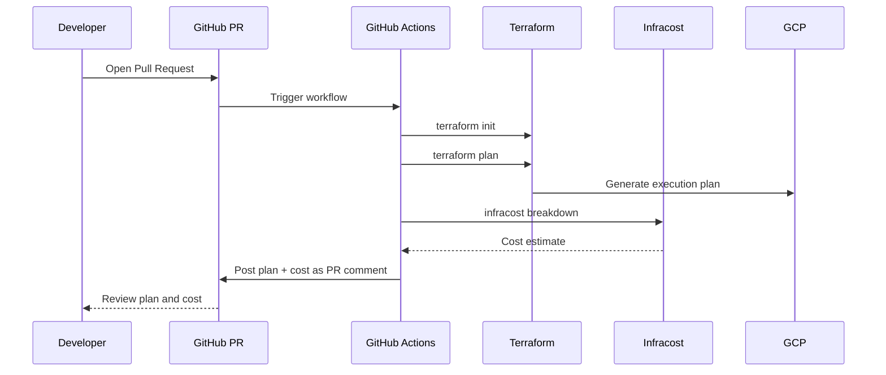

# How to Implement Automated Terraform Plan Reviews for GCP Using GitHub Actions with Cost Estimation

Author: [nawazdhandala](https://www.github.com/nawazdhandala)

Tags: GCP, Terraform, GitHub Actions, CI/CD, Cost Estimation, Infrastructure as Code

Description: Set up automated Terraform plan reviews in GitHub Actions for GCP deployments, including plan output as PR comments, cost estimation with Infracost, and automated approval workflows.

---

Reviewing Terraform changes in a pull request by reading HCL diffs is not enough. You can see that a variable changed from "e2-standard-4" to "e2-standard-16", but do you know how much more that costs per month? And did you check if the plan output matches what the code diff suggests?

Automated plan reviews fix this. When a PR is opened, GitHub Actions runs `terraform plan`, posts the output as a PR comment, and estimates the cost impact. Reviewers see exactly what will change before they approve.

Here is how to build this workflow for GCP.

## What the Workflow Does



## Workload Identity Federation Setup

First, set up authentication. Use Workload Identity Federation instead of service account keys:

```hcl
# wif.tf - Workload Identity Federation for GitHub Actions

resource "google_iam_workload_identity_pool" "github" {
  project                   = var.project_id
  workload_identity_pool_id = "github-actions"
  display_name              = "GitHub Actions"
}

resource "google_iam_workload_identity_pool_provider" "github" {
  project                            = var.project_id
  workload_identity_pool_id          = google_iam_workload_identity_pool.github.workload_identity_pool_id
  workload_identity_pool_provider_id = "github-provider"
  display_name                       = "GitHub"

  attribute_mapping = {
    "google.subject"       = "assertion.sub"
    "attribute.actor"      = "assertion.actor"
    "attribute.repository" = "assertion.repository"
    "attribute.ref"        = "assertion.ref"
  }

  attribute_condition = "assertion.repository_owner == '${var.github_org}'"

  oidc {
    issuer_uri = "https://token.actions.githubusercontent.com"
  }
}

# Service account for Terraform plan operations (read-only)
resource "google_service_account" "terraform_plan" {
  project      = var.project_id
  account_id   = "terraform-plan"
  display_name = "Terraform Plan (Read-Only)"
}

# Grant plan-level permissions - read state and plan, but not apply
resource "google_project_iam_member" "plan_viewer" {
  project = var.project_id
  role    = "roles/viewer"
  member  = "serviceAccount:${google_service_account.terraform_plan.email}"
}

resource "google_storage_bucket_iam_member" "plan_state_reader" {
  bucket = var.state_bucket_name
  role   = "roles/storage.objectViewer"
  member = "serviceAccount:${google_service_account.terraform_plan.email}"
}

# Allow GitHub Actions to impersonate the plan service account
resource "google_service_account_iam_member" "github_plan" {
  service_account_id = google_service_account.terraform_plan.name
  role               = "roles/iam.workloadIdentityUser"
  member             = "principalSet://iam.googleapis.com/${google_iam_workload_identity_pool.github.name}/attribute.repository/${var.github_org}/${var.github_repo}"
}

# Service account for Terraform apply operations (write)
resource "google_service_account" "terraform_apply" {
  project      = var.project_id
  account_id   = "terraform-apply"
  display_name = "Terraform Apply"
}

resource "google_project_iam_member" "apply_editor" {
  project = var.project_id
  role    = "roles/editor"
  member  = "serviceAccount:${google_service_account.terraform_apply.email}"
}
```

## The GitHub Actions Workflow

Here is the complete workflow file:

```yaml
# .github/workflows/terraform-plan.yml
name: Terraform Plan Review

on:
  pull_request:
    paths:
      - 'infrastructure/**'
      - '.github/workflows/terraform-plan.yml'

permissions:
  contents: read
  pull-requests: write
  id-token: write

env:
  TF_VERSION: '1.7.0'
  WORKING_DIR: 'infrastructure'
  GCP_PROJECT_ID: 'my-project'
  GCP_WORKLOAD_IDENTITY_PROVIDER: 'projects/123456/locations/global/workloadIdentityPools/github-actions/providers/github-provider'
  GCP_SERVICE_ACCOUNT: 'terraform-plan@my-project.iam.gserviceaccount.com'

jobs:
  terraform-plan:
    name: Terraform Plan
    runs-on: ubuntu-latest

    steps:
      - name: Checkout code
        uses: actions/checkout@v4

      # Authenticate to GCP using Workload Identity Federation
      - name: Authenticate to GCP
        id: auth
        uses: google-github-actions/auth@v2
        with:
          workload_identity_provider: ${{ env.GCP_WORKLOAD_IDENTITY_PROVIDER }}
          service_account: ${{ env.GCP_SERVICE_ACCOUNT }}

      - name: Setup Terraform
        uses: hashicorp/setup-terraform@v3
        with:
          terraform_version: ${{ env.TF_VERSION }}
          terraform_wrapper: false

      # Initialize Terraform
      - name: Terraform Init
        id: init
        working-directory: ${{ env.WORKING_DIR }}
        run: terraform init -no-color

      # Validate the configuration
      - name: Terraform Validate
        id: validate
        working-directory: ${{ env.WORKING_DIR }}
        run: terraform validate -no-color

      # Format check
      - name: Terraform Format Check
        id: fmt
        working-directory: ${{ env.WORKING_DIR }}
        run: terraform fmt -check -recursive -no-color
        continue-on-error: true

      # Generate the plan
      - name: Terraform Plan
        id: plan
        working-directory: ${{ env.WORKING_DIR }}
        run: |
          terraform plan -no-color -out=tfplan 2>&1 | tee plan_output.txt
          echo "exitcode=$?" >> $GITHUB_OUTPUT
        continue-on-error: true

      # Save plan as JSON for Infracost
      - name: Save Plan JSON
        working-directory: ${{ env.WORKING_DIR }}
        run: terraform show -json tfplan > plan.json

      # Post plan output as PR comment
      - name: Post Plan Comment
        uses: actions/github-script@v7
        with:
          github-token: ${{ secrets.GITHUB_TOKEN }}
          script: |
            const fs = require('fs');
            const plan = fs.readFileSync('${{ env.WORKING_DIR }}/plan_output.txt', 'utf8');

            // Truncate if too long for a PR comment
            const maxLength = 60000;
            const truncated = plan.length > maxLength
              ? plan.substring(0, maxLength) + '\n\n... (truncated)'
              : plan;

            const fmtResult = '${{ steps.fmt.outcome }}';
            const validateResult = '${{ steps.validate.outcome }}';
            const planResult = '${{ steps.plan.outcome }}';

            const body = `## Terraform Plan Review

            | Check | Status |
            |-------|--------|
            | Format | ${fmtResult === 'success' ? 'Passed' : 'Failed'} |
            | Validate | ${validateResult === 'success' ? 'Passed' : 'Failed'} |
            | Plan | ${planResult === 'success' ? 'Passed' : 'Failed'} |

            <details>
            <summary>Plan Output (click to expand)</summary>

            \`\`\`
            ${truncated}
            \`\`\`

            </details>

            *Triggered by @${context.actor} in commit ${context.sha.substring(0, 7)}*`;

            // Find existing comment to update
            const { data: comments } = await github.rest.issues.listComments({
              owner: context.repo.owner,
              repo: context.repo.repo,
              issue_number: context.issue.number,
            });

            const botComment = comments.find(c =>
              c.body.includes('## Terraform Plan Review')
            );

            if (botComment) {
              await github.rest.issues.updateComment({
                owner: context.repo.owner,
                repo: context.repo.repo,
                comment_id: botComment.id,
                body: body,
              });
            } else {
              await github.rest.issues.createComment({
                owner: context.repo.owner,
                repo: context.repo.repo,
                issue_number: context.issue.number,
                body: body,
              });
            }

      # Fail if plan failed
      - name: Check Plan Status
        if: steps.plan.outcome == 'failure'
        run: exit 1

  cost-estimation:
    name: Cost Estimation
    runs-on: ubuntu-latest
    needs: terraform-plan

    steps:
      - name: Checkout code
        uses: actions/checkout@v4

      - name: Setup Infracost
        uses: infracost/actions/setup@v3
        with:
          api-key: ${{ secrets.INFRACOST_API_KEY }}

      # Authenticate to GCP for Infracost
      - name: Authenticate to GCP
        uses: google-github-actions/auth@v2
        with:
          workload_identity_provider: ${{ env.GCP_WORKLOAD_IDENTITY_PROVIDER }}
          service_account: ${{ env.GCP_SERVICE_ACCOUNT }}

      - name: Setup Terraform
        uses: hashicorp/setup-terraform@v3
        with:
          terraform_version: ${{ env.TF_VERSION }}

      # Generate Infracost baseline from main branch
      - name: Infracost Baseline
        run: |
          infracost breakdown \
            --path=${{ env.WORKING_DIR }} \
            --format=json \
            --out-file=/tmp/infracost-base.json
        env:
          INFRACOST_TERRAFORM_BINARY: terraform

      # Generate Infracost diff
      - name: Infracost Diff
        run: |
          infracost diff \
            --path=${{ env.WORKING_DIR }} \
            --compare-to=/tmp/infracost-base.json \
            --format=json \
            --out-file=/tmp/infracost-diff.json

      # Post cost comment
      - name: Post Cost Comment
        run: |
          infracost comment github \
            --path=/tmp/infracost-diff.json \
            --repo=${{ github.repository }} \
            --pull-request=${{ github.event.pull_request.number }} \
            --github-token=${{ secrets.GITHUB_TOKEN }} \
            --behavior=update
```

## The Apply Workflow

A separate workflow handles applying after PR merge:

```yaml
# .github/workflows/terraform-apply.yml
name: Terraform Apply

on:
  push:
    branches:
      - main
    paths:
      - 'infrastructure/**'

permissions:
  contents: read
  id-token: write

env:
  TF_VERSION: '1.7.0'
  WORKING_DIR: 'infrastructure'
  GCP_WORKLOAD_IDENTITY_PROVIDER: 'projects/123456/locations/global/workloadIdentityPools/github-actions/providers/github-provider'
  GCP_SERVICE_ACCOUNT: 'terraform-apply@my-project.iam.gserviceaccount.com'

jobs:
  terraform-apply:
    name: Terraform Apply
    runs-on: ubuntu-latest
    environment: production

    steps:
      - uses: actions/checkout@v4

      - name: Authenticate to GCP
        uses: google-github-actions/auth@v2
        with:
          workload_identity_provider: ${{ env.GCP_WORKLOAD_IDENTITY_PROVIDER }}
          service_account: ${{ env.GCP_SERVICE_ACCOUNT }}

      - name: Setup Terraform
        uses: hashicorp/setup-terraform@v3
        with:
          terraform_version: ${{ env.TF_VERSION }}

      - name: Terraform Init
        working-directory: ${{ env.WORKING_DIR }}
        run: terraform init

      - name: Terraform Apply
        working-directory: ${{ env.WORKING_DIR }}
        run: terraform apply -auto-approve
```

## Adding Cost Thresholds

You can fail the PR check if the cost increase exceeds a threshold. Add this to the cost estimation job:

```yaml
      - name: Check Cost Threshold
        run: |
          MONTHLY_DIFF=$(jq '.diffTotalMonthlyCost | tonumber' /tmp/infracost-diff.json)
          THRESHOLD=500

          if (( $(echo "$MONTHLY_DIFF > $THRESHOLD" | bc -l) )); then
            echo "Cost increase of \$$MONTHLY_DIFF/month exceeds threshold of \$$THRESHOLD/month"
            echo "Requires approval from the infrastructure team"
            exit 1
          fi
```

## Multi-Environment Plan

For repositories with multiple environments, plan each one:

```yaml
jobs:
  plan:
    strategy:
      matrix:
        environment: [staging, production]
      fail-fast: false

    steps:
      # ... auth and setup steps ...

      - name: Terraform Plan - ${{ matrix.environment }}
        working-directory: infrastructure/environments/${{ matrix.environment }}
        run: terraform plan -no-color -out=tfplan
```

## Security Considerations

A few important security points for this setup:

- The plan service account should be read-only. It never needs to create or modify resources.
- The apply service account has write permissions and should only be used from the main branch workflow.
- Use GitHub's environment protection rules on the production environment to require approvals.
- Never log the full plan output if it might contain secrets. Use `terraform plan -no-color` and review the output before posting.
- Infracost does not need GCP credentials for cost estimation - it reads the plan JSON.

## Summary

Automated Terraform plan reviews transform infrastructure PRs from "trust me, this looks right" to "here is exactly what will change and what it will cost." The plan output shows resource additions, changes, and deletions. Infracost shows the dollar impact. Together, they give reviewers the information they need to make informed decisions. Set this up once, and every infrastructure change gets the same level of scrutiny automatically.
