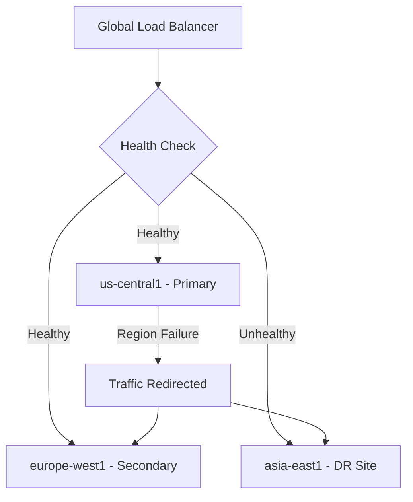

# How to Implement Backend Service Failover Policies for Regional Disaster Recovery on GCP

Author: [nawazdhandala](https://www.github.com/nawazdhandala)

Tags: GCP, Disaster Recovery, Failover, Load Balancer, High Availability

Description: Learn how to implement backend service failover policies on GCP Load Balancer for regional disaster recovery with automatic traffic redirection to healthy regions.

---

When an entire region goes down, your application needs to keep serving traffic from another region without manual intervention. GCP's global load balancer handles this automatically - when health checks determine that backends in one region are unhealthy, traffic shifts to healthy backends in other regions. But the default behavior might not match your requirements. You might want to keep some capacity in reserve, control the failover ratio, or implement a primary-backup architecture.

In this post, I will cover how to configure backend service failover policies for different disaster recovery patterns on GCP.

## Failover Architecture Overview

The global external Application Load Balancer distributes traffic to the nearest healthy backend. When backends in a region fail, traffic automatically moves to the next nearest healthy region. You can control this behavior through capacity scalers, failover ratios, and connection draining settings.



## Step 1 - Set Up Multi-Region Backends

Start by deploying backends in multiple regions with a clear primary-secondary hierarchy.

```bash
# Create the health check
gcloud compute health-checks create http app-hc \
    --port=8080 \
    --request-path=/healthz \
    --check-interval=5s \
    --timeout=3s \
    --healthy-threshold=2 \
    --unhealthy-threshold=3

# Create the backend service
gcloud compute backend-services create app-backend \
    --global \
    --protocol=HTTP \
    --health-checks=app-hc \
    --port-name=http \
    --connection-draining-timeout=300

# Instance groups in three regions
gcloud compute instance-groups managed create app-mig-us \
    --template=app-template \
    --size=4 \
    --zone=us-central1-a

gcloud compute instance-groups managed create app-mig-eu \
    --template=app-template \
    --size=4 \
    --zone=europe-west1-b

gcloud compute instance-groups managed create app-mig-asia \
    --template=app-template \
    --size=2 \
    --zone=asia-east1-a
```

## Step 2 - Configure Capacity Scalers for Primary-Secondary

Capacity scalers control how much traffic each backend group receives. By setting different capacity scalers, you can create a primary-secondary architecture.

```bash
# Primary region - full capacity
gcloud compute backend-services add-backend app-backend \
    --global \
    --instance-group=app-mig-us \
    --instance-group-zone=us-central1-a \
    --balancing-mode=UTILIZATION \
    --max-utilization=0.8 \
    --capacity-scaler=1.0

# Secondary region - receives traffic during normal operation
# but with lower priority
gcloud compute backend-services add-backend app-backend \
    --global \
    --instance-group=app-mig-eu \
    --instance-group-zone=europe-west1-b \
    --balancing-mode=UTILIZATION \
    --max-utilization=0.8 \
    --capacity-scaler=1.0

# DR region - standby, only receives traffic during failover
gcloud compute backend-services add-backend app-backend \
    --global \
    --instance-group=app-mig-asia \
    --instance-group-zone=asia-east1-a \
    --balancing-mode=UTILIZATION \
    --max-utilization=0.8 \
    --capacity-scaler=0.0
```

Setting `capacity-scaler=0.0` on the Asia region means it receives no traffic during normal operation. It only gets traffic when the load balancer has no other healthy backends to send to.

## Step 3 - Configure the Failover Policy

The failover policy controls how the load balancer handles traffic when backends fail.

```bash
# Configure the failover policy through the API
# The gcloud CLI has limited support, so we use the REST API
gcloud compute backend-services export app-backend \
    --global \
    --destination=/tmp/backend-config.yaml
```

Edit the exported configuration to add failover settings:

```yaml
# backend-config.yaml - Backend service with failover configuration
name: app-backend
protocol: HTTP
healthChecks:
  - projects/my-project/global/healthChecks/app-hc
portName: http
connectionDraining:
  drainingTimeoutSec: 300
loadBalancingScheme: EXTERNAL_MANAGED
backends:
  - group: projects/my-project/zones/us-central1-a/instanceGroups/app-mig-us
    balancingMode: UTILIZATION
    maxUtilization: 0.8
    capacityScaler: 1.0
  - group: projects/my-project/zones/europe-west1-b/instanceGroups/app-mig-eu
    balancingMode: UTILIZATION
    maxUtilization: 0.8
    capacityScaler: 1.0
  - group: projects/my-project/zones/asia-east1-a/instanceGroups/app-mig-asia
    balancingMode: UTILIZATION
    maxUtilization: 0.8
    capacityScaler: 0.0
    failover: true
localityLbPolicy: ROUND_ROBIN
outlierDetection:
  consecutiveErrors: 5
  interval:
    seconds: 10
  baseEjectionTime:
    seconds: 30
  maxEjectionPercent: 50
  enforcingConsecutiveErrors: 100
```

```bash
# Import the updated configuration
gcloud compute backend-services import app-backend \
    --global \
    --source=/tmp/backend-config.yaml
```

## Step 4 - Configure Health Check Sensitivity

For disaster recovery, health check timing matters. Too slow and traffic keeps going to an unhealthy region for too long. Too fast and transient issues cause unnecessary failovers.

```bash
# Configure health checks for fast failure detection
gcloud compute health-checks update http app-hc \
    --check-interval=5s \
    --timeout=3s \
    --healthy-threshold=2 \
    --unhealthy-threshold=3
```

With these settings:
- Health checks run every 5 seconds
- Each check times out after 3 seconds
- An instance is marked unhealthy after 3 consecutive failures (15 seconds)
- An instance is marked healthy after 2 consecutive successes (10 seconds)

This means failover starts about 15 seconds after a regional failure begins. For faster failover, reduce the check interval and unhealthy threshold, but be aware this increases the risk of false positives.

## Step 5 - Connection Draining

When the load balancer starts shifting traffic away from a failing region, you do not want to drop existing connections immediately. Connection draining gives in-flight requests time to complete.

```bash
# Set connection draining timeout
gcloud compute backend-services update app-backend \
    --global \
    --connection-draining-timeout=300
```

The 300-second (5-minute) timeout means existing connections have up to 5 minutes to complete before they are forcefully terminated. New connections go to healthy regions immediately.

## Step 6 - Test Failover

You should regularly test your failover configuration. Here is how to simulate a regional failure.

```bash
# Simulate failure by setting the primary region's capacity to zero
gcloud compute backend-services update-backend app-backend \
    --global \
    --instance-group=app-mig-us \
    --instance-group-zone=us-central1-a \
    --capacity-scaler=0.0

# Monitor traffic shifting to secondary regions
watch -n 5 'gcloud compute backend-services get-health app-backend --global'

# After testing, restore the primary region
gcloud compute backend-services update-backend app-backend \
    --global \
    --instance-group=app-mig-us \
    --instance-group-zone=us-central1-a \
    --capacity-scaler=1.0
```

You can also test by SSH-ing into the VMs in the primary region and stopping the application:

```bash
# Stop the application on all VMs in the primary region
gcloud compute ssh app-mig-us-xxxx --zone=us-central1-a \
    --command="sudo systemctl stop nginx"
```

## Step 7 - Automated Failover Monitoring

Set up alerts to notify you when failover occurs.

```python
from google.cloud import monitoring_v3

client = monitoring_v3.AlertPolicyServiceClient()

# Alert when a backend group goes unhealthy
alert_policy = monitoring_v3.AlertPolicy(
    display_name="Regional Failover Alert",
    conditions=[
        monitoring_v3.AlertPolicy.Condition(
            display_name="Backend group unhealthy",
            condition_threshold=monitoring_v3.AlertPolicy.Condition.MetricThreshold(
                filter=(
                    'resource.type="https_lb_rule" '
                    'AND metric.type="loadbalancing.googleapis.com/https/backend_request_count" '
                    'AND metric.labels.backend_scope="us-central1-a"'
                ),
                comparison=monitoring_v3.ComparisonType.COMPARISON_LT,
                threshold_value=1,
                duration={"seconds": 60},
                aggregations=[
                    monitoring_v3.Aggregation(
                        alignment_period={"seconds": 60},
                        per_series_aligner=monitoring_v3.Aggregation.Aligner.ALIGN_RATE,
                    )
                ],
            ),
        )
    ],
    notification_channels=["projects/my-project/notificationChannels/12345"],
    alert_strategy=monitoring_v3.AlertPolicy.AlertStrategy(
        notification_rate_limit=monitoring_v3.AlertPolicy.AlertStrategy.NotificationRateLimit(
            period={"seconds": 300}  # Max one notification per 5 minutes
        )
    ),
)

result = client.create_alert_policy(
    name="projects/my-project",
    alert_policy=alert_policy,
)
```

## DR Patterns

Here are common DR patterns and how to configure them on GCP:

**Active-Active (both regions serve traffic)**:
```bash
# Both regions at full capacity
--capacity-scaler=1.0  # for both regions
```

**Active-Passive (standby receives no traffic until failover)**:
```bash
# Primary at full, DR at zero
--capacity-scaler=1.0  # primary
--capacity-scaler=0.0  # standby
```

**Active-Warm (standby receives small amount of traffic to stay warm)**:
```bash
# Primary at full, warm standby at 10%
--capacity-scaler=1.0   # primary
--capacity-scaler=0.1   # warm standby
```

The warm standby pattern is my preference. It keeps the DR site exercised with real traffic, which means you find configuration issues before a real disaster rather than during one.

## Wrapping Up

Backend service failover on GCP is handled by the global load balancer through health checks, capacity scalers, and connection draining. The load balancer automatically shifts traffic away from unhealthy regions, and you control the behavior through capacity scalers (which regions are active vs standby), health check timing (how fast failover happens), and connection draining (how graceful the transition is). Test your failover configuration regularly - the worst time to discover a DR problem is during an actual disaster. Set up monitoring alerts for failover events so your team knows when traffic is being redirected, and investigate the root cause promptly.
