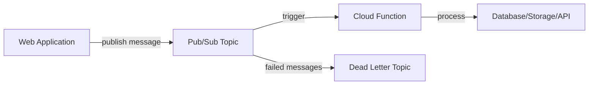

# How to Implement Background Task Processing in Python Cloud Functions with Pub/Sub Triggers

Author: [nawazdhandala](https://www.github.com/nawazdhandala)

Tags: GCP, Cloud Functions, Pub/Sub, Python, Serverless

Description: Learn how to build background task processing systems using Python Cloud Functions triggered by Pub/Sub messages for asynchronous workloads on GCP.

---

Not every task needs to happen in the request-response cycle. Sending emails, processing images, generating reports, syncing data - these are all things that should happen in the background. On GCP, the cleanest way to handle background tasks is with Cloud Functions triggered by Pub/Sub messages. Your application publishes a message describing the work, and a Cloud Function picks it up and processes it asynchronously.

## The Architecture

The pattern is straightforward. Your main application publishes a message to a Pub/Sub topic. Cloud Functions automatically subscribes to the topic and invokes your function for each message. The function does the work, and if it fails, Pub/Sub retries delivery.



## Setting Up the Infrastructure

Create the Pub/Sub topic and deploy your function.

```bash
# Create the topic for background tasks
gcloud pubsub topics create background-tasks

# Create a dead letter topic for failed messages
gcloud pubsub topics create background-tasks-dead-letter
```

## Writing the Cloud Function

A Pub/Sub-triggered Cloud Function receives a CloudEvent containing the message data. Here is a function that processes different types of background tasks.

```python
# main.py - Cloud Function for background task processing
import functions_framework
import base64
import json
import logging
from google.cloud import storage, firestore

logging.basicConfig(level=logging.INFO)
logger = logging.getLogger(__name__)

@functions_framework.cloud_event
def process_task(cloud_event):
    """Process a background task from a Pub/Sub message.

    The message data should be a JSON object with a 'task_type' field
    and a 'payload' field containing task-specific data.
    """
    # Decode the Pub/Sub message data from base64
    message_data = base64.b64decode(cloud_event.data["message"]["data"])
    task = json.loads(message_data)

    # Extract message attributes for routing and metadata
    attributes = cloud_event.data["message"].get("attributes", {})

    task_type = task.get("task_type")
    payload = task.get("payload", {})

    logger.info(f"Processing task: {task_type}", extra={
        "task_type": task_type,
        "message_id": cloud_event.data["message"]["messageId"],
    })

    # Route to the appropriate handler based on task type
    handlers = {
        "send_email": handle_send_email,
        "process_image": handle_process_image,
        "generate_report": handle_generate_report,
        "sync_data": handle_sync_data,
    }

    handler = handlers.get(task_type)
    if handler is None:
        logger.error(f"Unknown task type: {task_type}")
        return  # Acknowledge the message to prevent infinite retries

    try:
        handler(payload)
        logger.info(f"Task completed: {task_type}")
    except Exception as e:
        logger.error(f"Task failed: {task_type} - {str(e)}")
        # Raising an exception causes Pub/Sub to retry the message
        raise
```

## Implementing Task Handlers

Each task type gets its own handler function. Keep them focused and idempotent.

```python
# handlers.py - Task handler implementations
from google.cloud import storage, firestore
import requests
import logging

logger = logging.getLogger(__name__)

def handle_send_email(payload):
    """Send an email notification."""
    recipient = payload["recipient"]
    subject = payload["subject"]
    body = payload["body"]

    # Use your email service (SendGrid, Mailgun, etc.)
    logger.info(f"Sending email to {recipient}: {subject}")

    # Example with a generic email API
    response = requests.post(
        "https://api.emailservice.com/send",
        json={
            "to": recipient,
            "subject": subject,
            "body": body,
        },
        headers={"Authorization": "Bearer YOUR_API_KEY"},
        timeout=30,
    )
    response.raise_for_status()
    logger.info(f"Email sent successfully to {recipient}")


def handle_process_image(payload):
    """Resize and optimize an uploaded image."""
    bucket_name = payload["bucket"]
    file_path = payload["file_path"]
    output_sizes = payload.get("sizes", [{"width": 800, "height": 600}])

    storage_client = storage.Client()
    bucket = storage_client.bucket(bucket_name)

    # Download the original image
    blob = bucket.blob(file_path)
    image_bytes = blob.download_as_bytes()

    logger.info(f"Processing image: {file_path} ({len(image_bytes)} bytes)")

    # Process each requested size
    for size in output_sizes:
        # In a real implementation, use Pillow to resize
        output_path = f"processed/{size['width']}x{size['height']}/{file_path}"
        output_blob = bucket.blob(output_path)
        # output_blob.upload_from_string(resized_bytes)
        logger.info(f"Created {output_path}")


def handle_generate_report(payload):
    """Generate a report and store it in Firestore."""
    report_type = payload["report_type"]
    date_range = payload["date_range"]
    user_id = payload["requested_by"]

    logger.info(f"Generating {report_type} report for {date_range}")

    # Generate the report data (query databases, compute metrics, etc.)
    report_data = {
        "type": report_type,
        "date_range": date_range,
        "status": "completed",
        "generated_at": firestore.SERVER_TIMESTAMP,
        "requested_by": user_id,
        "results": {"total_revenue": 50000, "orders": 1234},
    }

    # Store the report in Firestore
    db = firestore.Client()
    db.collection("reports").add(report_data)
    logger.info(f"Report stored in Firestore")


def handle_sync_data(payload):
    """Sync data between two systems."""
    source = payload["source"]
    destination = payload["destination"]
    entity_type = payload["entity_type"]

    logger.info(f"Syncing {entity_type} from {source} to {destination}")

    # Fetch from source, transform, write to destination
    # Implementation depends on the specific systems involved
```

## Publishing Tasks from Your Application

Your main application publishes messages to trigger background processing.

```python
# task_publisher.py - Helper for publishing background tasks
from google.cloud import pubsub_v1
import json

class TaskPublisher:
    """Publish background tasks to Pub/Sub."""

    def __init__(self, project_id, topic_id="background-tasks"):
        self.publisher = pubsub_v1.PublisherClient()
        self.topic_path = self.publisher.topic_path(project_id, topic_id)

    def publish(self, task_type, payload, priority="normal"):
        """Publish a task message to Pub/Sub."""
        message = json.dumps({
            "task_type": task_type,
            "payload": payload,
        }).encode("utf-8")

        # Publish with attributes for filtering and monitoring
        future = self.publisher.publish(
            self.topic_path,
            data=message,
            task_type=task_type,
            priority=priority,
        )

        message_id = future.result()
        return message_id

# Usage in your web application
publisher = TaskPublisher("my-gcp-project")

# Queue an email after user registration
publisher.publish("send_email", {
    "recipient": "newuser@example.com",
    "subject": "Welcome!",
    "body": "Thanks for signing up.",
})

# Queue image processing after upload
publisher.publish("process_image", {
    "bucket": "my-uploads-bucket",
    "file_path": "photos/user-123/profile.jpg",
    "sizes": [
        {"width": 200, "height": 200},
        {"width": 800, "height": 600},
    ],
})

# Queue a report generation
publisher.publish("generate_report", {
    "report_type": "monthly_sales",
    "date_range": {"start": "2024-01-01", "end": "2024-01-31"},
    "requested_by": "user-456",
}, priority="high")
```

## Deploying the Cloud Function

Deploy your function to Cloud Functions Gen 2.

```bash
# Deploy the Cloud Function with Pub/Sub trigger
gcloud functions deploy process-background-task \
    --gen2 \
    --runtime=python311 \
    --region=us-central1 \
    --source=. \
    --entry-point=process_task \
    --trigger-topic=background-tasks \
    --memory=256Mi \
    --timeout=540s \
    --max-instances=10 \
    --min-instances=0 \
    --set-env-vars="GCP_PROJECT=my-gcp-project"
```

The `--timeout=540s` gives each task up to 9 minutes to complete. Adjust based on your longest-running task.

## Making Tasks Idempotent

Since Pub/Sub can deliver messages more than once, your task handlers must be idempotent - processing the same message twice should produce the same result.

```python
from google.cloud import firestore

db = firestore.Client()

def handle_send_email_idempotent(payload, message_id):
    """Idempotent email handler that tracks processed messages."""
    # Check if we already processed this message
    processed_ref = db.collection("processed_tasks").document(message_id)
    processed_doc = processed_ref.get()

    if processed_doc.exists:
        logger.info(f"Message {message_id} already processed, skipping")
        return

    # Send the email
    send_email(payload["recipient"], payload["subject"], payload["body"])

    # Record that we processed this message
    processed_ref.set({
        "processed_at": firestore.SERVER_TIMESTAMP,
        "task_type": "send_email",
    })
```

## Configuring Retry and Dead Letter Policies

Set up retry policies to handle transient failures and dead letter topics for messages that repeatedly fail.

```bash
# Create a subscription with retry and dead letter configuration
gcloud pubsub subscriptions create background-tasks-sub \
    --topic=background-tasks \
    --ack-deadline=600 \
    --max-delivery-attempts=5 \
    --dead-letter-topic=background-tasks-dead-letter \
    --min-retry-delay=10s \
    --max-retry-delay=600s
```

## Monitoring Background Tasks

Background tasks are invisible to users, which means failures can go unnoticed for a long time. You need monitoring. OneUptime (https://oneuptime.com) can monitor your Cloud Functions, track invocation rates, error rates, and execution duration, and alert you when tasks start failing or backing up in the queue.

## Summary

Pub/Sub-triggered Cloud Functions are an excellent fit for background task processing. The pattern is simple: your application publishes a message, and a function processes it asynchronously. The key principles are to make tasks idempotent (since Pub/Sub can deliver messages more than once), set appropriate timeouts, configure dead letter topics for failed messages, and monitor your task queue to catch issues early. This architecture scales automatically and you only pay for the compute time your tasks actually use.
