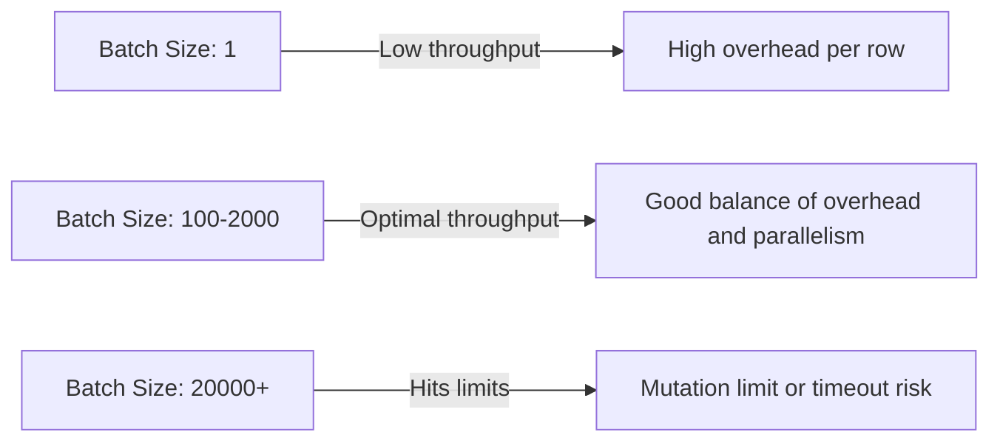

# How to Implement Batch Writes in Cloud Spanner for High-Throughput Ingestion

Author: [nawazdhandala](https://www.github.com/nawazdhandala)

Tags: GCP, Cloud Spanner, Batch Writes, High Throughput, Performance

Description: Learn how to implement efficient batch writes in Cloud Spanner for high-throughput data ingestion with practical code examples and optimization tips.

---

When you need to ingest large volumes of data into Cloud Spanner - whether it is loading initial data, processing event streams, or handling bulk updates - writing one row at a time is painfully slow. Batch writes let you group multiple mutations into a single operation, dramatically improving throughput. In this post, I will cover the different approaches to batch writing in Spanner and how to squeeze the most performance out of each one.

## Why Batch Writes Matter

Every write to Spanner involves network overhead, transaction coordination, and replication. When you write one row at a time, you pay that overhead for each row. With batch writes, you amortize the overhead across hundreds or thousands of rows.

The difference is significant. Single-row writes might give you a few hundred writes per second. Properly batched writes can push tens of thousands of rows per second on a modestly sized instance.

## Method 1: Mutations with Apply

The simplest form of batch writing groups multiple mutations into a single `Apply` call:

```python
from google.cloud import spanner
import uuid

client = spanner.Client()
instance = client.instance("my-instance")
database = instance.database("my-database")

def batch_insert_users(users_data):
    """Insert multiple users in a single write transaction using mutations."""

    # Build a list of mutations for all rows
    with database.batch() as batch:
        for user in users_data:
            batch.insert(
                table="Users",
                columns=["UserId", "Email", "DisplayName", "CreatedAt"],
                values=[[
                    str(uuid.uuid4()),
                    user["email"],
                    user["name"],
                    spanner.COMMIT_TIMESTAMP
                ]]
            )

# Insert 500 users in a single batch
users = [{"email": f"user{i}@example.com", "name": f"User {i}"} for i in range(500)]
batch_insert_users(users)
```

The `batch()` context manager collects all mutations and commits them in a single transaction when the block exits. This is efficient because there is only one round trip to Spanner for all 500 rows.

## Mutation Limits

There are limits to how much you can put in a single batch:

- Maximum 20,000 mutations per commit (each column value counts as one mutation)
- Maximum 100 MB of data per commit

If you have 4 columns per row, you can fit about 5,000 rows in a single batch (4 columns x 5,000 rows = 20,000 mutations). Plan your batch sizes accordingly:

```python
def chunked_batch_insert(all_rows, columns, table_name, chunk_size=2000):
    """Insert rows in chunks to stay within Spanner's mutation limits."""

    for i in range(0, len(all_rows), chunk_size):
        chunk = all_rows[i:i + chunk_size]

        with database.batch() as batch:
            batch.insert(
                table=table_name,
                columns=columns,
                values=chunk
            )

        print(f"Inserted rows {i} to {i + len(chunk)}")
```

## Method 2: Batch DML

If you need the flexibility of SQL for your writes, batch DML lets you execute multiple DML statements in a single round trip:

```python
def batch_update_statuses(order_updates):
    """Update multiple order statuses using batch DML."""

    def run_batch_dml(transaction):
        # Build a list of DML statements
        statements = []
        for order_id, new_status in order_updates:
            statements.append(
                (
                    "UPDATE Orders SET Status = @status WHERE OrderId = @orderId",
                    {"status": new_status, "orderId": order_id},
                    {"status": spanner.param_types.STRING,
                     "orderId": spanner.param_types.STRING}
                )
            )

        # Execute all DML statements in one round trip
        # Returns the row counts for each statement
        status, row_counts = transaction.batch_update(statements)

        total_updated = sum(row_counts)
        print(f"Updated {total_updated} rows across {len(statements)} statements")

    database.run_in_transaction(run_batch_dml)
```

Batch DML is limited to 20 statements per batch. For more statements, execute multiple batches within the same transaction or across separate transactions.

## Method 3: Partitioned DML

For bulk updates that do not need transactional semantics, partitioned DML is the fastest option. It splits a single DML statement across multiple server-side partitions and executes them in parallel:

```python
def archive_old_orders():
    """Archive all orders older than 90 days using partitioned DML."""

    # Partitioned DML executes in parallel across all splits
    row_count = database.execute_partitioned_dml(
        "UPDATE Orders SET Status = 'ARCHIVED' "
        "WHERE Status = 'COMPLETED' "
        "AND CreatedAt < TIMESTAMP_SUB(CURRENT_TIMESTAMP(), INTERVAL 90 DAY)"
    )

    print(f"Archived {row_count} orders")
```

Partitioned DML is not a transaction in the traditional sense. It does not provide atomicity across the entire operation. Some rows might be updated while others are not yet processed. It is best for maintenance operations where eventual consistency is acceptable.

## Method 4: Parallel Writers

For maximum throughput, use multiple goroutines or threads that each write batches concurrently. Here is a Go example:

```go
func parallelIngest(ctx context.Context, client *spanner.Client, allRows [][]interface{}) error {
    // Split rows into chunks of 2000
    chunkSize := 2000
    errChan := make(chan error, len(allRows)/chunkSize+1)
    sem := make(chan struct{}, 10) // Limit to 10 concurrent writers

    for i := 0; i < len(allRows); i += chunkSize {
        end := i + chunkSize
        if end > len(allRows) {
            end = len(allRows)
        }
        chunk := allRows[i:end]

        // Acquire semaphore slot
        sem <- struct{}{}

        go func(rows [][]interface{}) {
            defer func() { <-sem }() // Release semaphore slot

            // Build mutations for this chunk
            mutations := make([]*spanner.Mutation, 0, len(rows))
            for _, row := range rows {
                m := spanner.Insert("Events",
                    []string{"EventId", "EventType", "Payload", "CreatedAt"},
                    row)
                mutations = append(mutations, m)
            }

            // Write the chunk
            _, err := client.Apply(ctx, mutations)
            errChan <- err
        }(chunk)
    }

    // Wait for all writers to finish and check for errors
    totalChunks := (len(allRows) + chunkSize - 1) / chunkSize
    for i := 0; i < totalChunks; i++ {
        if err := <-errChan; err != nil {
            return fmt.Errorf("batch write failed: %w", err)
        }
    }

    return nil
}
```

## Throughput Optimization Tips

### Distribute Keys Evenly

Make sure your batch writes touch different parts of the key space. If all rows in a batch have adjacent primary keys, they will all hit the same split and create a hotspot:

```python
# Good: Random UUIDs spread writes across all splits
values = [[str(uuid.uuid4()), data] for data in batch_data]

# Bad: Sequential IDs concentrate writes on one split
values = [[i, data] for i, data in enumerate(batch_data)]
```

### Right-Size Your Batches

There is a sweet spot for batch size. Too small and you waste overhead per batch. Too large and you hit mutation limits or create lock contention:



A batch size of 500-2000 rows works well for most workloads.

### Monitor During Ingestion

Keep an eye on CPU utilization during bulk ingestion:

```bash
# Check instance CPU during ingestion
gcloud monitoring metrics list \
    --filter="metric.type=spanner.googleapis.com/instance/cpu/utilization"
```

If CPU exceeds 65% (regional) or 45% (multi-region), either slow down the ingestion rate or add more processing units temporarily.

### Use InsertOrUpdate for Idempotency

If your ingestion pipeline might retry batches (due to transient errors), use `InsertOrUpdate` instead of `Insert`:

```python
# InsertOrUpdate is idempotent - safe to retry without duplicate errors
with database.batch() as batch:
    batch.insert_or_update(
        table="Events",
        columns=["EventId", "EventType", "Payload", "CreatedAt"],
        values=rows
    )
```

## Measuring Throughput

Track your ingestion rate to know if optimizations are working:

```python
import time

def timed_batch_insert(all_rows, batch_size=1000):
    """Insert rows in batches and report throughput."""
    total_rows = len(all_rows)
    start_time = time.time()

    for i in range(0, total_rows, batch_size):
        chunk = all_rows[i:i + batch_size]

        with database.batch() as batch:
            batch.insert_or_update(
                table="Events",
                columns=["EventId", "EventType", "Payload", "CreatedAt"],
                values=chunk
            )

        elapsed = time.time() - start_time
        rows_done = i + len(chunk)
        rate = rows_done / elapsed if elapsed > 0 else 0
        print(f"Progress: {rows_done}/{total_rows} rows, {rate:.0f} rows/sec")

    total_time = time.time() - start_time
    print(f"Completed: {total_rows} rows in {total_time:.1f}s "
          f"({total_rows/total_time:.0f} rows/sec)")
```

## Wrapping Up

Batch writes are essential for any Spanner application that needs to handle bulk data. Start with mutations in a batch context for simple inserts, use batch DML when you need SQL flexibility, use partitioned DML for large-scale updates that do not need strict atomicity, and parallelize across multiple writers for maximum throughput. The combination of properly sized batches, evenly distributed keys, and parallel writers can push Spanner to handle tens of thousands of writes per second. Just keep an eye on CPU utilization and stay within the mutation limits, and you will get the throughput you need.
