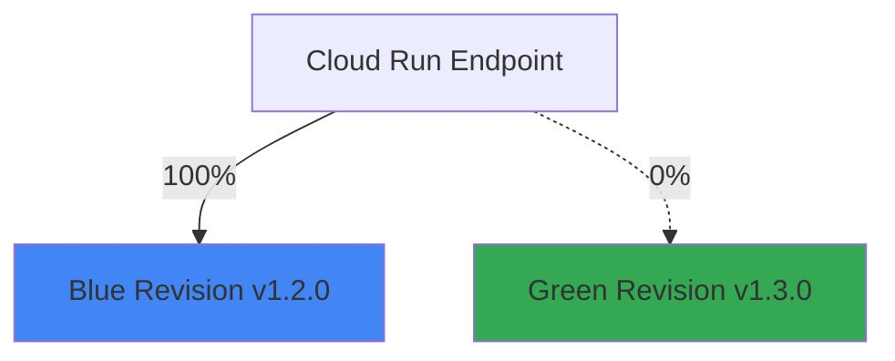
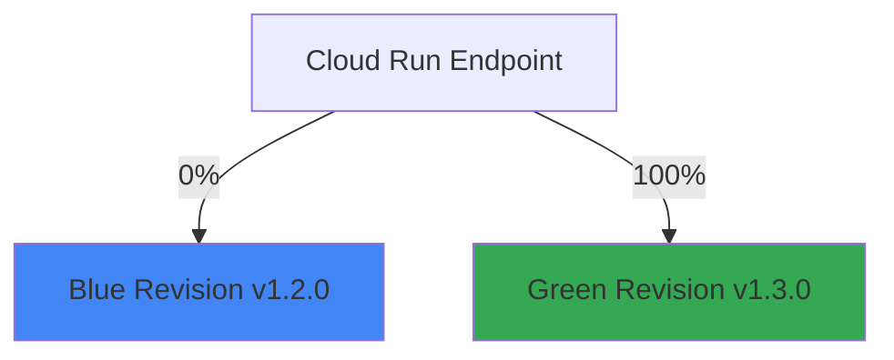

# How to Implement Blue-Green Deployments for Cloud Run Services Using Traffic Splitting and Revisions

Author: [nawazdhandala](https://www.github.com/nawazdhandala)

Tags: GCP, Cloud Run, Blue-Green Deployment, Traffic Splitting, DevOps

Description: Learn how to implement blue-green deployments for Cloud Run services using revision management and traffic splitting for zero-downtime releases on GCP.

---

Blue-green deployments let you release new versions of your application with zero downtime and instant rollback. The idea is simple: you run two identical environments (blue and green), deploy the new version to the inactive one, test it, then switch traffic over. If anything goes wrong, you switch back.

Cloud Run makes blue-green deployments particularly easy because of its built-in revision management and traffic splitting. Every deployment creates a new revision, and you control exactly how much traffic each revision gets. In this post, I will walk through implementing this pattern step by step.

## How Cloud Run Revisions Work

Every time you deploy to Cloud Run, it creates a new immutable revision. Revisions are like snapshots of your service - the container image, environment variables, resource limits, and other settings are all locked in. You can have multiple revisions running simultaneously and split traffic between them.



After verification:



## Step 1: Deploy the Initial Version (Blue)

Start with your current production version:

```bash
# Deploy the initial version
gcloud run deploy my-service \
  --image=gcr.io/my-project/my-app:v1.2.0 \
  --region=us-central1 \
  --platform=managed \
  --allow-unauthenticated \
  --min-instances=2 \
  --max-instances=100 \
  --memory=512Mi \
  --cpu=1

# Verify it is running and receiving all traffic
gcloud run services describe my-service \
  --region=us-central1 \
  --format="yaml(status.traffic)"
```

## Step 2: Deploy the New Version (Green) Without Traffic

Deploy the new version but do not send any traffic to it yet. Use the `--no-traffic` flag:

```bash
# Deploy the new version without routing traffic to it
gcloud run deploy my-service \
  --image=gcr.io/my-project/my-app:v1.3.0 \
  --region=us-central1 \
  --platform=managed \
  --no-traffic \
  --tag=green \
  --min-instances=2

# The --tag=green creates a dedicated URL for testing
# It will be something like: https://green---my-service-xxxxx.a.run.app
```

The `--tag=green` flag creates a tagged URL that you can use to test the new revision directly, without affecting production traffic.

## Step 3: Test the Green Revision

Use the tagged URL to run your verification suite against the new revision:

```bash
# Get the tagged URL
GREEN_URL=$(gcloud run services describe my-service \
  --region=us-central1 \
  --format='value(status.traffic[1].url)')

echo "Green revision URL: $GREEN_URL"

# Run health check
curl -sf "$GREEN_URL/health" | jq .

# Run your automated test suite against the green revision
npm run test:e2e -- --base-url="$GREEN_URL"
```

You can also write a more thorough verification script:

```bash
#!/bin/bash
# verify-green.sh - Verify the green revision before switching traffic

GREEN_URL=$1
FAILURES=0

echo "Verifying green revision at $GREEN_URL"

# Check health endpoint
echo "Checking health..."
HTTP_CODE=$(curl -s -o /dev/null -w "%{http_code}" "$GREEN_URL/health")
if [ "$HTTP_CODE" != "200" ]; then
    echo "FAIL: Health check returned $HTTP_CODE"
    FAILURES=$((FAILURES + 1))
else
    echo "PASS: Health check OK"
fi

# Check API response format
echo "Checking API response..."
RESPONSE=$(curl -s "$GREEN_URL/api/v1/status")
if echo "$RESPONSE" | jq -e '.version' > /dev/null 2>&1; then
    VERSION=$(echo "$RESPONSE" | jq -r '.version')
    echo "PASS: API responding with version $VERSION"
else
    echo "FAIL: Invalid API response"
    FAILURES=$((FAILURES + 1))
fi

# Check response time
echo "Checking response time..."
TOTAL_TIME=$(curl -s -o /dev/null -w "%{time_total}" "$GREEN_URL/api/v1/status")
if (( $(echo "$TOTAL_TIME < 2.0" | bc -l) )); then
    echo "PASS: Response time ${TOTAL_TIME}s"
else
    echo "FAIL: Response time ${TOTAL_TIME}s exceeds 2s threshold"
    FAILURES=$((FAILURES + 1))
fi

if [ $FAILURES -gt 0 ]; then
    echo "Verification FAILED with $FAILURES failures"
    exit 1
else
    echo "All verifications PASSED"
    exit 0
fi
```

## Step 4: Switch Traffic to Green

Once verification passes, route all traffic to the green revision:

```bash
# Get the latest revision name (the green one)
GREEN_REVISION=$(gcloud run revisions list \
  --service=my-service \
  --region=us-central1 \
  --format='value(name)' \
  --limit=1)

# Switch 100% of traffic to the green revision
gcloud run services update-traffic my-service \
  --region=us-central1 \
  --to-revisions=$GREEN_REVISION=100

echo "Traffic switched to $GREEN_REVISION"
```

## Step 5: Set Up Instant Rollback

If something goes wrong after the switch, roll back instantly:

```bash
# Get the previous (blue) revision name
BLUE_REVISION=$(gcloud run revisions list \
  --service=my-service \
  --region=us-central1 \
  --format='value(name)' \
  --limit=2 | tail -1)

# Roll back to the blue revision instantly
gcloud run services update-traffic my-service \
  --region=us-central1 \
  --to-revisions=$BLUE_REVISION=100

echo "Rolled back to $BLUE_REVISION"
```

This is instant because the blue revision is still running - Cloud Run just changes the traffic routing.

## Automating the Full Process with Cloud Build

Here is a complete Cloud Build pipeline that implements blue-green deployments:

```yaml
# cloudbuild-blue-green.yaml
steps:
  # Build and push the new image
  - name: 'gcr.io/cloud-builders/docker'
    args: ['build', '-t', 'gcr.io/$PROJECT_ID/my-app:$SHORT_SHA', '.']
    id: 'build'

  - name: 'gcr.io/cloud-builders/docker'
    args: ['push', 'gcr.io/$PROJECT_ID/my-app:$SHORT_SHA']
    id: 'push'
    waitFor: ['build']

  # Deploy green revision with no traffic
  - name: 'gcr.io/cloud-builders/gcloud'
    args:
      - 'run'
      - 'deploy'
      - 'my-service'
      - '--image=gcr.io/$PROJECT_ID/my-app:$SHORT_SHA'
      - '--region=$_REGION'
      - '--platform=managed'
      - '--no-traffic'
      - '--tag=green'
    id: 'deploy-green'
    waitFor: ['push']

  # Get the green revision URL and run tests
  - name: 'gcr.io/cloud-builders/gcloud'
    entrypoint: 'bash'
    args:
      - '-c'
      - |
        GREEN_URL=$(gcloud run services describe my-service \
          --region=$_REGION \
          --format='value(status.traffic[].url)' | grep green)

        echo "Testing green revision at: $GREEN_URL"

        # Run health check
        HTTP_CODE=$(curl -s -o /dev/null -w "%{http_code}" "$GREEN_URL/health")
        if [ "$HTTP_CODE" != "200" ]; then
          echo "Green revision health check failed with $HTTP_CODE"
          exit 1
        fi

        echo "Green revision health check passed"
    id: 'verify-green'
    waitFor: ['deploy-green']

  # Switch traffic to green
  - name: 'gcr.io/cloud-builders/gcloud'
    entrypoint: 'bash'
    args:
      - '-c'
      - |
        LATEST=$(gcloud run revisions list \
          --service=my-service \
          --region=$_REGION \
          --format='value(name)' --limit=1)

        gcloud run services update-traffic my-service \
          --region=$_REGION \
          --to-revisions=$LATEST=100

        echo "Traffic switched to $LATEST"
    id: 'switch-traffic'
    waitFor: ['verify-green']

  # Clean up old revisions (keep the last 3)
  - name: 'gcr.io/cloud-builders/gcloud'
    entrypoint: 'bash'
    args:
      - '-c'
      - |
        OLD_REVISIONS=$(gcloud run revisions list \
          --service=my-service \
          --region=$_REGION \
          --format='value(name)' \
          --sort-by=~creationTimestamp | tail -n +4)

        for rev in $OLD_REVISIONS; do
          echo "Deleting old revision: $rev"
          gcloud run revisions delete $rev --region=$_REGION --quiet || true
        done
    id: 'cleanup'
    waitFor: ['switch-traffic']

substitutions:
  _REGION: us-central1
```

## Monitoring the Deployment

After switching traffic, monitor the new revision closely:

```bash
# Watch error rates in real time
gcloud logging read \
  'resource.type="cloud_run_revision" AND severity>=ERROR' \
  --limit=20 \
  --format="table(timestamp, textPayload)"

# Compare latency between revisions
gcloud monitoring time-series list \
  --filter='resource.type="cloud_run_revision" AND metric.type="run.googleapis.com/request_latencies"' \
  --interval-start-time=$(date -u -v-30M +%Y-%m-%dT%H:%M:%SZ) \
  --format="table(resource.labels.revision_name, points[0].value.distributionValue.mean)"
```

## Handling Database Migrations

Blue-green deployments get tricky when your new version requires database schema changes. The rule is: **make schema changes backward compatible**.

1. Deploy a migration that adds new columns or tables (compatible with both versions)
2. Deploy the green version that uses the new schema
3. Switch traffic to green
4. After confirming stability, clean up old columns in a future release

Never drop columns or rename tables in the same release as the code change. That guarantees a broken rollback path.

## Wrapping Up

Blue-green deployments on Cloud Run are straightforward thanks to the built-in revision and traffic management. Deploy with `--no-traffic`, test using tagged URLs, switch traffic when verified, and roll back instantly if needed. The whole process can be automated in a Cloud Build pipeline that runs on every push to main.

The most important thing is testing the green revision thoroughly before switching traffic. Automate as many checks as possible - health checks, API contract tests, performance baselines - so you catch issues before your users do.
