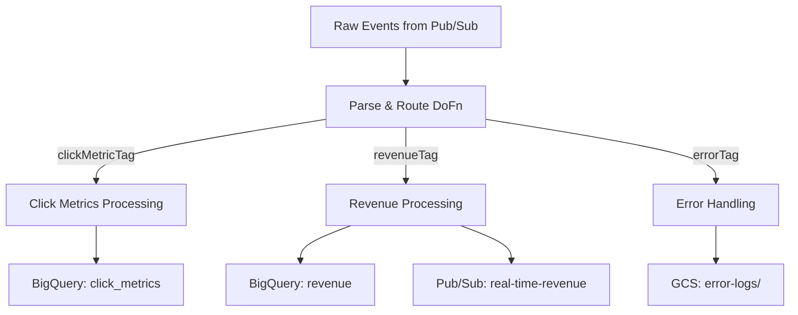

# How to Implement Branching Outputs with Tagged PCollections in Dataflow

Author: [nawazdhandala](https://www.github.com/nawazdhandala)

Tags: GCP, Google Cloud Dataflow, Apache Beam, Pipeline Design, Data Routing

Description: Learn how to use TupleTag and multiple outputs in Apache Beam to create branching pipelines that route data to different destinations based on content or logic.

---

Not all data in a pipeline should follow the same path. You might need to route events to different BigQuery tables based on their type, split records into valid and invalid streams, or send high-priority items down a fast path while low-priority items go through batch processing. Apache Beam handles this with tagged outputs, also known as multiple outputs or branching outputs.

This is a pattern I use in almost every production pipeline. Once you understand it, you will find uses for it everywhere.

## The Basic Pattern

A DoFn can produce output to multiple tagged PCollections. You define `TupleTag` objects for each output, then use `c.output(tag, element)` to route elements.

```java
// Define tags for each output branch
final TupleTag<Event> clicksTag = new TupleTag<Event>() {};
final TupleTag<Event> purchasesTag = new TupleTag<Event>() {};
final TupleTag<Event> pageViewsTag = new TupleTag<Event>() {};
final TupleTag<String> unrecognizedTag = new TupleTag<String>() {};

// Route events to different outputs based on type
PCollectionTuple results = rawEvents
    .apply("RouteByType", ParDo.of(
        new DoFn<String, Event>() {
            @ProcessElement
            public void processElement(ProcessContext c) {
                String raw = c.element();
                try {
                    Event event = Event.fromJson(raw);

                    // Route to the appropriate output based on event type
                    switch (event.getType()) {
                        case "click":
                            c.output(clicksTag, event);
                            break;
                        case "purchase":
                            c.output(purchasesTag, event);
                            break;
                        case "page_view":
                            c.output(pageViewsTag, event);
                            break;
                        default:
                            // Unknown event types go to a separate output
                            c.output(unrecognizedTag, raw);
                    }
                } catch (Exception e) {
                    // Unparseable events go to unrecognized
                    c.output(unrecognizedTag, raw);
                }
            }
        })
        // First tag is the "main" output, rest are side outputs
        .withOutputTags(clicksTag,
            TupleTagList.of(purchasesTag)
                .and(pageViewsTag)
                .and(unrecognizedTag)));

// Access each branch independently
PCollection<Event> clicks = results.get(clicksTag);
PCollection<Event> purchases = results.get(purchasesTag);
PCollection<Event> pageViews = results.get(pageViewsTag);
PCollection<String> unrecognized = results.get(unrecognizedTag);
```

Each branch is now a separate PCollection that you can process independently.

## Routing to Different Sinks

The most common use of branching is sending different data to different destinations.

```java
// Write each event type to its own BigQuery table
clicks
    .apply("ClicksToRows", ParDo.of(new EventToTableRowFn()))
    .apply("WriteClicks", BigQueryIO.writeTableRows()
        .to("project:analytics.click_events")
        .withSchema(clickSchema)
        .withWriteDisposition(WriteDisposition.WRITE_APPEND));

purchases
    .apply("PurchasesToRows", ParDo.of(new EventToTableRowFn()))
    .apply("WritePurchases", BigQueryIO.writeTableRows()
        .to("project:analytics.purchase_events")
        .withSchema(purchaseSchema)
        .withWriteDisposition(WriteDisposition.WRITE_APPEND));

pageViews
    .apply("PageViewsToRows", ParDo.of(new EventToTableRowFn()))
    .apply("WritePageViews", BigQueryIO.writeTableRows()
        .to("project:analytics.pageview_events")
        .withSchema(pageViewSchema)
        .withWriteDisposition(WriteDisposition.WRITE_APPEND));

// Send unrecognized events to a dead letter topic for investigation
unrecognized
    .apply("WriteDLQ", PubsubIO.writeStrings()
        .to("projects/my-project/topics/unrecognized-events"));
```

## One Element to Multiple Outputs

A single element can be sent to multiple output tags. This is useful when the same data needs to go to different processing paths simultaneously.

```java
// Send purchase events to both the purchases table and a real-time alerts stream
PCollectionTuple results = rawEvents
    .apply("ProcessAndRoute", ParDo.of(
        new DoFn<Event, Event>() {
            @ProcessElement
            public void processElement(ProcessContext c) {
                Event event = c.element();

                // Every event goes to the main analytics output
                c.output(analyticsTag, event);

                // High-value purchases also go to the alerts stream
                if (event.getType().equals("purchase")
                        && event.getAmount() > 1000.0) {
                    c.output(highValueAlertTag, event);
                }

                // Events from new users also go to the onboarding stream
                if (event.isNewUser()) {
                    c.output(newUserTag, event);
                }
            }
        }).withOutputTags(analyticsTag,
            TupleTagList.of(highValueAlertTag).and(newUserTag)));
```

This fan-out pattern lets you process the same data multiple ways without reading it from the source multiple times.

## Using Different Types for Different Outputs

Each output tag can have a different type. This is powerful when your routing logic also transforms the data.

```java
// Tags with different output types
final TupleTag<ClickMetric> clickMetricTag = new TupleTag<ClickMetric>() {};
final TupleTag<RevenueRecord> revenueTag = new TupleTag<RevenueRecord>() {};
final TupleTag<ErrorRecord> errorTag = new TupleTag<ErrorRecord>() {};

PCollectionTuple results = rawEvents
    .apply("TransformAndRoute", ParDo.of(
        new DoFn<String, ClickMetric>() {
            @ProcessElement
            public void processElement(ProcessContext c) {
                try {
                    JsonObject json = JsonParser.parseString(c.element())
                        .getAsJsonObject();
                    String type = json.get("type").getAsString();

                    if ("click".equals(type)) {
                        // Transform to ClickMetric and output
                        ClickMetric metric = new ClickMetric(
                            json.get("element_id").getAsString(),
                            json.get("page").getAsString(),
                            json.get("timestamp").getAsLong()
                        );
                        c.output(metric);  // Goes to main (clickMetricTag)

                    } else if ("purchase".equals(type)) {
                        // Transform to RevenueRecord and output to side tag
                        RevenueRecord revenue = new RevenueRecord(
                            json.get("user_id").getAsString(),
                            json.get("amount").getAsDouble(),
                            json.get("currency").getAsString()
                        );
                        c.output(revenueTag, revenue);
                    }

                } catch (Exception e) {
                    // Create an error record with context
                    ErrorRecord error = new ErrorRecord(
                        c.element(), e.getMessage(), "TransformAndRoute");
                    c.output(errorTag, error);
                }
            }
        }).withOutputTags(clickMetricTag,
            TupleTagList.of(revenueTag).and(errorTag)));

// Each output has a different type
PCollection<ClickMetric> clickMetrics = results.get(clickMetricTag);
PCollection<RevenueRecord> revenues = results.get(revenueTag);
PCollection<ErrorRecord> errors = results.get(errorTag);
```

## The Pipeline Graph

Here is how branching outputs affect the pipeline structure.



## Conditional Processing with Branching

You can also use branching to apply different processing logic to different subsets of data.

```java
// Branch, apply different transformations, then merge back
PCollectionTuple branched = events
    .apply("Branch", ParDo.of(new BranchFn())
        .withOutputTags(domesticTag, TupleTagList.of(internationalTag)));

// Apply domestic-specific processing
PCollection<ProcessedOrder> domesticOrders = branched.get(domesticTag)
    .apply("DomesticTax", ParDo.of(new DomesticTaxFn()))
    .apply("DomesticShipping", ParDo.of(new DomesticShippingFn()));

// Apply international-specific processing
PCollection<ProcessedOrder> internationalOrders = branched.get(internationalTag)
    .apply("InternationalTax", ParDo.of(new InternationalTaxFn()))
    .apply("CustomsDeclaration", ParDo.of(new CustomsFn()))
    .apply("InternationalShipping", ParDo.of(new InternationalShippingFn()));

// Merge the branches back together
PCollection<ProcessedOrder> allOrders = PCollectionList
    .of(domesticOrders)
    .and(internationalOrders)
    .apply("MergeOrders", Flatten.pCollections());
```

This branch-process-merge pattern is clean and lets each path have exactly the transforms it needs without unnecessary work.

## Performance Considerations

Tagged outputs have minimal overhead compared to running multiple passes over the same data. Dataflow processes each element once and routes it to the appropriate output in a single pass. This is much more efficient than reading from the source multiple times with different filters.

However, be aware that each output branch creates a separate PCollection that Dataflow must track and manage. If you create hundreds of output tags, the pipeline graph becomes complex and can impact planning time.

For most use cases, 2-10 output tags work well. If you need more dynamic routing (like routing to different tables based on a field value with many possible values), use BigQuery's dynamic table routing instead of output tags.

```java
// For highly dynamic routing, use BigQuery's DynamicDestinations
.apply("DynamicWrite", BigQueryIO.writeTableRows()
    .to(new DynamicDestinations<TableRow, String>() {
        @Override
        public String getDestination(ValueInSingleWindow<TableRow> element) {
            return (String) element.getValue().get("event_type");
        }

        @Override
        public TableDestination getTable(String destination) {
            return new TableDestination(
                "project:dataset." + destination + "_events", "");
        }

        @Override
        public TableSchema getSchema(String destination) {
            return getSchemaForType(destination);
        }
    }));
```

Tagged outputs are a fundamental building block for non-trivial Dataflow pipelines. They let you split, route, and rejoin data flows cleanly. Master this pattern and you can build pipelines that handle complex data routing without sacrificing readability or performance.
