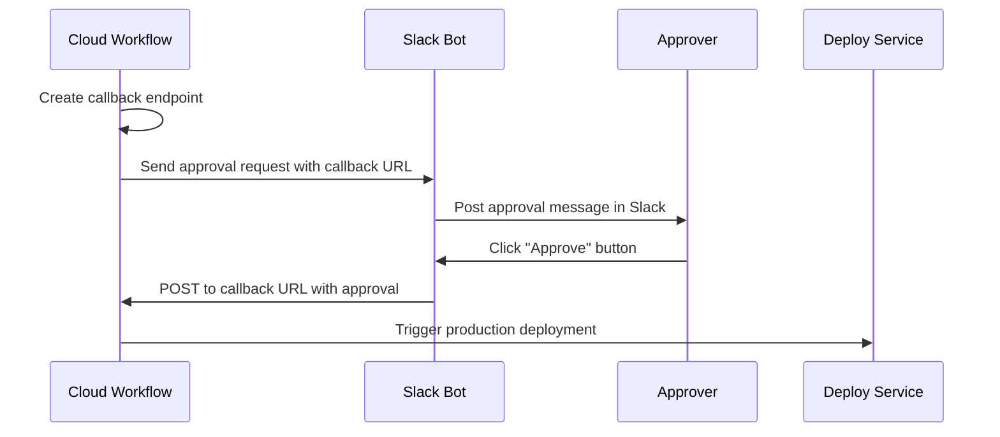

# How to Implement Callbacks in Cloud Workflows to Wait for External Events

Author: [nawazdhandala](https://www.github.com/nawazdhandala)

Tags: GCP, Cloud Workflows, Callbacks, Serverless, Event-Driven

Description: Learn how to implement callback endpoints in Google Cloud Workflows so your workflow can pause and wait for external events before continuing execution.

---

Google Cloud Workflows is a powerful orchestration service, but sometimes your workflow needs to stop and wait. Maybe you are waiting for a human approval, an external system to finish processing, or a webhook from a third-party service. This is where callbacks come in.

Callbacks let a workflow pause execution, expose an endpoint, and resume only when that endpoint receives an HTTP request. In this post, I will walk you through how to set up callbacks in Cloud Workflows step by step.

## What Are Callbacks in Cloud Workflows?

A callback is a mechanism that lets your workflow create a temporary HTTP endpoint. The workflow pauses at that point and waits. When an external system sends an HTTP POST request to that endpoint with the required data, the workflow picks back up and continues with the next step.

This pattern is incredibly useful for scenarios like:

- Waiting for manual approval in a deployment pipeline
- Pausing until a third-party webhook fires
- Holding execution until an asynchronous job completes in another system

## Prerequisites

Before diving in, make sure you have:

- A Google Cloud project with billing enabled
- The Workflows API enabled
- The `gcloud` CLI installed and configured
- A service account with the `workflows.invoker` role

You can enable the Workflows API with this command.

```bash
# Enable the Workflows API in your project
gcloud services enable workflows.googleapis.com
```

## Creating a Workflow with a Callback

The core of the callback mechanism involves two built-in functions: `events.create_callback_endpoint` and `events.await_callback`. Let me show you a complete workflow definition.

```yaml
# workflow-with-callback.yaml
# This workflow creates a callback, sends the URL somewhere,
# then waits for the callback to be invoked before proceeding.
main:
  steps:
    - init:
        assign:
          - project_id: ${sys.get_env("GOOGLE_CLOUD_PROJECT_ID")}

    - create_callback:
        # Create a callback endpoint that the workflow will wait on
        call: events.create_callback_endpoint
        args:
          http_callback_method: "POST"
        result: callback_details

    - log_callback_url:
        call: sys.log
        args:
          text: ${"Callback URL - " + callback_details.url}
          severity: "INFO"

    - notify_external_system:
        # Send the callback URL to an external system
        # Replace this with your actual notification mechanism
        call: http.post
        args:
          url: https://your-api.example.com/notify
          headers:
            Content-Type: "application/json"
          body:
            callback_url: ${callback_details.url}
            workflow_message: "Waiting for your approval"
        result: notify_result

    - wait_for_callback:
        # The workflow pauses here until the callback endpoint receives a POST
        call: events.await_callback
        args:
          callback: ${callback_details}
          timeout: 3600
        result: callback_response

    - process_response:
        # Use the data that was sent to the callback endpoint
        assign:
          - approved: ${callback_response.http_request.body.approved}
          - approver: ${callback_response.http_request.body.approver}

    - final_step:
        switch:
          - condition: ${approved == true}
            steps:
              - approve_action:
                  call: sys.log
                  args:
                    text: ${"Approved by " + approver}
                    severity: "INFO"
          - condition: ${approved == false}
            steps:
              - reject_action:
                  call: sys.log
                  args:
                    text: ${"Rejected by " + approver}
                    severity: "WARNING"
```

## Deploying the Workflow

Deploy the workflow using the gcloud CLI.

```bash
# Deploy the workflow to your GCP project
gcloud workflows deploy approval-workflow \
  --source=workflow-with-callback.yaml \
  --service-account=your-sa@your-project.iam.gserviceaccount.com \
  --location=us-central1
```

## Executing the Workflow and Triggering the Callback

Start a workflow execution.

```bash
# Execute the workflow
gcloud workflows execute approval-workflow \
  --location=us-central1
```

The workflow will pause at the `wait_for_callback` step. You can check the execution status to see that it is in a `ACTIVE` state, meaning it is waiting.

```bash
# Check the execution status - it should show ACTIVE while waiting
gcloud workflows executions list approval-workflow \
  --location=us-central1
```

To trigger the callback and resume the workflow, send a POST request to the callback URL.

```bash
# Trigger the callback with approval data
# Replace CALLBACK_URL with the actual URL from the workflow logs
curl -X POST "CALLBACK_URL" \
  -H "Authorization: Bearer $(gcloud auth print-access-token)" \
  -H "Content-Type: application/json" \
  -d '{
    "approved": true,
    "approver": "jane@example.com"
  }'
```

## Handling Timeouts

The `timeout` parameter in `events.await_callback` is specified in seconds. If the callback is not received within that window, the workflow will fail with a timeout error. You should handle this gracefully.

```yaml
# Adding error handling around the callback wait
- wait_for_callback:
    try:
      call: events.await_callback
      args:
        callback: ${callback_details}
        timeout: 3600
      result: callback_response
    except:
      as: e
      steps:
        - handle_timeout:
            switch:
              - condition: ${e.code == 408}
                steps:
                  - timeout_log:
                      call: sys.log
                      args:
                        text: "Callback timed out after 1 hour"
                        severity: "ERROR"
                  - timeout_return:
                      return:
                        status: "timed_out"
              - condition: true
                steps:
                  - other_error:
                      raise: ${e}
```

## Authentication for Callback Endpoints

By default, callback endpoints require authentication. The caller must include a valid OAuth 2.0 access token or an identity token with the appropriate permissions. The service account that the workflow runs as must have the `workflows.invoker` role.

If you need an external system without Google credentials to trigger the callback, you can place an intermediary service (like a Cloud Function or Cloud Run service) in front of it that handles authentication translation.

## Real-World Use Case: Deployment Approval Pipeline

Here is a practical example. Imagine you have a CI/CD pipeline where deployments to production require manual approval. The flow looks like this:



The workflow creates the callback, sends the URL to a Slack bot, and waits. When someone clicks "Approve" in Slack, the bot sends the POST request to the callback URL, and the workflow resumes to kick off the deployment.

## Tips for Working with Callbacks

First, always set a reasonable timeout. Do not set it to an extremely large value - think about what makes sense for your use case. An approval that has been pending for a week is probably stale.

Second, log the callback URL. You will need it for debugging, and it is helpful to have it in Cloud Logging so you can trace what happened.

Third, validate the callback payload. Just because the callback was triggered does not mean the data is valid. Add validation steps after receiving the callback response.

Fourth, consider idempotency. If there is any chance the callback could be triggered multiple times, make sure your downstream steps can handle that gracefully.

## Monitoring Callback-Based Workflows

You can monitor your workflow executions in the Google Cloud Console under the Workflows section. Each execution shows its current state, and you can see which step it is paused on. Cloud Logging will also capture the logs from your `sys.log` calls, which is invaluable for debugging.

```bash
# View logs for your workflow executions
gcloud logging read 'resource.type="workflows.googleapis.com/Workflow"' \
  --limit=20 \
  --format="table(timestamp, textPayload)"
```

## Wrapping Up

Callbacks in Cloud Workflows are a clean way to handle asynchronous coordination between your workflow and external systems. Whether you are building approval pipelines, waiting for webhooks, or integrating with systems that process work asynchronously, callbacks give you a built-in mechanism to pause and resume without polling or maintaining state yourself.

The key things to remember are: create the callback endpoint, send the URL to whatever system needs to trigger it, wait with a timeout, and handle both the success and timeout cases. With these building blocks, you can build some surprisingly sophisticated orchestration flows.
