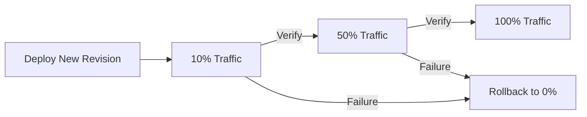

# How to Implement Canary Deployments for Cloud Run Services Using Cloud Deploy Delivery Pipelines

Author: [nawazdhandala](https://www.github.com/nawazdhandala)

Tags: GCP, Cloud Run, Cloud Deploy, Canary Deployments, CI/CD, Traffic Splitting

Description: Learn how to set up canary deployments for Cloud Run services using Cloud Deploy delivery pipelines with gradual traffic shifting and automated rollback capabilities.

---

Canary deployments let you test new code with a small percentage of real traffic before committing to a full rollout. Cloud Run has built-in traffic splitting that makes this straightforward, and Cloud Deploy can orchestrate the entire canary process through a delivery pipeline. This guide shows you how to wire everything together.

## Why Canary for Cloud Run?

Cloud Run already supports revisions and traffic splitting, so you might wonder why you need Cloud Deploy at all. The answer is structure and repeatability. Manually adjusting traffic percentages through the console or CLI works for small teams, but it does not scale. Cloud Deploy gives you a defined pipeline with stages, automated verification between traffic shifts, and a clear audit trail of every deployment.

## The Canary Strategy

Instead of sending 100% of traffic to the new version immediately, a canary deployment follows a progression:



## Step 1: Define Cloud Run Targets

Create target definitions for each environment:

```yaml
# targets/dev-run.yaml - Development Cloud Run target
apiVersion: deploy.cloud.google.com/v1
kind: Target
metadata:
  name: dev-cloudrun
description: Development Cloud Run environment
run:
  location: projects/my-project/locations/us-central1
```

```yaml
# targets/prod-run.yaml - Production Cloud Run target
apiVersion: deploy.cloud.google.com/v1
kind: Target
metadata:
  name: prod-cloudrun
description: Production Cloud Run environment
run:
  location: projects/my-project/locations/us-central1
```

Register the targets:

```bash
# Register both targets with Cloud Deploy
gcloud deploy apply --file=targets/dev-run.yaml --region=us-central1
gcloud deploy apply --file=targets/prod-run.yaml --region=us-central1
```

## Step 2: Create the Canary Pipeline

This is where the canary strategy is defined. The pipeline specifies traffic percentages and verification steps at each phase:

```yaml
# pipeline.yaml - Delivery pipeline with canary strategy for production
apiVersion: deploy.cloud.google.com/v1
kind: DeliveryPipeline
metadata:
  name: cloudrun-canary-pipeline
description: Cloud Run deployment with canary rollout
serialPipeline:
  stages:
    # Dev gets a standard deployment - no canary needed
    - targetId: dev-cloudrun
      profiles:
        - dev
      strategy:
        standard:
          verify: true

    # Production uses a canary strategy
    - targetId: prod-cloudrun
      profiles:
        - prod
      strategy:
        canary:
          runtimeConfig:
            cloudRun:
              automaticTrafficControl: true
          canaryDeployment:
            percentages:
              - 10   # First phase: 10% of traffic
              - 50   # Second phase: 50% of traffic
            verify: true  # Run verification at each phase
```

Apply the pipeline:

```bash
gcloud deploy apply --file=pipeline.yaml --region=us-central1
```

## Step 3: Configure Skaffold for Cloud Run

Skaffold needs to know how to deploy to Cloud Run. Here is the configuration:

```yaml
# skaffold.yaml - Configuration for Cloud Run canary deployments
apiVersion: skaffold/v4beta7
kind: Config
metadata:
  name: myapp-cloudrun
profiles:
  - name: dev
    manifests:
      rawYaml:
        - cloudrun/dev.yaml
    deploy:
      cloudrun: {}
    verify:
      - name: health-check
        container:
          name: curl
          image: curlimages/curl
          command: ["/bin/sh"]
          args:
            - "-c"
            - |
              # Verify the dev service responds correctly
              SERVICE_URL=$(gcloud run services describe myapp \
                --region=us-central1 --format='value(status.url)')
              curl -sf "$SERVICE_URL/healthz" || exit 1
              echo "Dev health check passed"

  - name: prod
    manifests:
      rawYaml:
        - cloudrun/prod.yaml
    deploy:
      cloudrun: {}
    verify:
      - name: canary-verification
        container:
          name: verify
          image: curlimages/curl
          command: ["/bin/sh"]
          args:
            - "-c"
            - |
              # Run multiple requests to catch intermittent errors
              SERVICE_URL=$(gcloud run services describe myapp \
                --region=us-central1 --format='value(status.url)')
              FAILURES=0
              for i in $(seq 1 100); do
                STATUS=$(curl -s -o /dev/null -w "%{http_code}" "$SERVICE_URL/healthz")
                if [ "$STATUS" != "200" ]; then
                  FAILURES=$((FAILURES + 1))
                fi
              done
              echo "Failures: $FAILURES out of 100 requests"
              # Fail if more than 5% of requests failed
              if [ "$FAILURES" -gt 5 ]; then
                echo "Error rate too high, canary verification failed"
                exit 1
              fi
              echo "Canary verification passed"
```

## Step 4: Define Cloud Run Service Manifests

Create the Cloud Run service definitions for each environment:

```yaml
# cloudrun/dev.yaml - Dev environment Cloud Run service
apiVersion: serving.knative.dev/v1
kind: Service
metadata:
  name: myapp
  annotations:
    run.googleapis.com/launch-stage: GA
spec:
  template:
    metadata:
      annotations:
        autoscaling.knative.dev/minScale: "0"
        autoscaling.knative.dev/maxScale: "5"
    spec:
      containerConcurrency: 80
      containers:
        - image: myapp  # Replaced by Cloud Deploy with actual image
          ports:
            - containerPort: 8080
          resources:
            limits:
              cpu: "1"
              memory: "512Mi"
          env:
            - name: ENVIRONMENT
              value: "development"
```

```yaml
# cloudrun/prod.yaml - Production Cloud Run service with higher limits
apiVersion: serving.knative.dev/v1
kind: Service
metadata:
  name: myapp
  annotations:
    run.googleapis.com/launch-stage: GA
spec:
  template:
    metadata:
      annotations:
        autoscaling.knative.dev/minScale: "2"    # Always keep 2 instances warm
        autoscaling.knative.dev/maxScale: "100"
    spec:
      containerConcurrency: 80
      containers:
        - image: myapp
          ports:
            - containerPort: 8080
          resources:
            limits:
              cpu: "2"
              memory: "1Gi"
          env:
            - name: ENVIRONMENT
              value: "production"
          startupProbe:
            httpGet:
              path: /healthz
              port: 8080
            initialDelaySeconds: 0
            periodSeconds: 2
            failureThreshold: 10
          livenessProbe:
            httpGet:
              path: /healthz
              port: 8080
            periodSeconds: 10
```

## Step 5: Create Releases and Watch the Canary

Build and create a release through Cloud Build:

```yaml
# cloudbuild.yaml - Build and release for Cloud Run canary
steps:
  # Build the container
  - name: 'gcr.io/cloud-builders/docker'
    args:
      - 'build'
      - '-t'
      - 'us-docker.pkg.dev/my-project/repo/myapp:${SHORT_SHA}'
      - '.'
    id: 'build'

  # Push to Artifact Registry
  - name: 'gcr.io/cloud-builders/docker'
    args: ['push', 'us-docker.pkg.dev/my-project/repo/myapp:${SHORT_SHA}']
    waitFor: ['build']
    id: 'push'

  # Create Cloud Deploy release
  - name: 'gcr.io/google.com/cloudsdktool/cloud-sdk'
    entrypoint: 'gcloud'
    args:
      - 'deploy'
      - 'releases'
      - 'create'
      - 'release-${SHORT_SHA}'
      - '--delivery-pipeline=cloudrun-canary-pipeline'
      - '--region=us-central1'
      - '--images=myapp=us-docker.pkg.dev/my-project/repo/myapp:${SHORT_SHA}'
    waitFor: ['push']
```

## Step 6: Monitor the Canary Phases

Once the release reaches the production stage, Cloud Deploy will execute the canary phases. You can monitor progress:

```bash
# Check the current rollout status
gcloud deploy rollouts describe prod-cloudrun-rollout-001 \
  --delivery-pipeline=cloudrun-canary-pipeline \
  --release=release-abc123 \
  --region=us-central1

# List all phases and their status
gcloud deploy rollouts list \
  --delivery-pipeline=cloudrun-canary-pipeline \
  --release=release-abc123 \
  --region=us-central1
```

During the canary, you can verify traffic splitting in Cloud Run:

```bash
# Check current traffic distribution
gcloud run services describe myapp \
  --region=us-central1 \
  --format='yaml(status.traffic)'
```

## Step 7: Advance or Rollback

If verification passes at each phase, Cloud Deploy automatically advances to the next percentage. But you can also control it manually:

```bash
# Manually advance to the next canary phase
gcloud deploy rollouts advance prod-cloudrun-rollout-001 \
  --delivery-pipeline=cloudrun-canary-pipeline \
  --release=release-abc123 \
  --region=us-central1

# Or roll back if something looks wrong
gcloud deploy targets rollback prod-cloudrun \
  --delivery-pipeline=cloudrun-canary-pipeline \
  --region=us-central1
```

## Adding Custom Metrics for Canary Decisions

For more sophisticated canary analysis, you can use Cloud Monitoring metrics in your verification steps:

```python
# verify_canary.py - Custom canary verification using Cloud Monitoring
from google.cloud import monitoring_v3
import time

def check_error_rate(project_id, service_name, threshold=0.05):
    """Check the error rate for the canary revision."""
    client = monitoring_v3.MetricServiceClient()
    project_name = f"projects/{project_id}"

    # Query the error rate over the last 5 minutes
    now = time.time()
    interval = monitoring_v3.TimeInterval({
        "end_time": {"seconds": int(now)},
        "start_time": {"seconds": int(now - 300)},
    })

    # Filter for Cloud Run request metrics
    filter_str = (
        f'resource.type="cloud_run_revision" '
        f'AND resource.labels.service_name="{service_name}" '
        f'AND metric.type="run.googleapis.com/request_count"'
    )

    results = client.list_time_series(
        request={
            "name": project_name,
            "filter": filter_str,
            "interval": interval,
            "view": monitoring_v3.ListTimeSeriesRequest.TimeSeriesView.FULL,
        }
    )

    total_requests = 0
    error_requests = 0
    for ts in results:
        for point in ts.points:
            count = point.value.int64_value
            # Check if this is an error response code
            if ts.metric.labels.get("response_code_class", "") == "5xx":
                error_requests += count
            total_requests += count

    if total_requests == 0:
        print("No traffic observed yet")
        return True

    error_rate = error_requests / total_requests
    print(f"Error rate: {error_rate:.2%} ({error_requests}/{total_requests})")
    return error_rate <= threshold

if __name__ == "__main__":
    import sys
    success = check_error_rate("my-project", "myapp")
    sys.exit(0 if success else 1)
```

## Best Practices for Cloud Run Canary Deployments

1. Set `minScale` to at least 1 in production to avoid cold start latency skewing your canary metrics. If the canary revision starts from zero instances, the first requests will be slow and might trigger false alarms.

2. Make your verification step duration long enough to collect meaningful data. Checking error rates after 10 seconds of 10% traffic will not tell you much. Aim for at least 5 minutes at each phase.

3. Use Cloud Monitoring dashboards to visualize both revisions side by side during the canary. Compare latency percentiles (p50, p95, p99), not just error rates.

4. Keep the number of canary phases reasonable. Three phases (10%, 50%, 100%) gives you good coverage without making deployments take hours.

5. Test your rollback process before you need it. Trigger a deliberate failure in staging to verify that Cloud Deploy rolls back correctly and traffic returns to the stable revision.

Canary deployments add time to your release process, but that time buys you confidence. A few minutes of gradual traffic shifting is a small price to pay compared to discovering a bug after 100% of your users have been affected.
