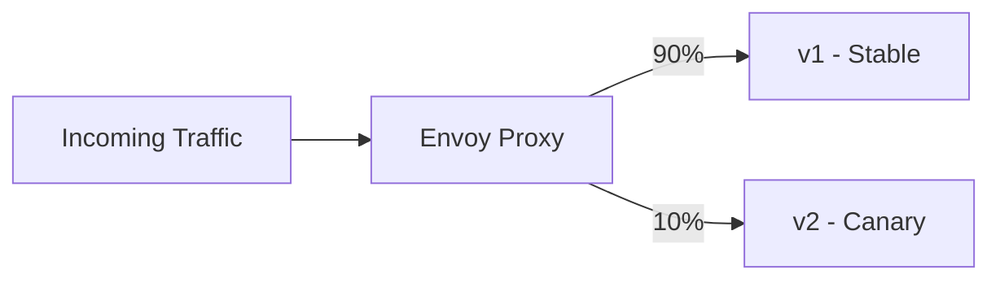

# How to Implement Canary Deployments Using Istio Traffic Splitting on GCP

Author: [nawazdhandala](https://www.github.com/nawazdhandala)

Tags: GCP, Istio, Canary Deployments, Traffic Splitting, GKE

Description: Learn how to implement canary deployments on GKE using Istio traffic splitting to gradually roll out new service versions with automated traffic management and rollback.

---

Deploying a new version of a service is always a risk. No matter how much testing you do in staging, production traffic has a way of finding bugs you missed. Canary deployments reduce this risk by routing a small percentage of traffic to the new version first, monitoring for problems, and gradually increasing traffic only if things look good. Istio on GKE makes this straightforward with VirtualService and DestinationRule resources that give you precise control over traffic distribution.

This guide walks through implementing a complete canary deployment workflow with Istio, from initial setup through automated progressive rollout.

## How Istio Traffic Splitting Works

Istio routes traffic through Envoy sidecar proxies. When you define traffic splitting rules, Envoy distributes incoming requests across different service versions according to the weights you specify.



The key Istio resources for canary deployments are:

- **DestinationRule** - Defines subsets (versions) of a service based on pod labels
- **VirtualService** - Defines routing rules including traffic weight distribution

## Step 1: Deploy Both Versions

First, deploy your stable version and the canary version as separate deployments with version labels.

```yaml
# deployment-v1.yaml
# Stable version of the application
apiVersion: apps/v1
kind: Deployment
metadata:
  name: my-service-v1
  namespace: default
spec:
  replicas: 3
  selector:
    matchLabels:
      app: my-service
      version: v1
  template:
    metadata:
      labels:
        app: my-service
        version: v1
    spec:
      containers:
      - name: my-service
        image: gcr.io/my-project/my-service:1.0.0
        ports:
        - containerPort: 8080
        resources:
          requests:
            cpu: 100m
            memory: 128Mi
---
# deployment-v2.yaml
# Canary version of the application
apiVersion: apps/v1
kind: Deployment
metadata:
  name: my-service-v2
  namespace: default
spec:
  replicas: 1
  selector:
    matchLabels:
      app: my-service
      version: v2
  template:
    metadata:
      labels:
        app: my-service
        version: v2
    spec:
      containers:
      - name: my-service
        image: gcr.io/my-project/my-service:2.0.0
        ports:
        - containerPort: 8080
        resources:
          requests:
            cpu: 100m
            memory: 128Mi
```

Both deployments share the same `app: my-service` label but have different `version` labels. The Kubernetes Service routes to both based on the `app` label.

```yaml
# service.yaml
# Service that routes to both v1 and v2 pods
apiVersion: v1
kind: Service
metadata:
  name: my-service
  namespace: default
spec:
  selector:
    app: my-service
  ports:
  - port: 8080
    targetPort: 8080
```

```bash
# Deploy everything
kubectl apply -f deployment-v1.yaml
kubectl apply -f deployment-v2.yaml
kubectl apply -f service.yaml
```

## Step 2: Create the DestinationRule

The DestinationRule defines the subsets that Istio can route to. Each subset maps to pods with specific labels.

```yaml
# destination-rule.yaml
# Defines v1 and v2 subsets for traffic routing
apiVersion: networking.istio.io/v1beta1
kind: DestinationRule
metadata:
  name: my-service
  namespace: default
spec:
  host: my-service
  subsets:
  - name: v1
    labels:
      version: v1
  - name: v2
    labels:
      version: v2
  trafficPolicy:
    connectionPool:
      tcp:
        maxConnections: 100
      http:
        h2UpgradePolicy: DEFAULT
        http1MaxPendingRequests: 100
        http2MaxRequests: 1000
```

```bash
kubectl apply -f destination-rule.yaml
```

## Step 3: Start with 100% to v1

Before introducing canary traffic, make sure all traffic goes to v1.

```yaml
# virtual-service-100-v1.yaml
# Routes all traffic to v1 (starting point)
apiVersion: networking.istio.io/v1beta1
kind: VirtualService
metadata:
  name: my-service
  namespace: default
spec:
  hosts:
  - my-service
  http:
  - route:
    - destination:
        host: my-service
        subset: v1
      weight: 100
    - destination:
        host: my-service
        subset: v2
      weight: 0
```

```bash
kubectl apply -f virtual-service-100-v1.yaml
```

## Step 4: Send Initial Canary Traffic

Now shift a small percentage of traffic to v2. Start with 5-10%.

```yaml
# virtual-service-canary-10.yaml
# Routes 10% of traffic to the canary (v2)
apiVersion: networking.istio.io/v1beta1
kind: VirtualService
metadata:
  name: my-service
  namespace: default
spec:
  hosts:
  - my-service
  http:
  - route:
    - destination:
        host: my-service
        subset: v1
      weight: 90
    - destination:
        host: my-service
        subset: v2
      weight: 10
```

```bash
kubectl apply -f virtual-service-canary-10.yaml
```

## Step 5: Monitor the Canary

This is the most important step. Watch the canary closely before increasing traffic.

### Check Error Rates

Use Cloud Monitoring or Prometheus to compare error rates between v1 and v2.

```bash
# Query Istio metrics to compare error rates
# In Prometheus or Cloud Monitoring, compare:
# rate(istio_requests_total{destination_version="v2", response_code=~"5.*"}[5m])
# vs
# rate(istio_requests_total{destination_version="v1", response_code=~"5.*"}[5m])
```

### Check Latency

```bash
# Compare p99 latency between versions
# istio_request_duration_milliseconds_bucket{destination_version="v2"}
# vs
# istio_request_duration_milliseconds_bucket{destination_version="v1"}
```

### Check Application-Specific Metrics

If your application exposes custom metrics, compare those between versions as well. Things like database query counts, cache hit rates, and business-specific metrics can reveal problems that HTTP error rates miss.

## Step 6: Progressive Traffic Increase

If the canary looks healthy, gradually increase traffic. A typical progression is 10% to 25% to 50% to 100%.

```yaml
# virtual-service-canary-25.yaml
# Routes 25% of traffic to the canary
apiVersion: networking.istio.io/v1beta1
kind: VirtualService
metadata:
  name: my-service
  namespace: default
spec:
  hosts:
  - my-service
  http:
  - route:
    - destination:
        host: my-service
        subset: v1
      weight: 75
    - destination:
        host: my-service
        subset: v2
      weight: 25
```

```bash
# Progress through stages
kubectl apply -f virtual-service-canary-25.yaml
# Monitor for 15 minutes

kubectl apply -f virtual-service-canary-50.yaml
# Monitor for 15 minutes

kubectl apply -f virtual-service-canary-100.yaml
# Full rollout complete
```

## Step 7: Rollback If Needed

If the canary shows problems, immediately route all traffic back to v1.

```bash
# Emergency rollback - send all traffic to v1
kubectl apply -f virtual-service-100-v1.yaml
```

This takes effect within seconds. Envoy proxies pick up the new routing rules almost immediately.

## Advanced: Header-Based Canary Routing

Instead of percentage-based splitting, you can route specific users to the canary using HTTP headers. This is useful for internal testing before exposing to real users.

```yaml
# virtual-service-header-canary.yaml
# Routes requests with a specific header to v2, all others to v1
apiVersion: networking.istio.io/v1beta1
kind: VirtualService
metadata:
  name: my-service
  namespace: default
spec:
  hosts:
  - my-service
  http:
  # Rule 1: Route canary-testers to v2
  - match:
    - headers:
        x-canary:
          exact: "true"
    route:
    - destination:
        host: my-service
        subset: v2
  # Rule 2: Everyone else goes to v1
  - route:
    - destination:
        host: my-service
        subset: v1
```

Your team can test the canary by adding the `x-canary: true` header to their requests while all production traffic continues to hit v1.

## Advanced: Automated Canary with Flagger

For fully automated canary deployments, use Flagger with Istio. Flagger watches metrics and automatically progresses or rolls back the canary.

```yaml
# flagger-canary.yaml
# Automated canary deployment with Flagger
apiVersion: flagger.app/v1beta1
kind: Canary
metadata:
  name: my-service
  namespace: default
spec:
  targetRef:
    apiVersion: apps/v1
    kind: Deployment
    name: my-service
  service:
    port: 8080
  analysis:
    # Run analysis every 60 seconds
    interval: 60s
    # Number of successful checks before promotion
    threshold: 10
    # Maximum traffic weight for canary
    maxWeight: 50
    # Traffic weight step size
    stepWeight: 10
    metrics:
    - name: request-success-rate
      # Minimum success rate required
      thresholdRange:
        min: 99
      interval: 60s
    - name: request-duration
      # Maximum p99 latency allowed
      thresholdRange:
        max: 500
      interval: 60s
```

With Flagger, you just update the deployment image and Flagger handles the progressive rollout automatically.

```bash
# Install Flagger
kubectl apply -k github.com/fluxcd/flagger/kustomize/istio

# Deploy the canary configuration
kubectl apply -f flagger-canary.yaml

# Trigger a canary by updating the image
kubectl set image deployment/my-service my-service=gcr.io/my-project/my-service:2.0.0
```

Flagger will automatically create the v2 deployment, shift traffic progressively, monitor metrics, and either complete the rollout or roll back.

## Cleaning Up After a Successful Canary

Once v2 is receiving 100% of traffic and is stable:

1. Remove the v1 deployment
2. Simplify the VirtualService to route to v2 only
3. Optionally update the v2 deployment name to remove the version suffix

```bash
# Remove the old version
kubectl delete deployment my-service-v1

# Update the VirtualService to route directly to v2
kubectl apply -f virtual-service-100-v2.yaml
```

## Tips from Production Experience

**Start smaller than you think.** 5% canary traffic is plenty for catching most issues. If you have low traffic, even 1% is fine as long as you run the canary long enough.

**Monitor the right metrics.** Error rate and latency are table stakes. Also watch downstream dependencies, database query patterns, and memory usage of the canary pods.

**Automate the monitoring.** Manual canary monitoring does not scale and is error-prone at 3 AM. Use Flagger or build your own automation that checks metrics and progresses/rolls back automatically.

**Account for connection draining.** When shifting traffic away from a version, give existing connections time to complete. Istio handles this gracefully, but be aware of long-running connections like WebSockets.

Canary deployments with Istio give you a safety net for every production release. The investment in setting up traffic splitting pays off the first time you catch a bug affecting 10% of traffic instead of 100%.
