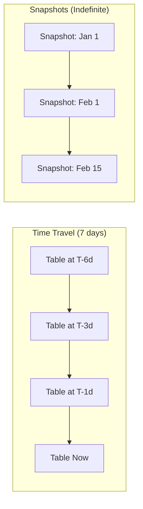

# How to Implement Change Data Capture Tracking in BigQuery Using Table Snapshots

Author: [nawazdhandala](https://www.github.com/nawazdhandala)

Tags: GCP, BigQuery, Change Data Capture, Table Snapshots, Data Auditing, Time Travel

Description: Learn how to track data changes over time in BigQuery using table snapshots and time travel features for change data capture, auditing, and data versioning.

---

Change Data Capture (CDC) is the practice of tracking what changed in your data, when it changed, and what the previous values were. In traditional databases, you might use triggers or log-based replication to capture changes. BigQuery does not have triggers, but it has two features that make CDC practical: table snapshots and time travel.

This guide covers how to use both features to build a CDC system in BigQuery that tracks inserts, updates, and deletes across your tables.

## BigQuery's Time Travel and Snapshot Features

Before diving into implementation, let me explain the two underlying capabilities.

**Time travel** lets you query a table as it existed at any point within the last seven days. You do this with the `FOR SYSTEM_TIME AS OF` clause. This is built into BigQuery - no setup required.

**Table snapshots** are point-in-time copies of a table. Unlike time travel, snapshots persist beyond seven days. They are stored efficiently as deltas from the base table, so they do not duplicate all the data.



## Strategy 1: CDC Using Time Travel

The simplest approach uses time travel to compare the current table state with a previous state.

### Detecting New Rows (Inserts)

```sql
-- Find rows that exist now but did not exist 1 hour ago
SELECT current_data.*
FROM `analytics.customers` AS current_data
LEFT JOIN `analytics.customers`
  FOR SYSTEM_TIME AS OF TIMESTAMP_SUB(CURRENT_TIMESTAMP(), INTERVAL 1 HOUR) AS previous_data
  ON current_data.customer_id = previous_data.customer_id
WHERE previous_data.customer_id IS NULL;
```

### Detecting Modified Rows (Updates)

```sql
-- Find rows that changed in the last hour
SELECT
  current_data.customer_id,
  previous_data.customer_name AS old_name,
  current_data.customer_name AS new_name,
  previous_data.email AS old_email,
  current_data.email AS new_email,
  previous_data.status AS old_status,
  current_data.status AS new_status
FROM `analytics.customers` AS current_data
INNER JOIN `analytics.customers`
  FOR SYSTEM_TIME AS OF TIMESTAMP_SUB(CURRENT_TIMESTAMP(), INTERVAL 1 HOUR) AS previous_data
  ON current_data.customer_id = previous_data.customer_id
WHERE current_data.customer_name != previous_data.customer_name
  OR current_data.email != previous_data.email
  OR current_data.status != previous_data.status;
```

### Detecting Deleted Rows

```sql
-- Find rows that existed 1 hour ago but no longer exist
SELECT previous_data.*
FROM `analytics.customers`
  FOR SYSTEM_TIME AS OF TIMESTAMP_SUB(CURRENT_TIMESTAMP(), INTERVAL 1 HOUR) AS previous_data
LEFT JOIN `analytics.customers` AS current_data
  ON previous_data.customer_id = current_data.customer_id
WHERE current_data.customer_id IS NULL;
```

### Automated CDC with Scheduled Queries

Create a scheduled query that runs hourly and writes changes to a change log table.

```sql
-- Scheduled CDC query that captures all changes
INSERT INTO `analytics.customer_change_log`
  (change_type, customer_id, old_values, new_values, detected_at)

-- Inserts
SELECT
  'INSERT' AS change_type,
  c.customer_id,
  NULL AS old_values,
  TO_JSON_STRING(c) AS new_values,
  CURRENT_TIMESTAMP() AS detected_at
FROM `analytics.customers` AS c
LEFT JOIN `analytics.customers`
  FOR SYSTEM_TIME AS OF TIMESTAMP_SUB(CURRENT_TIMESTAMP(), INTERVAL 1 HOUR) AS prev
  ON c.customer_id = prev.customer_id
WHERE prev.customer_id IS NULL

UNION ALL

-- Updates
SELECT
  'UPDATE' AS change_type,
  c.customer_id,
  TO_JSON_STRING(prev) AS old_values,
  TO_JSON_STRING(c) AS new_values,
  CURRENT_TIMESTAMP() AS detected_at
FROM `analytics.customers` AS c
INNER JOIN `analytics.customers`
  FOR SYSTEM_TIME AS OF TIMESTAMP_SUB(CURRENT_TIMESTAMP(), INTERVAL 1 HOUR) AS prev
  ON c.customer_id = prev.customer_id
WHERE TO_JSON_STRING(c) != TO_JSON_STRING(prev)

UNION ALL

-- Deletes
SELECT
  'DELETE' AS change_type,
  prev.customer_id,
  TO_JSON_STRING(prev) AS old_values,
  NULL AS new_values,
  CURRENT_TIMESTAMP() AS detected_at
FROM `analytics.customers`
  FOR SYSTEM_TIME AS OF TIMESTAMP_SUB(CURRENT_TIMESTAMP(), INTERVAL 1 HOUR) AS prev
LEFT JOIN `analytics.customers` AS c
  ON prev.customer_id = c.customer_id
WHERE c.customer_id IS NULL;
```

Schedule this query:

```bash
# Schedule the CDC query to run every hour
bq query --use_legacy_sql=false \
  --schedule="every 1 hours" \
  --display_name="Customer CDC Tracker" \
  --destination_table="" \
  "$(cat cdc_query.sql)"
```

## Strategy 2: CDC Using Table Snapshots

Table snapshots extend CDC beyond the 7-day time travel window. Create regular snapshots and compare them to detect changes.

### Create a Snapshot Schedule

```sql
-- Create a snapshot of the customers table
CREATE SNAPSHOT TABLE `analytics.customers_snapshot_20260217`
CLONE `analytics.customers`;
```

Automate snapshot creation with a scheduled query or Cloud Scheduler:

```bash
# Create a Cloud Scheduler job to take daily snapshots
gcloud scheduler jobs create http daily-customer-snapshot \
  --schedule="0 0 * * *" \
  --uri="https://bigquery.googleapis.com/bigquery/v2/projects/MY_PROJECT/jobs" \
  --http-method=POST \
  --headers="Content-Type=application/json" \
  --message-body='{
    "configuration": {
      "copy": {
        "sourceTable": {
          "projectId": "MY_PROJECT",
          "datasetId": "analytics",
          "tableId": "customers"
        },
        "destinationTable": {
          "projectId": "MY_PROJECT",
          "datasetId": "snapshots",
          "tableId": "customers_YYYYMMDD"
        },
        "operationType": "SNAPSHOT"
      }
    }
  }'
```

### Compare Snapshots

```sql
-- Compare two snapshots to find all changes between dates
WITH current_snapshot AS (
  SELECT * FROM `snapshots.customers_20260217`
),
previous_snapshot AS (
  SELECT * FROM `snapshots.customers_20260210`
),
changes AS (
  -- Inserts: in current but not in previous
  SELECT 'INSERT' AS change_type, c.customer_id, NULL AS old_record, TO_JSON_STRING(c) AS new_record
  FROM current_snapshot c
  LEFT JOIN previous_snapshot p ON c.customer_id = p.customer_id
  WHERE p.customer_id IS NULL

  UNION ALL

  -- Deletes: in previous but not in current
  SELECT 'DELETE' AS change_type, p.customer_id, TO_JSON_STRING(p) AS old_record, NULL AS new_record
  FROM previous_snapshot p
  LEFT JOIN current_snapshot c ON p.customer_id = c.customer_id
  WHERE c.customer_id IS NULL

  UNION ALL

  -- Updates: in both but with different values
  SELECT 'UPDATE' AS change_type, c.customer_id, TO_JSON_STRING(p) AS old_record, TO_JSON_STRING(c) AS new_record
  FROM current_snapshot c
  INNER JOIN previous_snapshot p ON c.customer_id = p.customer_id
  WHERE TO_JSON_STRING(c) != TO_JSON_STRING(p)
)
SELECT * FROM changes
ORDER BY change_type, customer_id;
```

## Strategy 3: Building a Full Change Log Table

For a production CDC system, maintain a permanent change log table.

```sql
-- Create the change log table
CREATE TABLE `analytics.change_log` (
  log_id STRING DEFAULT GENERATE_UUID(),
  table_name STRING,
  change_type STRING,  -- INSERT, UPDATE, DELETE
  entity_id STRING,
  old_values JSON,
  new_values JSON,
  changed_fields ARRAY<STRING>,
  detected_at TIMESTAMP DEFAULT CURRENT_TIMESTAMP(),
  snapshot_from TIMESTAMP,
  snapshot_to TIMESTAMP
)
PARTITION BY DATE(detected_at)
CLUSTER BY table_name, change_type;
```

### Identifying Specific Changed Fields

For updates, knowing which fields changed is more useful than just knowing something changed.

```sql
-- Function to identify which fields changed between two JSON objects
CREATE TEMP FUNCTION changed_fields(old_json STRING, new_json STRING)
RETURNS ARRAY<STRING>
LANGUAGE js AS """
  const oldObj = JSON.parse(old_json);
  const newObj = JSON.parse(new_json);
  const changed = [];
  for (const key of Object.keys(newObj)) {
    if (JSON.stringify(oldObj[key]) !== JSON.stringify(newObj[key])) {
      changed.push(key);
    }
  }
  return changed;
""";

-- Use in your CDC query
SELECT
  'UPDATE' AS change_type,
  c.customer_id,
  TO_JSON_STRING(prev) AS old_values,
  TO_JSON_STRING(c) AS new_values,
  changed_fields(TO_JSON_STRING(prev), TO_JSON_STRING(c)) AS modified_fields,
  CURRENT_TIMESTAMP() AS detected_at
FROM `analytics.customers` AS c
INNER JOIN `analytics.customers`
  FOR SYSTEM_TIME AS OF TIMESTAMP_SUB(CURRENT_TIMESTAMP(), INTERVAL 1 HOUR) AS prev
  ON c.customer_id = prev.customer_id
WHERE TO_JSON_STRING(c) != TO_JSON_STRING(prev);
```

## Querying the Change Log

Once you have a change log, you can answer questions that are impossible with current-state data alone.

```sql
-- How many changes happened per day for each table?
SELECT
  DATE(detected_at) AS change_date,
  table_name,
  change_type,
  COUNT(*) AS change_count
FROM `analytics.change_log`
GROUP BY change_date, table_name, change_type
ORDER BY change_date DESC, table_name;

-- What was the state of a specific customer at a specific point in time?
SELECT new_values
FROM `analytics.change_log`
WHERE table_name = 'customers'
  AND entity_id = 'c100'
  AND detected_at <= '2026-02-15 12:00:00'
ORDER BY detected_at DESC
LIMIT 1;

-- Who changed the most in the last week?
SELECT
  entity_id,
  COUNT(*) AS change_count,
  ARRAY_AGG(DISTINCT change_type) AS change_types
FROM `analytics.change_log`
WHERE table_name = 'customers'
  AND detected_at >= TIMESTAMP_SUB(CURRENT_TIMESTAMP(), INTERVAL 7 DAY)
GROUP BY entity_id
ORDER BY change_count DESC
LIMIT 20;
```

## Managing Snapshot Storage

Snapshots are stored efficiently as deltas, but they still accumulate over time. Set up a cleanup policy.

```bash
# Delete snapshots older than 90 days
for table in $(bq ls --format=json snapshots | jq -r '.[].tableReference.tableId' | grep 'customers_202'); do
  table_date=$(echo $table | grep -oP '\d{8}')
  if [[ $(date -d "$table_date" +%s) -lt $(date -d "-90 days" +%s) ]]; then
    bq rm -f "snapshots.$table"
  fi
done
```

## Wrapping Up

BigQuery's time travel and table snapshot features give you practical CDC capabilities without the complexity of log-based capture systems. Time travel handles short-term change detection (up to 7 days), while snapshots extend this indefinitely. The combination of scheduled CDC queries and a persistent change log table gives you a complete audit trail of what changed, when, and from what previous value. The approach is not real time - it depends on your polling interval - but for many analytics and compliance use cases, hourly or daily change detection is more than sufficient.
