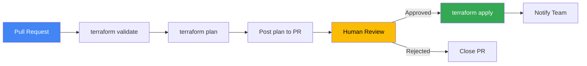
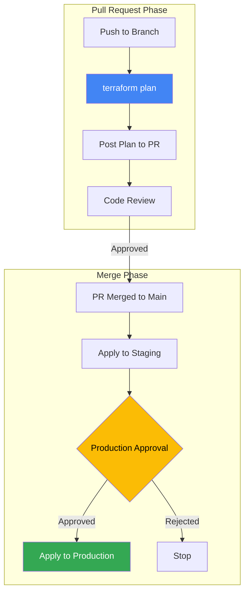

# How to Implement CI/CD for Terraform GCP Deployments Using Cloud Build and Terraform Plan Approval

Author: [nawazdhandala](https://www.github.com/nawazdhandala)

Tags: GCP, Terraform, Cloud Build, CI/CD, Infrastructure as Code, DevOps

Description: Implement a CI/CD pipeline for Terraform GCP deployments using Cloud Build with plan approval gates to safely manage infrastructure changes.

---

Running `terraform apply` from your laptop works until it doesn't. Maybe someone forgot to pull the latest state, or two people applied conflicting changes at the same time. A CI/CD pipeline for Terraform fixes these problems by making infrastructure changes go through a consistent, auditable process.

Cloud Build is a natural fit for this on GCP. You get native authentication with GCP services, no need for long-lived credentials, and integration with Cloud Source Repositories or GitHub. The approval gate ensures destructive changes get reviewed before they are applied.

## The Pipeline Flow



## Project Structure

```
infrastructure/
  cloudbuild/
    plan.yaml          # Cloud Build config for plan
    apply.yaml         # Cloud Build config for apply
  environments/
    production/
      main.tf
      backend.tf
      variables.tf
    staging/
      main.tf
      backend.tf
      variables.tf
  modules/
    cloud-run/
    gke/
```

## State Backend Configuration

Every Terraform CI/CD setup starts with remote state. Use a GCS bucket with state locking.

```hcl
# environments/production/backend.tf

terraform {
  backend "gcs" {
    bucket = "my-project-terraform-state"
    prefix = "production"
  }
}
```

Create the state bucket:

```bash
# Create the state bucket with versioning enabled
gsutil mb -l us-central1 gs://my-project-terraform-state
gsutil versioning set on gs://my-project-terraform-state
```

## Cloud Build Service Account

The Cloud Build service account needs permissions to manage your GCP resources.

```bash
# Get the Cloud Build service account
PROJECT_NUMBER=$(gcloud projects describe $PROJECT_ID --format="value(projectNumber)")
CB_SA="${PROJECT_NUMBER}@cloudbuild.gserviceaccount.com"

# Grant the roles Cloud Build needs
gcloud projects add-iam-policy-binding $PROJECT_ID \
  --member="serviceAccount:$CB_SA" \
  --role="roles/editor"

gcloud projects add-iam-policy-binding $PROJECT_ID \
  --member="serviceAccount:$CB_SA" \
  --role="roles/iam.securityAdmin"

# Allow Cloud Build to access the state bucket
gsutil iam ch "serviceAccount:$CB_SA:roles/storage.admin" gs://my-project-terraform-state
```

## Plan Pipeline

This pipeline runs on every pull request. It validates the Terraform configuration and generates a plan.

```yaml
# cloudbuild/plan.yaml

steps:
  # Step 1: Install Terraform
  - id: 'install-terraform'
    name: 'hashicorp/terraform:1.7'
    entrypoint: 'sh'
    args:
      - '-c'
      - 'terraform version'

  # Step 2: Initialize Terraform
  - id: 'terraform-init'
    name: 'hashicorp/terraform:1.7'
    dir: 'environments/${_ENVIRONMENT}'
    args:
      - 'init'
      - '-input=false'
      - '-no-color'

  # Step 3: Validate the configuration
  - id: 'terraform-validate'
    name: 'hashicorp/terraform:1.7'
    dir: 'environments/${_ENVIRONMENT}'
    args:
      - 'validate'
      - '-no-color'

  # Step 4: Run terraform fmt check
  - id: 'terraform-fmt'
    name: 'hashicorp/terraform:1.7'
    dir: 'environments/${_ENVIRONMENT}'
    args:
      - 'fmt'
      - '-check'
      - '-recursive'
      - '-no-color'

  # Step 5: Generate the plan and save it
  - id: 'terraform-plan'
    name: 'hashicorp/terraform:1.7'
    dir: 'environments/${_ENVIRONMENT}'
    args:
      - 'plan'
      - '-input=false'
      - '-no-color'
      - '-out=tfplan'
    env:
      - 'TF_VAR_project_id=${_PROJECT_ID}'

  # Step 6: Convert plan to human-readable text
  - id: 'plan-output'
    name: 'hashicorp/terraform:1.7'
    dir: 'environments/${_ENVIRONMENT}'
    entrypoint: 'sh'
    args:
      - '-c'
      - |
        terraform show -no-color tfplan > /workspace/plan-output.txt
        echo "Plan output saved"

  # Step 7: Save the plan as an artifact
  - id: 'save-plan'
    name: 'gcr.io/cloud-builders/gsutil'
    args:
      - 'cp'
      - 'environments/${_ENVIRONMENT}/tfplan'
      - 'gs://${_STATE_BUCKET}/plans/${BUILD_ID}/tfplan'

substitutions:
  _ENVIRONMENT: 'production'
  _PROJECT_ID: 'my-project'
  _STATE_BUCKET: 'my-project-terraform-state'

artifacts:
  objects:
    location: 'gs://${_STATE_BUCKET}/plans/${BUILD_ID}/'
    paths:
      - 'plan-output.txt'

options:
  logging: CLOUD_LOGGING_ONLY
```

## Apply Pipeline with Approval

The apply pipeline runs after the plan is approved. It uses the saved plan file to ensure exactly what was reviewed gets applied.

```yaml
# cloudbuild/apply.yaml

steps:
  # Step 1: Initialize Terraform
  - id: 'terraform-init'
    name: 'hashicorp/terraform:1.7'
    dir: 'environments/${_ENVIRONMENT}'
    args:
      - 'init'
      - '-input=false'
      - '-no-color'

  # Step 2: Download the approved plan
  - id: 'download-plan'
    name: 'gcr.io/cloud-builders/gsutil'
    args:
      - 'cp'
      - 'gs://${_STATE_BUCKET}/plans/${_PLAN_BUILD_ID}/tfplan'
      - 'environments/${_ENVIRONMENT}/tfplan'

  # Step 3: Apply the saved plan
  - id: 'terraform-apply'
    name: 'hashicorp/terraform:1.7'
    dir: 'environments/${_ENVIRONMENT}'
    args:
      - 'apply'
      - '-input=false'
      - '-no-color'
      - 'tfplan'

  # Step 4: Notify on success
  - id: 'notify-success'
    name: 'gcr.io/cloud-builders/curl'
    entrypoint: 'sh'
    args:
      - '-c'
      - |
        echo "Terraform apply completed successfully for ${_ENVIRONMENT}"

substitutions:
  _ENVIRONMENT: 'production'
  _STATE_BUCKET: 'my-project-terraform-state'
  _PLAN_BUILD_ID: ''  # Set to the plan build ID

options:
  logging: CLOUD_LOGGING_ONLY
```

## Cloud Build Trigger Configuration

Set up triggers for the plan and apply pipelines.

```bash
# Create a trigger for terraform plan on pull requests
gcloud builds triggers create github \
  --name="terraform-plan" \
  --repo-name="infrastructure" \
  --repo-owner="my-org" \
  --pull-request-pattern="^main$" \
  --build-config="cloudbuild/plan.yaml" \
  --substitutions="_ENVIRONMENT=production"

# Create a trigger for terraform apply on merge to main
gcloud builds triggers create github \
  --name="terraform-apply" \
  --repo-name="infrastructure" \
  --repo-owner="my-org" \
  --branch-pattern="^main$" \
  --build-config="cloudbuild/apply.yaml" \
  --substitutions="_ENVIRONMENT=production" \
  --require-approval
```

The `--require-approval` flag is the key part. It creates a manual approval gate that must be cleared before the apply runs.

## Adding Plan Comments to Pull Requests

To make the review process smoother, post the plan output as a PR comment.

```yaml
# Additional step in plan.yaml to post the plan as a PR comment
  - id: 'post-plan-comment'
    name: 'gcr.io/cloud-builders/curl'
    entrypoint: 'sh'
    secretEnv: ['GITHUB_TOKEN']
    args:
      - '-c'
      - |
        # Read the plan output and escape it for JSON
        PLAN=$(cat /workspace/plan-output.txt | head -200)

        # Post as a PR comment using the GitHub API
        curl -s -X POST \
          -H "Authorization: token $$GITHUB_TOKEN" \
          -H "Content-Type: application/json" \
          "https://api.github.com/repos/${_REPO_OWNER}/${_REPO_NAME}/issues/${_PR_NUMBER}/comments" \
          -d "{\"body\": \"## Terraform Plan\\n\\\`\\\`\\\`\\n${PLAN}\\n\\\`\\\`\\\`\"}"

availableSecrets:
  secretManager:
    - versionName: projects/${_PROJECT_ID}/secrets/github-token/versions/latest
      env: GITHUB_TOKEN
```

## Safety Checks

Add safety checks to prevent destructive changes from going through without explicit acknowledgment.

```yaml
# Additional step to detect destructive changes
  - id: 'check-destructive'
    name: 'hashicorp/terraform:1.7'
    dir: 'environments/${_ENVIRONMENT}'
    entrypoint: 'sh'
    args:
      - '-c'
      - |
        # Count resources being destroyed
        DESTROY_COUNT=$(terraform show -json tfplan | \
          python3 -c "
        import json, sys
        plan = json.load(sys.stdin)
        changes = plan.get('resource_changes', [])
        destroys = [c for c in changes if 'delete' in c.get('change', {}).get('actions', [])]
        print(len(destroys))
        ")

        if [ "$DESTROY_COUNT" -gt "0" ]; then
          echo "WARNING: This plan will DESTROY $DESTROY_COUNT resources!"
          echo "Resources to be destroyed:"
          terraform show -json tfplan | \
            python3 -c "
        import json, sys
        plan = json.load(sys.stdin)
        for c in plan.get('resource_changes', []):
            if 'delete' in c.get('change', {}).get('actions', []):
                print(f'  - {c[\"type\"]}.{c[\"name\"]}')
        "
        fi
```

## Multi-Environment Support

Handle multiple environments by parameterizing the pipeline.

```bash
# Staging trigger - auto-applies without approval
gcloud builds triggers create github \
  --name="terraform-apply-staging" \
  --repo-name="infrastructure" \
  --repo-owner="my-org" \
  --branch-pattern="^main$" \
  --build-config="cloudbuild/apply.yaml" \
  --substitutions="_ENVIRONMENT=staging"

# Production trigger - requires approval
gcloud builds triggers create github \
  --name="terraform-apply-production" \
  --repo-name="infrastructure" \
  --repo-owner="my-org" \
  --branch-pattern="^main$" \
  --build-config="cloudbuild/apply.yaml" \
  --substitutions="_ENVIRONMENT=production" \
  --require-approval
```

## Pipeline Architecture



## Wrapping Up

A CI/CD pipeline for Terraform eliminates the "it worked on my machine" class of infrastructure problems. Cloud Build handles the execution, GCS stores the state and plans, and the approval gate prevents accidental production changes. Start with the plan-on-PR and apply-on-merge pattern, and add more safety checks as your infrastructure grows.

For monitoring the infrastructure deployed by your Terraform pipelines, OneUptime can provide uptime monitoring, resource tracking, and alerting across all your GCP environments.
