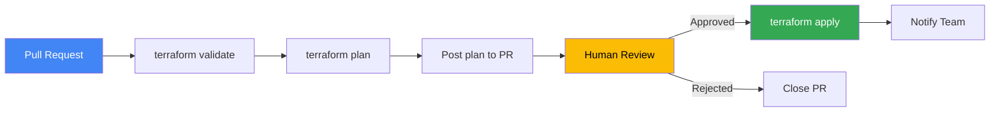
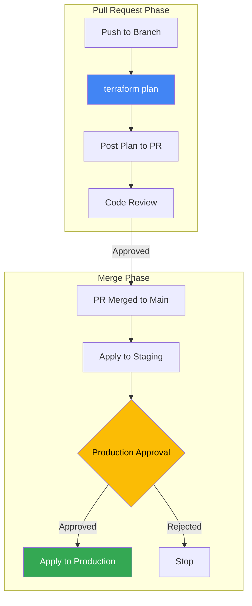

# How to Use CI/CD for Terraform GCP Deployments Using Cloud Build

Author: [nawazdhandala](https://www.github.com/nawazdhandala)

Tags: GCP, Terraform, Cloud Build, CI/CD, Infrastructure as Code, DevOps

Description: Implement a CI/CD pipeline for Terraform GCP deployments using Cloud Build with plan approval gates to safely manage infrastructure changes.

---

Running `terraform apply` from your laptop works until it doesn't. Maybe someone forgot to pull the latest state, or two people applied conflicting changes at the same time. A CI/CD pipeline for Terraform fixes these problems by making infrastructure changes go through a consistent, auditable process.

Cloud Build is a natural fit for this on GCP. You get native authentication with GCP services, no need for long-lived credentials, and integration with Cloud Source Repositories or GitHub. The approval gate ensures destructive changes get reviewed before they are applied.

## The Pipeline Flow


```mermaid
flowchart LR
    PR[Pull Request] --> Validate[terraform validate]
    Validate --> Plan[terraform plan]
    Plan --> Comment[Post plan to PR]
    Comment --> Review[Human Review]
    Review -->|Approved| Apply[terraform apply]
    Review -->|Rejected| Close[Close PR]
    Apply --> Notify[Notify Team]

    style PR fill:#4285F4,color:#fff
    style Review fill:#FBBC05,color:#000
    style Apply fill:#34A853,color:#fff
```

## Project Structure

```text
infrastructure/
  cloudbuild/
    plan.yaml          # Cloud Build config for plan
    apply.yaml         # Cloud Build config for apply
  environments/
    production/
      main.tf
      backend.tf
      variables.tf
    staging/
      main.tf
      backend.tf
      variables.tf
  modules/
    cloud-run/
    gke/
```

## State Backend Configuration

Every Terraform CI/CD setup starts with remote state. Use a GCS bucket with state locking.

```hcl
# environments/production/backend.tf

terraform {
  backend "gcs" {
    bucket = "my-project-terraform-state"
    prefix = "production"
  }
}
```

Create the state bucket:

```bash
# Create the state bucket with versioning enabled

gsutil mb -l us-central1 gs://my-project-terraform-state
gsutil versioning set on gs://my-project-terraform-state
```

## Cloud Build Service Account

The Cloud Build service account needs permissions to manage your GCP resources.

```bash
# Create a user-specified Cloud Build service account
CB_SA="terraform-cloud-build@$PROJECT_ID.iam.gserviceaccount.com"
gcloud iam service-accounts create terraform-cloud-build \
  --display-name="Terraform Cloud Build"

# Grant the roles Cloud Build needs
gcloud projects add-iam-policy-binding $PROJECT_ID \
  --member="serviceAccount:$CB_SA" \
  --role="roles/editor"

gcloud projects add-iam-policy-binding $PROJECT_ID \
  --member="serviceAccount:$CB_SA" \
  --role="roles/iam.securityAdmin"

# Allow Cloud Build to access the state bucket
gsutil iam ch "serviceAccount:$CB_SA:roles/storage.admin" gs://my-project-terraform-state
```

## Plan Pipeline

This pipeline runs on every pull request. It validates the Terraform configuration and generates a plan.

```yaml
# cloudbuild/plan.yaml

steps:
  # Step 1: Install Terraform
  - id: 'install-terraform'
    name: 'hashicorp/terraform:1.15'
    entrypoint: 'sh'
    args:
      - '-c'
      - 'terraform version'

  # Step 2: Initialize Terraform
  - id: 'terraform-init'
    name: 'hashicorp/terraform:1.15'
    dir: 'environments/${_ENVIRONMENT}'
    args:
      - 'init'
      - '-input=false'
      - '-no-color'

  # Step 3: Validate the configuration
  - id: 'terraform-validate'
    name: 'hashicorp/terraform:1.15'
    dir: 'environments/${_ENVIRONMENT}'
    args:
      - 'validate'
      - '-no-color'

  # Step 4: Run terraform fmt check
  - id: 'terraform-fmt'
    name: 'hashicorp/terraform:1.15'
    dir: 'environments/${_ENVIRONMENT}'
    args:
      - 'fmt'
      - '-check'
      - '-recursive'
      - '-no-color'

  # Step 5: Generate the plan and save it
  - id: 'terraform-plan'
    name: 'hashicorp/terraform:1.15'
    dir: 'environments/${_ENVIRONMENT}'
    args:
      - 'plan'
      - '-input=false'
      - '-no-color'
      - '-out=tfplan'
    env:
      - 'TF_VAR_project_id=${_PROJECT_ID}'

  # Step 6: Convert plan to human-readable text
  - id: 'plan-output'
    name: 'hashicorp/terraform:1.15'
    dir: 'environments/${_ENVIRONMENT}'
    entrypoint: 'sh'
    args:
      - '-c'
      - |
        terraform show -no-color tfplan > /workspace/plan-output.txt
        echo "Plan output saved"

  # Step 7: Save the plan as an artifact
  - id: 'save-plan'
    name: 'gcr.io/cloud-builders/gsutil'
    args:
      - 'cp'
      - 'environments/${_ENVIRONMENT}/tfplan'
      - 'gs://${_STATE_BUCKET}/plans/${BUILD_ID}/tfplan'

substitutions:
  _ENVIRONMENT: 'production'
  _PROJECT_ID: 'my-project'
  _STATE_BUCKET: 'my-project-terraform-state'

artifacts:
  objects:
    location: 'gs://${_STATE_BUCKET}/plans/${BUILD_ID}/'
    paths:
      - 'plan-output.txt'

options:
  logging: CLOUD_LOGGING_ONLY
```

## Apply Pipeline with Approval

The apply pipeline runs after the plan is approved. It uses the saved plan file to ensure exactly what was reviewed gets applied, so the approved plan build ID must be passed into the apply build.

```yaml
# cloudbuild/apply.yaml

steps:
  # Step 0: Make sure a reviewed plan was selected
  - id: 'check-plan-build-id'
    name: 'alpine'
    entrypoint: 'sh'
    args:
      - '-c'
      - |
        test -n "${_PLAN_BUILD_ID}" || {
          echo "_PLAN_BUILD_ID must be set to the approved plan build ID"
          exit 1
        }

  # Step 1: Initialize Terraform
  - id: 'terraform-init'
    name: 'hashicorp/terraform:1.15'
    dir: 'environments/${_ENVIRONMENT}'
    args:
      - 'init'
      - '-input=false'
      - '-no-color'

  # Step 2: Download the approved plan
  - id: 'download-plan'
    name: 'gcr.io/cloud-builders/gsutil'
    args:
      - 'cp'
      - 'gs://${_STATE_BUCKET}/plans/${_PLAN_BUILD_ID}/tfplan'
      - 'environments/${_ENVIRONMENT}/tfplan'

  # Step 3: Apply the saved plan
  - id: 'terraform-apply'
    name: 'hashicorp/terraform:1.15'
    dir: 'environments/${_ENVIRONMENT}'
    args:
      - 'apply'
      - '-input=false'
      - '-no-color'
      - 'tfplan'

  # Step 4: Notify on success
  - id: 'notify-success'
    name: 'gcr.io/cloud-builders/curl'
    entrypoint: 'sh'
    args:
      - '-c'
      - |
        echo "Terraform apply completed successfully for ${_ENVIRONMENT}"

substitutions:
  _ENVIRONMENT: 'production'
  _STATE_BUCKET: 'my-project-terraform-state'
  _PLAN_BUILD_ID: ''  # Set to the plan build ID

options:
  logging: CLOUD_LOGGING_ONLY
```

## Cloud Build Trigger Configuration

Set up triggers for the plan and apply pipelines.

```bash
# Create a trigger for terraform plan on pull requests
gcloud builds triggers create github \
  --name="terraform-plan" \
  --repo-name="infrastructure" \
  --repo-owner="my-org" \
  --pull-request-pattern="^main$" \
  --build-config="cloudbuild/plan.yaml" \
  --substitutions="_ENVIRONMENT=production" \
  --service-account="projects/$PROJECT_ID/serviceAccounts/$CB_SA"

# Create a manual trigger for terraform apply
gcloud beta builds triggers create manual \
  --name="terraform-apply" \
  --repo="https://github.com/my-org/infrastructure" \
  --repo-type="GITHUB" \
  --branch="main" \
  --build-config="cloudbuild/apply.yaml" \
  --substitutions="_ENVIRONMENT=production,_PLAN_BUILD_ID=PLAN_BUILD_ID" \
  --service-account="projects/$PROJECT_ID/serviceAccounts/$CB_SA" \
  --require-approval
```

The `--require-approval` flag is the key part. It creates a manual approval gate that must be cleared before the apply runs. After reviewing the plan, run the apply trigger with the reviewed plan build ID:

```bash
gcloud builds triggers run terraform-apply \
  --branch="main" \
  --substitutions="_ENVIRONMENT=production,_PLAN_BUILD_ID=APPROVED_PLAN_BUILD_ID"
```

## Adding Plan Comments to Pull Requests

To make the review process smoother, post the plan output as a PR comment.

```yaml
# Additional step in plan.yaml to post the plan as a PR comment
  - id: 'post-plan-comment'
    name: 'python:3.12-alpine'
    entrypoint: 'python'
    secretEnv: ['GITHUB_TOKEN']
    args:
      - '-'
      - |
        import json
        import os
        import urllib.request

        with open("/workspace/plan-output.txt", encoding="utf-8") as f:
            plan = "".join(f.readlines()[:200])

        owner, repo = os.environ["REPO_FULL_NAME"].split("/", 1)
        pr_number = os.environ["_PR_NUMBER"]
        token = os.environ["GITHUB_TOKEN"]
        body = json.dumps({"body": f"## Terraform Plan\n```\n{plan}\n```"}).encode()
        req = urllib.request.Request(
            f"https://api.github.com/repos/{owner}/{repo}/issues/{pr_number}/comments",
            data=body,
            headers={
                "Authorization": f"Bearer {token}",
                "Accept": "application/vnd.github+json",
                "X-GitHub-Api-Version": "2022-11-28",
                "Content-Type": "application/json",
            },
            method="POST",
        )
        urllib.request.urlopen(req).read()
    env:
      - 'REPO_FULL_NAME=$REPO_FULL_NAME'
      - '_PR_NUMBER=$_PR_NUMBER'

availableSecrets:
  secretManager:
    - versionName: projects/${_PROJECT_ID}/secrets/github-token/versions/latest
      env: GITHUB_TOKEN
```

## Safety Checks

Add safety checks to prevent destructive changes from going through without explicit acknowledgment.

```yaml
# Additional steps to detect destructive changes
  - id: 'export-plan-json'
    name: 'hashicorp/terraform:1.15'
    dir: 'environments/${_ENVIRONMENT}'
    entrypoint: 'sh'
    args:
      - '-c'
      - |
        terraform show -json tfplan > /workspace/tfplan.json

  - id: 'check-destructive'
    name: 'python:3.12-alpine'
    entrypoint: 'python'
    args:
      - '-'
      - |
        import json

        with open("/workspace/tfplan.json", encoding="utf-8") as f:
            plan = json.load(f)

        changes = plan.get('resource_changes', [])
        destroys = [c for c in changes if 'delete' in c.get('change', {}).get('actions', [])]
        if destroys:
            print(f"WARNING: This plan will DESTROY {len(destroys)} resources!")
            print("Resources to be destroyed:")
            for change in destroys:
                print(f"  - {change['address']}")
```

## Multi-Environment Support

Handle multiple environments by parameterizing the pipeline.

```bash
# Staging trigger - manually run after reviewing a staging plan
gcloud beta builds triggers create manual \
  --name="terraform-apply-staging" \
  --repo="https://github.com/my-org/infrastructure" \
  --repo-type="GITHUB" \
  --branch="main" \
  --build-config="cloudbuild/apply.yaml" \
  --substitutions="_ENVIRONMENT=staging,_PLAN_BUILD_ID=PLAN_BUILD_ID" \
  --service-account="projects/$PROJECT_ID/serviceAccounts/$CB_SA"

# Production trigger - requires approval
gcloud beta builds triggers create manual \
  --name="terraform-apply-production" \
  --repo="https://github.com/my-org/infrastructure" \
  --repo-type="GITHUB" \
  --branch="main" \
  --build-config="cloudbuild/apply.yaml" \
  --substitutions="_ENVIRONMENT=production,_PLAN_BUILD_ID=PLAN_BUILD_ID" \
  --service-account="projects/$PROJECT_ID/serviceAccounts/$CB_SA" \
  --require-approval
```

## Pipeline Architecture


```mermaid
flowchart TD
    subgraph PR[Pull Request Phase]
        Push[Push to Branch] --> Plan[terraform plan]
        Plan --> Comment[Post Plan to PR]
        Comment --> Review[Code Review]
    end

    subgraph Merge[Merge Phase]
        Approved[PR Merged to Main] --> Staging[Apply to Staging]
        Staging --> ProdApproval{Production Approval}
        ProdApproval -->|Approved| ProdApply[Apply to Production]
        ProdApproval -->|Rejected| Stop[Stop]
    end

    Review -->|Approved| Approved

    style Plan fill:#4285F4,color:#fff
    style ProdApproval fill:#FBBC05,color:#000
    style ProdApply fill:#34A853,color:#fff
```

## Wrapping Up

A CI/CD pipeline for Terraform eliminates the "it worked on my machine" class of infrastructure problems. Cloud Build handles the execution, GCS stores the state and plans, and the approval gate prevents accidental production changes. Start with the plan-on-PR and approved-apply pattern, and add more safety checks as your infrastructure grows.

For monitoring the infrastructure deployed by your Terraform pipelines, OneUptime can provide uptime monitoring, resource tracking, and alerting across all your GCP environments.
