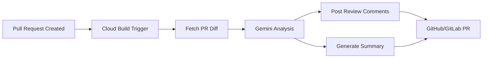

# How to Implement Code Generation and Review Automation with Gemini on Vertex AI

Author: [nawazdhandala](https://www.github.com/nawazdhandala)

Tags: GCP, Vertex AI, Gemini, Code Generation, Developer Tools

Description: Build automated code generation and review systems using Gemini on Vertex AI to accelerate development workflows with AI-assisted coding and pull request reviews.

---

AI-assisted coding has gone from novelty to practical tool. Gemini on Vertex AI is particularly interesting for teams already on GCP because it integrates naturally with Cloud Build, Cloud Source Repositories, and the rest of the GCP ecosystem. Rather than using it as a chatbot, you can embed it into your development workflow as an automated code reviewer, a boilerplate generator, and a documentation writer.

In this post, I'll build two practical systems: an automated pull request reviewer that runs on every PR, and a code generation service that produces boilerplate from specifications.

## Automated Pull Request Reviewer

The PR reviewer runs as a Cloud Build step triggered by pull requests. It reads the diff, analyzes the changes, and posts comments.

### Architecture



### The Review Function

```python
import vertexai
from vertexai.generative_models import GenerativeModel
import subprocess
import json
import requests

def review_pull_request(project_id, repo_name, pr_number):
    """Analyze a pull request and generate review comments"""
    vertexai.init(project=project_id, location="us-central1")
    model = GenerativeModel("gemini-1.5-pro")

    # Fetch the PR diff
    diff = get_pr_diff(repo_name, pr_number)
    pr_description = get_pr_description(repo_name, pr_number)

    # Break the diff into file-level chunks for focused review
    file_diffs = parse_diff_by_file(diff)

    all_comments = []

    for file_path, file_diff in file_diffs.items():
        # Skip non-code files
        if should_skip_file(file_path):
            continue

        # Generate a review for this file's changes
        review_prompt = f"""You are an experienced code reviewer. Review the following
code changes and provide specific, actionable feedback.

File: {file_path}
PR Description: {pr_description}

Changes:
```
{file_diff}
```

For each issue you find, provide:
1. The specific line or code section
2. The type of issue (bug, performance, security, style, maintainability)
3. A clear explanation of the problem
4. A suggested fix

Focus on:
- Potential bugs or logic errors
- Security vulnerabilities (SQL injection, XSS, etc.)
- Performance issues
- Missing error handling
- Unclear naming or logic

Do NOT comment on:
- Minor style preferences
- Import ordering
- Things that a linter would catch

Output as JSON array with fields: line_number, issue_type, description, suggestion.
Only output the JSON array, nothing else. If no issues found, output an empty array."""

        response = model.generate_content(
            review_prompt,
            generation_config={
                "temperature": 0.2,
                "max_output_tokens": 2000,
            },
        )

        try:
            file_comments = json.loads(response.text)
            for comment in file_comments:
                comment["file_path"] = file_path
            all_comments.extend(file_comments)
        except json.JSONDecodeError:
            print(f"Failed to parse review for {file_path}")
            continue

    # Generate an overall PR summary
    summary = generate_pr_summary(model, diff, pr_description, all_comments)

    return {
        "comments": all_comments,
        "summary": summary,
    }

def generate_pr_summary(model, diff, description, comments):
    """Generate a high-level summary of the PR review"""
    issue_counts = {}
    for comment in comments:
        issue_type = comment.get("issue_type", "other")
        issue_counts[issue_type] = issue_counts.get(issue_type, 0) + 1

    prompt = f"""Summarize this pull request review in 3-5 sentences.

PR Description: {description}

Issues found: {json.dumps(issue_counts)}
Total issues: {len(comments)}

Diff size: {len(diff)} characters

Provide:
1. Overall assessment (approve, request changes, or comment)
2. Key concerns if any
3. Positive aspects of the changes"""

    response = model.generate_content(
        prompt,
        generation_config={"temperature": 0.3, "max_output_tokens": 500},
    )

    return response.text
```

### Posting Comments to GitHub

```python
def post_review_to_github(repo_name, pr_number, review_result, github_token):
    """Post the AI review as GitHub PR comments"""
    headers = {
        "Authorization": f"token {github_token}",
        "Accept": "application/vnd.github.v3+json",
    }

    # Post individual line comments
    comments_payload = []
    for comment in review_result["comments"]:
        comments_payload.append({
            "path": comment["file_path"],
            "line": comment.get("line_number", 1),
            "body": (
                f"**{comment['issue_type'].upper()}**: "
                f"{comment['description']}\n\n"
                f"**Suggestion**: {comment['suggestion']}"
            ),
        })

    # Create the review with all comments at once
    review_body = {
        "body": (
            f"## AI Code Review Summary\n\n"
            f"{review_result['summary']}\n\n"
            f"---\n"
            f"*Review generated by Gemini on Vertex AI*"
        ),
        "event": "COMMENT",
        "comments": comments_payload[:50],  # GitHub limits to 50 comments
    }

    url = f"https://api.github.com/repos/{repo_name}/pulls/{pr_number}/reviews"
    response = requests.post(url, headers=headers, json=review_body)

    if response.status_code == 200:
        print(f"Review posted successfully for PR #{pr_number}")
    else:
        print(f"Failed to post review: {response.status_code} {response.text}")
```

### Cloud Build Integration

```yaml
# cloudbuild-review.yaml - Triggered on PR creation
steps:
  - name: 'python:3.11-slim'
    entrypoint: 'bash'
    args:
      - '-c'
      - |
        pip install google-cloud-aiplatform requests
        python3 scripts/ai_review.py \
          --repo "$_REPO_NAME" \
          --pr "$_PR_NUMBER" \
          --project "$PROJECT_ID"
    secretEnv: ['GITHUB_TOKEN']

availableSecrets:
  secretManager:
    - versionName: projects/$PROJECT_ID/secrets/github-token/versions/latest
      env: 'GITHUB_TOKEN'
```

## Code Generation Service

The second system generates boilerplate code from specifications. This is useful for standardized patterns like API endpoints, data models, or test files.

```python
import vertexai
from vertexai.generative_models import GenerativeModel
from flask import Flask, request, jsonify

app = Flask(__name__)

# Initialize Vertex AI
vertexai.init(project="your-project-id", location="us-central1")
model = GenerativeModel("gemini-1.5-pro")

# Load your team's code templates and standards
TEAM_STANDARDS = """
Our coding standards:
- Use TypeScript with strict mode
- All functions must have JSDoc comments
- Use express.js for HTTP handlers
- Use zod for input validation
- All database queries go through the repository pattern
- Error handling: throw custom AppError classes
- Tests: use jest with describe/it blocks
- File naming: kebab-case
"""

@app.route("/generate/api-endpoint", methods=["POST"])
def generate_api_endpoint():
    """Generate a complete API endpoint from a specification"""
    spec = request.get_json()

    prompt = f"""{TEAM_STANDARDS}

Generate a complete API endpoint based on this specification:

Endpoint: {spec['method']} {spec['path']}
Description: {spec['description']}
Request body schema: {json.dumps(spec.get('request_body', {}))}
Response schema: {json.dumps(spec.get('response', {}))}
Database table: {spec.get('table', 'N/A')}
Authentication required: {spec.get('auth_required', True)}

Generate the following files:
1. Route handler (controller)
2. Input validation schema (zod)
3. Repository/data access layer
4. Unit tests
5. Integration test

For each file, output the file path and complete contents.
Format as JSON with fields: files (array of {{path, content}})."""

    response = model.generate_content(
        prompt,
        generation_config={
            "temperature": 0.2,
            "max_output_tokens": 8000,
        },
    )

    try:
        generated = json.loads(response.text)
        return jsonify({
            "status": "success",
            "files": generated["files"],
            "spec": spec,
        })
    except json.JSONDecodeError:
        return jsonify({
            "status": "error",
            "raw_output": response.text,
        }), 500

@app.route("/generate/tests", methods=["POST"])
def generate_tests():
    """Generate test files for existing code"""
    data = request.get_json()
    source_code = data["source_code"]
    file_path = data["file_path"]
    test_framework = data.get("framework", "jest")

    prompt = f"""{TEAM_STANDARDS}

Generate comprehensive tests for this code:

File: {file_path}
```
{source_code}
```

Test framework: {test_framework}

Requirements:
- Test all public functions and methods
- Include happy path and error cases
- Mock external dependencies
- Test edge cases (null inputs, empty arrays, etc.)
- Include integration test if the code has external I/O

Output the complete test file content only, no explanation."""

    response = model.generate_content(
        prompt,
        generation_config={
            "temperature": 0.2,
            "max_output_tokens": 4000,
        },
    )

    return jsonify({
        "test_code": response.text,
        "source_file": file_path,
    })

@app.route("/generate/documentation", methods=["POST"])
def generate_documentation():
    """Generate documentation for code modules"""
    data = request.get_json()
    source_files = data["source_files"]

    # Combine all source files into context
    code_context = ""
    for f in source_files:
        code_context += f"\n--- {f['path']} ---\n{f['content']}\n"

    prompt = f"""Generate API documentation for the following code module.

{code_context}

Include:
1. Module overview
2. Function/method documentation with parameters and return types
3. Usage examples
4. Error handling notes

Format as Markdown."""

    response = model.generate_content(
        prompt,
        generation_config={
            "temperature": 0.3,
            "max_output_tokens": 4000,
        },
    )

    return jsonify({"documentation": response.text})
```

## Deploying the Services

```bash
# Deploy the code generation service to Cloud Run
gcloud run deploy code-gen-service \
    --source . \
    --region us-central1 \
    --memory 1Gi \
    --timeout 120 \
    --service-account code-gen@YOUR_PROJECT.iam.gserviceaccount.com \
    --no-allow-unauthenticated

# Set up the PR review trigger in Cloud Build
gcloud builds triggers create github \
    --repo-name=your-repo \
    --repo-owner=your-org \
    --pull-request-pattern="^main$" \
    --build-config=cloudbuild-review.yaml \
    --substitutions="_REPO_NAME=your-org/your-repo"
```

## Safety Guardrails

Always validate generated code before using it:

```python
def validate_generated_code(code, language):
    """Run basic validation on AI-generated code"""
    # Check for common dangerous patterns
    dangerous_patterns = [
        "eval(",
        "exec(",
        "subprocess.call(",
        "__import__(",
        "os.system(",
    ]

    for pattern in dangerous_patterns:
        if pattern in code:
            return {
                "valid": False,
                "reason": f"Generated code contains potentially dangerous pattern: {pattern}",
            }

    # Run the language's syntax checker
    if language == "python":
        try:
            compile(code, "<generated>", "exec")
        except SyntaxError as e:
            return {"valid": False, "reason": f"Syntax error: {e}"}

    return {"valid": True}
```

## Wrapping Up

Gemini on Vertex AI turns code review and generation from manual tasks into automated pipeline steps. The PR reviewer catches real bugs and security issues that human reviewers might miss when they're tired or rushed. The code generator eliminates boilerplate writing for standardized patterns. Both systems work best when you give them context about your team's standards and patterns. Start with the PR reviewer since it has the most immediate impact - even catching one security vulnerability makes the setup worthwhile. Then add code generation for the patterns your team writes most often.
