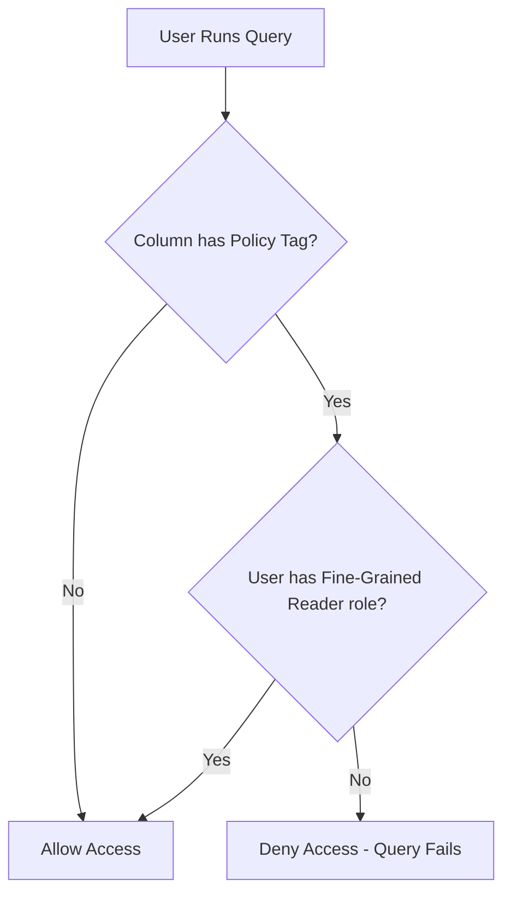

# How to Implement Column-Level Security with Data Catalog Policy Tags

Author: [nawazdhandala](https://www.github.com/nawazdhandala)

Tags: GCP, Data Catalog, Policy Tags, Column-Level Security, BigQuery

Description: Learn how to use Data Catalog policy tags to implement fine-grained column-level access control in BigQuery, restricting who can see sensitive columns like emails and SSNs.

---

Table-level access control is too coarse for many scenarios. Your analytics team needs access to the orders table, but they should not see the credit_card_number column. Your marketing team needs customer demographics, but they should not see social security numbers. Restricting access at the table level means either giving too much access or creating dozens of restricted views.

Data Catalog policy tags provide column-level security for BigQuery. You create a taxonomy of data classifications, assign policy tags to sensitive columns, and control which users can access data protected by each tag. When someone runs a query that includes a restricted column, BigQuery checks whether they have permission for that policy tag. If not, the query fails - even though they have access to the table itself.

## How Policy Tags Work

The architecture has three layers:

1. **Taxonomy**: A hierarchical classification system (like "Sensitive Data" with subcategories "PII", "Financial", "Health")
2. **Policy Tags**: Individual tags within the taxonomy that are applied to columns
3. **IAM Bindings**: Permissions that grant specific users access to columns with specific policy tags

When a user queries a BigQuery table, the query engine checks each column in the query against its policy tags and verifies the user has the `roles/datacatalog.categoryFineGrainedReader` role for those tags.



## Creating a Taxonomy

First, create a taxonomy that represents your data classification hierarchy:

```bash
# Create a taxonomy for sensitive data
gcloud data-catalog taxonomies create \
  --location=us \
  --display-name="Sensitive Data Classification" \
  --description="Classification hierarchy for column-level access control"
```

Note the taxonomy ID from the output. You will need it for creating policy tags.

In Terraform:

```hcl
# Taxonomy for data classification
resource "google_data_catalog_taxonomy" "sensitive_data" {
  provider     = google-beta
  display_name = "Sensitive Data Classification"
  description  = "Classification hierarchy for column-level access control"
  region       = "us"

  activated_policy_types = ["FINE_GRAINED_ACCESS_CONTROL"]
}
```

The `activated_policy_types` field is critical. Setting it to `FINE_GRAINED_ACCESS_CONTROL` enables the column-level security enforcement.

## Creating Policy Tags

Create policy tags within the taxonomy. You can organize them hierarchically:

```hcl
# Top-level policy tags
resource "google_data_catalog_policy_tag" "pii" {
  provider     = google-beta
  taxonomy     = google_data_catalog_taxonomy.sensitive_data.id
  display_name = "PII"
  description  = "Personally Identifiable Information"
}

resource "google_data_catalog_policy_tag" "financial" {
  provider     = google-beta
  taxonomy     = google_data_catalog_taxonomy.sensitive_data.id
  display_name = "Financial"
  description  = "Financial data including payment and billing information"
}

resource "google_data_catalog_policy_tag" "health" {
  provider     = google-beta
  taxonomy     = google_data_catalog_taxonomy.sensitive_data.id
  display_name = "Health"
  description  = "Protected health information (PHI)"
}

# Child policy tags under PII
resource "google_data_catalog_policy_tag" "email" {
  provider          = google-beta
  taxonomy          = google_data_catalog_taxonomy.sensitive_data.id
  display_name      = "Email Address"
  description       = "Personal email addresses"
  parent_policy_tag = google_data_catalog_policy_tag.pii.id
}

resource "google_data_catalog_policy_tag" "phone" {
  provider          = google-beta
  taxonomy          = google_data_catalog_taxonomy.sensitive_data.id
  display_name      = "Phone Number"
  description       = "Personal phone numbers"
  parent_policy_tag = google_data_catalog_policy_tag.pii.id
}

resource "google_data_catalog_policy_tag" "ssn" {
  provider          = google-beta
  taxonomy          = google_data_catalog_taxonomy.sensitive_data.id
  display_name      = "SSN"
  description       = "Social Security Numbers"
  parent_policy_tag = google_data_catalog_policy_tag.pii.id
}

# Child policy tags under Financial
resource "google_data_catalog_policy_tag" "credit_card" {
  provider          = google-beta
  taxonomy          = google_data_catalog_taxonomy.sensitive_data.id
  display_name      = "Credit Card"
  description       = "Credit card numbers and CVVs"
  parent_policy_tag = google_data_catalog_policy_tag.financial.id
}

resource "google_data_catalog_policy_tag" "bank_account" {
  provider          = google-beta
  taxonomy          = google_data_catalog_taxonomy.sensitive_data.id
  display_name      = "Bank Account"
  description       = "Bank account and routing numbers"
  parent_policy_tag = google_data_catalog_policy_tag.financial.id
}
```

## Applying Policy Tags to BigQuery Columns

Once you have policy tags, apply them to specific columns in your BigQuery tables:

```hcl
# BigQuery table with policy tags on sensitive columns
resource "google_bigquery_table" "customers" {
  dataset_id = "warehouse"
  table_id   = "customers"

  schema = jsonencode([
    {
      name = "customer_id"
      type = "STRING"
      mode = "REQUIRED"
      description = "Unique customer identifier"
    },
    {
      name = "first_name"
      type = "STRING"
      description = "Customer first name"
      policyTags = {
        names = [google_data_catalog_policy_tag.pii.id]
      }
    },
    {
      name = "last_name"
      type = "STRING"
      description = "Customer last name"
      policyTags = {
        names = [google_data_catalog_policy_tag.pii.id]
      }
    },
    {
      name = "email"
      type = "STRING"
      description = "Customer email address"
      policyTags = {
        names = [google_data_catalog_policy_tag.email.id]
      }
    },
    {
      name = "phone"
      type = "STRING"
      description = "Customer phone number"
      policyTags = {
        names = [google_data_catalog_policy_tag.phone.id]
      }
    },
    {
      name = "ssn"
      type = "STRING"
      description = "Social Security Number"
      policyTags = {
        names = [google_data_catalog_policy_tag.ssn.id]
      }
    },
    {
      name = "signup_date"
      type = "DATE"
      description = "Date the customer signed up"
    },
    {
      name = "plan_type"
      type = "STRING"
      description = "Subscription plan type"
    },
  ])
}
```

You can also apply policy tags using the bq CLI:

```bash
# Apply a policy tag to a column using bq update
bq update --schema '[
  {"name": "customer_id", "type": "STRING"},
  {"name": "email", "type": "STRING", "policyTags": {"names": ["projects/my-project/locations/us/taxonomies/123/policyTags/456"]}},
  {"name": "signup_date", "type": "DATE"}
]' my-project:warehouse.customers
```

Or using Python:

```python
# Apply policy tags to columns programmatically
from google.cloud import bigquery

client = bigquery.Client()

table = client.get_table("my-project.warehouse.customers")

# Update the email column with a policy tag
new_schema = []
for field in table.schema:
    if field.name == "email":
        # Add policy tag to the email column
        new_field = bigquery.SchemaField(
            name=field.name,
            field_type=field.field_type,
            mode=field.mode,
            description=field.description,
            policy_tags=bigquery.PolicyTagList(
                names=["projects/my-project/locations/us/taxonomies/123/policyTags/456"]
            ),
        )
        new_schema.append(new_field)
    else:
        new_schema.append(field)

table.schema = new_schema
client.update_table(table, ["schema"])
print("Policy tags applied")
```

## Granting Access to Protected Columns

Now control who can access the protected columns. Users need the `roles/datacatalog.categoryFineGrainedReader` role on the specific policy tag:

```hcl
# Grant the analytics team access to PII data (but not SSN or financial)
resource "google_data_catalog_policy_tag_iam_member" "analytics_pii" {
  provider   = google-beta
  policy_tag = google_data_catalog_policy_tag.pii.id
  role       = "roles/datacatalog.categoryFineGrainedReader"
  member     = "group:analytics-team@company.com"
}

# Grant the compliance team access to everything
resource "google_data_catalog_policy_tag_iam_member" "compliance_pii" {
  provider   = google-beta
  policy_tag = google_data_catalog_policy_tag.pii.id
  role       = "roles/datacatalog.categoryFineGrainedReader"
  member     = "group:compliance-team@company.com"
}

resource "google_data_catalog_policy_tag_iam_member" "compliance_financial" {
  provider   = google-beta
  policy_tag = google_data_catalog_policy_tag.financial.id
  role       = "roles/datacatalog.categoryFineGrainedReader"
  member     = "group:compliance-team@company.com"
}

resource "google_data_catalog_policy_tag_iam_member" "compliance_health" {
  provider   = google-beta
  policy_tag = google_data_catalog_policy_tag.health.id
  role       = "roles/datacatalog.categoryFineGrainedReader"
  member     = "group:compliance-team@company.com"
}

# Grant the billing team access to financial data only
resource "google_data_catalog_policy_tag_iam_member" "billing_financial" {
  provider   = google-beta
  policy_tag = google_data_catalog_policy_tag.financial.id
  role       = "roles/datacatalog.categoryFineGrainedReader"
  member     = "group:billing-team@company.com"
}
```

## What Happens When Access Is Denied

When a user without the right policy tag access tries to query a protected column, BigQuery returns an error:

```sql
-- User without PII access runs this query
SELECT customer_id, email, signup_date FROM warehouse.customers;

-- Error: Access Denied: BigQuery BigQuery: User does not have
-- permission to access policy tag
-- "projects/my-project/locations/us/taxonomies/123/policyTags/456"
-- on column "warehouse.customers.email".
```

The user can still query non-protected columns in the same table:

```sql
-- This works fine - no protected columns
SELECT customer_id, signup_date, plan_type FROM warehouse.customers;
```

## Hierarchical Tag Inheritance

Policy tags inherit permissions hierarchically. If you grant access to the parent "PII" tag, the user automatically gets access to all child tags (Email, Phone, SSN). If you only grant access to "Email", they can see emails but not phones or SSNs.

This makes permission management scalable:

```
Sensitive Data Classification (Taxonomy)
  PII                          --> Analytics team has access
    Email Address              --> (inherited from PII)
    Phone Number              --> (inherited from PII)
    SSN                       --> Only compliance team
  Financial                    --> Billing team has access
    Credit Card               --> (inherited from Financial)
    Bank Account              --> (inherited from Financial)
  Health                       --> Only health data team
```

For SSN specifically, you would remove the inheritance and grant access explicitly:

```hcl
# SSN requires explicit access, not inherited from PII parent
resource "google_data_catalog_policy_tag_iam_member" "compliance_ssn" {
  provider   = google-beta
  policy_tag = google_data_catalog_policy_tag.ssn.id
  role       = "roles/datacatalog.categoryFineGrainedReader"
  member     = "group:compliance-team@company.com"
}
```

## Data Masking with Policy Tags

In addition to access control, policy tags support data masking. Instead of blocking access entirely, you can show masked values:

```hcl
# Configure data masking rule for email addresses
resource "google_bigquery_datapolicy_data_policy" "mask_email" {
  provider       = google-beta
  location       = "us"
  data_policy_id = "mask_email_addresses"
  policy_tag     = google_data_catalog_policy_tag.email.id
  data_policy_type = "DATA_MASKING_POLICY"

  data_masking_policy {
    predefined_expression = "EMAIL_MASK"
  }
}
```

With masking, a user without fine-grained reader access sees:

```sql
SELECT email FROM warehouse.customers;
-- Result: j***@example.com, s***@company.org, ...
```

## Auditing Access

Track who is accessing protected columns using Cloud Audit Logs:

```bash
# Query audit logs for policy tag access checks
gcloud logging read '
  resource.type="bigquery_resource"
  AND protoPayload.methodName="google.cloud.bigquery.v2.JobService.InsertJob"
  AND protoPayload.authorizationInfo.permission="datacatalog.categories.fineGrainedGet"
' --limit=50 --format=json
```

## Best Practices

1. **Start with a simple taxonomy.** Three to five top-level categories covering PII, financial, and health data cover most organizations. Add specificity through child tags.

2. **Use hierarchy for permission management.** Grant broad access at parent tag level, restrict sensitive subcategories individually.

3. **Apply tags at the lowest necessary level.** Tag the email column, not the entire table. This lets users query non-sensitive columns freely.

4. **Manage everything in Terraform.** Policy tags, IAM bindings, and table schemas should all be version-controlled. Manual changes to access control are a governance risk.

5. **Combine with data masking.** For columns where partial access is acceptable (like showing masked emails), data masking is a better user experience than outright denial.

6. **Audit regularly.** Review who has access to which policy tags quarterly. Remove access that is no longer needed.

## Wrapping Up

Data Catalog policy tags bring true column-level security to BigQuery. Define your data classification taxonomy, apply policy tags to sensitive columns, and grant access through IAM. Users see only the columns they are authorized to access, while still being able to query the rest of the table. Combined with data masking for partial access and audit logging for compliance, policy tags give you the fine-grained control that table-level permissions cannot provide.
