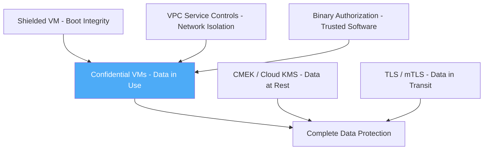

# How to Implement Confidential Computing with Confidential VMs for Sensitive Workloads

Author: [nawazdhandala](https://www.github.com/nawazdhandala)

Tags: GCP, Confidential Computing, Confidential VMs, Data Encryption, Cloud Security

Description: A practical guide to deploying Confidential VMs on Google Cloud to encrypt data in use and protect sensitive workloads from infrastructure-level threats.

---

Data encryption has three states: at rest, in transit, and in use. Google Cloud handles the first two by default - data is encrypted on disk and encrypted as it moves between services. But what about data while it is being processed in memory? That is where Confidential Computing comes in. Confidential VMs encrypt data in memory using hardware-based features built into AMD SEV (Secure Encrypted Virtualization) processors, ensuring that even the hypervisor cannot read your workload's memory.

This guide covers what Confidential VMs are, when to use them, and how to deploy and manage them in production.

## What Confidential VMs Protect Against

Standard VMs rely on the hypervisor for isolation between tenants. While Google's hypervisor is well-tested and hardened, some threat models require protection against potential hypervisor compromises. Confidential VMs address this by encrypting the VM's memory with a key that the hypervisor does not have access to.

This protects against:
- Hypervisor-level attacks or vulnerabilities
- Memory scraping by privileged system software
- Cold boot attacks on physical memory
- Insider threats at the infrastructure level

What Confidential VMs do not protect against:
- Vulnerabilities in your application code
- Operating system compromises within the VM
- Network-based attacks

Think of it as adding a hardware-enforced encryption layer around your VM's memory, separate from the software-based isolation the hypervisor provides.

## Creating a Confidential VM

Creating a Confidential VM is straightforward - it is a configuration option when launching an instance. The key requirement is using a machine type from the N2D or C2D family (which use AMD EPYC processors with SEV support).

This command creates a Confidential VM with AMD SEV encryption.

```bash
# Create a Confidential VM with AMD SEV memory encryption
gcloud compute instances create confidential-workload \
  --zone=us-central1-a \
  --machine-type=n2d-standard-4 \
  --confidential-compute \
  --maintenance-policy=TERMINATE \
  --image-family=ubuntu-2204-lts \
  --image-project=ubuntu-os-cloud \
  --boot-disk-size=100GB \
  --boot-disk-type=pd-ssd \
  --project=my-secure-project
```

A few things to note about this command:
- The `--confidential-compute` flag enables memory encryption
- The `--maintenance-policy=TERMINATE` is required because Confidential VMs cannot be live migrated
- N2D machine types use AMD EPYC processors that support SEV

## Verifying Confidential Computing is Active

After creating the instance, verify that memory encryption is actually running. SSH into the VM and check the kernel logs.

```bash
# SSH into the VM and verify SEV is active
gcloud compute ssh confidential-workload --zone=us-central1-a

# Check for AMD SEV messages in kernel log
dmesg | grep -i sev

# Expected output should include something like:
# AMD Memory Encryption Features active: SEV
```

You can also verify from outside the VM using the instance metadata.

```bash
# Check instance configuration for confidential computing
gcloud compute instances describe confidential-workload \
  --zone=us-central1-a \
  --format="yaml(confidentialInstanceConfig)"
```

## Confidential VMs with Terraform

For production deployments, Terraform is the preferred approach.

```hcl
# Confidential VM with all recommended security configurations
resource "google_compute_instance" "confidential" {
  name         = "confidential-workload"
  machine_type = "n2d-standard-8"
  zone         = "us-central1-a"
  project      = "my-secure-project"

  # Enable confidential computing (AMD SEV)
  confidential_instance_config {
    enable_confidential_compute = true
  }

  # Required: terminate on maintenance since live migration is not supported
  scheduling {
    on_host_maintenance = "TERMINATE"
    automatic_restart   = true
  }

  boot_disk {
    initialize_params {
      image = "ubuntu-os-cloud/ubuntu-2204-lts"
      size  = 100
      type  = "pd-ssd"
    }

    # Use CMEK for disk encryption on top of memory encryption
    kms_key_self_link = google_kms_crypto_key.vm_disk_key.id
  }

  network_interface {
    network    = google_compute_network.secure_net.id
    subnetwork = google_compute_subnetwork.secure_subnet.id

    # No external IP for security
  }

  # Shielded VM features complement Confidential Computing
  shielded_instance_config {
    enable_secure_boot          = true
    enable_vtpm                 = true
    enable_integrity_monitoring = true
  }

  service_account {
    email  = google_service_account.workload_sa.email
    scopes = ["cloud-platform"]
  }

  metadata = {
    enable-osconfig = "TRUE"
  }
}
```

## Combining Confidential VMs with Other Security Features

Confidential Computing is most effective as part of a defense-in-depth strategy. Here is how it fits with other Google Cloud security features.



### Shielded VM Features

Always enable Shielded VM features alongside Confidential Computing. Shielded VMs verify boot integrity, ensuring the VM has not been tampered with before the OS loads.

```bash
# Enable shielded VM features on a Confidential VM
gcloud compute instances update confidential-workload \
  --zone=us-central1-a \
  --shielded-secure-boot \
  --shielded-vtpm \
  --shielded-integrity-monitoring
```

### CMEK for Disk Encryption

While Confidential VMs encrypt memory, the boot and data disks should also use customer-managed keys.

```bash
# Attach a CMEK-encrypted disk to a Confidential VM
gcloud compute disks create encrypted-data-disk \
  --zone=us-central1-a \
  --size=500GB \
  --type=pd-ssd \
  --kms-key=projects/my-kms-project/locations/us-central1/keyRings/vm-keys/cryptoKeys/disk-key

gcloud compute instances attach-disk confidential-workload \
  --disk=encrypted-data-disk \
  --zone=us-central1-a
```

## Instance Templates for Auto-Scaling

For workloads that need auto-scaling, create an instance template with Confidential Computing enabled.

```bash
# Create an instance template for Confidential VM auto-scaling
gcloud compute instance-templates create confidential-template \
  --machine-type=n2d-standard-4 \
  --confidential-compute \
  --maintenance-policy=TERMINATE \
  --image-family=ubuntu-2204-lts \
  --image-project=ubuntu-os-cloud \
  --boot-disk-size=100GB \
  --boot-disk-type=pd-ssd \
  --shielded-secure-boot \
  --shielded-vtpm \
  --shielded-integrity-monitoring \
  --project=my-secure-project

# Create a managed instance group using the template
gcloud compute instance-groups managed create confidential-mig \
  --template=confidential-template \
  --size=3 \
  --zone=us-central1-a \
  --project=my-secure-project
```

## Monitoring Confidential VMs

Monitor the health and integrity of your Confidential VMs using Cloud Monitoring.

```bash
# Create an alert for Shielded VM integrity failures
# This catches boot tampering attempts on Confidential VMs
gcloud monitoring policies create \
  --display-name="Confidential VM Integrity Alert" \
  --condition-display-name="VM integrity validation failed" \
  --condition-filter='resource.type="gce_instance" AND metric.type="compute.googleapis.com/instance/integrity/late_boot_validation_status" AND metric.labels.status="FAILED"' \
  --condition-threshold-value=0 \
  --condition-threshold-comparison=COMPARISON_GT \
  --condition-threshold-duration=0s \
  --notification-channels=projects/my-secure-project/notificationChannels/CHANNEL_ID
```

You can also use the Security Command Center to monitor for Confidential VM-related findings.

## Performance Considerations

Confidential VMs introduce a small performance overhead due to memory encryption. In my testing, the overhead is typically 2-6% for most workloads, but it varies:

- **CPU-bound workloads** - minimal impact, usually under 2%
- **Memory-intensive workloads** - slightly higher overhead, around 3-6%
- **I/O-bound workloads** - negligible impact since the bottleneck is disk or network

The performance cost is generally acceptable for sensitive workloads where the security benefit justifies it. Run your own benchmarks with your actual workload to get accurate numbers.

## Use Cases

Confidential VMs are particularly valuable for:

1. **Healthcare data processing** - HIPAA workloads that need protection against infrastructure-level access
2. **Financial services** - processing payment or trading data with regulatory requirements for data-in-use protection
3. **Machine learning on sensitive data** - training models on PII or regulated data
4. **Multi-tenant platforms** - SaaS providers that need to demonstrate tenant data isolation
5. **Key management** - running custom key management or cryptographic operations

## Organization Policy Enforcement

To require Confidential Computing for all VMs in specific projects or folders, use organization policies.

```bash
# Require Confidential Computing for all VMs in a folder
gcloud resource-manager org-policies set-policy \
  --folder=FOLDER_ID \
  confidential-policy.yaml
```

```yaml
# confidential-policy.yaml
# Restrict VM creation to only Confidential VMs
constraint: constraints/compute.restrictNonConfidentialComputing
listPolicy:
  deniedValues:
    - compute.googleapis.com/Instance
```

This policy prevents the creation of non-Confidential VMs in the specified scope, ensuring all compute workloads meet the Confidential Computing requirement.

Confidential VMs are one of the most straightforward security features to adopt on Google Cloud. The deployment process is nearly identical to standard VMs, the performance overhead is modest, and the protection against infrastructure-level threats is substantial. For any workload handling sensitive data, the trade-off is well worth it.
