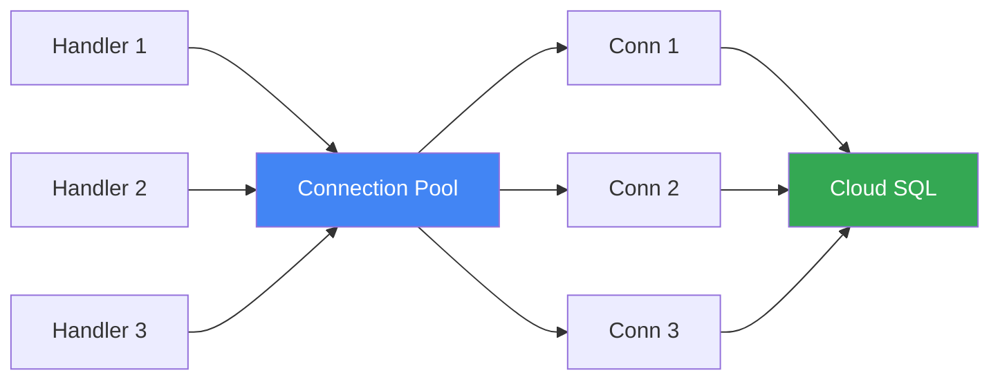

# How to Implement Connection Pooling for Cloud SQL in a Go Application Using the Cloud SQL Go Connector

Author: [nawazdhandala](https://www.github.com/nawazdhandala)

Tags: GCP, Cloud SQL, Go, Connection Pooling, Database, Google Cloud

Description: Implement efficient connection pooling for Cloud SQL in Go using the Cloud SQL Go Connector for secure, high-performance database access without the Auth Proxy.

---

If you have used Cloud SQL with Go, you have probably used the Cloud SQL Auth Proxy as a sidecar. It works, but it adds operational complexity - another container to manage, another thing to monitor, another thing that can fail. The Cloud SQL Go Connector takes a different approach by embedding the proxy logic directly into your application as a library.

This means your Go app connects to Cloud SQL without any sidecar, handles IAM authentication natively, and gives you full control over connection pooling. Let me show you how to set this up properly.

## Why Connection Pooling Matters

Cloud SQL connections are expensive to create. Each one involves a TLS handshake, authentication, and session setup. Without pooling, every database query opens a new connection and closes it when done. Under load, this crushes both your application and your database.

Connection pooling keeps a set of warm connections ready to go. When your code needs a database connection, it grabs one from the pool. When it is done, the connection goes back to the pool instead of being closed.



## Setting Up

Install the Cloud SQL Go Connector along with your database driver. I will use pgx for PostgreSQL, but the connector also supports MySQL.

```bash
go get cloud.google.com/go/cloudsqlconn
go get github.com/jackc/pgx/v5
go get github.com/jackc/pgx/v5/pgxpool
```

## Basic Connection Pool Setup

Here is the foundation - creating a connection pool that uses the Cloud SQL Go Connector.

```go
package main

import (
    "context"
    "fmt"
    "log"
    "net"
    "os"
    "time"

    "cloud.google.com/go/cloudsqlconn"
    "github.com/jackc/pgx/v5/pgxpool"
)

// DBConfig holds the database configuration
type DBConfig struct {
    InstanceConnectionName string
    User                   string
    Password               string
    Database               string
    // Pool settings
    MaxConns          int32
    MinConns          int32
    MaxConnLifetime   time.Duration
    MaxConnIdleTime   time.Duration
    HealthCheckPeriod time.Duration
}

// NewConnectionPool creates a pgxpool with the Cloud SQL Go Connector
func NewConnectionPool(ctx context.Context, cfg DBConfig) (*pgxpool.Pool, func(), error) {
    // Create the Cloud SQL dialer
    // This replaces the need for the Cloud SQL Auth Proxy sidecar
    dialer, err := cloudsqlconn.NewDialer(ctx,
        cloudsqlconn.WithDefaultDialOptions(cloudsqlconn.WithPrivateIP()),
    )
    if err != nil {
        return nil, nil, fmt.Errorf("failed to create dialer: %w", err)
    }

    // Build the connection string
    dsn := fmt.Sprintf("user=%s password=%s dbname=%s sslmode=disable",
        cfg.User, cfg.Password, cfg.Database)

    // Parse the connection pool config
    poolConfig, err := pgxpool.ParseConfig(dsn)
    if err != nil {
        return nil, nil, fmt.Errorf("failed to parse pool config: %w", err)
    }

    // Override the dial function to use the Cloud SQL connector
    poolConfig.ConnConfig.DialFunc = func(ctx context.Context, network, addr string) (net.Conn, error) {
        return dialer.Dial(ctx, cfg.InstanceConnectionName)
    }

    // Configure the pool
    poolConfig.MaxConns = cfg.MaxConns
    poolConfig.MinConns = cfg.MinConns
    poolConfig.MaxConnLifetime = cfg.MaxConnLifetime
    poolConfig.MaxConnIdleTime = cfg.MaxConnIdleTime
    poolConfig.HealthCheckPeriod = cfg.HealthCheckPeriod

    // Create the pool
    pool, err := pgxpool.NewWithConfig(ctx, poolConfig)
    if err != nil {
        return nil, nil, fmt.Errorf("failed to create pool: %w", err)
    }

    // Verify the connection
    if err := pool.Ping(ctx); err != nil {
        pool.Close()
        return nil, nil, fmt.Errorf("failed to ping database: %w", err)
    }

    // Return a cleanup function that closes both the pool and dialer
    cleanup := func() {
        pool.Close()
        dialer.Close()
    }

    log.Printf("Connection pool created: max=%d, min=%d", cfg.MaxConns, cfg.MinConns)
    return pool, cleanup, nil
}
```

## Choosing Pool Settings

Picking the right pool size depends on your Cloud SQL instance tier and workload. Here are some guidelines.

```go
// DefaultConfig returns a sensible default configuration
func DefaultConfig() DBConfig {
    return DBConfig{
        InstanceConnectionName: os.Getenv("INSTANCE_CONNECTION_NAME"),
        User:                   os.Getenv("DB_USER"),
        Password:               os.Getenv("DB_PASS"),
        Database:               os.Getenv("DB_NAME"),

        // Pool size should not exceed Cloud SQL's max connections
        // A db-f1-micro instance allows ~25 connections
        // A db-n1-standard-1 allows ~100 connections
        MaxConns: 10,
        MinConns: 2,

        // Connections should be recycled periodically to handle
        // things like IP changes or certificate rotations
        MaxConnLifetime: 30 * time.Minute,

        // Idle connections get closed after this duration
        MaxConnIdleTime: 5 * time.Minute,

        // Check idle connections are still alive
        HealthCheckPeriod: 1 * time.Minute,
    }
}
```

The critical setting is `MaxConns`. If you set this too high, you will exhaust the database's connection limit. Remember, if you have 5 Cloud Run instances each with `MaxConns=20`, that is 100 connections to your database. Cloud SQL's limits depend on your instance size.

## Using IAM Authentication

Instead of passwords, you can use IAM database authentication. This is more secure because credentials are short-lived and tied to the service account.

```go
// NewIAMConnectionPool creates a pool using IAM authentication instead of passwords
func NewIAMConnectionPool(ctx context.Context) (*pgxpool.Pool, func(), error) {
    // Create the dialer with IAM authentication enabled
    dialer, err := cloudsqlconn.NewDialer(ctx,
        cloudsqlconn.WithIAMAuthN(),
        cloudsqlconn.WithDefaultDialOptions(cloudsqlconn.WithPrivateIP()),
    )
    if err != nil {
        return nil, nil, fmt.Errorf("failed to create IAM dialer: %w", err)
    }

    instanceName := os.Getenv("INSTANCE_CONNECTION_NAME")
    dbUser := os.Getenv("DB_IAM_USER") // The IAM user, e.g., sa@project.iam

    // For IAM auth, the password field is left empty
    // The connector handles token generation
    dsn := fmt.Sprintf("user=%s dbname=%s sslmode=disable", dbUser, os.Getenv("DB_NAME"))

    poolConfig, err := pgxpool.ParseConfig(dsn)
    if err != nil {
        return nil, nil, err
    }

    poolConfig.ConnConfig.DialFunc = func(ctx context.Context, network, addr string) (net.Conn, error) {
        return dialer.Dial(ctx, instanceName)
    }

    poolConfig.MaxConns = 10
    poolConfig.MinConns = 2

    pool, err := pgxpool.NewWithConfig(ctx, poolConfig)
    if err != nil {
        return nil, nil, err
    }

    cleanup := func() {
        pool.Close()
        dialer.Close()
    }

    return pool, cleanup, nil
}
```

## Monitoring Pool Health

Keeping an eye on your connection pool is essential for catching problems before they affect users.

```go
// PoolStats returns current connection pool statistics
func PoolStats(pool *pgxpool.Pool) map[string]interface{} {
    stat := pool.Stat()
    return map[string]interface{}{
        // Current number of connections in the pool
        "total_connections":    stat.TotalConns(),
        // Connections currently in use
        "acquired_connections": stat.AcquiredConns(),
        // Connections sitting idle
        "idle_connections":     stat.IdleConns(),
        // Number of times a new connection was created
        "new_connections":      stat.NewConnsCount(),
        // Max connections configured
        "max_connections":      stat.MaxConns(),
        // Times we had to wait because no connections were available
        "empty_acquire_count": stat.EmptyAcquireCount(),
    }
}

// healthCheckHandler exposes pool stats for monitoring
func healthCheckHandler(pool *pgxpool.Pool) http.HandlerFunc {
    return func(w http.ResponseWriter, r *http.Request) {
        ctx, cancel := context.WithTimeout(r.Context(), 3*time.Second)
        defer cancel()

        // Check if we can actually query the database
        if err := pool.Ping(ctx); err != nil {
            w.WriteHeader(http.StatusServiceUnavailable)
            json.NewEncoder(w).Encode(map[string]string{
                "status": "unhealthy",
                "error":  err.Error(),
            })
            return
        }

        stats := PoolStats(pool)
        stats["status"] = "healthy"

        w.Header().Set("Content-Type", "application/json")
        json.NewEncoder(w).Encode(stats)
    }
}
```

## Handling Connection Errors

Database connections will eventually fail - network blips, maintenance windows, failovers. Your application needs to handle these gracefully.

```go
import (
    "errors"
    "github.com/jackc/pgx/v5/pgconn"
)

// executeWithRetry retries a database operation on transient failures
func executeWithRetry(ctx context.Context, pool *pgxpool.Pool, maxRetries int, fn func(ctx context.Context) error) error {
    var lastErr error

    for attempt := 0; attempt <= maxRetries; attempt++ {
        err := fn(ctx)
        if err == nil {
            return nil
        }

        lastErr = err

        // Check if the error is retryable
        if !isRetryableError(err) {
            return err
        }

        // Wait before retrying with exponential backoff
        backoff := time.Duration(attempt+1) * 100 * time.Millisecond
        log.Printf("Retryable error (attempt %d/%d): %v, retrying in %v",
            attempt+1, maxRetries, err, backoff)

        select {
        case <-time.After(backoff):
        case <-ctx.Done():
            return ctx.Err()
        }
    }

    return fmt.Errorf("max retries exceeded: %w", lastErr)
}

// isRetryableError checks if a database error is worth retrying
func isRetryableError(err error) bool {
    var pgErr *pgconn.PgError
    if errors.As(err, &pgErr) {
        // 40001: serialization failure (retry-safe)
        // 40P01: deadlock detected
        switch pgErr.Code {
        case "40001", "40P01":
            return true
        }
    }

    // Connection-level errors are retryable since the pool
    // will create a new connection
    if errors.Is(err, context.DeadlineExceeded) {
        return false
    }

    return false
}
```

## Putting It Together

```go
func main() {
    ctx := context.Background()

    cfg := DefaultConfig()
    pool, cleanup, err := NewConnectionPool(ctx, cfg)
    if err != nil {
        log.Fatalf("Failed to create connection pool: %v", err)
    }
    defer cleanup()

    mux := http.NewServeMux()
    mux.HandleFunc("/health", healthCheckHandler(pool))
    mux.HandleFunc("/api/users", usersHandler(pool))

    port := os.Getenv("PORT")
    if port == "" {
        port = "8080"
    }

    log.Printf("Server starting on port %s", port)
    log.Fatal(http.ListenAndServe(":"+port, mux))
}
```

## Wrapping Up

The Cloud SQL Go Connector eliminates the need for the Auth Proxy sidecar while giving you direct control over connection pooling. The key is to size your pool correctly for your database tier, use health checks to catch connection issues early, and implement retry logic for transient failures. With IAM authentication, you also get stronger security without managing passwords.

For monitoring your database connections and pool health in production, OneUptime can help you track connection utilization, detect pool exhaustion, and alert on database connectivity issues before they affect your users.
