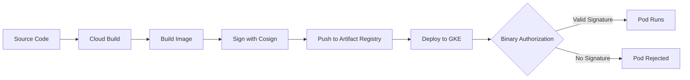

# How to Implement Container Image Signing with Cosign and Binary Authorization for GKE Deployments

Author: [nawazdhandala](https://www.github.com/nawazdhandala)

Tags: GCP, Cosign, Binary Authorization, GKE, Security, Container, Supply Chain

Description: Learn how to sign container images with Cosign and enforce image verification on GKE using Binary Authorization to secure your software supply chain.

---

Software supply chain attacks are a real threat. An attacker who compromises your CI/CD pipeline can inject malicious code into your container images, and those images get deployed to production without anyone noticing. Container image signing addresses this by creating a cryptographic attestation that an image was built by a trusted process.

Google Cloud's Binary Authorization takes this further. It acts as a gatekeeper on your GKE cluster, refusing to run any container image that does not have a valid signature. Together, Cosign (for signing) and Binary Authorization (for enforcement) create a chain of trust from your build pipeline to your production cluster.

## How the Flow Works

The process looks like this:

1. Cloud Build builds your container image
2. Cosign signs the image with a cryptographic key
3. The signature is stored alongside the image in Artifact Registry
4. When you deploy to GKE, Binary Authorization checks for a valid signature
5. If the signature is valid, the pod runs. If not, it is rejected.



## Setting Up the Key Pair

Cosign uses key pairs for signing. You can store the keys in Google Cloud KMS for secure key management.

```bash
# Create a KMS keyring and key for image signing
gcloud kms keyrings create image-signing \
    --location=global

gcloud kms keys create cosign-key \
    --keyring=image-signing \
    --location=global \
    --purpose=asymmetric-signing \
    --default-algorithm=ec-sign-p256-sha256
```

## Installing Cosign

```bash
# Install cosign on macOS
brew install cosign

# Or on Linux
curl -sSL https://github.com/sigstore/cosign/releases/latest/download/cosign-linux-amd64 -o /usr/local/bin/cosign
chmod +x /usr/local/bin/cosign
```

## Signing an Image

First, build and push your image.

```bash
# Build and push the image
docker build -t us-central1-docker.pkg.dev/my-project/my-repo/my-app:v1 .
docker push us-central1-docker.pkg.dev/my-project/my-repo/my-app:v1
```

Now sign it using the KMS key.

```bash
# Sign the image using the KMS key
cosign sign \
    --key gcpkms://projects/my-project/locations/global/keyRings/image-signing/cryptoKeys/cosign-key \
    us-central1-docker.pkg.dev/my-project/my-repo/my-app:v1
```

Cosign uploads the signature as an OCI artifact alongside your image in Artifact Registry.

## Verifying a Signature

Anyone with access to the public key can verify the signature.

```bash
# Verify the image signature
cosign verify \
    --key gcpkms://projects/my-project/locations/global/keyRings/image-signing/cryptoKeys/cosign-key \
    us-central1-docker.pkg.dev/my-project/my-repo/my-app:v1
```

## Setting Up Binary Authorization

Enable the Binary Authorization API and configure a policy.

```bash
# Enable the required APIs
gcloud services enable binaryauthorization.googleapis.com
gcloud services enable containeranalysis.googleapis.com
gcloud services enable container.googleapis.com
```

Create an attestor. An attestor is an entity that can vouch for an image.

```bash
# Create a note for the attestor
cat > /tmp/note.json << 'EOF'
{
  "attestation": {
    "hint": {
      "humanReadableName": "Build Attestor"
    }
  }
}
EOF

# Create the note in Container Analysis
curl -X POST \
    -H "Authorization: Bearer $(gcloud auth print-access-token)" \
    -H "Content-Type: application/json" \
    --data-binary @/tmp/note.json \
    "https://containeranalysis.googleapis.com/v1/projects/my-project/notes/build-attestor"

# Create the attestor
gcloud container binauthz attestors create build-attestor \
    --attestation-authority-note=build-attestor \
    --attestation-authority-note-project=my-project

# Add the KMS key to the attestor
gcloud container binauthz attestors public-keys add \
    --attestor=build-attestor \
    --keyversion-project=my-project \
    --keyversion-location=global \
    --keyversion-keyring=image-signing \
    --keyversion-key=cosign-key \
    --keyversion=1
```

## Configuring the Binary Authorization Policy

Create a policy that requires attestation for all images.

```yaml
# policy.yaml - Binary Authorization policy
defaultAdmissionRule:
  evaluationMode: REQUIRE_ATTESTATION
  enforcementMode: ENFORCED_BLOCK_AND_AUDIT_LOG
  requireAttestationsBy:
    - projects/my-project/attestors/build-attestor
# Allow GKE system images without attestation
globalPolicyEvaluationMode: ENABLE
# Exempt specific image patterns (like system images)
admissionWhitelistPatterns:
  - namePattern: 'gcr.io/google_containers/*'
  - namePattern: 'gcr.io/gke-release/*'
  - namePattern: 'k8s.gcr.io/*'
```

Apply the policy.

```bash
# Import the policy
gcloud container binauthz policy import policy.yaml
```

## Enabling Binary Authorization on GKE

Create a new cluster with Binary Authorization enabled, or update an existing one.

```bash
# Create a new GKE cluster with Binary Authorization
gcloud container clusters create secure-cluster \
    --region=us-central1 \
    --binauthz-evaluation-mode=PROJECT_SINGLETON_POLICY_ENFORCE

# Or enable on an existing cluster
gcloud container clusters update my-cluster \
    --region=us-central1 \
    --binauthz-evaluation-mode=PROJECT_SINGLETON_POLICY_ENFORCE
```

## Integrating Signing into Cloud Build

Here is a Cloud Build configuration that builds, signs, and creates an attestation.

```yaml
# cloudbuild.yaml - Build, sign, and attest
steps:
  # Build the Docker image
  - name: 'gcr.io/cloud-builders/docker'
    id: 'build'
    args:
      - 'build'
      - '-t'
      - 'us-central1-docker.pkg.dev/$PROJECT_ID/my-repo/my-app:$SHORT_SHA'
      - '.'

  # Push the image
  - name: 'gcr.io/cloud-builders/docker'
    id: 'push'
    args:
      - 'push'
      - 'us-central1-docker.pkg.dev/$PROJECT_ID/my-repo/my-app:$SHORT_SHA'

  # Get the image digest for signing
  - name: 'gcr.io/cloud-builders/docker'
    id: 'get-digest'
    entrypoint: 'bash'
    args:
      - '-c'
      - |
        # Get the full image digest
        docker inspect --format='{{index .RepoDigests 0}}' \
          us-central1-docker.pkg.dev/$PROJECT_ID/my-repo/my-app:$SHORT_SHA \
          > /workspace/image-digest.txt
        cat /workspace/image-digest.txt

  # Sign the image with Cosign
  - name: 'gcr.io/projectsigstore/cosign'
    id: 'sign'
    entrypoint: 'sh'
    args:
      - '-c'
      - |
        # Sign the image using the KMS key
        cosign sign \
          --key gcpkms://projects/$PROJECT_ID/locations/global/keyRings/image-signing/cryptoKeys/cosign-key \
          --yes \
          $(cat /workspace/image-digest.txt)

  # Create a Binary Authorization attestation
  - name: 'gcr.io/google.com/cloudsdktool/cloud-sdk'
    id: 'attest'
    entrypoint: 'bash'
    args:
      - '-c'
      - |
        # Create the attestation for Binary Authorization
        gcloud container binauthz attestations sign-and-create \
          --artifact-url=$(cat /workspace/image-digest.txt) \
          --attestor=build-attestor \
          --attestor-project=$PROJECT_ID \
          --keyversion-project=$PROJECT_ID \
          --keyversion-location=global \
          --keyversion-keyring=image-signing \
          --keyversion-key=cosign-key \
          --keyversion=1

images:
  - 'us-central1-docker.pkg.dev/$PROJECT_ID/my-repo/my-app:$SHORT_SHA'
```

## Testing the Setup

Deploy a signed image - this should succeed.

```bash
# Deploy the signed image
kubectl create deployment my-app \
    --image=us-central1-docker.pkg.dev/my-project/my-repo/my-app:v1
```

Try deploying an unsigned image - this should be blocked.

```bash
# This should be rejected by Binary Authorization
kubectl create deployment unsigned-app \
    --image=us-central1-docker.pkg.dev/my-project/my-repo/unsigned-app:v1

# Check the events for the rejection
kubectl get events --field-selector reason=FailedCreate
```

You should see an event message indicating the image was denied by Binary Authorization.

## Monitoring and Auditing

Binary Authorization logs all admission decisions. Query them with Cloud Logging.

```bash
# View Binary Authorization audit logs
gcloud logging read \
    'resource.type="k8s_cluster" AND protoPayload.serviceName="binaryauthorization.googleapis.com"' \
    --limit=20 \
    --format='table(timestamp, protoPayload.status.code, protoPayload.status.message)'
```

## Wrapping Up

Container image signing with Cosign and Binary Authorization creates a strong verification chain for your GKE deployments. Every image must be signed by your build pipeline before GKE allows it to run. This prevents unauthorized images, whether from supply chain attacks, compromised registries, or accidental deployments of untested code, from reaching production. The Cloud Build integration makes signing automatic, so it adds security without adding friction to your deployment process.
