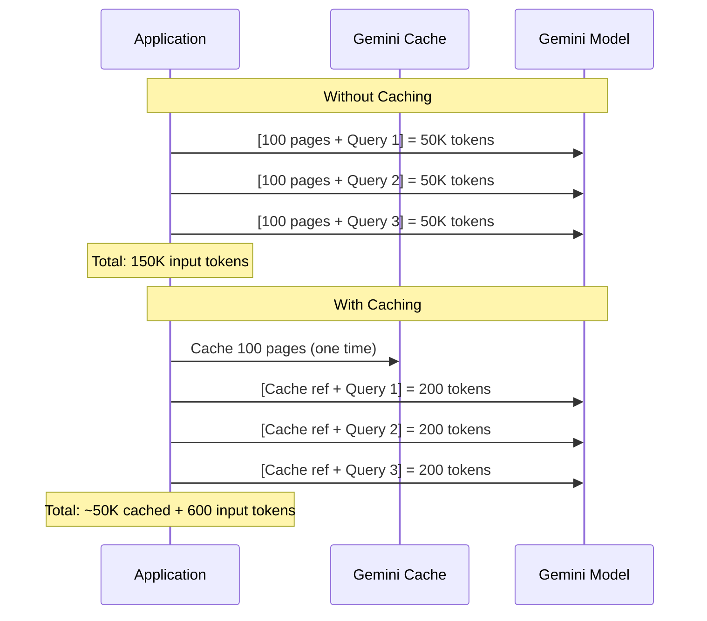

# How to Implement Context Caching with Gemini on Vertex AI to Reduce Token Costs

Author: [nawazdhandala](https://www.github.com/nawazdhandala)

Tags: GCP, Vertex AI, Gemini, Context Caching, Cost Optimization

Description: Learn how to use context caching with Gemini on Vertex AI to dramatically reduce token costs when repeatedly querying against the same large context.

---

Every time you send a large document, codebase, or conversation history to Gemini, you pay for all those input tokens. If you are asking multiple questions about the same 100-page document, you are paying to send those 100 pages with every single request. Context caching fixes this by letting you store the context once and reference it in subsequent requests, paying only for the cached storage and your new query tokens.

For applications like document Q&A, code analysis, or customer support over long conversation histories, context caching can reduce costs by 50-90% depending on the ratio of context size to query size.

## How Context Caching Works

Without caching, every request includes the full context plus the query. With caching, you upload the context once to create a cache, then each subsequent request only includes the query and a reference to the cached context.



## Creating a Cached Context

Start by uploading your context to create a cache. The context can be text, code, or any content that Gemini accepts.

This code creates a cached context from a large document:

```python
import vertexai
from vertexai.generative_models import GenerativeModel, Part
from vertexai.preview import caching

# Initialize Vertex AI
vertexai.init(project="your-project-id", location="us-central1")

# Create the cached content from a large document
# The document is stored in GCS
cached_content = caching.CachedContent.create(
    model_name="gemini-1.5-pro-002",
    system_instruction="You are a technical documentation expert. Answer questions based only on the provided documentation. If the answer is not in the documentation, say so.",
    contents=[
        Part.from_uri(
            "gs://your-bucket/documents/product-documentation.pdf",
            mime_type="application/pdf"
        )
    ],
    ttl="3600s",  # Cache expires after 1 hour
    display_name="product-docs-cache"
)

print(f"Cache created: {cached_content.name}")
print(f"Expires at: {cached_content.expire_time}")
print(f"Token count: {cached_content.usage_metadata.total_token_count}")
```

## Querying Against the Cached Context

Once the cache exists, create a model instance that references it and send queries without resending the full context.

This code queries the cached context:

```python
from vertexai.generative_models import GenerativeModel

# Create a model instance that uses the cached context
model = GenerativeModel.from_cached_content(cached_content=cached_content)

# Query 1 - only the query tokens are billed as new input
response1 = model.generate_content("What are the system requirements for installation?")
print(f"Query 1: {response1.text}")

# Query 2 - same cached context, different question
response2 = model.generate_content("How do I configure SSL certificates?")
print(f"Query 2: {response2.text}")

# Query 3
response3 = model.generate_content("What are the known limitations of the API?")
print(f"Query 3: {response3.text}")

# Check usage - most tokens come from cache, not new input
print(f"\nUsage for query 3:")
print(f"  Cached tokens: {response3.usage_metadata.cached_content_token_count}")
print(f"  Prompt tokens: {response3.usage_metadata.prompt_token_count}")
print(f"  Response tokens: {response3.usage_metadata.candidates_token_count}")
```

## Caching Multiple Documents

You can cache multiple documents together, which is useful for analyzing a collection of related files.

This code caches a set of source code files:

```python
from vertexai.preview import caching
from vertexai.generative_models import Part

# Cache an entire codebase for analysis
cached_code = caching.CachedContent.create(
    model_name="gemini-1.5-pro-002",
    system_instruction=(
        "You are a senior software engineer reviewing this codebase. "
        "Answer questions about the code architecture, potential bugs, "
        "and improvement opportunities."
    ),
    contents=[
        Part.from_uri("gs://your-bucket/code/main.py", mime_type="text/x-python"),
        Part.from_uri("gs://your-bucket/code/models.py", mime_type="text/x-python"),
        Part.from_uri("gs://your-bucket/code/api.py", mime_type="text/x-python"),
        Part.from_uri("gs://your-bucket/code/database.py", mime_type="text/x-python"),
        Part.from_uri("gs://your-bucket/code/auth.py", mime_type="text/x-python"),
        Part.from_uri("gs://your-bucket/code/utils.py", mime_type="text/x-python"),
        Part.from_uri("gs://your-bucket/code/tests/test_api.py", mime_type="text/x-python"),
        Part.from_uri("gs://your-bucket/code/tests/test_models.py", mime_type="text/x-python"),
    ],
    ttl="7200s",  # 2 hour TTL for a longer code review session
    display_name="codebase-review-cache"
)

# Now ask multiple questions about the codebase cheaply
model = GenerativeModel.from_cached_content(cached_content=cached_code)

# Architecture overview
response = model.generate_content("Describe the overall architecture of this application.")
print(response.text)

# Security review
response = model.generate_content("Are there any security vulnerabilities in the authentication code?")
print(response.text)

# Performance review
response = model.generate_content("What are the potential performance bottlenecks in the database layer?")
print(response.text)
```

## Managing Cache Lifecycle

Caches have a TTL (time to live) after which they are automatically deleted. You can also manage them manually.

This code manages cache lifecycle:

```python
from vertexai.preview import caching

# List all active caches
caches = caching.CachedContent.list()
for cache in caches:
    print(f"Cache: {cache.display_name}")
    print(f"  Name: {cache.name}")
    print(f"  Expires: {cache.expire_time}")
    print(f"  Tokens: {cache.usage_metadata.total_token_count}")
    print()

# Update the TTL of an existing cache
cached_content.update(ttl="7200s")  # Extend to 2 hours
print(f"Updated expiry: {cached_content.expire_time}")

# Or set a specific expiration time
from datetime import datetime, timedelta, timezone

new_expire = datetime.now(timezone.utc) + timedelta(hours=4)
cached_content.update(expire_time=new_expire)

# Delete a cache when you are done
cached_content.delete()
print("Cache deleted")
```

## Building a Cost-Efficient Q&A Service

Here is a practical example of a document Q&A service that uses context caching to minimize costs.

This code implements a cached Q&A service:

```python
# qa_service.py - Document Q&A with context caching

import vertexai
from vertexai.preview import caching
from vertexai.generative_models import GenerativeModel, Part
from datetime import datetime, timezone

class CachedQAService:
    """Q&A service that uses context caching for cost efficiency."""

    def __init__(self, project_id, location="us-central1"):
        vertexai.init(project=project_id, location=location)
        self._caches = {}  # document_id -> (cache, model, expire_time)

    def _get_or_create_cache(self, document_id, document_uri, mime_type):
        """Get existing cache or create a new one for the document."""
        # Check if we have a valid cache
        if document_id in self._caches:
            cache, model, expire_time = self._caches[document_id]
            if datetime.now(timezone.utc) < expire_time:
                return model  # Cache is still valid

            # Cache expired, clean up
            try:
                cache.delete()
            except Exception:
                pass

        # Create a new cache
        cache = caching.CachedContent.create(
            model_name="gemini-1.5-flash-002",  # Flash is cheaper for Q&A
            system_instruction=(
                "Answer questions based strictly on the provided document. "
                "Be concise and cite relevant sections when possible. "
                "If the information is not in the document, clearly state that."
            ),
            contents=[
                Part.from_uri(document_uri, mime_type=mime_type)
            ],
            ttl="3600s",  # 1 hour
            display_name=f"qa-cache-{document_id}"
        )

        model = GenerativeModel.from_cached_content(cached_content=cache)
        self._caches[document_id] = (cache, model, cache.expire_time)

        return model

    def ask(self, document_id, document_uri, mime_type, question):
        """Ask a question about a document."""
        model = self._get_or_create_cache(document_id, document_uri, mime_type)
        response = model.generate_content(question)

        return {
            "answer": response.text,
            "cached_tokens": response.usage_metadata.cached_content_token_count,
            "new_input_tokens": response.usage_metadata.prompt_token_count,
            "output_tokens": response.usage_metadata.candidates_token_count
        }

    def cleanup(self):
        """Delete all active caches."""
        for document_id, (cache, _, _) in self._caches.items():
            try:
                cache.delete()
                print(f"Deleted cache for {document_id}")
            except Exception as e:
                print(f"Error deleting cache for {document_id}: {e}")
        self._caches.clear()

# Usage
service = CachedQAService("your-project-id")

# First question creates the cache
result = service.ask(
    document_id="annual-report-2025",
    document_uri="gs://your-bucket/reports/annual-2025.pdf",
    mime_type="application/pdf",
    question="What was the total revenue for 2025?"
)
print(f"Answer: {result['answer']}")
print(f"Cached tokens: {result['cached_tokens']}")
print(f"New tokens: {result['new_input_tokens']}")

# Subsequent questions reuse the cache
result = service.ask(
    document_id="annual-report-2025",
    document_uri="gs://your-bucket/reports/annual-2025.pdf",
    mime_type="application/pdf",
    question="What were the main risk factors mentioned?"
)
print(f"Answer: {result['answer']}")
```

## Cost Comparison

Let us calculate the actual savings for a realistic scenario. Say you have a 200-page document (roughly 100,000 tokens) and you ask 20 questions about it.

Without caching:
```
20 requests x 100,000 input tokens = 2,000,000 input tokens
At $0.00125 per 1K tokens (Gemini 1.5 Pro) = $2.50
```

With caching:
```
1 cache creation: 100,000 tokens stored
20 requests x ~200 query tokens = 4,000 new input tokens
Cache storage: 100,000 tokens x 1 hour x $0.000315/1K/hr = $0.0315
New input tokens: 4,000 x $0.00125/1K = $0.005
Total: ~$0.04
```

That is a 98% cost reduction for 20 questions against the same document. The savings increase with more questions and larger documents.

## When Context Caching Makes Sense

Context caching is most valuable when you have a large, static context that you query multiple times. Good use cases include document Q&A systems, code review tools, customer support with long product manuals, and multi-turn conversations with extensive system prompts.

It is less useful for one-off queries against unique contexts, or when the context changes frequently. Creating and storing a cache has its own cost, so you need at least a few queries against the same context to break even.

The minimum cache size is 32,768 tokens. If your context is smaller than that, the overhead of caching is not worth it - just send the full context with each request.

Context caching with Gemini on Vertex AI is one of the most impactful cost optimization techniques for LLM-powered applications. The implementation is straightforward, and the savings are dramatic for the right use cases.
