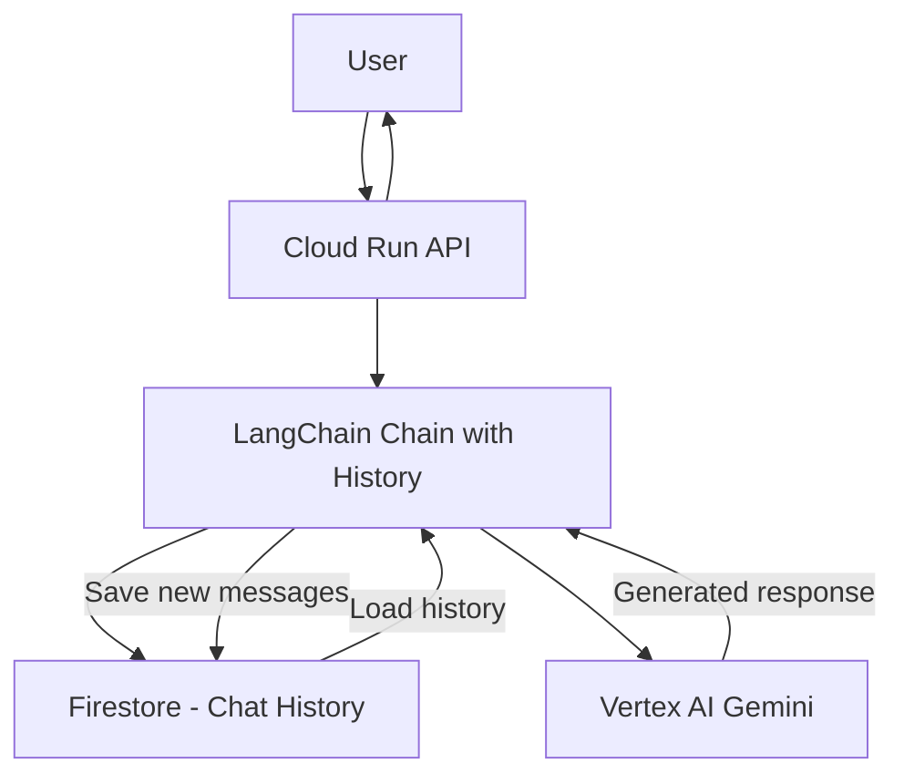

# How to Implement Conversation Memory with LangChain and Firestore on GCP

Author: [nawazdhandala](https://www.github.com/nawazdhandala)

Tags: GCP, LangChain, Firestore, Conversation Memory, Chatbot

Description: Learn how to persist conversation memory using LangChain and Google Cloud Firestore for building stateful chatbots and AI assistants on GCP.

---

Chatbots and AI assistants need memory to have meaningful conversations. Without it, every message is treated as the start of a new conversation, and the user has to repeat context constantly. LangChain provides several memory implementations, but for production applications on GCP, you need persistent storage that survives restarts and scales across instances. Firestore is a natural fit for this - it is serverless, fast, and integrates well with the rest of the Google Cloud ecosystem.

This guide shows how to implement persistent conversation memory using LangChain and Firestore, from basic setup through advanced patterns.

## Why Firestore for Conversation Memory

Firestore offers several properties that make it well-suited for storing chat history:

- **Low latency reads and writes** - Conversations need snappy responses
- **Serverless and auto-scaling** - No capacity planning needed
- **Real-time listeners** - Useful if you want to stream updates to a UI
- **Structured document model** - Chat histories map naturally to documents and subcollections
- **Strong consistency** - No stale reads when loading conversation history

## Prerequisites

- Google Cloud project with Firestore API enabled
- A Firestore database (Native mode)
- Python 3.9+

```bash
# Install required packages
pip install langchain langchain-google-firestore langchain-google-vertexai google-cloud-firestore
```

## Basic Setup

### Creating the Firestore Chat History Store

LangChain provides `FirestoreChatMessageHistory` that implements the standard chat message history interface backed by Firestore.

```python
from langchain_google_firestore import FirestoreChatMessageHistory
from google.cloud import firestore

# Initialize the Firestore client
client = firestore.Client(project="your-project-id")

# Create a chat history store for a specific session
# Each session gets its own document in Firestore
chat_history = FirestoreChatMessageHistory(
    session_id="user-123-session-001",  # Unique identifier for this conversation
    collection="chat_sessions",          # Firestore collection name
    client=client,
)

# Add messages to the history
chat_history.add_user_message("What is Cloud Run?")
chat_history.add_ai_message("Cloud Run is a managed compute platform on Google Cloud that lets you run containers directly on top of Google's scalable infrastructure.")

# Retrieve the conversation history
for message in chat_history.messages:
    print(f"{message.type}: {message.content}")
```

### How It Looks in Firestore

The data structure in Firestore looks like this:

```
chat_sessions/
  user-123-session-001/
    messages/
      0: {type: "human", content: "What is Cloud Run?", timestamp: ...}
      1: {type: "ai", content: "Cloud Run is a managed...", timestamp: ...}
```

## Integrating with a Chat Model

Now let us wire the Firestore-backed history into an actual chat application using Gemini.

```python
from langchain_google_vertexai import ChatVertexAI
from langchain_google_firestore import FirestoreChatMessageHistory
from langchain_core.prompts import ChatPromptTemplate, MessagesPlaceholder
from langchain_core.runnables.history import RunnableWithMessageHistory
from google.cloud import firestore

# Initialize the Gemini model
llm = ChatVertexAI(
    model_name="gemini-1.5-pro",
    project="your-project-id",
    location="us-central1",
    temperature=0.7,
)

# Define the prompt with a placeholder for chat history
prompt = ChatPromptTemplate.from_messages([
    ("system", "You are a helpful GCP expert assistant. Be concise and practical in your answers."),
    MessagesPlaceholder(variable_name="history"),
    ("human", "{input}"),
])

# Create the base chain
chain = prompt | llm

# Initialize Firestore client
fs_client = firestore.Client(project="your-project-id")

def get_session_history(session_id: str):
    """Factory function that creates a Firestore-backed history for each session."""
    return FirestoreChatMessageHistory(
        session_id=session_id,
        collection="chat_sessions",
        client=fs_client,
    )

# Wrap the chain with message history
chain_with_history = RunnableWithMessageHistory(
    chain,
    get_session_history,
    input_messages_key="input",
    history_messages_key="history",
)
```

## Using the Conversational Chain

```python
# First message in a new conversation
response1 = chain_with_history.invoke(
    {"input": "What are the main differences between Cloud Run and GKE?"},
    config={"configurable": {"session_id": "user-456-session-001"}},
)
print(f"Assistant: {response1.content}")

# Follow-up message - the model remembers the previous context
response2 = chain_with_history.invoke(
    {"input": "Which one would you recommend for a small team with limited Kubernetes experience?"},
    config={"configurable": {"session_id": "user-456-session-001"}},
)
print(f"Assistant: {response2.content}")

# The assistant knows we were discussing Cloud Run vs GKE
# because the conversation history was loaded from Firestore
```

## Managing Conversation Sessions

### Listing Active Sessions

```python
from google.cloud import firestore

def list_active_sessions(user_id: str, client: firestore.Client) -> list:
    """List all chat sessions for a given user."""
    # Query sessions that belong to this user
    sessions = client.collection("chat_sessions").where(
        "user_id", "==", user_id
    ).order_by("last_updated", direction=firestore.Query.DESCENDING).stream()

    return [
        {"session_id": doc.id, "data": doc.to_dict()}
        for doc in sessions
    ]
```

### Clearing a Session

```python
def clear_session(session_id: str, client: firestore.Client):
    """Clear the chat history for a specific session."""
    history = FirestoreChatMessageHistory(
        session_id=session_id,
        collection="chat_sessions",
        client=client,
    )
    history.clear()
    print(f"Cleared session {session_id}")
```

## Trimming Long Conversations

Long conversations eat tokens and increase costs. Implement a sliding window to keep only the most recent messages.

```python
from langchain_core.messages import trim_messages

def get_trimmed_session_history(session_id: str):
    """Get session history with a maximum message window."""
    history = FirestoreChatMessageHistory(
        session_id=session_id,
        collection="chat_sessions",
        client=fs_client,
    )
    return history

# Use trim_messages to limit the context window
trimmer = trim_messages(
    max_tokens=4000,          # Maximum tokens to keep in history
    strategy="last",          # Keep the most recent messages
    token_counter=llm,        # Use the model to count tokens
    include_system=True,      # Always include the system message
    start_on="human",         # Start the window on a human message
)

# Build the chain with trimming
trimmed_prompt = ChatPromptTemplate.from_messages([
    ("system", "You are a helpful GCP expert assistant."),
    MessagesPlaceholder(variable_name="history"),
    ("human", "{input}"),
])

trimmed_chain = trimmed_prompt | llm
```

## Adding Metadata to Sessions

Store additional context alongside the conversation for better session management.

```python
from datetime import datetime

def create_session_with_metadata(
    user_id: str,
    session_id: str,
    client: firestore.Client,
    topic: str = None,
):
    """Create a new chat session with metadata."""
    # Store session metadata in the parent document
    session_ref = client.collection("chat_sessions").document(session_id)
    session_ref.set({
        "user_id": user_id,
        "created_at": datetime.utcnow(),
        "last_updated": datetime.utcnow(),
        "topic": topic or "General",
        "message_count": 0,
    })

    # Return the chat history object for this session
    return FirestoreChatMessageHistory(
        session_id=session_id,
        collection="chat_sessions",
        client=client,
    )
```

## Production Architecture

Here is how the components fit together in a production deployment:



## Security Considerations

Make sure your Firestore security rules prevent users from accessing each others conversations. If you are using Firestore in a backend service, the service account needs the `roles/datastore.user` role. For client-side access, set up proper security rules.

```javascript
// Firestore security rules for chat sessions
rules_version = '2';
service cloud.firestore {
  match /databases/{database}/documents {
    match /chat_sessions/{sessionId} {
      // Only allow access if the user_id matches the authenticated user
      allow read, write: if request.auth != null
        && resource.data.user_id == request.auth.uid;
    }
  }
}
```

## Summary

Firestore provides a solid foundation for persisting LangChain conversation memory on GCP. The integration is straightforward, the serverless scaling handles traffic spikes without intervention, and the low-latency reads keep your chatbot feeling responsive. Start with the basic `FirestoreChatMessageHistory`, add session management and trimming as your application matures, and use Firestore security rules to keep conversations private. This approach works well for chatbots, customer support agents, and any multi-turn AI application.
