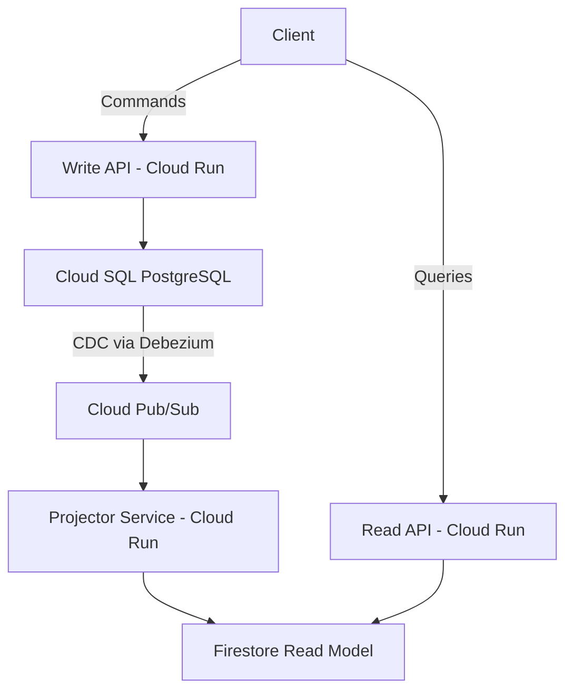

# How to Implement CQRS on Google Cloud Using Firestore for Reads and Cloud SQL for Writes

Author: [nawazdhandala](https://www.github.com/nawazdhandala)

Tags: GCP, CQRS, Firestore, Cloud SQL, Microservices, Architecture Patterns

Description: Step-by-step guide to implementing the CQRS pattern on Google Cloud, using Cloud SQL for write operations and Firestore for optimized read queries.

---

Most applications start with a single database handling both reads and writes. This works fine initially, but as traffic grows, you hit a wall. Your read patterns and write patterns have fundamentally different requirements. Writes need strong consistency, relational integrity, and transactional guarantees. Reads need speed, flexible querying, and the ability to scale horizontally. CQRS - Command Query Responsibility Segregation - solves this by splitting your data layer into two separate models optimized for their specific job.

On Google Cloud, a natural combination is Cloud SQL for the write side (relational, transactional, ACID-compliant) and Firestore for the read side (fast, scalable, document-oriented). In this post, I will show you how to wire these together with a change data capture pipeline that keeps them in sync.

## The Architecture

The write model receives commands (create, update, delete) through an API that writes to Cloud SQL. A change data capture (CDC) mechanism detects writes and pushes updates through Pub/Sub to a projector service that transforms the data and writes it into Firestore. The read model serves queries directly from Firestore with sub-millisecond latency.



## Setting Up the Write Model with Cloud SQL

Start by creating the Cloud SQL instance and defining your relational schema. This is where all writes happen.

```bash
# Create a Cloud SQL PostgreSQL instance
gcloud sql instances create cqrs-write-db \
  --database-version=POSTGRES_15 \
  --tier=db-custom-2-4096 \
  --region=us-central1

# Create the database
gcloud sql databases create orders_db --instance=cqrs-write-db
```

Define the write-side schema focused on data integrity and normalization.

```sql
-- Write model schema - normalized for consistency
CREATE TABLE customers (
    id UUID PRIMARY KEY DEFAULT gen_random_uuid(),
    email VARCHAR(255) UNIQUE NOT NULL,
    name VARCHAR(255) NOT NULL,
    created_at TIMESTAMP DEFAULT NOW(),
    updated_at TIMESTAMP DEFAULT NOW()
);

CREATE TABLE orders (
    id UUID PRIMARY KEY DEFAULT gen_random_uuid(),
    customer_id UUID NOT NULL REFERENCES customers(id),
    status VARCHAR(50) NOT NULL DEFAULT 'pending',
    total_amount DECIMAL(10, 2) NOT NULL,
    created_at TIMESTAMP DEFAULT NOW(),
    updated_at TIMESTAMP DEFAULT NOW()
);

CREATE TABLE order_items (
    id UUID PRIMARY KEY DEFAULT gen_random_uuid(),
    order_id UUID NOT NULL REFERENCES orders(id) ON DELETE CASCADE,
    product_name VARCHAR(255) NOT NULL,
    quantity INTEGER NOT NULL,
    unit_price DECIMAL(10, 2) NOT NULL
);

-- Trigger to update the updated_at timestamp automatically
CREATE OR REPLACE FUNCTION update_modified_column()
RETURNS TRIGGER AS $$
BEGIN
    NEW.updated_at = NOW();
    RETURN NEW;
END;
$$ LANGUAGE plpgsql;

CREATE TRIGGER update_orders_modtime
    BEFORE UPDATE ON orders
    FOR EACH ROW
    EXECUTE FUNCTION update_modified_column();
```

## Building the Write API

The write API handles command operations. It validates input, enforces business rules, and writes to Cloud SQL.

```python
# write-api/main.py
import os
import uuid
from flask import Flask, request, jsonify
from google.cloud import pubsub_v1
import sqlalchemy
from sqlalchemy import text
import json

app = Flask(__name__)

# Set up Cloud SQL connection pool
db = sqlalchemy.create_engine(
    sqlalchemy.engine.url.URL.create(
        drivername='postgresql+pg8000',
        username=os.environ['DB_USER'],
        password=os.environ['DB_PASS'],
        database=os.environ['DB_NAME'],
        host=os.environ.get('DB_HOST', '127.0.0.1'),
    ),
    pool_size=5,
    max_overflow=2,
)

publisher = pubsub_v1.PublisherClient()
topic_path = publisher.topic_path(os.environ['PROJECT_ID'], 'data-changes')

@app.route('/orders', methods=['POST'])
def create_order():
    """Handle the CreateOrder command."""
    data = request.get_json()

    with db.connect() as conn:
        # Insert the order within a transaction
        result = conn.execute(
            text("""
                INSERT INTO orders (customer_id, status, total_amount)
                VALUES (:customer_id, 'pending', :total_amount)
                RETURNING id, created_at
            """),
            {'customer_id': data['customer_id'], 'total_amount': data['total_amount']}
        )
        order_row = result.fetchone()
        order_id = str(order_row[0])

        # Insert order items
        for item in data['items']:
            conn.execute(
                text("""
                    INSERT INTO order_items (order_id, product_name, quantity, unit_price)
                    VALUES (:order_id, :product_name, :quantity, :unit_price)
                """),
                {
                    'order_id': order_id,
                    'product_name': item['product_name'],
                    'quantity': item['quantity'],
                    'unit_price': item['unit_price'],
                }
            )
        conn.commit()

    # Publish a change event so the read model gets updated
    publish_change_event('order_created', {
        'order_id': order_id,
        'customer_id': data['customer_id'],
        'items': data['items'],
        'total_amount': data['total_amount'],
        'status': 'pending',
    })

    return jsonify({'order_id': order_id}), 201

def publish_change_event(event_type, payload):
    """Publish domain events to Pub/Sub for the read model projector."""
    message = {
        'event_type': event_type,
        'payload': payload,
        'timestamp': str(uuid.uuid1()),
    }
    publisher.publish(
        topic_path,
        data=json.dumps(message).encode('utf-8'),
        event_type=event_type,
    )
```

## Building the Projector Service

The projector listens for change events and transforms the normalized write-side data into denormalized documents optimized for reading.

```python
# projector/main.py
import os
import json
from flask import Flask, request
from google.cloud import firestore

app = Flask(__name__)
db = firestore.Client()

@app.route('/', methods=['POST'])
def project_event():
    """Transform write-model events into read-model documents."""
    envelope = request.get_json()
    message_data = json.loads(
        __import__('base64').b64decode(envelope['message']['data']).decode('utf-8')
    )

    event_type = message_data['event_type']
    payload = message_data['payload']

    # Route to the appropriate projection handler
    handlers = {
        'order_created': handle_order_created,
        'order_updated': handle_order_updated,
        'order_cancelled': handle_order_cancelled,
    }

    handler = handlers.get(event_type)
    if handler:
        handler(payload)
    else:
        print(f'Unknown event type: {event_type}')

    return 'OK', 200

def handle_order_created(payload):
    """Build a denormalized order document for fast reads."""
    order_id = payload['order_id']

    # The read model document combines data that lives in
    # separate tables on the write side
    read_doc = {
        'order_id': order_id,
        'customer_id': payload['customer_id'],
        'status': payload['status'],
        'total_amount': payload['total_amount'],
        'items': payload['items'],
        'item_count': len(payload['items']),
        'created_at': firestore.SERVER_TIMESTAMP,
    }

    # Write to Firestore - this is the read model
    db.collection('orders_read').document(order_id).set(read_doc)

    # Also update a customer summary collection for dashboard queries
    customer_ref = db.collection('customer_summaries').document(payload['customer_id'])
    customer_ref.set({
        'total_orders': firestore.Increment(1),
        'total_spent': firestore.Increment(float(payload['total_amount'])),
        'last_order_at': firestore.SERVER_TIMESTAMP,
    }, merge=True)

def handle_order_updated(payload):
    """Update the read model when an order changes."""
    db.collection('orders_read').document(payload['order_id']).update({
        'status': payload['status'],
        'updated_at': firestore.SERVER_TIMESTAMP,
    })

def handle_order_cancelled(payload):
    """Handle order cancellation in the read model."""
    db.collection('orders_read').document(payload['order_id']).update({
        'status': 'cancelled',
        'cancelled_at': firestore.SERVER_TIMESTAMP,
    })
```

## Building the Read API

The read API serves queries directly from Firestore. Because the data is already denormalized and shaped for the queries you need, reads are fast and simple.

```python
# read-api/main.py
import os
from flask import Flask, request, jsonify
from google.cloud import firestore

app = Flask(__name__)
db = firestore.Client()

@app.route('/orders/<order_id>', methods=['GET'])
def get_order(order_id):
    """Fetch a single order from the read model."""
    doc = db.collection('orders_read').document(order_id).get()
    if not doc.exists:
        return jsonify({'error': 'Order not found'}), 404
    return jsonify(doc.to_dict()), 200

@app.route('/customers/<customer_id>/orders', methods=['GET'])
def get_customer_orders(customer_id):
    """List all orders for a customer with pagination."""
    page_size = int(request.args.get('limit', 20))
    last_order_id = request.args.get('after')

    query = (db.collection('orders_read')
             .where('customer_id', '==', customer_id)
             .order_by('created_at', direction=firestore.Query.DESCENDING)
             .limit(page_size))

    # Support cursor-based pagination
    if last_order_id:
        last_doc = db.collection('orders_read').document(last_order_id).get()
        query = query.start_after(last_doc)

    results = [doc.to_dict() for doc in query.stream()]
    return jsonify({'orders': results, 'count': len(results)}), 200

@app.route('/customers/<customer_id>/summary', methods=['GET'])
def get_customer_summary(customer_id):
    """Get pre-computed customer summary from the read model."""
    doc = db.collection('customer_summaries').document(customer_id).get()
    if not doc.exists:
        return jsonify({'error': 'Customer not found'}), 404
    return jsonify(doc.to_dict()), 200
```

## Handling Eventual Consistency

CQRS introduces eventual consistency between the write and read models. There will be a brief delay between when data is written to Cloud SQL and when it appears in Firestore. For most use cases, this delay is under a second. But you need to account for it in your application.

One practical approach is to return the write result directly from the command endpoint. The client uses that response immediately and does not need to query the read model right away. For cases where the client does need to read after write, you can include a version number or timestamp and have the read API wait briefly if the read model has not caught up yet.

## Wrapping Up

CQRS is one of those patterns that adds complexity but pays for itself as your system scales. By separating reads and writes, you can optimize each path independently. Cloud SQL gives you the transactional guarantees you need for writes, while Firestore delivers the speed and scalability you need for reads. The key is getting the projection layer right - it is the bridge between your two models and the place where most bugs will hide.

Monitor both sides of the CQRS equation separately. With OneUptime, you can track write latencies on your Cloud SQL instance and read latencies on Firestore, plus monitor the lag between the two models to make sure your projector is keeping up with the write volume.
