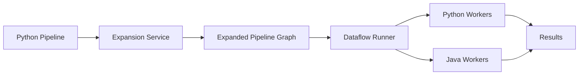

# How to Implement Cross-Language Pipelines in Dataflow Using Multi-SDK Support

Author: [nawazdhandala](https://www.github.com/nawazdhandala)

Tags: GCP, Dataflow, Apache Beam, Cross-Language, Multi-SDK

Description: Learn how to build Dataflow pipelines that combine Python and Java transforms using Apache Beam's cross-language framework for multi-SDK pipelines.

---

Apache Beam's cross-language support lets you use transforms written in one language from a pipeline written in another. This is a big deal in practice because some of the best Beam connectors and transforms are only available in Java (like the Kafka connector or the Avro file IO with specific schemas), while many data teams prefer writing their pipeline logic in Python.

With multi-SDK support in Dataflow, you can write your main pipeline in Python but call Java transforms for I/O or specific processing steps. The expansion service handles the translation between languages at runtime. I started using this when I needed the Java BigQuery Storage Write API connector from a Python pipeline, and it worked better than I expected.

## How Cross-Language Works

When you use a cross-language transform, your Python pipeline sends the transform specification to an expansion service (a Java process) that returns the expanded pipeline graph. At runtime, Dataflow executes both the Python and Java portions, handling the serialization and data exchange between them automatically.

The data exchange uses a common format based on Beam's schema system, which means both sides need to agree on the data format. In practice, this works through Beam rows (schema-aware records) or raw bytes.



## Prerequisites

You need both the Python and Java SDKs available, plus the expansion service JAR:

```bash
# Install the Apache Beam Python SDK with GCP extras
pip install apache-beam[gcp]

# Download the expansion service JAR (match versions with your Python SDK)
# The expansion service is included in the Beam Java SDK
wget https://repo1.maven.org/maven2/org/apache/beam/beam-sdks-java-io-expansion-service/2.52.0/beam-sdks-java-io-expansion-service-2.52.0.jar

# Or use the Beam-provided expansion service for specific I/O connectors
pip install apache-beam[gcp,dataframe]
```

## Using Java I/O Connectors from Python

The most common use case is accessing Java I/O connectors from Python. Here is how to use the Java Kafka connector:

```python
# kafka_cross_language.py
# Read from Kafka using the Java connector in a Python pipeline
import apache_beam as beam
from apache_beam.options.pipeline_options import PipelineOptions
from apache_beam.io.kafka import ReadFromKafka, WriteToKafka

options = PipelineOptions(
    runner="DataflowRunner",
    project="my-project",
    region="us-central1",
    temp_location="gs://my-bucket/temp",
    streaming=True,
    # The expansion service JAR for Kafka I/O
    expansion_service_jar="beam-sdks-java-io-expansion-service-2.52.0.jar",
)

with beam.Pipeline(options=options) as pipeline:
    # ReadFromKafka is a Java transform called from Python
    # The cross-language framework handles serialization automatically
    messages = (
        pipeline
        | "ReadFromKafka" >> ReadFromKafka(
            consumer_config={
                "bootstrap.servers": "kafka-broker:9092",
                "group.id": "my-consumer-group",
                "auto.offset.reset": "earliest",
            },
            topics=["user-events"],
            # Specify how to deserialize the key and value
            key_deserializer="org.apache.kafka.common.serialization.StringDeserializer",
            value_deserializer="org.apache.kafka.common.serialization.StringDeserializer",
        )
    )

    # Process in Python as usual
    processed = (
        messages
        | "ExtractValue" >> beam.Map(lambda kv: json.loads(kv[1]))
        | "FilterActive" >> beam.Filter(lambda x: x.get("active", False))
        | "EnrichData" >> beam.Map(enrich_event)
    )

    # Write back to a different Kafka topic using the Java connector
    (
        processed
        | "FormatForKafka" >> beam.Map(lambda x: ("", json.dumps(x)))
        | "WriteToKafka" >> WriteToKafka(
            producer_config={
                "bootstrap.servers": "kafka-broker:9092",
            },
            topic="processed-events",
            key_serializer="org.apache.kafka.common.serialization.StringSerializer",
            value_serializer="org.apache.kafka.common.serialization.StringSerializer",
        )
    )
```

## Using Java Transforms for Specific Processing

You can also call custom Java transforms from Python:

```python
# custom_java_transform.py
# Call a custom Java transform from a Python pipeline
import apache_beam as beam
from apache_beam.transforms.external import JavaExternalTransform

# Define the Java transform URN and parameters
# The URN identifies the transform in the expansion service
java_transform = JavaExternalTransform(
    "beam:transform:org.example:my_custom_transform:v1",
    expansion_service="localhost:8097",
)

with beam.Pipeline(options=options) as pipeline:
    (
        pipeline
        | "ReadInput" >> beam.io.ReadFromText("gs://my-bucket/input.txt")
        | "ProcessInPython" >> beam.Map(preprocess)
        # Hand off to Java for specialized processing
        | "JavaProcessing" >> java_transform
        # Continue processing in Python
        | "PostProcess" >> beam.Map(postprocess)
        | "WriteOutput" >> beam.io.WriteToText("gs://my-bucket/output/")
    )
```

## Starting the Expansion Service

For custom Java transforms, you need to run the expansion service:

```bash
# Start the expansion service on port 8097
java -jar beam-sdks-java-io-expansion-service-2.52.0.jar \
  --port=8097 \
  --javaClassLookupAllowedNamespaces='*'
```

For built-in Beam I/O connectors, the expansion service starts automatically when you specify the JAR path in your pipeline options.

## Using Schema-Aware Cross-Language Transforms

For complex data types, use Beam schemas to ensure type safety across languages:

```python
# schema_cross_language.py
# Use Beam schemas for type-safe cross-language transforms
import apache_beam as beam
from apache_beam.typehints.schemas import MillisInstant
import typing

# Define a schema using a named tuple
# Beam translates this to a schema that Java can understand
class UserEvent(typing.NamedTuple):
    user_id: str
    event_type: str
    timestamp: int
    amount: float
    region: str

# Register the schema with Beam's type system
beam.coders.registry.register_coder(UserEvent, beam.coders.RowCoder)

with beam.Pipeline(options=options) as pipeline:
    events = (
        pipeline
        | "ReadFromPubSub" >> beam.io.ReadFromPubSub(
            topic="projects/my-project/topics/events"
        )
        | "ParseToSchema" >> beam.Map(
            lambda msg: UserEvent(**json.loads(msg))
        ).with_output_types(UserEvent)
    )

    # The schema-typed PCollection can be passed to Java transforms
    # that expect the same schema structure
    processed = (
        events
        | "JavaEnrichment" >> JavaExternalTransform(
            "beam:transform:org.example:enrich_user:v1",
            expansion_service="localhost:8097",
        )
    )
```

## Cross-Language SQL Transform

You can use Beam SQL (which runs on the Java SDK) from Python:

```python
# sql_cross_language.py
# Use Beam SQL from a Python pipeline
import apache_beam as beam
from apache_beam.transforms.sql import SqlTransform

# Define the schema
class SalesRecord(typing.NamedTuple):
    product_id: str
    category: str
    quantity: int
    price: float
    sale_date: str

beam.coders.registry.register_coder(SalesRecord, beam.coders.RowCoder)

with beam.Pipeline(options=options) as pipeline:
    sales = (
        pipeline
        | "ReadSales" >> beam.io.ReadFromText("gs://my-bucket/sales.jsonl")
        | "ParseSales" >> beam.Map(
            lambda line: SalesRecord(**json.loads(line))
        ).with_output_types(SalesRecord)
    )

    # Use Beam SQL - this executes in the Java SDK
    # but integrates seamlessly with the Python pipeline
    aggregated = (
        sales
        | "AggregateByCategory" >> SqlTransform("""
            SELECT
                category,
                SUM(quantity) AS total_quantity,
                SUM(quantity * price) AS total_revenue,
                AVG(price) AS avg_price,
                COUNT(*) AS sale_count
            FROM PCOLLECTION
            GROUP BY category
            HAVING SUM(quantity * price) > 1000
            ORDER BY total_revenue DESC
        """)
    )

    (
        aggregated
        | "FormatResults" >> beam.Map(lambda row: json.dumps(row._asdict()))
        | "WriteResults" >> beam.io.WriteToText("gs://my-bucket/aggregated/")
    )
```

## Debugging Cross-Language Pipelines

Cross-language pipelines add complexity to debugging. Here are some practical tips:

```python
# debug_cross_language.py
# Debugging utilities for cross-language pipelines
import apache_beam as beam
import logging

# Enable verbose logging to see cross-language communication
logging.getLogger("apache_beam.transforms.external").setLevel(logging.DEBUG)
logging.getLogger("apache_beam.runners.portability").setLevel(logging.DEBUG)

class DebugDoFn(beam.DoFn):
    """DoFn that logs elements at language boundaries for debugging."""

    def __init__(self, label):
        self.label = label

    def process(self, element):
        logging.info(f"[{self.label}] Element type: {type(element)}, Value: {element}")
        yield element

# Insert debug steps at language boundaries
with beam.Pipeline(options=options) as pipeline:
    (
        pipeline
        | "Read" >> beam.io.ReadFromText("gs://my-bucket/input.txt")
        | "BeforeJava" >> beam.ParDo(DebugDoFn("pre-java"))
        | "JavaTransform" >> java_transform
        | "AfterJava" >> beam.ParDo(DebugDoFn("post-java"))
        | "Write" >> beam.io.WriteToText("gs://my-bucket/output/")
    )
```

## Deploying to Dataflow

When deploying cross-language pipelines to Dataflow, make sure the expansion service dependencies are available:

```bash
# Deploy with all required JARs
python my_pipeline.py \
  --runner=DataflowRunner \
  --project=my-project \
  --region=us-central1 \
  --temp_location=gs://my-bucket/temp \
  --staging_location=gs://my-bucket/staging \
  --streaming \
  --expansion_service_jar=beam-sdks-java-io-expansion-service-2.52.0.jar \
  --experiments=use_runner_v2

# The use_runner_v2 experiment is required for cross-language support
```

## Summary

Cross-language pipelines in Dataflow let you combine the best of both worlds - Python's ease of use for data processing logic and Java's rich ecosystem of I/O connectors and transforms. The key components are the expansion service that translates between languages and Beam schemas that ensure type safety at the boundaries. Start with the built-in cross-language I/O connectors like Kafka and SQL, and move to custom Java transforms as needed. Enable debug logging at language boundaries during development, and always use the Runner v2 experiment when deploying to Dataflow. The setup has some initial complexity, but once working, it feels natural to mix Python and Java transforms in the same pipeline.
