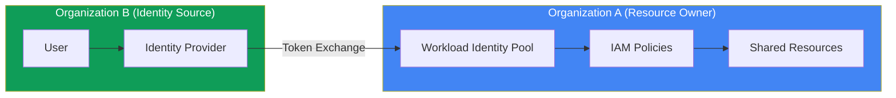

# How to Implement Cross-Organization Identity Federation Between GCP Organizations

Author: [nawazdhandala](https://www.github.com/nawazdhandala)

Tags: GCP, Identity Federation, Cross-Organization, IAM, Google Cloud Security

Description: Learn how to implement cross-organization identity federation between Google Cloud organizations, enabling secure resource sharing without duplicating identities.

---

Large enterprises often have multiple Google Cloud organizations - one per business unit, acquired company, or geographic region. When teams across these organizations need to collaborate on shared resources, you face a choice: create duplicate accounts in each organization, or federate identities so users from one organization can access resources in another.

Identity federation is the right answer. It avoids the security and management overhead of duplicate identities while giving you fine-grained control over cross-organization access.

## Architecture Overview

Cross-organization federation in GCP works through workload identity pools and IAM policies. Organization A (the resource owner) creates a workload identity pool that trusts Organization B's identity provider. Users from Organization B can then access resources in Organization A using their existing credentials.



## Setting Up Cross-Organization Federation

### Step 1: Create a Workload Identity Pool in the Resource Organization

In Organization A (the one that owns the resources):

```bash
# Create a workload identity pool to accept identities from the partner organization
gcloud iam workload-identity-pools create partner-org-pool \
    --project=org-a-project \
    --location=global \
    --display-name="Partner Organization Pool" \
    --description="Accepts identities from Organization B for shared resource access"
```

### Step 2: Create an OIDC Provider for the Partner Organization

If Organization B uses Google Workspace or Cloud Identity, you can federate using Google's OIDC endpoint:

```bash
# Create an OIDC provider that trusts Organization B's Google identity
gcloud iam workload-identity-pools providers create-oidc org-b-google \
    --workload-identity-pool=partner-org-pool \
    --project=org-a-project \
    --location=global \
    --issuer-uri="https://accounts.google.com" \
    --allowed-audiences="//iam.googleapis.com/projects/ORG_A_PROJECT_NUMBER/locations/global/workloadIdentityPools/partner-org-pool/providers/org-b-google" \
    --attribute-mapping="\
google.subject=assertion.sub,\
google.groups=assertion.groups,\
attribute.email=assertion.email,\
attribute.email_domain=assertion.email.extract('{email_local}@{domain}').domain" \
    --attribute-condition="assertion.email.endsWith('@org-b-domain.com')"
```

The `--attribute-condition` is critical. It ensures only users from Organization B's domain can use this federation path. Without it, any Google account could potentially authenticate.

### Step 3: Grant Cross-Organization Access

Now grant specific IAM roles to the federated identities:

```bash
# Grant read access to a shared BigQuery dataset for all Org B users
gcloud projects add-iam-policy-binding org-a-project \
    --role=roles/bigquery.dataViewer \
    --member="principalSet://iam.googleapis.com/projects/ORG_A_PROJECT_NUMBER/locations/global/workloadIdentityPools/partner-org-pool/attribute.email_domain/org-b-domain.com"

# Grant specific users from Org B access to a shared GCS bucket
gcloud storage buckets add-iam-policy-binding gs://shared-data-bucket \
    --role=roles/storage.objectViewer \
    --member="principal://iam.googleapis.com/projects/ORG_A_PROJECT_NUMBER/locations/global/workloadIdentityPools/partner-org-pool/subject/user-id-from-org-b"
```

### Step 4: Configure Service Account Impersonation

For workloads that need to use Google Cloud client libraries, set up service account impersonation:

```bash
# Create a service account in Org A for Org B workloads to impersonate
gcloud iam service-accounts create org-b-shared-sa \
    --project=org-a-project \
    --display-name="Shared SA for Org B workloads"

# Grant the SA necessary resource permissions
gcloud projects add-iam-policy-binding org-a-project \
    --role=roles/bigquery.jobUser \
    --member="serviceAccount:org-b-shared-sa@org-a-project.iam.gserviceaccount.com"

# Allow Org B identities to impersonate this service account
gcloud iam service-accounts add-iam-policy-binding \
    org-b-shared-sa@org-a-project.iam.gserviceaccount.com \
    --role=roles/iam.workloadIdentityUser \
    --member="principalSet://iam.googleapis.com/projects/ORG_A_PROJECT_NUMBER/locations/global/workloadIdentityPools/partner-org-pool/attribute.email_domain/org-b-domain.com"
```

## Accessing Resources from Organization B

### For Human Users

Users from Organization B authenticate and access resources using the gcloud CLI:

```bash
# Generate a credential configuration file for cross-org access
gcloud iam workload-identity-pools create-cred-config \
    projects/ORG_A_PROJECT_NUMBER/locations/global/workloadIdentityPools/partner-org-pool/providers/org-b-google \
    --service-account=org-b-shared-sa@org-a-project.iam.gserviceaccount.com \
    --credential-source-type=executable \
    --credential-source-command="gcloud auth print-identity-token --audiences=//iam.googleapis.com/projects/ORG_A_PROJECT_NUMBER/locations/global/workloadIdentityPools/partner-org-pool/providers/org-b-google" \
    --output-file=cross-org-creds.json

# Use the credential config
export GOOGLE_APPLICATION_CREDENTIALS=/path/to/cross-org-creds.json

# Now BigQuery queries run against Org A's project
bq query --project_id=org-a-project "SELECT * FROM shared_dataset.shared_table LIMIT 10"
```

### For Automated Workloads

Applications in Organization B can access Organization A resources programmatically:

```python
# cross_org_access.py
# Access resources in Org A from a workload running in Org B

from google.auth import identity_pool
from google.cloud import bigquery

# Configure identity pool credentials for cross-org access
credentials = identity_pool.Credentials.from_info({
    "type": "external_account",
    "audience": "//iam.googleapis.com/projects/ORG_A_PROJECT_NUMBER/locations/global/workloadIdentityPools/partner-org-pool/providers/org-b-google",
    "subject_token_type": "urn:ietf:params:oauth:token-type:jwt",
    "token_url": "https://sts.googleapis.com/v1/token",
    "service_account_impersonation_url": "https://iamcredentials.googleapis.com/v1/projects/-/serviceAccounts/org-b-shared-sa@org-a-project.iam.gserviceaccount.com:generateAccessToken",
    "credential_source": {
        "file": "/var/run/secrets/tokens/gcp-token",  # Or another credential source
    }
})

# Use the credentials to access Org A resources
client = bigquery.Client(
    project='org-a-project',
    credentials=credentials
)

# Query shared data in Org A's BigQuery
query = "SELECT * FROM `shared_dataset.shared_table` LIMIT 100"
results = client.query(query).result()
for row in results:
    print(row)
```

## Terraform Configuration

```hcl
# In Organization A's Terraform (resource owner)

# Workload identity pool for cross-org federation
resource "google_iam_workload_identity_pool" "partner" {
  workload_identity_pool_id = "partner-org-pool"
  project                   = "org-a-project"
  display_name              = "Partner Organization Pool"
  description               = "Accepts identities from Organization B"
}

# OIDC provider for Organization B
resource "google_iam_workload_identity_pool_provider" "org_b" {
  workload_identity_pool_id          = google_iam_workload_identity_pool.partner.workload_identity_pool_id
  workload_identity_pool_provider_id = "org-b-google"
  project                            = "org-a-project"

  # Only accept tokens from Org B's domain
  attribute_condition = "assertion.email.endsWith('@org-b-domain.com')"

  attribute_mapping = {
    "google.subject"        = "assertion.sub"
    "attribute.email"       = "assertion.email"
    "attribute.email_domain" = "assertion.email.extract('{local}@{domain}').domain"
  }

  oidc {
    issuer_uri = "https://accounts.google.com"
    allowed_audiences = [
      "//iam.googleapis.com/projects/${data.google_project.org_a.number}/locations/global/workloadIdentityPools/partner-org-pool/providers/org-b-google"
    ]
  }
}

# Service account for Org B to impersonate
resource "google_service_account" "org_b_shared" {
  account_id   = "org-b-shared-sa"
  display_name = "Shared SA for Organization B"
  project      = "org-a-project"
}

# Allow Org B principals to impersonate the shared SA
resource "google_service_account_iam_binding" "org_b_impersonation" {
  service_account_id = google_service_account.org_b_shared.name
  role               = "roles/iam.workloadIdentityUser"

  members = [
    "principalSet://iam.googleapis.com/${google_iam_workload_identity_pool.partner.name}/attribute.email_domain/org-b-domain.com"
  ]
}

# Grant the shared SA access to specific resources
resource "google_project_iam_member" "bigquery_access" {
  project = "org-a-project"
  role    = "roles/bigquery.dataViewer"
  member  = "serviceAccount:${google_service_account.org_b_shared.email}"
}
```

## Security Considerations

**Restrict the attribute condition tightly.** The `attribute_condition` on the provider is your first line of defense. Always restrict to specific domains, groups, or user attributes.

**Use the principle of least privilege for cross-org access.** Create dedicated service accounts with narrow permissions for cross-org use. Do not reuse service accounts that have broader access.

**Monitor cross-org access.** Set up audit log monitoring for the workload identity pool:

```bash
# Monitor cross-org authentication events
gcloud logging read 'protoPayload.serviceName="sts.googleapis.com"' \
    --project=org-a-project \
    --limit=50 \
    --format="table(timestamp, protoPayload.authenticationInfo.principalEmail, protoPayload.status)"
```

**Set up VPC Service Controls.** If the shared resources contain sensitive data, use VPC Service Controls to create a perimeter that allows only specific projects from both organizations:

```bash
# Create a service perimeter that includes projects from both organizations
gcloud access-context-manager perimeters create cross-org-perimeter \
    --policy=POLICY_ID \
    --title="Cross-Org Shared Resources" \
    --resources="projects/ORG_A_PROJECT_NUMBER,projects/ORG_B_PROJECT_NUMBER" \
    --restricted-services="bigquery.googleapis.com,storage.googleapis.com"
```

**Review and rotate regularly.** Cross-organization access should be reviewed quarterly. Remove federation paths that are no longer needed and audit which identities are actively using the access.

Cross-organization identity federation is the secure way to enable collaboration between separate GCP organizations. It eliminates the need for shared credentials or duplicate accounts while giving you complete control over who can access what.
