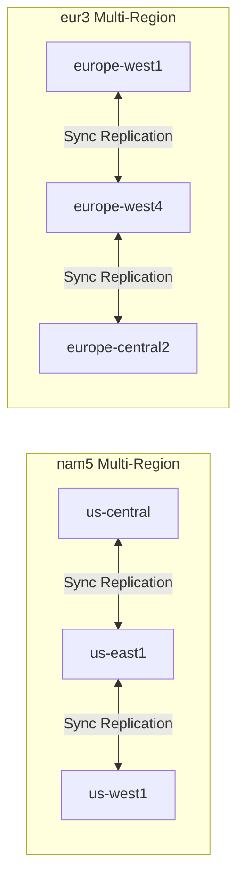

# How to Implement Cross-Region Firestore Replication for Global Application Availability

Author: [nawazdhandala](https://www.github.com/nawazdhandala)

Tags: GCP, Firestore, Replication, Global Availability, NoSQL

Description: A practical guide to implementing cross-region Firestore replication on Google Cloud Platform for building globally available applications with low-latency data access.

---

If you are building an application that serves users across multiple continents, latency becomes your enemy. A user in Tokyo should not have to wait 200ms for every database read because your Firestore instance sits in us-central1. Cross-region replication is how you solve this, and Firestore actually makes it easier than most databases.

In this post, I will cover how Firestore handles multi-region replication natively, how to configure it properly, and what patterns to use when you need even more control over data distribution.

## Understanding Firestore's Built-in Replication

Firestore offers two location types when you create a database: regional and multi-region. This choice happens at database creation time and cannot be changed later, so it is important to get it right.

**Regional locations** replicate data across multiple zones within a single region. This gives you zone-level fault tolerance at lower cost.

**Multi-region locations** replicate data across multiple regions, giving you region-level fault tolerance and lower read latency for geographically distributed users.

The two multi-region options available are:

- **nam5** (United States) - replicates across multiple regions in North America
- **eur3** (Europe) - replicates across multiple regions in Europe



## Creating a Multi-Region Firestore Database

When setting up a new project, choose the multi-region location during database creation:

```bash
# Create a Firestore database with multi-region replication (nam5)
gcloud firestore databases create \
  --location=nam5 \
  --type=firestore-native \
  --project=my-global-app
```

If you already have a regional Firestore database and want multi-region coverage, you will need to export and reimport your data into a new database. Here is how:

```bash
# Export existing data from regional database
gcloud firestore export gs://my-backup-bucket/firestore-export \
  --project=my-global-app

# Create the new multi-region database (in a new project or after deleting the old one)
gcloud firestore databases create \
  --location=nam5 \
  --type=firestore-native \
  --project=my-global-app-v2

# Import data into the new multi-region database
gcloud firestore import gs://my-backup-bucket/firestore-export \
  --project=my-global-app-v2
```

## Designing Your Data Model for Global Access

Multi-region replication handles the infrastructure side, but your data model matters too. Here are patterns that work well for globally distributed applications.

### Pattern 1: Region-Aware Collections

Structure your data so that region-specific information is grouped together. This reduces cross-region write contention:

```javascript
// Each user's data is primarily written from their home region
// This structure minimizes cross-region write conflicts

const userRef = db.collection('users').doc(userId);

// Store the user's home region to optimize routing later
await userRef.set({
  displayName: 'Jane Developer',
  email: 'jane@example.com',
  homeRegion: 'us-east1',
  preferences: {
    language: 'en',
    timezone: 'America/New_York'
  },
  createdAt: FieldValue.serverTimestamp()
});

// Region-specific activity logs go in subcollections
// These are mostly written from one region, reducing conflicts
await userRef.collection('activity').add({
  action: 'login',
  region: 'us-east1',
  timestamp: FieldValue.serverTimestamp()
});
```

### Pattern 2: Read-Heavy Global Data with Local Writes

For data that is read globally but written from a single region, use a publish/subscribe pattern:

```javascript
// Global configuration - written by admins, read everywhere
// Since writes are infrequent, multi-region replication handles this perfectly

async function updateGlobalConfig(configUpdate) {
  const configRef = db.collection('global_config').doc('app_settings');

  await configRef.update({
    ...configUpdate,
    lastUpdatedBy: 'admin@example.com',
    lastUpdatedAt: FieldValue.serverTimestamp(),
    // Track which version this is for cache invalidation
    version: FieldValue.increment(1)
  });
}

// Clients worldwide read this with low latency
// because Firestore serves reads from the nearest replica
async function getGlobalConfig() {
  const configRef = db.collection('global_config').doc('app_settings');
  const snapshot = await configRef.get();
  return snapshot.data();
}
```

## Implementing Custom Cross-Region Sync

Sometimes the built-in multi-region locations do not cover your needs. If you need data available in both North America and Asia-Pacific, for example, you will need a custom replication approach.

### Using Cloud Functions for Cross-Region Sync

Set up Firestore triggers that replicate writes across independent Firestore databases:

```javascript
// cloud-function: replicateToAsia
// Triggers on writes to the US database and syncs to the APAC database

const { Firestore } = require('@google-cloud/firestore');

// Primary database (nam5)
const primaryDb = new Firestore({ projectId: 'my-app-us' });

// Secondary database (asia-southeast1)
const secondaryDb = new Firestore({ projectId: 'my-app-asia' });

exports.replicateToAsia = functions
  .firestore
  .document('shared_data/{docId}')
  .onWrite(async (change, context) => {
    const docId = context.params.docId;

    if (!change.after.exists) {
      // Document was deleted - replicate the deletion
      await secondaryDb.collection('shared_data').doc(docId).delete();
      console.log(`Deleted ${docId} from APAC replica`);
      return;
    }

    const data = change.after.data();

    // Add replication metadata to prevent infinite loops
    if (data._replicatedFrom === 'asia') {
      // This write originated from Asia, skip to avoid loop
      return;
    }

    await secondaryDb.collection('shared_data').doc(docId).set({
      ...data,
      _replicatedFrom: 'us',
      _replicatedAt: Firestore.FieldValue.serverTimestamp()
    }, { merge: true });

    console.log(`Replicated ${docId} to APAC region`);
  });
```

### Handling Conflicts in Custom Replication

When writes can happen in multiple regions simultaneously, you need a conflict resolution strategy. Last-write-wins based on server timestamps is the simplest approach:

```javascript
// Conflict resolution using server timestamps
async function replicateWithConflictResolution(sourceData, targetDb, collectionPath, docId) {
  const targetRef = targetDb.collection(collectionPath).doc(docId);

  await targetDb.runTransaction(async (transaction) => {
    const targetDoc = await transaction.get(targetRef);

    if (targetDoc.exists) {
      const targetData = targetDoc.data();

      // Compare timestamps - only overwrite if source is newer
      if (sourceData.updatedAt > targetData.updatedAt) {
        transaction.set(targetRef, sourceData, { merge: true });
      }
      // If target is newer, skip this replication
    } else {
      // Document does not exist in target - just create it
      transaction.set(targetRef, sourceData);
    }
  });
}
```

## Monitoring Replication Health

You need visibility into whether replication is working correctly. Set up custom metrics to track replication lag:

```javascript
// Monitor replication lag using Cloud Monitoring custom metrics
const monitoring = require('@google-cloud/monitoring');

const client = new monitoring.MetricServiceClient();
const projectPath = client.projectPath('my-global-app');

async function reportReplicationLag(sourceRegion, targetRegion, lagMs) {
  const dataPoint = {
    interval: {
      endTime: { seconds: Date.now() / 1000 }
    },
    value: { doubleValue: lagMs }
  };

  const timeSeriesData = {
    metric: {
      type: 'custom.googleapis.com/firestore/replication_lag_ms',
      labels: {
        source_region: sourceRegion,
        target_region: targetRegion
      }
    },
    resource: {
      type: 'global',
      labels: { project_id: 'my-global-app' }
    },
    points: [dataPoint]
  };

  await client.createTimeSeries({
    name: projectPath,
    timeSeries: [timeSeriesData]
  });
}
```

Then set up an alert when replication lag exceeds your threshold:

```bash
# Create an alerting policy for replication lag
gcloud alpha monitoring policies create \
  --display-name="Firestore Replication Lag Alert" \
  --condition-display-name="Replication lag exceeds 5 seconds" \
  --condition-filter='metric.type="custom.googleapis.com/firestore/replication_lag_ms"' \
  --condition-threshold-value=5000 \
  --condition-threshold-comparison=COMPARISON_GT \
  --condition-threshold-duration=300s \
  --notification-channels=projects/my-global-app/notificationChannels/123
```

## Performance Considerations

There are real trade-offs to understand with multi-region Firestore:

**Write latency increases** with multi-region configurations. A write to a nam5 database takes longer than a write to a single us-central1 instance because it needs to be committed across regions before the write is acknowledged.

**Read latency decreases** for users near any of the replicated regions, since Firestore serves reads from the closest replica.

**Cost increases** with multi-region storage. You are paying for data stored in multiple locations. Expect roughly 2-3x the storage cost compared to a single region.

**Consistency guarantees remain strong.** Even with multi-region replication, Firestore provides strong consistency for reads. You always get the most recent committed write.

## Routing Clients to the Nearest Region

If you are using custom cross-database replication, route clients to the nearest database for reads:

```javascript
// Client-side region routing
function getFirestoreClient(userRegion) {
  // Map user regions to the nearest Firestore database
  const regionMapping = {
    'us-east': { projectId: 'my-app-us' },
    'us-west': { projectId: 'my-app-us' },
    'eu-west': { projectId: 'my-app-eu' },
    'ap-southeast': { projectId: 'my-app-asia' }
  };

  const config = regionMapping[userRegion] || regionMapping['us-east'];
  return new Firestore(config);
}
```

## Wrapping Up

Firestore's built-in multi-region support handles a lot of the heavy lifting for cross-region replication. For most applications, choosing a multi-region location at database creation time is all you need. When your requirements go beyond the built-in options - say you need data replicated across continents - Cloud Functions-based replication with conflict resolution gives you the flexibility to build exactly what you need.

The most important thing is to choose your replication strategy before you have data in production. Migrating a regional database to multi-region later is doable but disruptive. Plan for your global footprint from the start.
