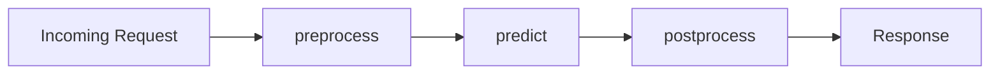

# How to Implement Custom Prediction Routines with Pre-Processing and Post-Processing on Vertex AI

Author: [nawazdhandala](https://www.github.com/nawazdhandala)

Tags: GCP, Vertex AI, Custom Prediction, Pre-Processing, Post-Processing

Description: A hands-on guide to implementing custom prediction routines on Vertex AI that include data pre-processing and post-processing logic alongside model inference.

---

Most real-world prediction services need more than just raw model inference. You might need to decode base64-encoded images before feeding them to your model, look up embeddings from a cache, normalize input features, or transform raw model outputs into human-readable labels with confidence scores. Vertex AI Custom Prediction Routines (CPR) let you wrap all of this logic around your model without building a full custom container from scratch.

CPR gives you a structured way to add pre-processing and post-processing while still leveraging Vertex AI's pre-built serving infrastructure. You write a Python class, and Vertex AI handles the rest.

## How Custom Prediction Routines Work

A Custom Prediction Routine is a Python class that implements specific methods. Vertex AI calls these methods in sequence for each prediction request.



The `preprocess` method transforms the raw input into the format your model expects. The `predict` method runs the actual model inference. The `postprocess` method transforms model output into the format your API consumers need.

## Writing the Predictor Class

The core of a CPR is a class that extends the Vertex AI predictor interface. Let us build one for an image classification model that accepts base64-encoded images.

This is the predictor class with full pre and post processing:

```python
# predictor.py - Custom Prediction Routine for image classification

import os
import json
import base64
import numpy as np
from io import BytesIO
from PIL import Image
from google.cloud.aiplatform.prediction import Predictor
from google.cloud.aiplatform.utils import prediction_utils

class ImageClassificationPredictor(Predictor):
    """Custom predictor that handles image preprocessing and label mapping."""

    def __init__(self):
        """Initialize instance variables."""
        self._model = None
        self._labels = None
        self._input_size = (224, 224)  # Expected input dimensions

    def load(self, artifacts_uri: str):
        """Load model artifacts from the specified URI.

        This method is called once when the server starts.
        It downloads and loads the model and any supporting files.
        """
        # Download artifacts from GCS to a local directory
        prediction_utils.download_model_artifacts(artifacts_uri)

        # Load the TensorFlow model
        import tensorflow as tf
        self._model = tf.keras.models.load_model(
            os.path.join(artifacts_uri, "saved_model")
        )

        # Load the label mapping file
        labels_path = os.path.join(artifacts_uri, "labels.json")
        with open(labels_path, "r") as f:
            self._labels = json.load(f)

        print(f"Model loaded with {len(self._labels)} classes")

    def preprocess(self, prediction_input: dict) -> np.ndarray:
        """Convert raw input (base64 images) into model-ready tensors.

        Handles:
        - Base64 decoding of image data
        - Resizing to expected dimensions
        - Normalization to [0, 1] range
        - Batching multiple images
        """
        instances = prediction_input.get("instances", [])
        processed_images = []

        for instance in instances:
            # Each instance has a "data" field with base64-encoded image
            image_data = instance.get("data", "")

            # Decode base64 to bytes
            image_bytes = base64.b64decode(image_data)

            # Open image with PIL and convert to RGB
            image = Image.open(BytesIO(image_bytes)).convert("RGB")

            # Resize to expected dimensions
            image = image.resize(self._input_size)

            # Convert to numpy array and normalize to [0, 1]
            image_array = np.array(image, dtype=np.float32) / 255.0

            processed_images.append(image_array)

        # Stack into a batch
        return np.stack(processed_images, axis=0)

    def predict(self, preprocessed_input: np.ndarray) -> np.ndarray:
        """Run the model inference on preprocessed data."""
        # Run prediction
        predictions = self._model.predict(preprocessed_input)
        return predictions

    def postprocess(self, prediction_results: np.ndarray) -> dict:
        """Transform raw model output into a user-friendly response.

        Converts probability arrays into labeled predictions with
        top-k results and confidence scores.
        """
        responses = []

        for probs in prediction_results:
            # Get top 5 predictions
            top_indices = np.argsort(probs)[-5:][::-1]

            top_predictions = []
            for idx in top_indices:
                top_predictions.append({
                    "label": self._labels[str(idx)],
                    "confidence": round(float(probs[idx]), 4)
                })

            # Also include the single best prediction for convenience
            best_idx = top_indices[0]
            responses.append({
                "predicted_label": self._labels[str(best_idx)],
                "confidence": round(float(probs[best_idx]), 4),
                "top_5": top_predictions
            })

        return {"predictions": responses}
```

## Handling Structured Data with Feature Engineering

Not all models work with images. Here is a predictor for tabular data that performs feature engineering at serving time.

This predictor computes derived features before sending data to the model:

```python
# tabular_predictor.py - CPR for tabular data with feature engineering

import os
import pickle
import numpy as np
import pandas as pd
from datetime import datetime
from google.cloud.aiplatform.prediction import Predictor

class TabularPredictor(Predictor):
    """Predictor that performs real-time feature engineering on tabular data."""

    def __init__(self):
        self._model = None
        self._scaler = None
        self._feature_columns = None

    def load(self, artifacts_uri: str):
        """Load model, scaler, and feature configuration."""
        # Load the trained model
        with open(os.path.join(artifacts_uri, "model.pkl"), "rb") as f:
            self._model = pickle.load(f)

        # Load the feature scaler used during training
        with open(os.path.join(artifacts_uri, "scaler.pkl"), "rb") as f:
            self._scaler = pickle.load(f)

        # Load the expected feature column order
        with open(os.path.join(artifacts_uri, "feature_columns.json"), "r") as f:
            import json
            self._feature_columns = json.load(f)

    def preprocess(self, prediction_input: dict) -> pd.DataFrame:
        """Engineer features from raw input data."""
        instances = prediction_input.get("instances", [])
        df = pd.DataFrame(instances)

        # Compute derived features
        # Calculate age from birth_date
        if "birth_date" in df.columns:
            df["birth_date"] = pd.to_datetime(df["birth_date"])
            df["age"] = (datetime.now() - df["birth_date"]).dt.days / 365.25
            df.drop("birth_date", axis=1, inplace=True)

        # Create interaction features
        if "income" in df.columns and "debt" in df.columns:
            df["debt_to_income_ratio"] = df["debt"] / (df["income"] + 1)

        # Encode time-based features
        if "timestamp" in df.columns:
            df["timestamp"] = pd.to_datetime(df["timestamp"])
            df["hour_of_day"] = df["timestamp"].dt.hour
            df["day_of_week"] = df["timestamp"].dt.dayofweek
            df["is_weekend"] = df["day_of_week"].isin([5, 6]).astype(int)
            df.drop("timestamp", axis=1, inplace=True)

        # Ensure columns match training order and apply scaling
        df = df[self._feature_columns]
        df_scaled = self._scaler.transform(df)

        return df_scaled

    def predict(self, preprocessed_input: np.ndarray) -> dict:
        """Run prediction and get both class and probability."""
        classes = self._model.predict(preprocessed_input)
        probabilities = self._model.predict_proba(preprocessed_input)
        return {"classes": classes, "probabilities": probabilities}

    def postprocess(self, prediction_results: dict) -> dict:
        """Format predictions with risk categories."""
        risk_labels = {0: "low_risk", 1: "medium_risk", 2: "high_risk"}

        predictions = []
        for cls, probs in zip(
            prediction_results["classes"],
            prediction_results["probabilities"]
        ):
            predictions.append({
                "risk_category": risk_labels.get(int(cls), "unknown"),
                "risk_score": round(float(max(probs)), 4),
                "probabilities": {
                    risk_labels[i]: round(float(p), 4)
                    for i, p in enumerate(probs)
                }
            })

        return {"predictions": predictions}
```

## Packaging and Deploying the CPR

To deploy a Custom Prediction Routine, you need to package it as a source distribution and upload it to Vertex AI.

This code packages and deploys the predictor:

```python
from google.cloud import aiplatform
from google.cloud.aiplatform.prediction import LocalModel

# Define the local model with the custom predictor
local_model = LocalModel.build_cpr_model(
    "predictor.py",  # Path to your predictor file
    "ImageClassificationPredictor",  # Class name
    requirements_path="requirements.txt",  # Additional dependencies
    base_image="python:3.10-slim"  # Base Docker image
)

# Test locally before deploying
# local_model.deploy_to_local_endpoint(
#     artifact_uri="./model_artifacts/"
# )

# Upload to Vertex AI Model Registry
model = local_model.upload(
    display_name="image-classifier-cpr",
    artifact_uri="gs://your-bucket/models/image-classifier/",
    project="your-project-id",
    location="us-central1"
)

# Create endpoint and deploy
endpoint = aiplatform.Endpoint.create(
    display_name="image-classifier-endpoint"
)

model.deploy(
    endpoint=endpoint,
    machine_type="n1-standard-4",
    accelerator_type="NVIDIA_TESLA_T4",  # GPU for faster inference
    accelerator_count=1,
    min_replica_count=1,
    max_replica_count=5
)

print(f"Deployed to: {endpoint.resource_name}")
```

## Testing Locally Before Deploying

Always test your CPR locally before deploying to Vertex AI. The local testing loop is much faster.

This code runs a local test:

```python
import base64
import json

# Read a test image and encode it
with open("test_image.jpg", "rb") as f:
    image_b64 = base64.b64encode(f.read()).decode("utf-8")

# Create the test request
test_request = {
    "instances": [
        {"data": image_b64}
    ]
}

# Instantiate and test the predictor directly
predictor = ImageClassificationPredictor()
predictor.load("./model_artifacts/")

preprocessed = predictor.preprocess(test_request)
raw_predictions = predictor.predict(preprocessed)
response = predictor.postprocess(raw_predictions)

print(json.dumps(response, indent=2))
```

## Error Handling in Prediction Routines

Production prediction services need proper error handling. Bad inputs should return clear error messages instead of crashing the server.

Add validation in your preprocess method:

```python
def preprocess(self, prediction_input: dict) -> np.ndarray:
    """Preprocess with input validation."""
    instances = prediction_input.get("instances", [])

    if not instances:
        raise ValueError("Request must contain at least one instance")

    if len(instances) > 32:
        raise ValueError("Maximum batch size is 32 instances")

    for i, instance in enumerate(instances):
        if "data" not in instance:
            raise ValueError(f"Instance {i} missing required 'data' field")

        # Validate base64 encoding
        try:
            decoded = base64.b64decode(instance["data"])
        except Exception:
            raise ValueError(f"Instance {i} has invalid base64 encoding")

    # Continue with normal preprocessing
    return self._process_images(instances)
```

Custom Prediction Routines strike a good balance between the simplicity of pre-built containers and the flexibility of fully custom containers. You get to write Python code for your pre and post processing logic without worrying about HTTP servers, health checks, or Docker configuration. For most use cases where you need custom logic at serving time, CPR is the way to go.
