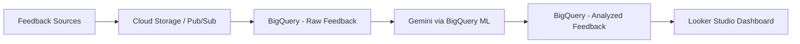

# How to Implement Customer Feedback Analysis with Gemini and BigQuery on GCP

Author: [nawazdhandala](https://www.github.com/nawazdhandala)

Tags: GCP, Gemini, BigQuery, Customer Feedback, NLP, AI, Google Cloud

Description: A practical guide to building a customer feedback analysis pipeline using Gemini models and BigQuery on Google Cloud Platform for actionable insights.

---

Every SaaS company collects customer feedback - support tickets, survey responses, app reviews, NPS comments. The problem is never collection; it is analysis. When you have thousands of feedback entries pouring in weekly, manual review breaks down fast. In this post, I will show you how to build an automated feedback analysis pipeline using Gemini on Vertex AI and BigQuery, turning raw text into structured insights your product team can actually use.

## The Architecture

The pipeline works like this: feedback lands in BigQuery (either directly or through ingestion), Gemini processes each entry to extract sentiment, topics, and actionable items, and the results go back into BigQuery for dashboarding and analysis.



## Prerequisites

You need a GCP project with these APIs enabled:

```bash
# Enable the required APIs
gcloud services enable bigquery.googleapis.com \
    aiplatform.googleapis.com \
    bigqueryconnection.googleapis.com \
    --project=your-project-id
```

## Step 1: Set Up Your BigQuery Dataset

First, create a dataset and table to hold the raw feedback:

```sql
-- Create the dataset for our feedback analysis project
CREATE SCHEMA IF NOT EXISTS `your-project.feedback_analysis`
OPTIONS (location = 'us-central1');

-- Create the raw feedback table with common fields
CREATE TABLE IF NOT EXISTS `your-project.feedback_analysis.raw_feedback` (
    feedback_id STRING NOT NULL,
    source STRING,           -- e.g., 'support_ticket', 'nps_survey', 'app_review'
    customer_id STRING,
    feedback_text STRING,
    submitted_at TIMESTAMP,
    ingested_at TIMESTAMP DEFAULT CURRENT_TIMESTAMP()
);
```

Load some sample data to work with:

```sql
-- Insert sample feedback entries for testing the pipeline
INSERT INTO `your-project.feedback_analysis.raw_feedback`
    (feedback_id, source, customer_id, feedback_text, submitted_at)
VALUES
    ('fb-001', 'nps_survey', 'cust-123', 'The dashboard is great but loading times have gotten worse over the past month. Please fix the performance issues.', TIMESTAMP('2026-02-10 14:30:00')),
    ('fb-002', 'support_ticket', 'cust-456', 'Cannot export reports to PDF. This feature worked last week but now it just shows a blank page.', TIMESTAMP('2026-02-11 09:15:00')),
    ('fb-003', 'app_review', 'cust-789', 'Love the new mobile app update. The notification system is exactly what we needed. Five stars.', TIMESTAMP('2026-02-12 16:45:00'));
```

## Step 2: Create a BigQuery ML Connection to Vertex AI

BigQuery can call Gemini directly through a remote model connection. Set this up first:

```bash
# Create a BigQuery connection to Vertex AI
bq mk --connection \
    --connection_type=CLOUD_RESOURCE \
    --project_id=your-project-id \
    --location=us-central1 \
    vertex-ai-connection
```

After creating the connection, grant the service account the Vertex AI User role:

```bash
# Get the service account from the connection
SERVICE_ACCOUNT=$(bq show --connection --format=json \
    your-project-id.us-central1.vertex-ai-connection | \
    jq -r '.cloudResource.serviceAccountId')

# Grant Vertex AI access to the connection's service account
gcloud projects add-iam-policy-binding your-project-id \
    --member="serviceAccount:${SERVICE_ACCOUNT}" \
    --role="roles/aiplatform.user"
```

## Step 3: Create a Remote Gemini Model in BigQuery

Now register Gemini as a BigQuery ML model:

```sql
-- Create a remote model that points to Gemini on Vertex AI
CREATE OR REPLACE MODEL `your-project.feedback_analysis.gemini_model`
REMOTE WITH CONNECTION `your-project.us-central1.vertex-ai-connection`
OPTIONS (
    endpoint = 'gemini-2.0-flash'
);
```

## Step 4: Analyze Feedback with Gemini

Here is where the real work happens. Use `ML.GENERATE_TEXT` to analyze each feedback entry:

```sql
-- Analyze each piece of feedback using Gemini to extract structured insights
SELECT
    feedback_id,
    source,
    customer_id,
    feedback_text,
    ml_generate_text_result['candidates'][0]['content']['parts'][0]['text'] AS analysis_result
FROM ML.GENERATE_TEXT(
    MODEL `your-project.feedback_analysis.gemini_model`,
    (
        SELECT
            feedback_id,
            source,
            customer_id,
            feedback_text,
            CONCAT(
                'Analyze this customer feedback and return a JSON object with these fields:\n',
                '- sentiment: one of "positive", "negative", "neutral", "mixed"\n',
                '- sentiment_score: float from -1.0 (very negative) to 1.0 (very positive)\n',
                '- topics: array of topic strings (e.g., "performance", "billing", "UI")\n',
                '- urgency: one of "low", "medium", "high", "critical"\n',
                '- action_items: array of specific actionable suggestions\n',
                '- summary: one sentence summary\n\n',
                'Feedback: ', feedback_text
            ) AS prompt
        FROM `your-project.feedback_analysis.raw_feedback`
    ),
    STRUCT(
        0.1 AS temperature,      -- Low temperature for consistent structured output
        1024 AS max_output_tokens
    )
);
```

## Step 5: Parse and Store Structured Results

The Gemini response comes back as text containing JSON. Parse it into proper columns:

```sql
-- Create a table that stores the parsed analysis results
CREATE OR REPLACE TABLE `your-project.feedback_analysis.analyzed_feedback` AS
WITH raw_analysis AS (
    SELECT
        feedback_id,
        source,
        customer_id,
        feedback_text,
        submitted_at,
        -- Extract the JSON from Gemini's response
        ml_generate_text_result['candidates'][0]['content']['parts'][0]['text'] AS raw_json
    FROM ML.GENERATE_TEXT(
        MODEL `your-project.feedback_analysis.gemini_model`,
        (
            SELECT
                feedback_id, source, customer_id, feedback_text, submitted_at,
                CONCAT(
                    'Analyze this customer feedback. Return ONLY a valid JSON object with fields: ',
                    'sentiment (positive/negative/neutral/mixed), ',
                    'sentiment_score (float -1.0 to 1.0), ',
                    'topics (string array), ',
                    'urgency (low/medium/high/critical), ',
                    'action_items (string array), ',
                    'summary (one sentence).\n\nFeedback: ', feedback_text
                ) AS prompt
            FROM `your-project.feedback_analysis.raw_feedback`
        ),
        STRUCT(0.1 AS temperature, 1024 AS max_output_tokens)
    )
)
SELECT
    feedback_id,
    source,
    customer_id,
    feedback_text,
    submitted_at,
    -- Parse individual fields from the JSON response
    JSON_VALUE(raw_json, '$.sentiment') AS sentiment,
    CAST(JSON_VALUE(raw_json, '$.sentiment_score') AS FLOAT64) AS sentiment_score,
    JSON_QUERY_ARRAY(raw_json, '$.topics') AS topics,
    JSON_VALUE(raw_json, '$.urgency') AS urgency,
    JSON_QUERY_ARRAY(raw_json, '$.action_items') AS action_items,
    JSON_VALUE(raw_json, '$.summary') AS summary,
    CURRENT_TIMESTAMP() AS analyzed_at
FROM raw_analysis;
```

## Step 6: Build Aggregation Views for Dashboarding

Create views that your Looker Studio dashboard can query:

```sql
-- Weekly sentiment trends by feedback source
CREATE OR REPLACE VIEW `your-project.feedback_analysis.weekly_sentiment` AS
SELECT
    DATE_TRUNC(submitted_at, WEEK) AS week,
    source,
    COUNT(*) AS feedback_count,
    AVG(sentiment_score) AS avg_sentiment,
    COUNTIF(sentiment = 'negative') AS negative_count,
    COUNTIF(sentiment = 'positive') AS positive_count
FROM `your-project.feedback_analysis.analyzed_feedback`
GROUP BY 1, 2
ORDER BY 1 DESC;

-- Top topics by frequency, showing sentiment breakdown
CREATE OR REPLACE VIEW `your-project.feedback_analysis.topic_breakdown` AS
SELECT
    topic,
    COUNT(*) AS mention_count,
    AVG(sentiment_score) AS avg_sentiment,
    COUNTIF(urgency IN ('high', 'critical')) AS urgent_mentions
FROM `your-project.feedback_analysis.analyzed_feedback`,
    UNNEST(topics) AS topic
GROUP BY 1
ORDER BY mention_count DESC;
```

## Step 7: Automate with Scheduled Queries

Set up a scheduled query to process new feedback daily:

```bash
# Create a scheduled query that runs daily at 6 AM UTC
bq query --use_legacy_sql=false \
    --schedule='every 24 hours' \
    --display_name='Daily Feedback Analysis' \
    --destination_table='your-project.feedback_analysis.analyzed_feedback' \
    --append_table=true \
    'SELECT ... FROM ML.GENERATE_TEXT(...)
     WHERE submitted_at > TIMESTAMP_SUB(CURRENT_TIMESTAMP(), INTERVAL 1 DAY)'
```

## Scaling Considerations

When processing large volumes of feedback, keep these things in mind:

**Batch size matters.** Gemini has rate limits on Vertex AI. If you have 50,000 feedback entries to process, break them into batches of 1,000 and space the queries out. BigQuery does handle some of this internally, but for very large volumes you may hit API quotas.

**Cost control.** Each `ML.GENERATE_TEXT` call is billed per token. For high-volume workloads, consider pre-filtering feedback to skip entries that are too short or clearly automated (like "N/A" responses) before sending them to Gemini.

**Prompt consistency.** The structured JSON output depends on Gemini following your instructions consistently. Low temperature settings (0.1) help, but you should still validate the JSON parsing and handle malformed responses gracefully.

## Monitoring the Pipeline

Set up alerting for when the analysis pipeline fails or when sentiment drops below a threshold. You can use Cloud Monitoring for the BigQuery job metrics and OneUptime for end-to-end pipeline monitoring, including tracking whether your scheduled queries are running on time and producing valid results.

```sql
-- Quick health check query - run this to spot issues
SELECT
    DATE(analyzed_at) AS analysis_date,
    COUNT(*) AS entries_analyzed,
    COUNTIF(sentiment IS NULL) AS failed_parses,
    AVG(sentiment_score) AS avg_sentiment
FROM `your-project.feedback_analysis.analyzed_feedback`
WHERE analyzed_at > TIMESTAMP_SUB(CURRENT_TIMESTAMP(), INTERVAL 7 DAY)
GROUP BY 1
ORDER BY 1 DESC;
```

## What You Get Out of This

Once this pipeline is running, your product team gets a live dashboard showing sentiment trends over time, the most frequently mentioned topics with their sentiment breakdown, urgent issues that need immediate attention, and specific action items extracted from customer words. Instead of reading through hundreds of feedback entries manually, they can focus on the patterns and priorities that Gemini surfaces. That is the real value - not replacing human judgment, but making sure the right information reaches the right people fast enough to act on it.
