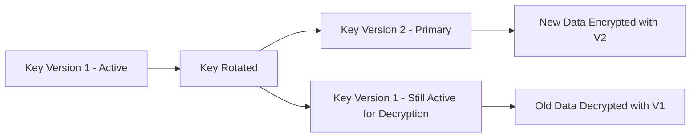

# How to Implement Customer-Managed Encryption Keys Across All Google Cloud Services

Author: [nawazdhandala](https://www.github.com/nawazdhandala)

Tags: GCP, CMEK, Cloud KMS, Encryption, Data Security

Description: A comprehensive guide to implementing Customer-Managed Encryption Keys across Google Cloud services including BigQuery, Cloud Storage, GKE, and Cloud SQL using Cloud KMS.

---

Google Cloud encrypts all data at rest by default using Google-managed keys. For many workloads, that is sufficient. But when your compliance requirements demand that you control the encryption keys - when you need the ability to revoke access to encrypted data, rotate keys on your schedule, or prove key custody to auditors - you need Customer-Managed Encryption Keys (CMEK).

CMEK gives you control over the keys used to encrypt your data while Google Cloud handles the actual encryption and decryption operations. This post covers how to implement CMEK across the most commonly used Google Cloud services.

## How CMEK Works

With CMEK, you create and manage encryption keys in Cloud KMS. Google Cloud services then use your keys to encrypt and decrypt data instead of using Google-managed keys. You retain control over:

- Key creation and deletion
- Key rotation schedule
- Key access policies (who and what can use the key)
- Key state (enable, disable, or destroy)

If you disable or destroy a CMEK key, the data encrypted with that key becomes inaccessible. This is both the power and the risk of CMEK.

## Setting Up Cloud KMS for CMEK

Before configuring individual services, you need a Cloud KMS setup. I recommend a dedicated project for key management.

This script creates a KMS project, key ring, and keys for multiple services.

```bash
# Create a dedicated project for key management
gcloud projects create my-org-kms-project --organization=123456789

# Enable the Cloud KMS API
gcloud services enable cloudkms.googleapis.com --project=my-org-kms-project

# Create a key ring in a specific region
gcloud kms keyrings create production-keyring \
  --location=us-central1 \
  --project=my-org-kms-project

# Create keys for different services
# BigQuery encryption key with 90-day rotation
gcloud kms keys create bigquery-key \
  --keyring=production-keyring \
  --location=us-central1 \
  --purpose=encryption \
  --rotation-period=7776000s \
  --next-rotation-time=$(date -u -d "+90 days" +%Y-%m-%dT%H:%M:%SZ) \
  --project=my-org-kms-project

# Cloud Storage encryption key
gcloud kms keys create storage-key \
  --keyring=production-keyring \
  --location=us-central1 \
  --purpose=encryption \
  --rotation-period=7776000s \
  --project=my-org-kms-project

# Cloud SQL encryption key
gcloud kms keys create cloudsql-key \
  --keyring=production-keyring \
  --location=us-central1 \
  --purpose=encryption \
  --project=my-org-kms-project
```

## Granting Service Agent Access to Keys

Each Google Cloud service uses a service agent to perform encryption operations. You must grant the `cloudkms.cryptoKeyEncrypterDecrypter` role to the appropriate service agent for each service.

This script grants the necessary IAM bindings for common services.

```bash
# Get the BigQuery service agent for your project
BQ_SA="bq-$(gcloud projects describe my-data-project --format='value(projectNumber)')@bigquery-encryption.iam.gserviceaccount.com"

# Grant BigQuery access to its CMEK key
gcloud kms keys add-iam-policy-binding bigquery-key \
  --keyring=production-keyring \
  --location=us-central1 \
  --project=my-org-kms-project \
  --member="serviceAccount:${BQ_SA}" \
  --role="roles/cloudkms.cryptoKeyEncrypterDecrypter"

# Get the Cloud Storage service agent
GCS_SA="service-$(gcloud projects describe my-data-project --format='value(projectNumber)')@gs-project-accounts.iam.gserviceaccount.com"

# Grant Cloud Storage access to its CMEK key
gcloud kms keys add-iam-policy-binding storage-key \
  --keyring=production-keyring \
  --location=us-central1 \
  --project=my-org-kms-project \
  --member="serviceAccount:${GCS_SA}" \
  --role="roles/cloudkms.cryptoKeyEncrypterDecrypter"

# Get the Cloud SQL service agent
SQL_SA="service-$(gcloud projects describe my-data-project --format='value(projectNumber)')@gcp-sa-cloud-sql.iam.gserviceaccount.com"

# Grant Cloud SQL access to its CMEK key
gcloud kms keys add-iam-policy-binding cloudsql-key \
  --keyring=production-keyring \
  --location=us-central1 \
  --project=my-org-kms-project \
  --member="serviceAccount:${SQL_SA}" \
  --role="roles/cloudkms.cryptoKeyEncrypterDecrypter"
```

## CMEK for Cloud Storage

Cloud Storage supports CMEK at the bucket level. All objects written to the bucket will be encrypted with the specified key.

```bash
# Create a bucket with CMEK encryption
gcloud storage buckets create gs://my-cmek-bucket \
  --location=us-central1 \
  --default-encryption-key=projects/my-org-kms-project/locations/us-central1/keyRings/production-keyring/cryptoKeys/storage-key
```

## CMEK for BigQuery

BigQuery supports CMEK at the dataset level. You set the default key when creating the dataset.

```bash
# Create a BigQuery dataset with CMEK
bq mk --dataset \
  --default_kms_key=projects/my-org-kms-project/locations/us-central1/keyRings/production-keyring/cryptoKeys/bigquery-key \
  --location=us-central1 \
  my-data-project:encrypted_dataset
```

You can also encrypt individual tables or query results with different keys.

```bash
# Create a table with a specific CMEK key
bq mk --table \
  --destination_kms_key=projects/my-org-kms-project/locations/us-central1/keyRings/production-keyring/cryptoKeys/bigquery-key \
  my-data-project:encrypted_dataset.sensitive_table \
  schema.json
```

## CMEK for Cloud SQL

Cloud SQL requires CMEK to be set at instance creation time. You cannot add CMEK to an existing instance.

```bash
# Create a Cloud SQL instance with CMEK
gcloud sql instances create encrypted-postgres \
  --database-version=POSTGRES_15 \
  --tier=db-custom-4-16384 \
  --region=us-central1 \
  --disk-encryption-key=projects/my-org-kms-project/locations/us-central1/keyRings/production-keyring/cryptoKeys/cloudsql-key \
  --project=my-data-project
```

## CMEK for GKE

GKE supports CMEK for encrypting boot disks and attached persistent disks. Cluster-level secrets can also use application-layer encryption with a Cloud KMS key.

```bash
# Create a GKE cluster with CMEK for boot disks and application-layer secret encryption
gcloud container clusters create cmek-cluster \
  --region=us-central1 \
  --boot-disk-kms-key=projects/my-org-kms-project/locations/us-central1/keyRings/production-keyring/cryptoKeys/gke-disk-key \
  --database-encryption-key=projects/my-org-kms-project/locations/us-central1/keyRings/production-keyring/cryptoKeys/gke-secrets-key \
  --project=my-gke-project
```

## Comprehensive Terraform Configuration

Here is a Terraform setup that creates KMS keys and applies CMEK across multiple services.

```hcl
# Cloud KMS key ring and keys for CMEK
resource "google_kms_key_ring" "production" {
  name     = "production-keyring"
  location = "us-central1"
  project  = "my-org-kms-project"
}

resource "google_kms_crypto_key" "storage" {
  name            = "storage-key"
  key_ring        = google_kms_key_ring.production.id
  rotation_period = "7776000s" # 90 days

  lifecycle {
    # Prevent accidental key destruction
    prevent_destroy = true
  }
}

resource "google_kms_crypto_key" "bigquery" {
  name            = "bigquery-key"
  key_ring        = google_kms_key_ring.production.id
  rotation_period = "7776000s"

  lifecycle {
    prevent_destroy = true
  }
}

# IAM binding for Cloud Storage service agent
resource "google_kms_crypto_key_iam_member" "storage_sa" {
  crypto_key_id = google_kms_crypto_key.storage.id
  role          = "roles/cloudkms.cryptoKeyEncrypterDecrypter"
  member        = "serviceAccount:service-${data.google_project.main.number}@gs-project-accounts.iam.gserviceaccount.com"
}

# Cloud Storage bucket with CMEK
resource "google_storage_bucket" "encrypted" {
  name     = "my-cmek-encrypted-bucket"
  location = "us-central1"
  project  = "my-data-project"

  encryption {
    default_kms_key_name = google_kms_crypto_key.storage.id
  }

  depends_on = [google_kms_crypto_key_iam_member.storage_sa]
}

# BigQuery dataset with CMEK
resource "google_bigquery_dataset" "encrypted" {
  dataset_id = "encrypted_dataset"
  project    = "my-data-project"
  location   = "us-central1"

  default_encryption_configuration {
    kms_key_name = google_kms_crypto_key.bigquery.id
  }
}
```

## Enforcing CMEK with Organization Policies

To ensure teams cannot create resources without CMEK, use organization policies.

```bash
# Require CMEK for Cloud Storage at the organization level
gcloud resource-manager org-policies set-policy \
  --organization=123456789 \
  cmek-policy.yaml
```

The policy file restricts which services can create non-CMEK resources.

```yaml
# cmek-policy.yaml
# Deny creation of resources without CMEK for specified services
constraint: constraints/gcp.restrictNonCmekServices
listPolicy:
  deniedValues:
    - storage.googleapis.com
    - bigquery.googleapis.com
    - sqladmin.googleapis.com
    - container.googleapis.com
```

## Key Rotation Strategy

CMEK keys should be rotated regularly. Cloud KMS supports automatic rotation, but you need to understand what happens during rotation.

When a key is rotated:
- A new key version is created and becomes the primary version
- New data is encrypted with the new primary version
- Existing data remains encrypted with the old version
- Old versions are not disabled automatically - they stay active for decryption



To re-encrypt existing data with the new key version, you need to rewrite the data. For Cloud Storage, this means rewriting objects. For BigQuery, it means copying tables.

## Monitoring CMEK Usage

Track CMEK operations through Cloud Audit Logs.

```bash
# Check recent KMS key usage in audit logs
gcloud logging read 'resource.type="cloudkms_cryptokey" AND protoPayload.methodName="Encrypt"' \
  --project=my-org-kms-project \
  --limit=20 \
  --format="table(timestamp, protoPayload.authenticationInfo.principalEmail, protoPayload.resourceName)"
```

CMEK is a foundational control for organizations with strict data sovereignty or compliance requirements. Plan your key hierarchy carefully, enforce CMEK through organization policies, and monitor key usage through audit logs. The operational overhead is modest compared to the control and auditability you gain.
