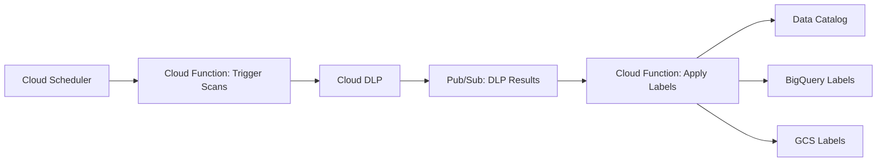

# How to Implement Data Classification and Labeling Automation in Google Cloud

Author: [nawazdhandala](https://www.github.com/nawazdhandala)

Tags: GCP, Data Classification, Cloud DLP, Data Governance, Automation

Description: A hands-on guide to automating data classification and labeling across Google Cloud resources using Cloud DLP, Data Catalog, and Cloud Functions.

---

Knowing what data you have and how sensitive it is might sound basic, but most organizations struggle with it at scale. When you have thousands of BigQuery tables, Cloud Storage buckets, and databases scattered across dozens of projects, manually classifying everything is not realistic. You need automation.

This guide covers how to build an automated data classification and labeling pipeline on Google Cloud using Cloud Data Loss Prevention (DLP), Data Catalog, and a few Cloud Functions to tie everything together.

## The Classification Strategy

Before writing any code, define your classification tiers. A common approach uses four levels:

- Public - data that can be freely shared externally
- Internal - data meant for internal use but not sensitive
- Confidential - sensitive business data requiring access controls
- Restricted - highly sensitive data like PII, PHI, or financial records

Each tier maps to specific security controls. Restricted data might require encryption with customer-managed keys, access logging, and retention policies. Internal data might just need basic IAM controls.

## Architecture Overview

The automated classification pipeline has three main components. Cloud DLP scans your data and identifies sensitive content. Cloud Functions process the DLP findings and apply labels. Data Catalog stores the classification metadata so it is searchable and auditable.



## Step 1: Set Up Cloud DLP Inspection Templates

Inspection templates define what types of sensitive data to look for. Create one template that covers all the info types relevant to your organization.

```python
from google.cloud import dlp_v2

def create_inspection_template(project_id):
    """Create a DLP inspection template covering common sensitive data types."""
    client = dlp_v2.DlpServiceClient()
    parent = f"projects/{project_id}/locations/global"

    # Define the info types to detect
    info_types = [
        {"name": "EMAIL_ADDRESS"},
        {"name": "PHONE_NUMBER"},
        {"name": "CREDIT_CARD_NUMBER"},
        {"name": "US_SOCIAL_SECURITY_NUMBER"},
        {"name": "DATE_OF_BIRTH"},
        {"name": "IP_ADDRESS"},
        {"name": "STREET_ADDRESS"},
        {"name": "PERSON_NAME"},
        {"name": "PASSPORT"},
        {"name": "MEDICAL_RECORD_NUMBER"},
    ]

    inspect_config = {
        "info_types": info_types,
        "min_likelihood": dlp_v2.Likelihood.LIKELY,
        "limits": {
            "max_findings_per_request": 1000,
            "max_findings_per_item": 100,
        },
        "include_quote": False,  # do not store the actual sensitive values
    }

    template = {
        "display_name": "Org-wide Classification Template",
        "description": "Scans for PII, financial, and health data",
        "inspect_config": inspect_config,
    }

    response = client.create_inspect_template(
        parent=parent,
        inspect_template=template,
        template_id="org-classification-template",
    )
    print(f"Created template: {response.name}")
    return response.name
```

## Step 2: Build the Scanning Trigger Function

This Cloud Function triggers DLP scans on a schedule. It discovers new or modified resources and queues them for inspection.

```python
import json
from google.cloud import dlp_v2
from google.cloud import bigquery
from google.cloud import storage

def trigger_classification_scan(event, context):
    """Triggered by Cloud Scheduler to scan resources for sensitive data."""
    dlp_client = dlp_v2.DlpServiceClient()
    bq_client = bigquery.Client()

    project_id = "your-project-id"
    template_name = f"projects/{project_id}/locations/global/inspectTemplates/org-classification-template"

    # Scan BigQuery tables
    for dataset in bq_client.list_datasets():
        for table in bq_client.list_tables(dataset.reference):
            table_ref = table.reference

            # Configure the DLP job for this table
            job_config = {
                "inspect_template_name": template_name,
                "storage_config": {
                    "big_query_options": {
                        "table_reference": {
                            "project_id": table_ref.project,
                            "dataset_id": table_ref.dataset_id,
                            "table_id": table_ref.table_id,
                        },
                        # Sample rows for large tables instead of scanning everything
                        "sample_method": "RANDOM_START",
                        "rows_limit": 10000,
                    }
                },
                "actions": [
                    {
                        # Publish results to Pub/Sub for downstream processing
                        "pub_sub": {
                            "topic": f"projects/{project_id}/topics/dlp-classification-results"
                        }
                    },
                    {
                        # Also save full results to BigQuery for analysis
                        "save_findings": {
                            "output_config": {
                                "table": {
                                    "project_id": project_id,
                                    "dataset_id": "dlp_results",
                                    "table_id": "classification_findings",
                                }
                            }
                        }
                    }
                ],
            }

            # Create the DLP inspection job
            response = dlp_client.create_dlp_job(
                parent=f"projects/{project_id}/locations/us-central1",
                inspect_job=job_config,
            )
            print(f"Started DLP job for {table_ref}: {response.name}")
```

## Step 3: Process DLP Results and Apply Labels

When DLP findings arrive via Pub/Sub, this function determines the classification level and applies labels.

```python
import base64
import json
from google.cloud import bigquery
from google.cloud import datacatalog_v1
from google.cloud import dlp_v2

# Classification rules based on info types found
CLASSIFICATION_RULES = {
    "RESTRICTED": [
        "US_SOCIAL_SECURITY_NUMBER",
        "CREDIT_CARD_NUMBER",
        "MEDICAL_RECORD_NUMBER",
        "PASSPORT",
    ],
    "CONFIDENTIAL": [
        "DATE_OF_BIRTH",
        "PERSON_NAME",
        "STREET_ADDRESS",
        "PHONE_NUMBER",
    ],
    "INTERNAL": [
        "EMAIL_ADDRESS",
        "IP_ADDRESS",
    ],
}

def determine_classification(info_types_found):
    """Determine the highest classification level based on findings."""
    for level in ["RESTRICTED", "CONFIDENTIAL", "INTERNAL"]:
        for info_type in CLASSIFICATION_RULES[level]:
            if info_type in info_types_found:
                return level
    return "PUBLIC"

def apply_classification_labels(event, context):
    """Process DLP findings and apply classification labels."""
    # Decode the Pub/Sub message
    message = json.loads(base64.b64decode(event["data"]).decode())

    dlp_client = dlp_v2.DlpServiceClient()
    bq_client = bigquery.Client()
    dc_client = datacatalog_v1.DataCatalogClient()

    # Get the full DLP job results
    job_name = message.get("dlpJob", {}).get("name")
    job = dlp_client.get_dlp_job(request={"name": job_name})

    # Extract the info types that were found
    info_types_found = set()
    for info_type_stats in job.inspect_details.result.info_type_stats:
        if info_type_stats.count > 0:
            info_types_found.add(info_type_stats.info_type.name)

    # Determine the classification level
    classification = determine_classification(info_types_found)

    # Get the resource that was scanned
    storage_config = job.inspect_details.requested_options.job_config.storage_config
    if storage_config.big_query_options:
        table_ref = storage_config.big_query_options.table_reference

        # Apply labels to the BigQuery table
        apply_bigquery_labels(
            bq_client, table_ref, classification, info_types_found
        )

        # Create or update Data Catalog entry
        update_data_catalog_tag(
            dc_client, table_ref, classification, info_types_found
        )

def apply_bigquery_labels(client, table_ref, classification, info_types):
    """Apply classification labels to a BigQuery table."""
    table_id = f"{table_ref.project_id}.{table_ref.dataset_id}.{table_ref.table_id}"
    table = client.get_table(table_id)

    # Set labels on the table
    labels = dict(table.labels) if table.labels else {}
    labels["data_classification"] = classification.lower()
    labels["has_pii"] = "true" if classification in ["RESTRICTED", "CONFIDENTIAL"] else "false"
    labels["last_scanned"] = "2026-02-17"

    table.labels = labels
    client.update_table(table, ["labels"])
    print(f"Applied {classification} label to {table_id}")
```

## Step 4: Create a Data Catalog Tag Template

Data Catalog provides richer metadata than simple labels. Create a tag template for classification information.

```python
def create_classification_tag_template(project_id, location="us-central1"):
    """Create a Data Catalog tag template for classification metadata."""
    client = datacatalog_v1.DataCatalogClient()
    parent = f"projects/{project_id}/locations/{location}"

    tag_template = datacatalog_v1.TagTemplate()
    tag_template.display_name = "Data Classification"

    # Classification level field
    level_field = datacatalog_v1.TagTemplateField()
    level_field.display_name = "Classification Level"
    level_field.type_.enum_type.allowed_values = [
        datacatalog_v1.FieldType.EnumType.EnumValue(display_name="PUBLIC"),
        datacatalog_v1.FieldType.EnumType.EnumValue(display_name="INTERNAL"),
        datacatalog_v1.FieldType.EnumType.EnumValue(display_name="CONFIDENTIAL"),
        datacatalog_v1.FieldType.EnumType.EnumValue(display_name="RESTRICTED"),
    ]
    level_field.is_required = True
    tag_template.fields["classification_level"] = level_field

    # Sensitive data types found
    types_field = datacatalog_v1.TagTemplateField()
    types_field.display_name = "Sensitive Data Types Found"
    types_field.type_.primitive_type = datacatalog_v1.FieldType.PrimitiveType.STRING
    tag_template.fields["sensitive_types"] = types_field

    # Last scan date
    scan_field = datacatalog_v1.TagTemplateField()
    scan_field.display_name = "Last Classification Scan"
    scan_field.type_.primitive_type = datacatalog_v1.FieldType.PrimitiveType.TIMESTAMP
    tag_template.fields["last_scan_date"] = scan_field

    response = client.create_tag_template(
        parent=parent,
        tag_template_id="data_classification",
        tag_template=tag_template,
    )
    print(f"Created tag template: {response.name}")
```

## Step 5: Schedule Regular Scans

Set up Cloud Scheduler to run classification scans on a regular basis, catching new data as it arrives.

```bash
# Run classification scans daily at 2 AM
gcloud scheduler jobs create pubsub classification-scan \
  --schedule="0 2 * * *" \
  --topic=trigger-classification-scan \
  --message-body='{"scan_type": "full"}' \
  --location=us-central1 \
  --time-zone="UTC"
```

## Querying Classification Results

Once classification labels are in place, you can query across your entire data landscape to find all restricted data or generate compliance reports.

```sql
-- Find all tables classified as RESTRICTED
SELECT
  table_catalog AS project,
  table_schema AS dataset,
  table_name,
  option_value AS labels
FROM `region-us`.INFORMATION_SCHEMA.TABLE_OPTIONS
WHERE option_name = 'labels'
AND option_value LIKE '%restricted%';
```

Automating data classification removes the human bottleneck from data governance. Once the pipeline is running, every new table and bucket gets classified automatically, and you always have an up-to-date inventory of where your sensitive data lives. This makes compliance audits far less painful and helps you enforce the right security controls on the right data.
