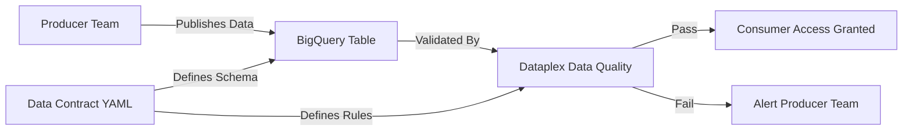

# How to Implement Data Contracts Between Producer and Consumer Teams Using Dataplex

Author: [nawazdhandala](https://www.github.com/nawazdhandala)

Tags: GCP, Dataplex, Data Contracts, Data Governance, Data Quality

Description: Implement data contracts between producer and consumer teams using Google Cloud Dataplex for reliable data quality and governance at scale.

---

Data contracts solve one of the most frustrating problems in data engineering: the producer team changes their schema or data format, and everything downstream breaks. Without explicit agreements about what data looks like, data pipelines are fragile. A data contract is a formal agreement between a data producer and its consumers about the structure, quality, and semantics of shared data.

Google Cloud Dataplex provides the tools to enforce these contracts through data quality rules, schema management, and automated validation. Let's build a practical data contract system using Dataplex.

## What Goes Into a Data Contract

A data contract should define several things clearly:

- The schema (column names, types, nullable constraints)
- Data quality expectations (freshness, completeness, uniqueness, valid ranges)
- SLAs for data availability
- Ownership and escalation paths
- Versioning and change management procedures



## Defining the Contract as Code

Store your data contracts as YAML files in version control. This makes them reviewable, versioned, and enforceable.

```yaml
# contracts/customer_events.yaml
# Data contract for the customer_events table
contract:
  name: customer_events
  version: "2.1"
  owner:
    team: platform-engineering
    email: platform@company.com
    slack: "#platform-data"

  description: >
    Customer interaction events from the web and mobile applications.
    Published every 15 minutes with a maximum latency of 30 minutes.

  source:
    project: production-data
    dataset: events
    table: customer_events

  schema:
    columns:
      - name: event_id
        type: STRING
        mode: REQUIRED
        description: Unique identifier for each event
      - name: customer_id
        type: STRING
        mode: REQUIRED
        description: Customer identifier, links to customer master
      - name: event_type
        type: STRING
        mode: REQUIRED
        description: Type of event (page_view, click, purchase, etc.)
        allowed_values: [page_view, click, purchase, sign_up, sign_out]
      - name: event_timestamp
        type: TIMESTAMP
        mode: REQUIRED
        description: When the event occurred
      - name: properties
        type: JSON
        mode: NULLABLE
        description: Event-specific properties as JSON

  quality_rules:
    freshness:
      max_age_minutes: 30
      check_column: event_timestamp
    completeness:
      required_columns: [event_id, customer_id, event_type, event_timestamp]
      max_null_percentage: 0
    uniqueness:
      columns: [event_id]
      tolerance: 0  # No duplicates allowed
    validity:
      - column: event_type
        rule: IN ('page_view', 'click', 'purchase', 'sign_up', 'sign_out')
      - column: event_timestamp
        rule: "event_timestamp >= TIMESTAMP_SUB(CURRENT_TIMESTAMP(), INTERVAL 24 HOUR)"

  sla:
    availability: 99.9
    max_latency_minutes: 30
    update_frequency: "every 15 minutes"

  consumers:
    - team: analytics
      access_level: reader
      use_case: Dashboard and reporting
    - team: ml-engineering
      access_level: reader
      use_case: Feature engineering for recommendation models
```

## Setting Up Dataplex Data Quality Scans

Dataplex provides automated data quality scanning that maps directly to contract rules. Create quality scans that enforce your contract.

```bash
# Create a Dataplex lake and zone for governed data
gcloud dataplex lakes create production-lake \
  --location=us-central1 \
  --display-name="Production Data Lake"

gcloud dataplex zones create curated-zone \
  --lake=production-lake \
  --location=us-central1 \
  --type=CURATED \
  --resource-location-type=SINGLE_REGION \
  --display-name="Curated Data Zone"
```

Now create a data quality scan based on the contract rules.

```python
# create_quality_scan.py - Create Dataplex data quality scan from contract
from google.cloud import dataplex_v1
import yaml

def create_scan_from_contract(contract_path, project_id, location):
    """Create a Dataplex data quality scan from a contract YAML file."""

    # Load the contract definition
    with open(contract_path) as f:
        contract = yaml.safe_load(f)["contract"]

    client = dataplex_v1.DataScanServiceClient()
    parent = f"projects/{project_id}/locations/{location}"

    source = contract["source"]
    table_ref = f"//bigquery.googleapis.com/projects/{source['project']}/datasets/{source['dataset']}/tables/{source['table']}"

    # Build quality rules from the contract
    rules = []

    # Freshness rule
    freshness = contract["quality_rules"].get("freshness", {})
    if freshness:
        rules.append(dataplex_v1.DataQualityRule(
            freshness_expectation=dataplex_v1.DataQualityRule.FreshnessExpectation(
                # Not directly supported, use custom SQL
            ),
            column=freshness["check_column"],
            dimension="FRESHNESS",
        ))

    # Completeness rules - check for nulls on required columns
    completeness = contract["quality_rules"].get("completeness", {})
    for col in completeness.get("required_columns", []):
        rules.append(dataplex_v1.DataQualityRule(
            non_null_expectation=dataplex_v1.DataQualityRule.NonNullExpectation(),
            column=col,
            dimension="COMPLETENESS",
        ))

    # Uniqueness rules
    uniqueness = contract["quality_rules"].get("uniqueness", {})
    for col in uniqueness.get("columns", []):
        rules.append(dataplex_v1.DataQualityRule(
            uniqueness_expectation=dataplex_v1.DataQualityRule.UniquenessExpectation(),
            column=col,
            dimension="UNIQUENESS",
        ))

    # Validity rules using SQL expressions
    for validity_rule in contract["quality_rules"].get("validity", []):
        rules.append(dataplex_v1.DataQualityRule(
            row_condition_expectation=dataplex_v1.DataQualityRule.RowConditionExpectation(
                sql_expression=validity_rule["rule"],
            ),
            column=validity_rule["column"],
            dimension="VALIDITY",
        ))

    # Create the data quality scan
    scan = dataplex_v1.DataScan(
        data=dataplex_v1.DataSource(
            resource=table_ref,
        ),
        data_quality_spec=dataplex_v1.DataQualitySpec(
            rules=rules,
            sampling_percent=100.0,  # Scan all rows
        ),
        description=contract.get("description", ""),
        display_name=f"Contract: {contract['name']} v{contract['version']}",
    )

    scan_id = f"contract-{contract['name'].replace('_', '-')}"
    operation = client.create_data_scan(
        parent=parent,
        data_scan=scan,
        data_scan_id=scan_id,
    )

    result = operation.result()
    print(f"Created scan: {result.name}")
    return result
```

## Scheduling Contract Validation

Run contract validation checks on a schedule that matches the SLA.

```bash
# Schedule the data quality scan to run every 15 minutes
gcloud dataplex datascans create data-quality contract-customer-events \
  --location=us-central1 \
  --data-source-resource="//bigquery.googleapis.com/projects/production-data/datasets/events/tables/customer_events" \
  --schedule-cron="*/15 * * * *" \
  --data-quality-spec-file=quality-rules.json
```

## Alerting on Contract Violations

When a quality scan fails, alert both the producer and consumer teams.

```python
# contract_monitor.py - Monitor contract violations and alert
import functions_framework
from google.cloud import dataplex_v1
from google.cloud import pubsub_v1
import json
import logging

logger = logging.getLogger(__name__)
publisher = pubsub_v1.PublisherClient()


@functions_framework.http
def check_contract_violations(request):
    """Check recent scan results and alert on failures."""
    client = dataplex_v1.DataScanServiceClient()
    project = "your-project"
    location = "us-central1"

    # List all contract scans
    parent = f"projects/{project}/locations/{location}"
    scans = client.list_data_scans(parent=parent)

    violations = []

    for scan in scans:
        if not scan.display_name.startswith("Contract:"):
            continue

        # Get the latest job result
        jobs = client.list_data_scan_jobs(parent=scan.name)
        latest_job = None
        for job in jobs:
            latest_job = job
            break  # First result is the latest

        if latest_job and latest_job.data_quality_result:
            result = latest_job.data_quality_result
            if not result.passed:
                # Contract violation detected
                failed_rules = [
                    r for r in result.rules
                    if not r.passed
                ]

                violation = {
                    "contract": scan.display_name,
                    "scan_time": str(latest_job.end_time),
                    "failed_rules": [
                        {
                            "dimension": r.rule.dimension,
                            "column": r.rule.column,
                            "pass_ratio": r.pass_ratio,
                        }
                        for r in failed_rules
                    ],
                }
                violations.append(violation)

                # Publish violation alert
                topic_path = publisher.topic_path(project, "contract-violations")
                publisher.publish(
                    topic_path,
                    json.dumps(violation).encode("utf-8"),
                )

    return json.dumps({"violations": violations}), 200
```

## Schema Evolution and Versioning

When a producer needs to change the schema, the contract version must be updated and consumers notified.

```python
# schema_validator.py - Validate schema changes against the contract
from google.cloud import bigquery

def validate_schema_change(contract, new_schema):
    """Check if a proposed schema change is backward compatible."""
    current_columns = {c["name"]: c for c in contract["schema"]["columns"]}
    issues = []

    for col_name, col_def in current_columns.items():
        if col_name not in {c.name for c in new_schema}:
            if col_def.get("mode") == "REQUIRED":
                issues.append(f"Breaking change: Required column '{col_name}' removed")

    # Check for type changes on existing columns
    for new_col in new_schema:
        if new_col.name in current_columns:
            old_type = current_columns[new_col.name]["type"]
            if new_col.field_type != old_type:
                issues.append(
                    f"Type change on '{new_col.name}': {old_type} -> {new_col.field_type}"
                )

    return issues
```

## Consumer Access Control

Use Dataplex to manage which teams can access contracted data.

```bash
# Grant consumer team read access through Dataplex
gcloud dataplex zones add-iam-policy-binding curated-zone \
  --lake=production-lake \
  --location=us-central1 \
  --member="group:analytics-team@company.com" \
  --role="roles/dataplex.dataReader"
```

## Wrapping Up

Data contracts bring discipline to data sharing between teams. By defining contracts as code, enforcing them with Dataplex quality scans, and alerting on violations, you create a system where producers and consumers have clear expectations. The contract YAML becomes the single source of truth for what data should look like, and Dataplex ensures it actually does. This approach scales across dozens of teams and hundreds of datasets, preventing the cascade of broken pipelines that comes from undocumented data changes.
