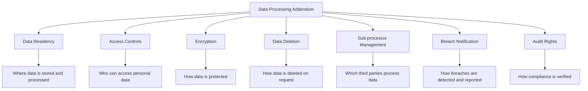

# How to Implement Data Processing Addendum Requirements on Google Cloud

Author: [nawazdhandala](https://www.github.com/nawazdhandala)

Tags: GCP, Data Processing, GDPR, Privacy, Google Cloud Compliance

Description: A practical guide to implementing Data Processing Addendum (DPA) requirements on Google Cloud, covering data residency, processing controls, and privacy compliance.

---

When your organization processes personal data on Google Cloud, you need a Data Processing Addendum (DPA) that defines how that data is handled. The DPA is not just a legal document you sign and forget - it contains specific technical requirements that you need to implement in your cloud environment. Whether you are meeting GDPR, CCPA, or other privacy regulations, the technical controls supporting your DPA are what make it enforceable.

This guide covers the practical GCP configurations needed to satisfy common DPA requirements.

## Understanding DPA Requirements

A typical DPA covers these technical areas:



## Data Residency Controls

Most DPAs specify where personal data can be stored and processed. On GCP, enforce this with organization policies:

```bash
# Restrict resources to EU locations for GDPR compliance
gcloud resource-manager org-policies set-policy - \
    --folder=EU_DATA_FOLDER_ID <<'EOF'
constraint: constraints/gcp.resourceLocations
listPolicy:
  allowedValues:
    - "in:eu-locations"
EOF

# For more specific control, restrict to individual regions
gcloud resource-manager org-policies set-policy - \
    --folder=EU_DATA_FOLDER_ID <<'EOF'
constraint: constraints/gcp.resourceLocations
listPolicy:
  allowedValues:
    - "europe-west1"
    - "europe-west3"
    - "europe-west4"
EOF
```

Verify that existing resources comply:

```bash
# List all resources and their locations using Cloud Asset Inventory
gcloud asset search-all-resources \
    --scope=folders/EU_DATA_FOLDER_ID \
    --format="table(name, assetType, location)" \
    --order-by="location"
```

## Access Controls for Personal Data

DPAs require that only authorized personnel can access personal data. Implement this with strict IAM policies:

```bash
# Create a custom role for personal data access
gcloud iam roles create personalDataProcessor \
    --project=data-processing-project \
    --title="Personal Data Processor" \
    --description="Access to process personal data per DPA requirements" \
    --permissions=\
bigquery.tables.getData,\
bigquery.jobs.create,\
storage.objects.get,\
storage.objects.list

# Grant access only to the data processing team
gcloud projects add-iam-policy-binding data-processing-project \
    --role=projects/data-processing-project/roles/personalDataProcessor \
    --member="group:data-processing-team@company.com"

# Deny all other access to personal data storage
# Use VPC Service Controls to create a data perimeter
gcloud access-context-manager perimeters create personal-data-perimeter \
    --policy=POLICY_ID \
    --title="Personal Data Processing Perimeter" \
    --resources="projects/DATA_PROJECT_NUMBER" \
    --restricted-services="bigquery.googleapis.com,storage.googleapis.com" \
    --access-levels="accessPolicies/POLICY_ID/accessLevels/authorized-processors"
```

Create an access level that requires specific conditions:

```yaml
# authorized-processors.yaml
# Only users from specific groups on managed devices can access personal data
conditions:
  - members:
      - "group:data-processing-team@company.com"
    requiredAccessLevels:
      - "accessPolicies/POLICY_ID/accessLevels/managed-device"
    ipSubnetworks:
      - "203.0.113.0/24"  # Corporate office IP range
```

## Encryption Requirements

DPAs typically require encryption at rest and in transit. GCP encrypts data by default, but you may need to manage your own keys:

```bash
# Create customer-managed encryption keys for personal data
gcloud kms keyrings create personal-data-keyring \
    --location=europe-west1 \
    --project=data-processing-project

gcloud kms keys create personal-data-key \
    --keyring=personal-data-keyring \
    --location=europe-west1 \
    --purpose=encryption \
    --rotation-period=90d \
    --project=data-processing-project

# Create encrypted storage for personal data
gcloud storage buckets create gs://personal-data-eu \
    --project=data-processing-project \
    --location=europe-west1 \
    --default-encryption-key=projects/data-processing-project/locations/europe-west1/keyRings/personal-data-keyring/cryptoKeys/personal-data-key \
    --uniform-bucket-level-access

# Enforce CMEK for all services in the folder
gcloud resource-manager org-policies set-policy - \
    --folder=EU_DATA_FOLDER_ID <<'EOF'
constraint: constraints/gcp.restrictNonCmekServices
listPolicy:
  deniedValues:
    - "storage.googleapis.com"
    - "bigquery.googleapis.com"
    - "compute.googleapis.com"
EOF
```

## Data Deletion and Retention

DPAs require the ability to delete personal data on request. Build automated deletion capabilities:

```python
# data_deletion.py
# Handles data deletion requests per DPA requirements
# Triggered by a data subject request via API or Pub/Sub

import functions_framework
from google.cloud import bigquery
from google.cloud import storage
from google.cloud import firestore
from datetime import datetime
import json
import logging

bq_client = bigquery.Client()
storage_client = storage.Client()
db = firestore.Client()

@functions_framework.http
def process_deletion_request(request):
    """Process a data deletion request for a specific data subject."""

    request_data = request.get_json()
    subject_id = request_data.get('subject_id')
    subject_email = request_data.get('email')
    request_id = request_data.get('request_id')

    if not subject_id or not request_id:
        return json.dumps({'error': 'Missing subject_id or request_id'}), 400

    deletion_log = {
        'request_id': request_id,
        'subject_id': subject_id,
        'requested_at': datetime.utcnow().isoformat(),
        'steps': []
    }

    # Step 1: Delete from BigQuery
    try:
        delete_query = f"""
        DELETE FROM `data-processing-project.user_data.profiles`
        WHERE user_id = @subject_id
        """
        job_config = bigquery.QueryJobConfig(
            query_parameters=[
                bigquery.ScalarQueryParameter("subject_id", "STRING", subject_id)
            ]
        )
        job = bq_client.query(delete_query, job_config=job_config)
        job.result()
        deletion_log['steps'].append({
            'system': 'bigquery_profiles',
            'status': 'deleted',
            'rows_affected': job.num_dml_affected_rows
        })
    except Exception as e:
        deletion_log['steps'].append({
            'system': 'bigquery_profiles',
            'status': 'error',
            'detail': str(e)
        })

    # Step 2: Delete from Cloud Storage
    try:
        bucket = storage_client.bucket('personal-data-eu')
        blobs = bucket.list_blobs(prefix=f"users/{subject_id}/")
        deleted_count = 0
        for blob in blobs:
            blob.delete()
            deleted_count += 1
        deletion_log['steps'].append({
            'system': 'cloud_storage',
            'status': 'deleted',
            'objects_deleted': deleted_count
        })
    except Exception as e:
        deletion_log['steps'].append({
            'system': 'cloud_storage',
            'status': 'error',
            'detail': str(e)
        })

    # Step 3: Delete from Firestore
    try:
        doc_ref = db.collection('users').document(subject_id)
        doc_ref.delete()
        deletion_log['steps'].append({
            'system': 'firestore',
            'status': 'deleted'
        })
    except Exception as e:
        deletion_log['steps'].append({
            'system': 'firestore',
            'status': 'error',
            'detail': str(e)
        })

    # Log the deletion for audit purposes
    deletion_log['completed_at'] = datetime.utcnow().isoformat()
    db.collection('deletion_audit_log').document(request_id).set(deletion_log)

    return json.dumps(deletion_log)
```

Set up retention policies for automated data lifecycle management:

```bash
# Set retention policy on storage buckets
# Data older than the retention period is automatically deleted
gcloud storage buckets update gs://personal-data-eu \
    --lifecycle-file=lifecycle-config.json
```

```json
{
  "rule": [
    {
      "action": {"type": "Delete"},
      "condition": {
        "age": 730,
        "matchesPrefix": ["temp-processing/"]
      }
    },
    {
      "action": {"type": "Delete"},
      "condition": {
        "age": 2555,
        "matchesPrefix": ["archived/"]
      }
    }
  ]
}
```

## Sub-Processor Management

DPAs require tracking which sub-processors handle personal data:

```bash
# Use Cloud Asset Inventory to track all services that process data
gcloud asset search-all-resources \
    --scope=folders/EU_DATA_FOLDER_ID \
    --asset-types="sqladmin.googleapis.com/Instance,bigquery.googleapis.com/Dataset,storage.googleapis.com/Bucket" \
    --format="table(name, assetType, location, createTime)"
```

## Breach Detection and Notification

DPAs require breach notification within specific timeframes (72 hours for GDPR):

```bash
# Enable Security Command Center for breach detection
gcloud scc settings update \
    --organization=123456789 \
    --enable-modules=SECURITY_HEALTH_ANALYTICS,EVENT_THREAT_DETECTION

# Create notification for potential breaches
gcloud scc notifications create breach-alerts \
    --organization=123456789 \
    --filter='severity="CRITICAL" AND (category="DATA_EXFILTRATION" OR category="ANOMALOUS_ACCESS")' \
    --pubsub-topic=projects/data-processing-project/topics/breach-notifications
```

## Audit Logging for DPA Compliance

```bash
# Enable comprehensive audit logging
# All data access must be logged for DPA compliance
gcloud projects set-iam-policy data-processing-project - <<'EOF'
auditConfigs:
  - service: allServices
    auditLogConfigs:
      - logType: ADMIN_READ
      - logType: DATA_READ
      - logType: DATA_WRITE
EOF

# Export audit logs for retention
gcloud logging sinks create dpa-audit-sink \
    storage.googleapis.com/dpa-audit-logs \
    --project=data-processing-project \
    --log-filter='logName:"cloudaudit.googleapis.com"'
```

## Terraform Configuration

```hcl
# Data residency organization policy
resource "google_folder_organization_policy" "data_residency" {
  folder     = google_folder.eu_data.name
  constraint = "constraints/gcp.resourceLocations"

  list_policy {
    allow {
      values = ["in:eu-locations"]
    }
  }
}

# CMEK enforcement
resource "google_folder_organization_policy" "require_cmek" {
  folder     = google_folder.eu_data.name
  constraint = "constraints/gcp.restrictNonCmekServices"

  list_policy {
    deny {
      values = [
        "storage.googleapis.com",
        "bigquery.googleapis.com",
      ]
    }
  }
}

# VPC Service Controls for data perimeter
resource "google_access_context_manager_service_perimeter" "data" {
  parent = "accessPolicies/${var.policy_id}"
  name   = "accessPolicies/${var.policy_id}/servicePerimeters/personal_data"
  title  = "Personal Data Perimeter"

  status {
    resources           = ["projects/${var.project_number}"]
    restricted_services = [
      "bigquery.googleapis.com",
      "storage.googleapis.com",
    ]
    access_levels = [
      "accessPolicies/${var.policy_id}/accessLevels/authorized-processors"
    ]
  }
}
```

## Regular Compliance Activities

Maintaining DPA compliance requires ongoing effort:

1. **Monthly** - Review access logs, verify data residency compliance
2. **Quarterly** - Conduct access reviews, update sub-processor list
3. **On request** - Process data subject access and deletion requests within required timeframes
4. **Annually** - Review and update DPA terms, conduct privacy impact assessments

The technical controls on GCP provide the foundation for DPA compliance, but they must be paired with documented processes, trained staff, and regular reviews. Build the automation early so that when data subject requests come in or auditors need evidence, you have everything ready.
