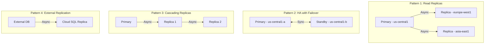

# How to Implement Database Replication Patterns Between Cloud SQL Instances Across GCP Regions

Author: [nawazdhandala](https://www.github.com/nawazdhandala)

Tags: GCP, Cloud SQL, Database Replication, Cross-Region, High Availability, PostgreSQL

Description: Explore and implement different database replication patterns between Cloud SQL instances across GCP regions for high availability, read scaling, and disaster recovery.

---

Database replication is the practice of maintaining copies of your data across multiple database instances. On Google Cloud, Cloud SQL supports several replication patterns, each suited to different requirements. Whether you need read scaling, disaster recovery, or migration with zero downtime, understanding these patterns and when to use each one is fundamental to building reliable data infrastructure.

In this post, I will cover the major replication patterns available with Cloud SQL, show you how to set them up, and explain the tradeoffs of each approach.

## Replication Patterns Overview



## Pattern 1: Cross-Region Read Replicas

This is the most common pattern. The primary handles all writes, and read replicas in other regions serve read queries with lower latency for users in those regions.

```bash
# Create the primary instance
gcloud sql instances create primary-db \
  --database-version=POSTGRES_15 \
  --tier=db-custom-4-16384 \
  --region=us-central1 \
  --availability-type=REGIONAL

# Create cross-region read replicas
gcloud sql instances create replica-eu \
  --master-instance-name=primary-db \
  --region=europe-west1 \
  --tier=db-custom-4-16384 \
  --availability-type=ZONAL

gcloud sql instances create replica-asia \
  --master-instance-name=primary-db \
  --region=asia-east1 \
  --tier=db-custom-4-16384 \
  --availability-type=ZONAL
```

The application routes reads to the nearest replica and writes to the primary.

```python
# read_replica_routing.py
import os
from sqlalchemy import create_engine, text

class ReplicaRouter:
    """Routes queries to the appropriate database instance."""

    def __init__(self):
        # Primary for writes
        self.primary = create_engine(
            self._build_url(os.environ['PRIMARY_INSTANCE']),
            pool_size=10,
            pool_pre_ping=True,
        )

        # Replicas for reads, keyed by region
        self.replicas = {}
        for region_config in os.environ.get('REPLICAS', '').split(';'):
            if not region_config:
                continue
            region, instance = region_config.split('=')
            self.replicas[region] = create_engine(
                self._build_url(instance),
                pool_size=10,
                pool_pre_ping=True,
            )

        # Determine which replica is closest to this service instance
        self.local_region = os.environ.get('REGION', 'us-central1')

    def _build_url(self, instance_connection_name):
        user = os.environ['DB_USER']
        password = os.environ['DB_PASS']
        database = os.environ['DB_NAME']
        return f'postgresql+pg8000://{user}:{password}@/{database}?unix_sock=/cloudsql/{instance_connection_name}/.s.PGSQL.5432'

    def get_read_connection(self):
        """Get a connection to the nearest read replica."""
        # Try the local replica first
        if self.local_region in self.replicas:
            try:
                return self.replicas[self.local_region].connect()
            except Exception:
                pass

        # Fall back to any available replica
        for region, engine in self.replicas.items():
            try:
                return engine.connect()
            except Exception:
                continue

        # Last resort: read from the primary
        return self.primary.connect()

    def get_write_connection(self):
        """Get a connection to the primary for write operations."""
        return self.primary.connect()
```

## Pattern 2: High Availability Within a Region

Cloud SQL HA uses synchronous replication to a standby in a different zone within the same region. Failover is automatic and typically takes 30-120 seconds.

```bash
# Create an HA instance (or upgrade an existing one)
gcloud sql instances create ha-db \
  --database-version=POSTGRES_15 \
  --tier=db-custom-4-16384 \
  --region=us-central1 \
  --availability-type=REGIONAL

# To upgrade an existing instance to HA
gcloud sql instances patch existing-db \
  --availability-type=REGIONAL
```

Monitor the HA status and failover events.

```python
# monitor_ha.py
from google.cloud import monitoring_v3
import time

def check_failover_events(project_id, instance_id, hours_back=24):
    """Check for recent failover events on a Cloud SQL instance."""
    client = monitoring_v3.MetricServiceClient()
    project_name = f'projects/{project_id}'

    now = time.time()
    interval = monitoring_v3.TimeInterval({
        'end_time': {'seconds': int(now)},
        'start_time': {'seconds': int(now - hours_back * 3600)},
    })

    # Query for failover-related metrics
    results = client.list_time_series(
        request={
            'name': project_name,
            'filter': (
                f'metric.type="cloudsql.googleapis.com/database/available_for_failover" '
                f'AND resource.labels.database_id="{project_id}:{instance_id}"'
            ),
            'interval': interval,
        }
    )

    for series in results:
        for point in series.points:
            if not point.value.bool_value:
                print(f'WARNING: Instance not available for failover at {point.interval.end_time}')
```

## Pattern 3: Cascading Replicas

When you need replicas of replicas, cascading replication reduces the load on the primary. The primary replicates to a first-tier replica, which then replicates to second-tier replicas.

```bash
# Create the first-tier replica (replicates from primary)
gcloud sql instances create tier1-replica \
  --master-instance-name=primary-db \
  --region=us-east1 \
  --tier=db-custom-4-16384

# Create second-tier replicas that replicate from the first-tier
# Note: Cloud SQL supports cascading replicas for MySQL
# For PostgreSQL, each replica must connect to the primary directly
# Use external replication for cascading PostgreSQL replicas

gcloud sql instances create tier2-replica-a \
  --master-instance-name=primary-db \
  --region=europe-west1 \
  --tier=db-custom-2-8192

gcloud sql instances create tier2-replica-b \
  --master-instance-name=primary-db \
  --region=asia-east1 \
  --tier=db-custom-2-8192
```

## Pattern 4: External Replication for Migration

When migrating from an external database to Cloud SQL, set up external replication to keep both systems in sync during the transition.

```bash
# Create a Cloud SQL instance configured as an external replica
gcloud sql instances create migration-target \
  --database-version=POSTGRES_15 \
  --tier=db-custom-4-16384 \
  --region=us-central1

# Configure the external primary connection
gcloud sql instances patch migration-target \
  --source-ip-address=203.0.113.10 \
  --source-port=5432
```

Set up the replication from your external PostgreSQL to Cloud SQL.

```sql
-- On the external primary, create a replication user
CREATE USER replication_user WITH REPLICATION LOGIN PASSWORD 'secure-password';

-- Grant necessary permissions
GRANT SELECT ON ALL TABLES IN SCHEMA public TO replication_user;

-- Configure pg_hba.conf to allow the Cloud SQL IP
-- host replication replication_user CLOUD_SQL_IP/32 md5
```

## Monitoring Replication Health

Track replication lag across all patterns to ensure data freshness.

```python
# replication_monitor.py
from google.cloud import monitoring_v3
from google.cloud import sqladmin_v1beta4
import time

def get_all_replica_lag(project_id):
    """Get replication lag for all replicas in the project."""
    sql_client = sqladmin_v1beta4.SqlAdminServiceClient()
    monitoring_client = monitoring_v3.MetricServiceClient()

    # List all instances
    instances = sql_client.list(project=project_id)

    replicas = []
    for instance in instances.items:
        if instance.instance_type == 'READ_REPLICA_INSTANCE':
            lag = get_replica_lag(
                monitoring_client,
                project_id,
                instance.name,
            )
            replicas.append({
                'name': instance.name,
                'region': instance.region,
                'master': instance.master_instance_name,
                'lag_bytes': lag,
                'status': 'healthy' if lag < 10 * 1024 * 1024 else 'lagging',
            })

    return replicas

def get_replica_lag(client, project_id, instance_name):
    """Get the replication lag in bytes for a specific replica."""
    project_name = f'projects/{project_id}'
    now = time.time()

    interval = monitoring_v3.TimeInterval({
        'end_time': {'seconds': int(now)},
        'start_time': {'seconds': int(now - 300)},
    })

    results = client.list_time_series(
        request={
            'name': project_name,
            'filter': (
                f'metric.type="cloudsql.googleapis.com/database/postgresql/replication/replica_byte_lag" '
                f'AND resource.labels.database_id="{project_id}:{instance_name}"'
            ),
            'interval': interval,
        }
    )

    for series in results:
        for point in series.points:
            return point.value.int64_value

    return -1  # Unknown
```

## Handling Replication Conflicts

With asynchronous replication, there is always a window where the replica is behind the primary. Your application needs to handle this.

```python
# consistency_helper.py
import time

class ConsistencyHelper:
    """Helpers for dealing with replication lag in read-after-write scenarios."""

    def __init__(self, router):
        self.router = router

    def read_after_write(self, query, params=None, max_wait_seconds=5):
        """Read from primary immediately after a write to avoid stale data.

        Falls back to replica reads after a short wait period.
        """
        # For read-after-write consistency, read from the primary
        with self.router.get_write_connection() as conn:
            result = conn.execute(query, params)
            return result.fetchall()

    def read_with_minimum_freshness(self, query, params=None, max_lag_seconds=5):
        """Read from replica only if replication lag is acceptable.

        If the replica is too far behind, read from primary instead.
        """
        # Check replica lag before routing the read
        lag = self.get_replica_lag()
        if lag > max_lag_seconds:
            # Replica is too far behind, use primary
            with self.router.get_write_connection() as conn:
                result = conn.execute(query, params)
                return result.fetchall()
        else:
            with self.router.get_read_connection() as conn:
                result = conn.execute(query, params)
                return result.fetchall()

    def get_replica_lag(self):
        """Query the replica for its current replication lag."""
        with self.router.get_read_connection() as conn:
            result = conn.execute(
                "SELECT EXTRACT(EPOCH FROM (now() - pg_last_xact_replay_timestamp()))::INT"
            )
            row = result.fetchone()
            return row[0] if row and row[0] else 0
```

## Promoting a Replica

When you need to promote a replica to an independent instance (for DR or migration cutover).

```bash
# Promote a replica to a standalone primary
gcloud sql instances promote-replica replica-eu

# After promotion:
# - The replica becomes an independent primary instance
# - It no longer receives replication updates
# - You need to update your application connection strings
# - You should create new replicas from the new primary
```

## Summary

Choose your replication pattern based on your requirements. Cross-region read replicas give you read scaling and DR capability. HA within a region protects against zone failures. External replication enables zero-downtime migrations. Each pattern has tradeoffs in terms of data freshness, complexity, and cost. The key is understanding that replication lag means your replicas will always be slightly behind the primary, and your application needs to handle this gracefully.

OneUptime can monitor replication lag across all your Cloud SQL instances, alerting you when any replica falls too far behind. Combined with application-level monitoring, it helps you ensure that your replication setup is meeting the freshness guarantees your application depends on.
