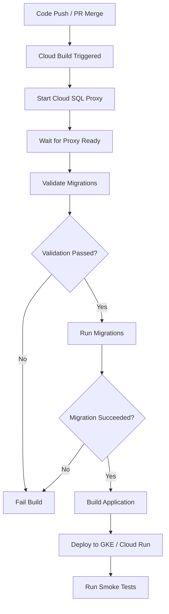

# How to Use Database Schema Migrations in CI/CD Pipelines for Cloud SQL

Author: [nawazdhandala](https://www.github.com/nawazdhandala)

Tags: GCP, Cloud SQL, Cloud Build, CI/CD, Database Migration, DevOps

Description: Learn how to automate database schema migrations in your CI/CD pipelines for Cloud SQL instances using Google Cloud Build with practical examples and best practices.

---

Database schema migrations are one of those things that every team eventually needs to automate but few get right on the first try. If you are running Cloud SQL on GCP and using Cloud Build for your CI/CD pipelines, you have a solid foundation to build reliable, repeatable migration workflows. In this post, I will walk through how to set this up from scratch, covering the tricky parts that documentation often glosses over.

## Why Automate Schema Migrations?

Running migrations manually is fine when your team is small and you deploy once a week. But as soon as you start deploying multiple times a day or have multiple environments, manual migrations become a bottleneck and a risk. Someone forgets to run the migration, or runs it out of order, and suddenly your application is throwing errors in production.

Automating migrations inside your CI/CD pipeline ensures that every deployment includes the necessary schema changes, applied in the correct order, every single time.

## Prerequisites

Before diving in, make sure you have the following in place:

- A Cloud SQL instance (PostgreSQL or MySQL)
- Cloud Build API enabled in your GCP project
- The Cloud Build service account granted the Cloud SQL Client role
- A migration tool of your choice (I will use Flyway in these examples, but Liquibase or golang-migrate work just as well)
- Your migration scripts stored in version control alongside your application code

## Setting Up Cloud SQL Proxy in Cloud Build

Cloud Build steps run in containers. For public IP connections, the Cloud SQL Auth Proxy gives your build a local TCP endpoint for connecting securely to Cloud SQL. If your instance only uses private IP, run the build in a Cloud Build private pool on the same VPC and either connect directly to the private IP or run the proxy with `--private-ip`.

Cloud Build waits for each step listed in `waitFor` to finish, so do not put the proxy in a separate foreground step and then wait on it. A reliable pattern is to use a small migration image that contains both Flyway and the proxy, then start the proxy in the same step as the migration command:

```dockerfile
# Dockerfile.migrations
FROM flyway/flyway:10-alpine
RUN apk add --no-cache netcat-openbsd
COPY --from=gcr.io/cloud-sql-connectors/cloud-sql-proxy:2.22.0 /cloud-sql-proxy /cloud-sql-proxy
ENTRYPOINT []
```

```yaml
# cloudbuild.yaml - Main build configuration with Cloud SQL Proxy

steps:
  # Step 1: Build a local image that includes Flyway and the Cloud SQL Auth Proxy
  - name: 'gcr.io/cloud-builders/docker'
    args: ['build', '-f', 'Dockerfile.migrations', '-t', 'flyway-cloud-sql-proxy:${SHORT_SHA}', '.']
    id: 'build-migration-image'
```

The key detail here is that the proxy process will be started inside the migration step itself. That keeps the proxy lifecycle tied to the command that needs it, instead of leaving Cloud Build waiting on a long-running proxy step.

## Running Flyway Migrations

With the migration image built, you can start the proxy, wait for the local port to accept connections, and then run Flyway:

```yaml
  # Step 2: Run database migrations using Flyway
  - name: 'flyway-cloud-sql-proxy:${SHORT_SHA}'
    entrypoint: 'sh'
    args:
      - '-c'
      - |
        /cloud-sql-proxy --port=5432 "${_CLOUD_SQL_CONNECTION_NAME}" &

        for i in $(seq 1 30); do
          if nc -z 127.0.0.1 5432; then
            proxy_ready=1
            break
          fi
          sleep 1
        done

        if [ "${proxy_ready:-0}" != "1" ]; then
          echo "Proxy did not start in time"
          exit 1
        fi

        flyway \
          -url="jdbc:postgresql://127.0.0.1:5432/${_DB_NAME}" \
          -user="${_DB_USER}" \
          -password="${_DB_PASSWORD}" \
          -locations="filesystem:./db/migrations" \
          -baselineOnMigrate=true \
          migrate
    waitFor: ['build-migration-image']
    id: 'run-migrations'

  # Step 3: Build and deploy the application (only after migrations succeed)
  - name: 'gcr.io/cloud-builders/docker'
    args: ['build', '-t', '${_REGION}-docker.pkg.dev/${PROJECT_ID}/${_REPOSITORY}/myapp:${SHORT_SHA}', '.']
    waitFor: ['run-migrations']
    id: 'build-app'

substitutions:
  _CLOUD_SQL_CONNECTION_NAME: 'my-project:us-central1:my-instance'
  _DB_NAME: 'mydb'
  _DB_USER: 'migration_user'
  _DB_PASSWORD: ''  # Use Secret Manager instead
  _REGION: 'us-central1'
  _REPOSITORY: 'my-repo'
```

## Securing Database Credentials

Hardcoding passwords in your cloudbuild.yaml is a bad idea. Use Secret Manager to store and retrieve credentials securely.

First, create the secret:

```bash
# Create a secret in Secret Manager for the database password
gcloud secrets create db-migration-password \
  --replication-policy="automatic"

# Add the actual password as a secret version
echo -n "your-secure-password" | \
  gcloud secrets versions add db-migration-password --data-file=-
```

Then reference it in your build configuration:

```yaml
# cloudbuild.yaml - Using Secret Manager for credentials
availableSecrets:
  secretManager:
    - versionName: projects/${PROJECT_ID}/secrets/db-migration-password/versions/latest
      env: 'DB_PASSWORD'

steps:
  - name: 'flyway-cloud-sql-proxy:${SHORT_SHA}'
    entrypoint: 'sh'
    args:
      - '-c'
      - |
        flyway \
          -url="jdbc:postgresql://127.0.0.1:5432/${_DB_NAME}" \
          -user="${_DB_USER}" \
          -password="$$DB_PASSWORD" \
          -locations="filesystem:./db/migrations" \
          migrate
    secretEnv: ['DB_PASSWORD']
```

The double dollar sign (`$$DB_PASSWORD`) is important - a single dollar sign would try to do Cloud Build substitution, while the double dollar sign lets the shell read the secret environment variable.

## Writing Migration Scripts

Keep your migration scripts in a directory like `db/migrations/` with a naming convention that Flyway can pick up:

```sql
-- V001__create_users_table.sql
-- Creates the initial users table with basic fields
CREATE TABLE IF NOT EXISTS users (
    id SERIAL PRIMARY KEY,
    email VARCHAR(255) NOT NULL UNIQUE,
    display_name VARCHAR(255),
    created_at TIMESTAMP WITH TIME ZONE DEFAULT NOW(),
    updated_at TIMESTAMP WITH TIME ZONE DEFAULT NOW()
);

-- Add an index on email for faster lookups
CREATE INDEX idx_users_email ON users(email);
```

```sql
-- V002__add_user_roles.sql
-- Adds role-based access control columns to the users table
ALTER TABLE users ADD COLUMN role VARCHAR(50) DEFAULT 'viewer';

-- Create a check constraint to ensure only valid roles are assigned
ALTER TABLE users ADD CONSTRAINT chk_user_role
    CHECK (role IN ('viewer', 'editor', 'admin', 'owner'));
```

## Handling Migration Failures

What happens when a migration fails midway through? This is where things get interesting. PostgreSQL wraps DDL statements in transactions by default, so a failed migration will roll back cleanly. MySQL does not do this for most DDL statements, so you need to be more careful.

Here is a Cloud Build step that validates migrations before applying them:

```yaml
  # Validate migrations before applying them
  - name: 'flyway-cloud-sql-proxy:${SHORT_SHA}'
    entrypoint: 'sh'
    args:
      - '-c'
      - |
        /cloud-sql-proxy --port=5432 "${_CLOUD_SQL_CONNECTION_NAME}" &

        for i in $(seq 1 30); do
          if nc -z 127.0.0.1 5432; then
            proxy_ready=1
            break
          fi
          sleep 1
        done

        if [ "${proxy_ready:-0}" != "1" ]; then
          echo "Proxy did not start in time"
          exit 1
        fi

        flyway \
          -url="jdbc:postgresql://127.0.0.1:5432/${_DB_NAME}" \
          -user="${_DB_USER}" \
          -password="$$DB_PASSWORD" \
          -locations="filesystem:./db/migrations" \
          validate
    secretEnv: ['DB_PASSWORD']
    id: 'validate-migrations'

  # Only run migrate if validation passes
  - name: 'flyway-cloud-sql-proxy:${SHORT_SHA}'
    entrypoint: 'sh'
    args:
      - '-c'
      - |
        /cloud-sql-proxy --port=5432 "${_CLOUD_SQL_CONNECTION_NAME}" &

        for i in $(seq 1 30); do
          if nc -z 127.0.0.1 5432; then
            proxy_ready=1
            break
          fi
          sleep 1
        done

        if [ "${proxy_ready:-0}" != "1" ]; then
          echo "Proxy did not start in time"
          exit 1
        fi

        flyway \
          -url="jdbc:postgresql://127.0.0.1:5432/${_DB_NAME}" \
          -user="${_DB_USER}" \
          -password="$$DB_PASSWORD" \
          -locations="filesystem:./db/migrations" \
          migrate
    secretEnv: ['DB_PASSWORD']
    waitFor: ['validate-migrations']
    id: 'run-migrations'
```

## Separating Migration Permissions

Your migration user should not be the same account your application uses at runtime. Create a dedicated migration user with elevated permissions:

```sql
-- Create a dedicated migration user with schema modification privileges
CREATE USER migration_user WITH PASSWORD 'secure-password';
GRANT ALL PRIVILEGES ON DATABASE mydb TO migration_user;
GRANT ALL PRIVILEGES ON SCHEMA public TO migration_user;

-- Create a restricted application user
CREATE USER app_user WITH PASSWORD 'different-password';
GRANT SELECT, INSERT, UPDATE, DELETE ON ALL TABLES IN SCHEMA public TO app_user;
```

This way, even if your application credentials are compromised, an attacker cannot modify the schema.

## Triggering Migrations on Pull Requests

You might want to run migrations against a staging database whenever a pull request is opened. Cloud Build triggers make this straightforward:

```yaml
# cloudbuild-pr.yaml - Triggered on pull requests against staging
steps:
  # Run migrations against the staging database
  - name: 'flyway-cloud-sql-proxy:${SHORT_SHA}'
    entrypoint: 'sh'
    args:
      - '-c'
      - |
        /cloud-sql-proxy --port=5432 "${_CLOUD_SQL_CONNECTION_NAME}" &

        for i in $(seq 1 30); do
          if nc -z 127.0.0.1 5432; then
            proxy_ready=1
            break
          fi
          sleep 1
        done

        if [ "${proxy_ready:-0}" != "1" ]; then
          echo "Proxy did not start in time"
          exit 1
        fi

        flyway \
          -url="jdbc:postgresql://127.0.0.1:5432/staging_db" \
          -user="${_DB_USER}" \
          -password="$$DB_PASSWORD" \
          -locations="filesystem:./db/migrations" \
          -baselineOnMigrate=true \
          info  # Just show migration status, don't apply
    secretEnv: ['DB_PASSWORD']
```

Using `info` instead of `migrate` lets you preview what changes would be applied without actually running them - useful for code review.

## Pipeline Flow Overview

Here is how the complete pipeline fits together:


```mermaid
flowchart TD
    A[Code Push / PR Merge] --> B[Cloud Build Triggered]
    B --> C[Start Cloud SQL Proxy]
    C --> D[Wait for Proxy Ready]
    D --> E[Validate Migrations]
    E --> F{Validation Passed?}
    F -->|Yes| G[Run Migrations]
    F -->|No| H[Fail Build]
    G --> I{Migration Succeeded?}
    I -->|Yes| J[Build Application]
    I -->|No| H
    J --> K[Deploy to GKE / Cloud Run]
    K --> L[Run Smoke Tests]
```

## Tips from Production Experience

After running this setup in production for a while, here are some lessons learned:

1. Always make migrations backward compatible. Your old application version will still be running during deployment, so dropping a column that the old code references will cause errors.

2. Use a migration lock table. Flyway does this by default, but if you are using a custom migration runner, make sure two builds cannot run migrations simultaneously.

3. Set a reasonable timeout on the proxy wait step. Thirty seconds is usually plenty, but network issues can cause delays.

4. Keep each migration script focused on one change. It is tempting to bundle multiple alterations into one file, but smaller migrations are easier to debug when something goes wrong.

5. Test migrations against a copy of production data before deploying. Cloud SQL point-in-time recovery makes it easy to create a clone for testing.

Automating schema migrations removes one of the scariest parts of deployment. Once you have this pipeline running, you can focus on writing good migration scripts instead of worrying about whether they will actually get applied.
