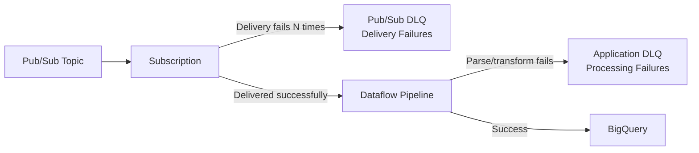

# How to Implement Dead Letter Queues in Pub/Sub to Dataflow Streaming Pipelines

Author: [nawazdhandala](https://www.github.com/nawazdhandala)

Tags: GCP, Pub/Sub, Dataflow, Dead Letter Queue, Error Handling, Streaming, Apache Beam

Description: Learn how to implement dead letter queues in Pub/Sub to Dataflow streaming pipelines to handle poison messages, schema errors, and processing failures gracefully.

---

Every streaming pipeline will eventually encounter messages it cannot process. A malformed JSON payload. A missing required field. A database lookup that returns null. A third-party API timeout. If your pipeline crashes on these messages, it blocks all processing. If it silently drops them, you lose data. Dead letter queues (DLQs) give you a third option: set the bad messages aside, keep processing the good ones, and deal with the failures separately.

This guide covers two levels of dead letter handling in GCP streaming pipelines: Pub/Sub-level DLQs for delivery failures, and application-level DLQs in Dataflow for processing failures.

## Two Levels of Dead Letter Handling



**Pub/Sub DLQ**: Catches messages that Pub/Sub cannot deliver to Dataflow (network issues, ack deadline exceeded, persistent nack).

**Application DLQ**: Catches messages that Dataflow receives but cannot process (bad schema, invalid data, failed enrichment).

You need both. They catch different types of failures.

## Part 1: Pub/Sub Dead Letter Topic

### Set Up the Dead Letter Topic

```bash
# Create the dead letter topic and subscription
gcloud pubsub topics create pipeline-dead-letter
gcloud pubsub subscriptions create pipeline-dead-letter-sub \
  --topic=pipeline-dead-letter

# Grant Pub/Sub the permission to publish to the dead letter topic
PROJECT_NUMBER=$(gcloud projects describe MY_PROJECT --format="value(projectNumber)")
gcloud pubsub topics add-iam-policy-binding pipeline-dead-letter \
  --member="serviceAccount:service-${PROJECT_NUMBER}@gcp-sa-pubsub.iam.gserviceaccount.com" \
  --role="roles/pubsub.publisher"
```

### Configure the Main Subscription with Dead Letter Policy

```bash
# Create or update the main subscription with dead letter handling
gcloud pubsub subscriptions create main-pipeline-sub \
  --topic=events-topic \
  --dead-letter-topic=projects/MY_PROJECT/topics/pipeline-dead-letter \
  --max-delivery-attempts=5 \
  --ack-deadline=120
```

After 5 failed delivery attempts, the message is automatically forwarded to the dead letter topic. The original message is preserved along with attributes that tell you why it failed:

- `CloudPubSubDeadLetterSourceDeliveryCount`: Number of delivery attempts
- `CloudPubSubDeadLetterSourceSubscription`: The subscription that rejected it
- `CloudPubSubDeadLetterSourceTopic`: The original topic

## Part 2: Application-Level Dead Letter Queue in Dataflow

This is where most of the interesting work happens. You need to catch failures at each processing stage and route them to a dead letter output.

### Using Tagged Outputs for Error Routing

Apache Beam's tagged outputs let you create multiple output streams from a single DoFn. Use this to separate successful processing from failures.

```python
# Pipeline with application-level dead letter handling
import apache_beam as beam
from apache_beam.options.pipeline_options import PipelineOptions, StandardOptions
import json
import traceback
from datetime import datetime

class ParseMessage(beam.DoFn):
    """Parse raw messages with error routing."""

    def process(self, element):
        try:
            data = json.loads(element.decode('utf-8'))

            # Validate required fields
            required_fields = ['event_id', 'event_type', 'timestamp']
            missing = [f for f in required_fields if f not in data]

            if missing:
                yield beam.pvalue.TaggedOutput('dead_letter', {
                    'raw_message': element.decode('utf-8', errors='replace'),
                    'error_type': 'VALIDATION_ERROR',
                    'error_detail': f"Missing fields: {missing}",
                    'stage': 'parse',
                    'timestamp': datetime.utcnow().isoformat(),
                })
                return

            yield data

        except json.JSONDecodeError as e:
            yield beam.pvalue.TaggedOutput('dead_letter', {
                'raw_message': element.decode('utf-8', errors='replace'),
                'error_type': 'JSON_PARSE_ERROR',
                'error_detail': str(e),
                'stage': 'parse',
                'timestamp': datetime.utcnow().isoformat(),
            })

class EnrichEvent(beam.DoFn):
    """Enrich events with external data, routing failures to DLQ."""

    def process(self, event):
        try:
            # Simulate enrichment - in practice, this might call an API or database
            user_id = event.get('user_id')
            if not user_id:
                raise ValueError("Cannot enrich event without user_id")

            # Add enrichment data
            event['enriched'] = True
            event['enriched_at'] = datetime.utcnow().isoformat()
            yield event

        except Exception as e:
            yield beam.pvalue.TaggedOutput('dead_letter', {
                'raw_message': json.dumps(event),
                'error_type': 'ENRICHMENT_ERROR',
                'error_detail': str(e),
                'error_trace': traceback.format_exc(),
                'stage': 'enrich',
                'timestamp': datetime.utcnow().isoformat(),
            })

class TransformEvent(beam.DoFn):
    """Transform events for BigQuery, catching any conversion errors."""

    def process(self, event):
        try:
            row = {
                'event_id': event['event_id'],
                'event_type': event['event_type'],
                'user_id': event.get('user_id', ''),
                'event_timestamp': event['timestamp'],
                'processed_at': datetime.utcnow().isoformat(),
                'payload': json.dumps(event.get('data', {})),
            }
            yield row

        except Exception as e:
            yield beam.pvalue.TaggedOutput('dead_letter', {
                'raw_message': json.dumps(event),
                'error_type': 'TRANSFORM_ERROR',
                'error_detail': str(e),
                'stage': 'transform',
                'timestamp': datetime.utcnow().isoformat(),
            })
```

### Wiring It Together

```python
def run():
    options = PipelineOptions()
    options.view_as(StandardOptions).streaming = True

    with beam.Pipeline(options=options) as p:
        # Read from Pub/Sub
        raw = (
            p
            | "Read" >> beam.io.ReadFromPubSub(
                subscription="projects/MY_PROJECT/subscriptions/main-pipeline-sub"
            )
        )

        # Parse with DLQ routing
        parsed = (
            raw
            | "Parse" >> beam.ParDo(ParseMessage())
                .with_outputs('dead_letter', main='valid')
        )

        # Enrich with DLQ routing
        enriched = (
            parsed.valid
            | "Enrich" >> beam.ParDo(EnrichEvent())
                .with_outputs('dead_letter', main='valid')
        )

        # Transform with DLQ routing
        transformed = (
            enriched.valid
            | "Transform" >> beam.ParDo(TransformEvent())
                .with_outputs('dead_letter', main='valid')
        )

        # Write successful events to BigQuery
        (
            transformed.valid
            | "WriteSuccess" >> beam.io.WriteToBigQuery(
                table='MY_PROJECT:analytics.events',
                write_disposition=beam.io.BigQueryDisposition.WRITE_APPEND,
            )
        )

        # Merge all dead letter outputs from every stage
        all_dead_letters = (
            (parsed.dead_letter, enriched.dead_letter, transformed.dead_letter)
            | "MergeDLQ" >> beam.Flatten()
        )

        # Write dead letters to BigQuery for analysis
        (
            all_dead_letters
            | "WriteDLQ_BQ" >> beam.io.WriteToBigQuery(
                table='MY_PROJECT:analytics.dead_letter_events',
                schema=(
                    'raw_message:STRING,error_type:STRING,'
                    'error_detail:STRING,error_trace:STRING,'
                    'stage:STRING,timestamp:TIMESTAMP'
                ),
                write_disposition=beam.io.BigQueryDisposition.WRITE_APPEND,
                create_disposition=beam.io.BigQueryDisposition.CREATE_IF_NEEDED,
            )
        )

        # Also publish dead letters to Pub/Sub for real-time alerting
        (
            all_dead_letters
            | "SerializeDLQ" >> beam.Map(
                lambda dl: json.dumps(dl).encode('utf-8')
            )
            | "PublishDLQ" >> beam.io.WriteToPubSub(
                topic="projects/MY_PROJECT/topics/app-dead-letter"
            )
        )

if __name__ == '__main__':
    run()
```

## Monitoring Dead Letter Queues

### BigQuery Dashboard Queries

```sql
-- Dead letter volume by error type and stage over last 24 hours
SELECT
  stage,
  error_type,
  COUNT(*) AS error_count,
  MIN(timestamp) AS first_seen,
  MAX(timestamp) AS last_seen
FROM `analytics.dead_letter_events`
WHERE timestamp >= TIMESTAMP_SUB(CURRENT_TIMESTAMP(), INTERVAL 24 HOUR)
GROUP BY stage, error_type
ORDER BY error_count DESC;

-- Dead letter rate as percentage of total events
SELECT
  TIMESTAMP_TRUNC(timestamp, HOUR) AS hour,
  COUNT(*) AS dead_letter_count,
FROM `analytics.dead_letter_events`
WHERE timestamp >= TIMESTAMP_SUB(CURRENT_TIMESTAMP(), INTERVAL 7 DAY)
GROUP BY hour
ORDER BY hour DESC;
```

### Alert on Dead Letter Volume

```bash
# Create an alert when dead letter rate exceeds threshold
gcloud monitoring policies create \
  --display-name="High Dead Letter Rate" \
  --condition-display-name="DLQ messages > 100/min" \
  --condition-filter='resource.type="pubsub_topic" AND metric.type="pubsub.googleapis.com/topic/send_message_operation_count" AND resource.label.topic_id="app-dead-letter"' \
  --condition-threshold-value=100 \
  --condition-threshold-comparison=COMPARISON_GT \
  --condition-threshold-duration=60s \
  --notification-channels=CHANNEL_ID
```

## Reprocessing Dead Letter Messages

Once you fix the root cause (deploy a bug fix, update the schema, fix the external service), you can replay the dead letters.

```sql
-- Export dead letters for reprocessing
EXPORT DATA OPTIONS(
  uri='gs://MY_BUCKET/dlq-replay/export-*.jsonl',
  format='JSON'
) AS
SELECT raw_message
FROM `analytics.dead_letter_events`
WHERE timestamp BETWEEN '2026-02-17 10:00:00' AND '2026-02-17 12:00:00'
  AND error_type = 'ENRICHMENT_ERROR'
```

```bash
# Republish dead letters back to the main topic
gsutil cat gs://MY_BUCKET/dlq-replay/export-*.jsonl | \
  while read line; do
    msg=$(echo "$line" | jq -r '.raw_message')
    gcloud pubsub topics publish events-topic --message="$msg"
  done
```

## Best Practices

1. **Always include the raw message in the dead letter record.** You need it for debugging and replay.
2. **Tag errors by stage and type.** This tells you where and why things failed.
3. **Set up alerting on DLQ volume.** A spike in dead letters usually means something changed upstream.
4. **Expire old dead letters.** Set a partition expiration on the BigQuery DLQ table (30-90 days is typical).
5. **Test your DLQ path.** Intentionally send malformed messages to verify they end up in the right place.

## Wrapping Up

Dead letter queues turn fatal pipeline errors into manageable operational events. The Pub/Sub DLQ catches delivery-level issues, while the application-level DLQ in Dataflow catches processing failures. Together, they ensure that bad messages never block good ones, every failure is recorded with enough context to diagnose and fix, and fixed messages can be replayed without data loss. It is one of those patterns that feels like unnecessary overhead until the first time it saves you from a production incident.
