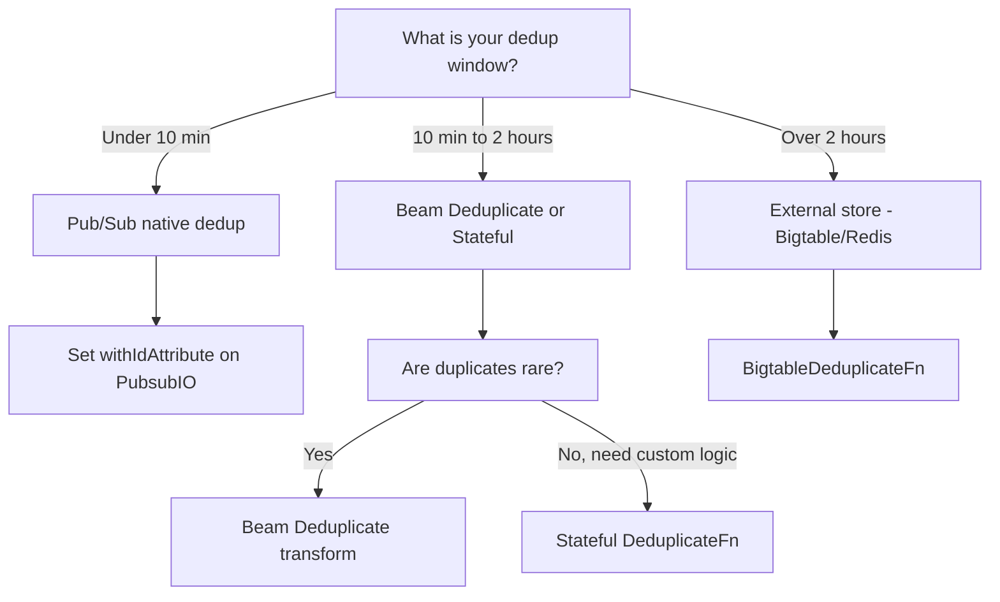

# How to Implement Deduplication in Dataflow Streaming Pipelines

Author: [nawazdhandala](https://www.github.com/nawazdhandala)

Tags: GCP, Google Cloud Dataflow, Apache Beam, Deduplication, Streaming

Description: Implement reliable deduplication in Google Cloud Dataflow streaming pipelines using Beam's built-in transforms, stateful processing, and external stores.

---

Duplicate messages are a fact of life in distributed systems. Pub/Sub guarantees at-least-once delivery, which means your pipeline might process the same message more than once. Network retries, producer bugs, and upstream replays all contribute to duplicates. If your pipeline writes to BigQuery or updates a counter, processing a duplicate means incorrect data.

Deduplication in streaming pipelines is not trivial because you need to remember what you have already seen, and you cannot remember everything forever. Let me walk through several approaches, from simple to sophisticated.

## Why Duplicates Happen

Understanding the sources of duplicates helps you choose the right strategy.

**Pub/Sub redelivery**: If your pipeline does not acknowledge a message fast enough, Pub/Sub redelivers it. This is the most common source.

**Producer-side duplicates**: The system sending messages might retry on timeout and send the same message twice.

**Pipeline restarts**: When a streaming pipeline restarts (update, failure recovery), it may reprocess messages from its last checkpoint.

**Upstream replays**: Sometimes upstream systems replay historical data, resending messages you have already processed.

## Approach 1: Beam's Built-in Deduplicate Transform

Apache Beam includes a `Deduplicate` transform that removes duplicates within a configurable time window. This is the simplest approach.

```java
// Built-in deduplication based on the full element value
PCollection<String> messages = pipeline
    .apply("ReadPubSub", PubsubIO.readStrings()
        .fromSubscription("projects/my-project/subscriptions/events"));

// Remove duplicate messages seen within the last 10 minutes
PCollection<String> deduplicated = messages
    .apply("Deduplicate", Deduplicate.<String>values()
        .withDuration(Duration.standardMinutes(10)));
```

This works by maintaining state for each unique element value. Elements that appear more than once within the duration are dropped. The limitation is that it compares the entire element value. If two messages have the same payload but different metadata, they are considered duplicates. If two messages have different payloads but represent the same logical event, they are not detected as duplicates.

## Approach 2: Deduplication by ID

Most real-world events have a unique identifier. Deduplicating by ID is more reliable than comparing full payloads.

```java
// Deduplicate by a unique event ID extracted from each message
PCollection<String> deduplicated = messages
    .apply("ExtractId", WithKeys.of(
        new SerializableFunction<String, String>() {
            @Override
            public String apply(String message) {
                // Extract the unique event ID from the JSON message
                JsonObject json = JsonParser.parseString(message).getAsJsonObject();
                return json.get("event_id").getAsString();
            }
        }))
    .apply("DeduplicateById", Deduplicate.<KV<String, String>>keyedValues()
        .withDuration(Duration.standardHours(1)))
    .apply("DropKeys", Values.create());
```

The `withDuration` parameter is critical. It determines how long Dataflow remembers IDs. Set it based on your maximum expected duplicate delay. If duplicates can arrive up to 1 hour after the original, set the duration to at least 1 hour (with some margin).

## Approach 3: Stateful Deduplication

For more control, implement deduplication with stateful processing. This lets you handle edge cases like choosing which duplicate to keep.

```java
// Stateful deduplication DoFn with custom logic
public class DeduplicateFn extends DoFn<KV<String, Event>, Event> {

    // State: track whether we have seen this ID before
    @StateId("seen")
    private final StateSpec<ValueState<Boolean>> seenSpec =
        StateSpecs.value(BooleanCoder.of());

    // Timer: clear state after the dedup window expires
    @TimerId("expiry")
    private final TimerSpec expirySpec =
        TimerSpecs.timer(TimeDomain.PROCESSING_TIME);

    private static final Duration DEDUP_WINDOW = Duration.standardHours(2);

    @ProcessElement
    public void processElement(
            ProcessContext c,
            @StateId("seen") ValueState<Boolean> seen,
            @TimerId("expiry") Timer expiry) {

        Boolean alreadySeen = seen.read();

        if (alreadySeen == null || !alreadySeen) {
            // First time seeing this ID - output and mark as seen
            seen.write(true);
            c.output(c.element().getValue());

            // Set a timer to clean up state after the dedup window
            expiry.offset(DEDUP_WINDOW).setRelative();
        }
        // If already seen, silently drop the duplicate
    }

    @OnTimer("expiry")
    public void onExpiry(@StateId("seen") ValueState<Boolean> seen) {
        // Clear state to free memory
        seen.clear();
    }
}
```

Use it in the pipeline like this.

```java
// Apply stateful deduplication keyed by event ID
PCollection<Event> deduplicated = events
    .apply("KeyByEventId", WithKeys.of(event -> event.getEventId()))
    .apply("Deduplicate", ParDo.of(new DeduplicateFn()));
```

The timer is important. Without it, state grows unbounded as you accumulate IDs forever. The timer clears state after the dedup window, keeping memory usage stable.

## Approach 4: Pub/Sub Native Deduplication

If your messages have a unique ID, you can use Pub/Sub's built-in deduplication before data even reaches Dataflow.

```java
// Read with Pub/Sub ID attribute for native deduplication
PCollection<PubsubMessage> messages = pipeline
    .apply("ReadPubSub", PubsubIO.readMessages()
        .fromSubscription("projects/my-project/subscriptions/events")
        .withIdAttribute("event_id"));  // Pub/Sub deduplicates on this attribute
```

When you set `withIdAttribute`, Pub/Sub tracks message IDs and suppresses redelivery of messages with the same ID within a 10-minute window. This handles Pub/Sub-level duplicates but does not help with producer-side duplicates or replays.

## Approach 5: External Store Deduplication

For very large dedup windows or cross-pipeline deduplication, use an external store like Cloud Bigtable or Redis.

```java
// Deduplication using Bigtable as an external seen-set
public class BigtableDeduplicateFn extends DoFn<Event, Event> {

    private transient BigtableDataClient client;
    private static final String TABLE_ID = "dedup-state";
    private static final String FAMILY = "seen";

    @Setup
    public void setup() throws IOException {
        client = BigtableDataClient.create("my-project", "my-instance");
    }

    @ProcessElement
    public void processElement(ProcessContext c) {
        Event event = c.element();
        String eventId = event.getEventId();

        // Check if we have seen this event ID before
        Row row = client.readRow(TABLE_ID, eventId);

        if (row == null || row.getCells(FAMILY, "ts").isEmpty()) {
            // Not seen before - write to Bigtable and output
            RowMutation mutation = RowMutation.create(TABLE_ID, eventId)
                .setCell(FAMILY, "ts",
                    String.valueOf(System.currentTimeMillis()));
            client.mutateRow(mutation);

            c.output(event);
        }
        // Otherwise, drop the duplicate
    }

    @Teardown
    public void teardown() {
        if (client != null) {
            client.close();
        }
    }
}
```

This approach handles dedup windows of any duration (limited only by Bigtable storage) and works across pipeline restarts. The tradeoff is the latency of an external lookup per element.

## Choosing the Right Approach



## State Size and Performance

Deduplication state grows with the number of unique IDs within your dedup window. If you process 1 million unique events per hour with a 2-hour window, you maintain state for 2 million IDs.

Each ID entry in Beam state is relatively small (the ID string plus a boolean). But at millions of entries, it adds up. Monitor the state size metric in Dataflow and adjust your dedup window if state gets too large.

For high-throughput pipelines, consider using a Bloom filter for probabilistic deduplication. It uses much less memory but has a small false-positive rate (incorrectly identifying a new message as a duplicate).

```java
// Bloom filter based deduplication - memory efficient but probabilistic
@StateId("bloomFilter")
private final StateSpec<ValueState<byte[]>> bloomFilterSpec =
    StateSpecs.value(ByteArrayCoder.of());

@ProcessElement
public void processElement(ProcessContext c,
        @StateId("bloomFilter") ValueState<byte[]> filterState) {
    // Deserialize or create Bloom filter
    byte[] filterBytes = filterState.read();
    BloomFilter<String> filter = filterBytes != null
        ? BloomFilter.readFrom(new ByteArrayInputStream(filterBytes))
        : BloomFilter.create(Funnels.stringFunnel(Charset.defaultCharset()),
            1000000, 0.001);  // 0.1% false positive rate

    String eventId = c.element().getValue().getEventId();

    if (!filter.mightContain(eventId)) {
        filter.put(eventId);
        filterState.write(serializeFilter(filter));
        c.output(c.element().getValue());
    }
}
```

Deduplication is a necessary evil in streaming systems. Pick the approach that matches your accuracy requirements, dedup window, and throughput. For most pipelines, the built-in Deduplicate transform or stateful deduplication with a timer-based cleanup does the job well.
