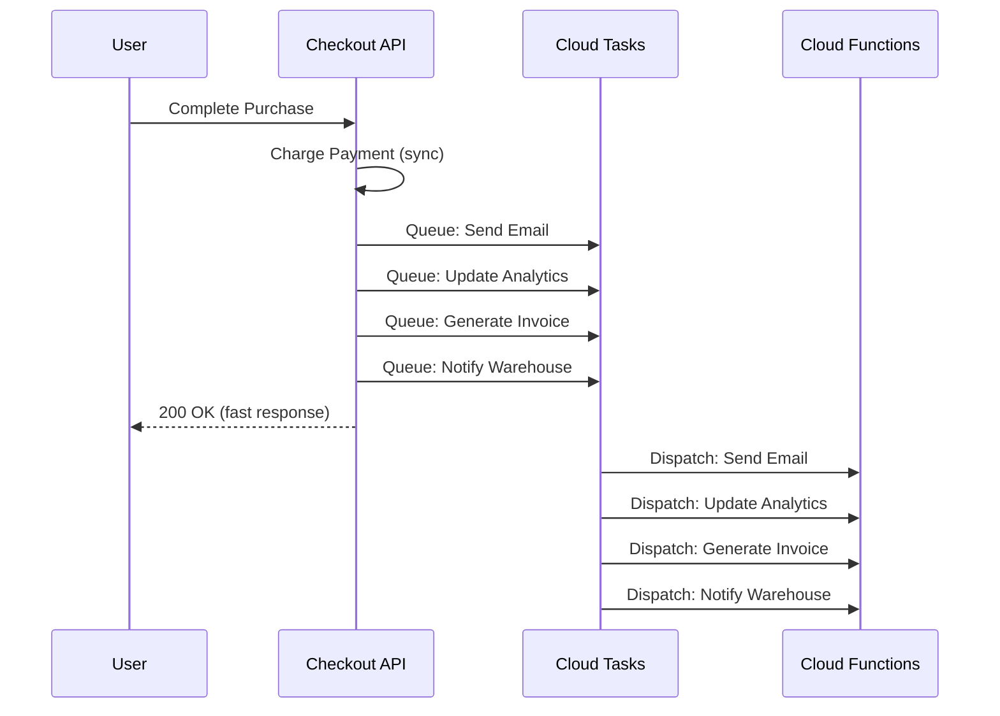

# How to Implement Deferred Task Processing with Cloud Tasks and Cloud Functions

Author: [nawazdhandala](https://www.github.com/nawazdhandala)

Tags: GCP, Cloud Tasks, Cloud Functions, Deferred Processing, Serverless

Description: Learn how to implement deferred task processing by combining Cloud Tasks with Cloud Functions to schedule work for later execution in a fully serverless architecture.

---

Deferred processing means scheduling work to happen later instead of doing it now. Your API receives a request, immediately responds to the user, and queues up the actual heavy lifting for later. This keeps your API fast and your users happy while the real work happens in the background at the right pace.

Cloud Tasks and Cloud Functions are a natural combination for this. Cloud Tasks manages the queue and delivery, while Cloud Functions provide the serverless execution environment for your task handlers. In this post, I will walk through a complete implementation.

## Why Defer Work?

Consider an e-commerce checkout flow. When a customer completes a purchase, your API needs to:

1. Charge the payment (must happen now)
2. Send a confirmation email (can happen in a few seconds)
3. Update analytics (can happen in a minute)
4. Generate an invoice PDF (can happen in a few minutes)
5. Notify the warehouse (can happen later)

Only step 1 needs to happen synchronously. Everything else can be deferred. By queuing steps 2-5 as tasks, your checkout API responds in 200ms instead of 5 seconds.



## Setting Up the Infrastructure

Start by enabling the required APIs and creating the Cloud Tasks queue.

```bash
# Enable required APIs
gcloud services enable \
  cloudtasks.googleapis.com \
  cloudfunctions.googleapis.com

# Create the task queue with rate limiting and retry config
gcloud tasks queues create order-tasks \
  --location=us-central1 \
  --max-dispatches-per-second=25 \
  --max-concurrent-dispatches=10 \
  --max-attempts=5 \
  --min-backoff="10s" \
  --max-backoff="300s" \
  --max-doublings=4

# Create a service account for task dispatch
gcloud iam service-accounts create task-dispatcher \
  --display-name="Cloud Tasks Dispatcher"
```

## Creating the Task Handler Cloud Function

Deploy a Cloud Function that handles different task types based on the request payload.

```javascript
// index.js
// Cloud Function that handles deferred order processing tasks
const functions = require("@google-cloud/functions-framework");
const nodemailer = require("nodemailer");
const { Firestore } = require("@google-cloud/firestore");
const { Storage } = require("@google-cloud/storage");

const firestore = new Firestore();
const storage = new Storage();

// Register the HTTP function
functions.http("orderTaskHandler", async (req, res) => {
  // Extract Cloud Tasks metadata from headers
  const taskName = req.headers["x-cloudtasks-taskname"] || "unknown";
  const retryCount = parseInt(req.headers["x-cloudtasks-taskretrycount"] || "0");

  console.log(`Processing task: ${taskName}, retry: ${retryCount}`);

  const { taskType, orderId, data } = req.body;

  if (!taskType || !orderId) {
    // Bad request - return 200 to prevent retries on invalid data
    console.error("Missing taskType or orderId");
    res.status(200).json({ error: "invalid_payload" });
    return;
  }

  try {
    // Route to the appropriate handler based on task type
    switch (taskType) {
      case "send_confirmation_email":
        await sendConfirmationEmail(orderId, data);
        break;
      case "update_analytics":
        await updateAnalytics(orderId, data);
        break;
      case "generate_invoice":
        await generateInvoice(orderId, data);
        break;
      case "notify_warehouse":
        await notifyWarehouse(orderId, data);
        break;
      default:
        console.error(`Unknown task type: ${taskType}`);
        res.status(200).json({ error: "unknown_task_type" });
        return;
    }

    console.log(`Task ${taskType} completed for order ${orderId}`);
    res.status(200).json({ status: "completed" });
  } catch (error) {
    console.error(`Task failed: ${error.message}`);

    // After too many retries, give up gracefully
    if (retryCount >= 4) {
      console.error(`Task ${taskName} exhausted retries, logging failure`);
      await logFailedTask(orderId, taskType, error.message);
      res.status(200).json({ status: "failed_permanently" });
      return;
    }

    // Return 500 to trigger a retry
    res.status(500).json({ error: error.message });
  }
});

async function sendConfirmationEmail(orderId, data) {
  // Check if email was already sent (idempotency)
  const sentRef = firestore.doc(`sent_emails/${orderId}_confirmation`);
  const sent = await sentRef.get();
  if (sent.exists) {
    console.log(`Confirmation email already sent for order ${orderId}`);
    return;
  }

  console.log(`Sending confirmation email to ${data.customerEmail}`);
  // Your email sending logic here

  // Record that the email was sent
  await sentRef.set({ sentAt: new Date().toISOString() });
}

async function updateAnalytics(orderId, data) {
  console.log(`Updating analytics for order ${orderId}`);
  // Write to your analytics system
  await firestore.collection("analytics_events").add({
    type: "order_completed",
    orderId,
    amount: data.totalAmount,
    timestamp: new Date().toISOString(),
  });
}

async function generateInvoice(orderId, data) {
  console.log(`Generating invoice for order ${orderId}`);
  // Generate invoice and save to Cloud Storage
  const invoiceData = {
    orderId,
    customer: data.customerName,
    items: data.items,
    total: data.totalAmount,
    generatedAt: new Date().toISOString(),
  };

  const bucket = storage.bucket("my-invoices-bucket");
  const file = bucket.file(`invoices/${orderId}.json`);
  await file.save(JSON.stringify(invoiceData));
}

async function notifyWarehouse(orderId, data) {
  console.log(`Notifying warehouse about order ${orderId}`);
  // Call warehouse API
  const response = await fetch("https://warehouse-api.example.com/orders", {
    method: "POST",
    headers: { "Content-Type": "application/json" },
    body: JSON.stringify({ orderId, items: data.items }),
  });

  if (!response.ok) {
    throw new Error(`Warehouse API returned ${response.status}`);
  }
}

async function logFailedTask(orderId, taskType, errorMessage) {
  await firestore.collection("failed_tasks").add({
    orderId,
    taskType,
    errorMessage,
    failedAt: new Date().toISOString(),
  });
}
```

Deploy the function.

```bash
# Deploy the Cloud Function
gcloud functions deploy order-task-handler \
  --gen2 \
  --runtime=nodejs20 \
  --region=us-central1 \
  --entry-point=orderTaskHandler \
  --trigger-http \
  --no-allow-unauthenticated \
  --timeout=120s \
  --memory=256MB \
  --service-account=task-handler-sa@YOUR_PROJECT.iam.gserviceaccount.com

# Grant the task dispatcher permission to invoke the function
gcloud functions add-invoker-policy-binding order-task-handler \
  --region=us-central1 \
  --member="serviceAccount:task-dispatcher@YOUR_PROJECT.iam.gserviceaccount.com"
```

## Creating the Task Producer

This is the code your main API uses to queue tasks.

```javascript
// task-producer.js
// Module for creating deferred tasks in Cloud Tasks
const { CloudTasksClient } = require("@google-cloud/tasks");

const client = new CloudTasksClient();

const PROJECT = process.env.GOOGLE_CLOUD_PROJECT;
const LOCATION = "us-central1";
const QUEUE = "order-tasks";
const HANDLER_URL = process.env.TASK_HANDLER_URL; // Cloud Function URL
const SERVICE_ACCOUNT = `task-dispatcher@${PROJECT}.iam.gserviceaccount.com`;

async function createDeferredTask(taskType, orderId, data, delaySeconds = 0) {
  const parent = client.queuePath(PROJECT, LOCATION, QUEUE);

  const payload = { taskType, orderId, data };

  const task = {
    httpRequest: {
      httpMethod: "POST",
      url: HANDLER_URL,
      headers: { "Content-Type": "application/json" },
      body: Buffer.from(JSON.stringify(payload)).toString("base64"),
      oidcToken: {
        serviceAccountEmail: SERVICE_ACCOUNT,
        audience: HANDLER_URL,
      },
    },
  };

  // Schedule for later if delay is specified
  if (delaySeconds > 0) {
    task.scheduleTime = {
      seconds: Math.floor(Date.now() / 1000) + delaySeconds,
    };
  }

  // Use a deterministic name for deduplication
  const taskId = `${orderId}-${taskType}-${Date.now()}`;
  task.name = `${parent}/tasks/${taskId}`;

  try {
    const [response] = await client.createTask({ parent, task });
    console.log(`Created task: ${response.name}`);
    return response;
  } catch (error) {
    if (error.code === 6) {
      // ALREADY_EXISTS - deduplication caught it
      console.log(`Task ${taskId} already exists`);
      return null;
    }
    throw error;
  }
}

module.exports = { createDeferredTask };
```

## Using the Task Producer in Your API

Here is how the checkout API uses deferred tasks.

```javascript
// checkout.js
// Checkout endpoint that defers non-critical work to Cloud Tasks
const express = require("express");
const { createDeferredTask } = require("./task-producer");

const app = express();
app.use(express.json());

app.post("/api/checkout", async (req, res) => {
  const { customerId, items, paymentMethod } = req.body;

  try {
    // Step 1: Charge payment (synchronous - must happen now)
    const payment = await chargePayment(customerId, items, paymentMethod);
    const orderId = payment.orderId;

    // Build shared data for deferred tasks
    const orderData = {
      customerId,
      customerEmail: payment.customerEmail,
      customerName: payment.customerName,
      items,
      totalAmount: payment.amount,
    };

    // Step 2: Queue deferred tasks (non-blocking)
    // Send confirmation email immediately
    await createDeferredTask("send_confirmation_email", orderId, orderData);

    // Update analytics after 5 seconds
    await createDeferredTask("update_analytics", orderId, orderData, 5);

    // Generate invoice after 30 seconds
    await createDeferredTask("generate_invoice", orderId, orderData, 30);

    // Notify warehouse after 1 minute
    await createDeferredTask("notify_warehouse", orderId, orderData, 60);

    // Return fast response to user
    res.status(200).json({
      orderId,
      status: "confirmed",
      message: "Order placed successfully",
    });
  } catch (error) {
    console.error("Checkout failed:", error);
    res.status(500).json({ error: "Checkout failed" });
  }
});
```

## Scheduling Tasks with Delays

The `scheduleTime` field lets you delay task execution. This is useful for tasks that should not run immediately.

```javascript
// Schedule a follow-up email 24 hours after purchase
await createDeferredTask(
  "send_followup_email",
  orderId,
  { customerEmail: "user@example.com", orderId },
  86400 // 24 hours in seconds
);

// Schedule a review request 7 days after delivery
await createDeferredTask(
  "request_review",
  orderId,
  { customerEmail: "user@example.com", productId: "PROD-123" },
  604800 // 7 days in seconds
);
```

## Monitoring Deferred Tasks

Keep track of your deferred processing pipeline.

```bash
# Check how many tasks are in the queue
gcloud tasks list --queue=order-tasks \
  --location=us-central1 \
  --format="table(name.basename(), scheduleTime, dispatchCount)"

# View Cloud Function logs
gcloud functions logs read order-task-handler \
  --region=us-central1 \
  --limit=20

# Check for failed tasks in Firestore (if you implemented the dead letter pattern)
# Use the Firebase Console or Firestore API
```

## Wrapping Up

Deferred task processing with Cloud Tasks and Cloud Functions gives you a fully serverless background processing pipeline. Your API stays fast by queuing work instead of doing it inline, Cloud Tasks handles delivery and retries, and Cloud Functions scale automatically to match the task volume. The keys to success are: make handlers idempotent, distinguish between retryable and permanent failures, use task scheduling for time-delayed work, and log failed tasks somewhere you can find them later.
