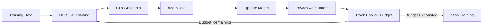

# How to Implement Differential Privacy for ML Training on Google Cloud

Author: [nawazdhandala](https://www.github.com/nawazdhandala)

Tags: GCP, Differential Privacy, Machine Learning, Privacy, Vertex AI, TensorFlow Privacy, Google Cloud

Description: Implement differential privacy for machine learning model training on Google Cloud to protect individual data points while preserving model utility.

---

When you train an ML model on sensitive data - medical records, financial transactions, user behavior - the model can memorize specific data points. An attacker with access to the model could potentially extract information about individuals in the training set. Differential privacy (DP) prevents this by adding carefully calibrated noise during training, providing a mathematical guarantee that the model's output does not reveal too much about any single training example. Here is how to implement it on Google Cloud.

## What Differential Privacy Guarantees

Differential privacy gives you a formal guarantee: the model's behavior is essentially the same whether or not any single individual's data is in the training set. This is quantified by the privacy budget (epsilon) - smaller epsilon means stronger privacy but potentially lower model accuracy.



## Prerequisites

```bash
# Install TensorFlow Privacy - Google's DP training library
pip install tensorflow-privacy tensorflow google-cloud-aiplatform

# Enable Vertex AI for running training jobs
gcloud services enable aiplatform.googleapis.com --project=your-project-id
```

## Understanding the Key Parameters

Before writing code, you need to understand three parameters that control the privacy-utility tradeoff:

- **Noise multiplier**: How much noise to add to gradients. Higher values mean stronger privacy but slower learning.
- **L2 norm clip**: Maximum gradient norm per example. Limits how much any single example can influence the model.
- **Delta**: The probability that the privacy guarantee fails. Typically set to less than 1/N where N is the dataset size.

## Step 1: Basic DP Training with TensorFlow Privacy

Here is a complete example training a classification model with differential privacy:

```python
# dp_training.py - Train a model with differential privacy using TF Privacy
import tensorflow as tf
from tensorflow_privacy.privacy.optimizers.dp_optimizers_keras import DPKerasSGDOptimizer
from tensorflow_privacy.privacy.analysis.compute_dp_sgd_privacy_lib import compute_dp_sgd_privacy
import numpy as np

def build_model(input_shape, num_classes):
    """Build a simple neural network for classification.
    The architecture is standard - DP is applied at the optimizer level."""
    model = tf.keras.Sequential([
        tf.keras.layers.Dense(128, activation='relu', input_shape=(input_shape,)),
        tf.keras.layers.Dense(64, activation='relu'),
        tf.keras.layers.Dense(num_classes, activation='softmax'),
    ])
    return model

def train_with_dp(X_train, y_train, X_test, y_test, dp_config):
    """Train a model using differentially private SGD.
    The DP optimizer clips per-example gradients and adds Gaussian noise."""

    num_train = len(X_train)
    input_shape = X_train.shape[1]
    num_classes = len(np.unique(y_train))

    model = build_model(input_shape, num_classes)

    # Create the DP optimizer
    # This replaces the standard optimizer with one that clips and noises gradients
    optimizer = DPKerasSGDOptimizer(
        l2_norm_clip=dp_config["l2_norm_clip"],       # Max gradient norm per example
        noise_multiplier=dp_config["noise_multiplier"],  # Noise scale
        num_microbatches=dp_config["batch_size"],      # Process each example separately
        learning_rate=dp_config["learning_rate"],
    )

    # Use standard categorical crossentropy loss
    # The loss must be computed per-example (reduction=NONE) for DP to work correctly
    loss = tf.keras.losses.SparseCategoricalCrossentropy(
        from_logits=False,
        reduction=tf.losses.Reduction.NONE,  # Required for DP-SGD
    )

    model.compile(optimizer=optimizer, loss=loss, metrics=['accuracy'])

    # Train the model
    history = model.fit(
        X_train, y_train,
        epochs=dp_config["epochs"],
        batch_size=dp_config["batch_size"],
        validation_data=(X_test, y_test),
        verbose=1,
    )

    # Compute the actual privacy guarantee achieved
    epsilon = compute_dp_sgd_privacy(
        n=num_train,
        batch_size=dp_config["batch_size"],
        noise_multiplier=dp_config["noise_multiplier"],
        epochs=dp_config["epochs"],
        delta=dp_config["delta"],
    )

    print(f"\nPrivacy guarantee: epsilon = {epsilon[0]:.2f} at delta = {dp_config['delta']}")
    return model, history, epsilon

# Configuration for DP training
dp_config = {
    "l2_norm_clip": 1.0,
    "noise_multiplier": 1.1,
    "batch_size": 256,
    "learning_rate": 0.01,
    "epochs": 30,
    "delta": 1e-5,  # Should be less than 1/dataset_size
}

# Run the training
# model, history, epsilon = train_with_dp(X_train, y_train, X_test, y_test, dp_config)
```

## Step 2: Tune the Privacy-Utility Tradeoff

The relationship between privacy (epsilon) and accuracy is a tradeoff. Here is how to find the right balance:

```python
# privacy_tuning.py - Find the optimal privacy-utility tradeoff
from tensorflow_privacy.privacy.analysis.compute_dp_sgd_privacy_lib import compute_dp_sgd_privacy

def privacy_utility_sweep(n_train, batch_size, epochs, delta):
    """Sweep noise multiplier values to show the privacy-utility tradeoff.
    Use this to understand what epsilon you get for different noise levels."""

    print(f"Dataset size: {n_train}, Batch size: {batch_size}, Epochs: {epochs}")
    print(f"{'Noise Multiplier':>18} {'Epsilon':>10} {'Privacy Level':>20}")
    print("-" * 50)

    noise_values = [0.5, 0.7, 1.0, 1.1, 1.3, 1.5, 2.0, 3.0, 5.0]

    for noise_mult in noise_values:
        epsilon = compute_dp_sgd_privacy(
            n=n_train,
            batch_size=batch_size,
            noise_multiplier=noise_mult,
            epochs=epochs,
            delta=delta,
        )

        # Categorize the privacy level
        if epsilon[0] < 1:
            level = "Strong"
        elif epsilon[0] < 5:
            level = "Moderate"
        elif epsilon[0] < 10:
            level = "Weak"
        else:
            level = "Very Weak"

        print(f"{noise_mult:>18.1f} {epsilon[0]:>10.2f} {level:>20}")

# Example sweep for a 100K sample dataset
privacy_utility_sweep(
    n_train=100000,
    batch_size=256,
    epochs=30,
    delta=1e-5,
)
```

Typical output:
```
    Noise Multiplier    Epsilon        Privacy Level
--------------------------------------------------
               0.5      45.21            Very Weak
               0.7      15.82                 Weak
               1.0       7.42                 Weak
               1.1       5.89             Moderate
               1.3       4.12             Moderate
               1.5       3.01             Moderate
               2.0       1.82             Moderate
               3.0       0.97               Strong
               5.0       0.42               Strong
```

## Step 3: Run DP Training on Vertex AI

Package the training code and run it as a Vertex AI custom training job:

```python
# Launch DP training on Vertex AI with GPU support
from google.cloud import aiplatform

aiplatform.init(project="your-project-id", location="us-central1")

# Create a custom training job
job = aiplatform.CustomContainerTrainingJob(
    display_name="dp-training-job",
    container_uri="gcr.io/your-project-id/dp-trainer:latest",
    model_serving_container_image_uri="gcr.io/cloud-aiplatform/prediction/tf2-cpu.2-12:latest",
)

# Run with GPU for faster DP training (gradient computation is expensive)
model = job.run(
    replica_count=1,
    machine_type="n1-standard-8",
    accelerator_type="NVIDIA_TESLA_T4",
    accelerator_count=1,
    model_display_name="dp-classification-model",
    args=[
        "--noise-multiplier=1.1",
        "--l2-norm-clip=1.0",
        "--epochs=30",
        "--batch-size=256",
        "--data-path=gs://your-bucket/training-data/",
    ],
)
```

The Dockerfile for the training container:

```dockerfile
# Dockerfile for DP training container
FROM tensorflow/tensorflow:2.15.0-gpu

# Install TensorFlow Privacy
RUN pip install tensorflow-privacy==0.9.0

# Copy training code
COPY dp_training.py /app/train.py
WORKDIR /app

ENTRYPOINT ["python", "train.py"]
```

## Step 4: Validate the Privacy Guarantee

After training, verify the epsilon guarantee is within your requirements:

```python
# validate_privacy.py - Verify the privacy guarantee meets requirements
def validate_privacy_guarantee(training_params, max_epsilon):
    """Check that the achieved privacy guarantee meets the required threshold.
    This should be run as a gate before model deployment."""

    epsilon, optimal_order = compute_dp_sgd_privacy(
        n=training_params["n_train"],
        batch_size=training_params["batch_size"],
        noise_multiplier=training_params["noise_multiplier"],
        epochs=training_params["epochs"],
        delta=training_params["delta"],
    )

    print(f"Achieved epsilon: {epsilon:.4f}")
    print(f"Optimal Renyi order: {optimal_order}")
    print(f"Required max epsilon: {max_epsilon}")

    if epsilon <= max_epsilon:
        print("PASS: Privacy guarantee meets requirements")
        return True
    else:
        print("FAIL: Privacy guarantee does not meet requirements")
        print(f"  Consider: increasing noise_multiplier, reducing epochs, or increasing batch_size")
        return False

# Validate before deployment
is_valid = validate_privacy_guarantee(
    training_params={
        "n_train": 100000,
        "batch_size": 256,
        "noise_multiplier": 1.1,
        "epochs": 30,
        "delta": 1e-5,
    },
    max_epsilon=8.0,  # Your organization's maximum acceptable epsilon
)
```

## Step 5: Compare DP vs Non-DP Models

Always compare against a non-private baseline to understand the accuracy cost:

```python
def compare_dp_impact(X_train, y_train, X_test, y_test, dp_config):
    """Train both a standard and DP model to measure the privacy cost on accuracy.
    The difference shows how much utility you trade for privacy."""

    # Train without DP (baseline)
    baseline_model = build_model(X_train.shape[1], len(np.unique(y_train)))
    baseline_model.compile(
        optimizer=tf.keras.optimizers.SGD(learning_rate=dp_config["learning_rate"]),
        loss='sparse_categorical_crossentropy',
        metrics=['accuracy']
    )
    baseline_model.fit(X_train, y_train, epochs=dp_config["epochs"],
                       batch_size=dp_config["batch_size"], verbose=0)
    baseline_acc = baseline_model.evaluate(X_test, y_test, verbose=0)[1]

    # Train with DP
    dp_model, _, epsilon = train_with_dp(X_train, y_train, X_test, y_test, dp_config)
    dp_acc = dp_model.evaluate(X_test, y_test, verbose=0)[1]

    print(f"\nBaseline accuracy: {baseline_acc:.4f}")
    print(f"DP accuracy: {dp_acc:.4f}")
    print(f"Accuracy cost: {baseline_acc - dp_acc:.4f}")
    print(f"Privacy guarantee: epsilon = {epsilon[0]:.2f}")

    return baseline_acc, dp_acc, epsilon
```

## Practical Guidelines

**Start with moderate privacy.** An epsilon of 3-8 provides meaningful privacy protection while preserving most model utility. Only go below epsilon 1 if your data is extremely sensitive and you can tolerate significant accuracy loss.

**Use larger batch sizes.** Larger batches amortize the noise cost across more examples, improving the privacy-utility tradeoff.

**Pre-train on public data when possible.** Train the model on non-sensitive public data first, then fine-tune with DP on your private data. This dramatically reduces the accuracy cost.

**More training data helps.** The privacy cost per example decreases with dataset size. DP works much better on datasets with 100K+ examples than on small datasets.

## Monitoring

Use OneUptime to monitor your DP-trained models in production. Track prediction accuracy and compare it against your non-DP baseline. If the accuracy gap widens over time, the DP model may be degrading faster and need retraining sooner.

## Summary

Differential privacy for ML training on Google Cloud gives you a mathematical guarantee that your model does not leak individual training data. The implementation uses TensorFlow Privacy for DP-SGD training and Vertex AI for scalable training infrastructure. The main challenge is the privacy-utility tradeoff - you need to find the noise level that provides acceptable privacy without destroying model accuracy. Use the sweep approach to understand this tradeoff for your specific dataset and choose the epsilon that matches your privacy requirements.
