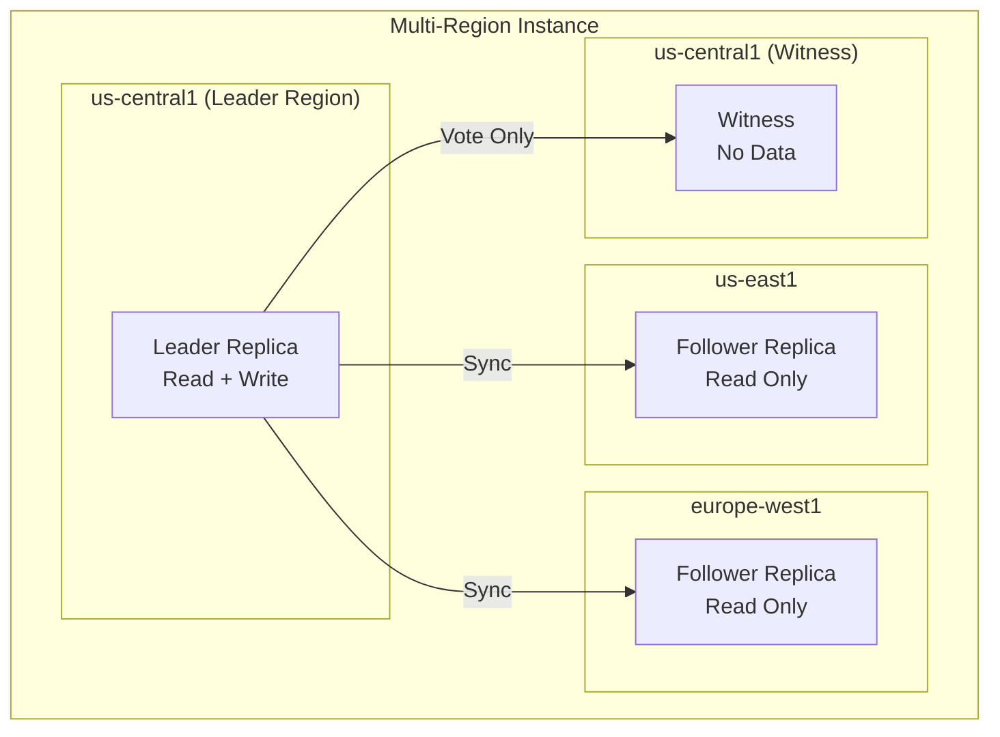

# How to Implement Directed Reads in Cloud Spanner for Read-Only Workload Optimization

Author: [nawazdhandala](https://www.github.com/nawazdhandala)

Tags: GCP, Cloud Spanner, Directed Reads, Read Optimization, Multi-Region, Database Performance

Description: Learn how to use directed reads in Cloud Spanner to route read-only queries to specific replicas for reduced latency, workload isolation, and cost optimization.

---

Cloud Spanner distributes data across multiple replicas in different regions for durability and availability. By default, Spanner's routing layer decides which replica serves each read request. This works well in most cases, but sometimes you want more control. Maybe you want to ensure that analytics queries hit a read-only replica instead of the leader. Maybe you want reads from your European users to be served from European replicas. Maybe you want to isolate heavy reporting workloads from your OLTP traffic.

Directed reads give you that control. You can specify which replicas a read should be routed to based on replica type (leader or follower) and location.

## How Spanner Replication Works

First, some background on Spanner's replica types:



- **Leader replicas** handle all writes and can serve reads. They are in the leader region.
- **Follower replicas** hold a full copy of the data and can serve reads. They are in non-leader regions.
- **Witness replicas** participate in consensus but do not hold data.

Without directed reads, Spanner might route a read from a European client to the leader replica in the US, adding cross-region latency unnecessarily.

## When to Use Directed Reads

Directed reads are useful in several scenarios:

1. **Latency optimization**: Route reads to the nearest replica to reduce round-trip time
2. **Workload isolation**: Send analytics/reporting queries to follower replicas to avoid impacting OLTP on the leader
3. **Cost optimization**: Prefer in-region reads to avoid cross-region network charges
4. **Compliance**: Ensure certain reads are served from replicas in specific geographic locations

## Enabling Directed Reads

Directed reads are configured per-request through the client library. You do not need to change any Spanner instance configuration.

### Using Directed Reads in Python

```python
# directed_reads.py - Route reads to specific replicas
from google.cloud import spanner
from google.cloud.spanner_v1 import DirectedReadOptions
from google.cloud.spanner_v1.types import DirectedReadOptions as DROTypes

# Create the Spanner client
client = spanner.Client(project="MY_PROJECT")
instance = client.instance("my-instance")
database = instance.database("my-database")

def read_from_nearest_follower():
    """Route reads to the nearest follower replica."""
    # Configure directed reads to prefer follower replicas
    directed_read_options = DirectedReadOptions(
        include_replicas=DROTypes.IncludeReplicas(
            replica_selections=[
                DROTypes.ReplicaSelection(
                    # Prefer follower replicas
                    type_=DROTypes.ReplicaSelection.Type.READ_ONLY,
                ),
            ],
            # Allow fallback to other replicas if preferred are unavailable
            auto_failover_disabled=False,
        ),
    )

    with database.snapshot() as snapshot:
        results = snapshot.execute_sql(
            "SELECT user_id, name, email FROM users WHERE region = @region",
            params={"region": "europe"},
            param_types={"region": spanner.param_types.STRING},
            directed_read_options=directed_read_options,
        )

        for row in results:
            print(f"User: {row[1]}, Email: {row[2]}")

def read_from_specific_region():
    """Route reads to replicas in a specific region."""
    directed_read_options = DirectedReadOptions(
        include_replicas=DROTypes.IncludeReplicas(
            replica_selections=[
                DROTypes.ReplicaSelection(
                    # Target replicas in europe-west1
                    location="europe-west1",
                ),
            ],
            auto_failover_disabled=False,
        ),
    )

    with database.snapshot() as snapshot:
        results = snapshot.execute_sql(
            "SELECT order_id, total FROM orders WHERE customer_region = 'EU'",
            directed_read_options=directed_read_options,
        )

        for row in results:
            print(f"Order: {row[0]}, Total: {row[1]}")
```

### Using Directed Reads in Java

```java
// DirectedReadsExample.java
import com.google.cloud.spanner.*;
import com.google.spanner.v1.DirectedReadOptions;
import com.google.spanner.v1.DirectedReadOptions.IncludeReplicas;
import com.google.spanner.v1.DirectedReadOptions.ReplicaSelection;

public class DirectedReadsExample {

    public static void readFromFollower(DatabaseClient dbClient) {
        // Configure directed reads to target read-only replicas
        DirectedReadOptions directedReadOptions = DirectedReadOptions.newBuilder()
            .setIncludeReplicas(
                IncludeReplicas.newBuilder()
                    .addReplicaSelections(
                        ReplicaSelection.newBuilder()
                            // Route to read-only (follower) replicas
                            .setType(ReplicaSelection.Type.READ_ONLY)
                            .build()
                    )
                    // Allow failover to other replicas if needed
                    .setAutoFailoverDisabled(false)
                    .build()
            )
            .build();

        // Execute a read with directed read options
        try (ReadOnlyTransaction txn = dbClient.singleUseReadOnlyTransaction()) {
            ResultSet resultSet = txn.executeQuery(
                Statement.of("SELECT user_id, name FROM users"),
                Options.directedRead(directedReadOptions)
            );

            while (resultSet.next()) {
                System.out.printf("User: %s, Name: %s%n",
                    resultSet.getString("user_id"),
                    resultSet.getString("name"));
            }
        }
    }

    public static void readFromRegion(DatabaseClient dbClient) {
        // Target replicas in a specific region
        DirectedReadOptions directedReadOptions = DirectedReadOptions.newBuilder()
            .setIncludeReplicas(
                IncludeReplicas.newBuilder()
                    .addReplicaSelections(
                        ReplicaSelection.newBuilder()
                            .setLocation("us-east1")
                            .build()
                    )
                    .setAutoFailoverDisabled(false)
                    .build()
            )
            .build();

        try (ReadOnlyTransaction txn = dbClient.singleUseReadOnlyTransaction()) {
            ResultSet resultSet = txn.executeQuery(
                Statement.of("SELECT * FROM orders WHERE region = 'US-EAST'"),
                Options.directedRead(directedReadOptions)
            );

            while (resultSet.next()) {
                // Process results
            }
        }
    }
}
```

### Using Directed Reads in Go

```go
// directed_reads.go
package main

import (
    "context"
    "fmt"

    "cloud.google.com/go/spanner"
    sppb "cloud.google.com/go/spanner/apiv1/spannerpb"
    "google.golang.org/api/iterator"
)

func readFromFollower(ctx context.Context, client *spanner.Client) error {
    // Configure directed reads to prefer follower replicas
    directedReadOptions := &sppb.DirectedReadOptions{
        Replicas: &sppb.DirectedReadOptions_IncludeReplicas_{
            IncludeReplicas: &sppb.DirectedReadOptions_IncludeReplicas{
                ReplicaSelections: []*sppb.DirectedReadOptions_ReplicaSelection{
                    {
                        // Route to read-only replicas
                        Type: sppb.DirectedReadOptions_ReplicaSelection_READ_ONLY,
                    },
                },
                AutoFailoverDisabled: false,
            },
        },
    }

    // Execute the read with directed read options
    txn := client.Single().WithDirectedReadOptions(directedReadOptions)
    stmt := spanner.Statement{SQL: "SELECT user_id, name FROM users LIMIT 100"}

    iter := txn.Query(ctx, stmt)
    defer iter.Stop()

    for {
        row, err := iter.Next()
        if err == iterator.Done {
            break
        }
        if err != nil {
            return err
        }

        var userID, name string
        if err := row.Columns(&userID, &name); err != nil {
            return err
        }
        fmt.Printf("User: %s, Name: %s\n", userID, name)
    }

    return nil
}
```

## Excluding Replicas

Instead of specifying which replicas to include, you can exclude specific ones. This is useful when you want to keep a specific replica free for a particular workload.

```python
# Exclude the leader replica - force reads to followers
from google.cloud.spanner_v1 import DirectedReadOptions
from google.cloud.spanner_v1.types import DirectedReadOptions as DROTypes

directed_read_options = DirectedReadOptions(
    exclude_replicas=DROTypes.ExcludeReplicas(
        replica_selections=[
            DROTypes.ReplicaSelection(
                # Exclude the leader - reads go to followers only
                type_=DROTypes.ReplicaSelection.Type.READ_WRITE,
            ),
        ],
    ),
)
```

## Patterns for Production Use

### Pattern 1: OLTP vs Analytics Isolation

Route transactional reads to the leader and analytics queries to followers.

```python
# Helper function for workload routing
def get_directed_read_options(workload_type):
    """Return directed read options based on workload type."""
    if workload_type == "analytics":
        # Analytics reads go to followers to avoid impacting OLTP
        return DirectedReadOptions(
            include_replicas=DROTypes.IncludeReplicas(
                replica_selections=[
                    DROTypes.ReplicaSelection(
                        type_=DROTypes.ReplicaSelection.Type.READ_ONLY,
                    ),
                ],
                auto_failover_disabled=False,
            ),
        )
    elif workload_type == "oltp":
        # OLTP reads go to the leader for strong consistency
        return DirectedReadOptions(
            include_replicas=DROTypes.IncludeReplicas(
                replica_selections=[
                    DROTypes.ReplicaSelection(
                        type_=DROTypes.ReplicaSelection.Type.READ_WRITE,
                    ),
                ],
                auto_failover_disabled=False,
            ),
        )
    else:
        # Default: let Spanner decide
        return None
```

### Pattern 2: Geographic Routing

Route reads to the nearest region based on the client's location.

```python
# Map client regions to Spanner replica locations
REGION_MAP = {
    "us": "us-central1",
    "eu": "europe-west1",
    "asia": "asia-southeast1",
}

def get_regional_read_options(client_region):
    """Route reads to the nearest Spanner replica."""
    target_location = REGION_MAP.get(client_region)
    if not target_location:
        return None

    return DirectedReadOptions(
        include_replicas=DROTypes.IncludeReplicas(
            replica_selections=[
                DROTypes.ReplicaSelection(
                    location=target_location,
                ),
            ],
            auto_failover_disabled=False,
        ),
    )
```

## Important Limitations

- Directed reads only work with read-only transactions and single reads. You cannot use them with read-write transactions.
- If the specified replicas are unavailable and `auto_failover_disabled` is True, the read fails. Keep auto-failover enabled in production.
- Directed reads do not change consistency guarantees. Stale reads on followers return data that may be a few seconds old (within the staleness bound you specify).
- Not all regions in your instance configuration will have data replicas. Witness regions do not hold data.

## Wrapping Up

Directed reads give you fine-grained control over where Spanner serves your read queries. For multi-region deployments, this translates to lower latency, better workload isolation, and more predictable performance. The implementation is straightforward - it is a per-request configuration in the client library, no infrastructure changes needed. The main thing to get right is deciding your routing strategy: by workload type, by geography, or a combination. Start with the simple case of routing analytics to followers, measure the latency improvement, and expand from there.
