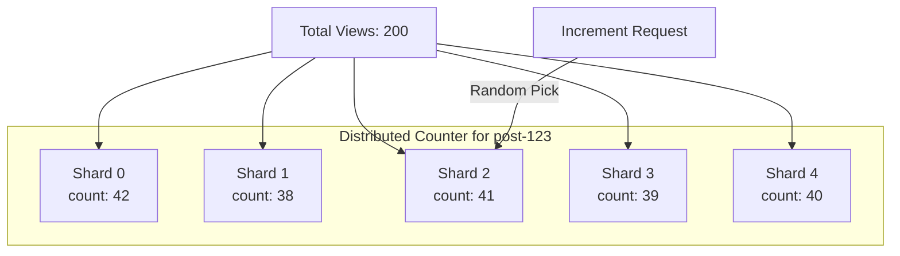

# How to Implement Distributed Counters in Firestore for High-Write Scenarios

Author: [nawazdhandala](https://www.github.com/nawazdhandala)

Tags: GCP, Firestore, Distributed Counters, Scalability, Firebase

Description: Learn how to build distributed counters in Firestore to handle high write throughput beyond the single-document limit of one write per second.

---

Firestore has a hard limit: you can write to a single document at most once per second on a sustained basis. For a simple page view counter or a like button on a viral post, that limit gets blown through instantly. The solution is distributed counters - instead of one document holding the count, you spread the count across multiple "shard" documents and sum them up when you need the total.

This pattern is well-documented by Google, and once you understand it, you can apply it to any high-write counter scenario. Let me walk through the implementation from scratch.

## The Problem

Say you have a blog post and you want to track how many times it has been viewed. The naive approach is a single document with a `views` field that gets incremented on every page load.

```javascript
// This works fine at low traffic, but breaks at scale
// A single document can only sustain ~1 write per second
import { doc, updateDoc, increment } from 'firebase/firestore';

async function incrementViews(postId) {
  await updateDoc(doc(db, 'posts', postId), {
    views: increment(1)
  });
}
```

If your post goes viral and gets 100 views per second, this will fail. Firestore will start rejecting writes or they will queue up and cause latency spikes.

## The Distributed Counter Pattern

The idea is simple: instead of one counter, create N shard documents. When you want to increment, pick a random shard and increment that one. When you want to read the total, sum all the shards.



With 10 shards, you can handle 10 writes per second. With 100 shards, 100 writes per second. You trade write throughput for read complexity.

## Creating the Counter

First, let us set up the counter with a configurable number of shards.

```javascript
// Initialize a distributed counter with the specified number of shards
// Call this once when creating a new counter
import { doc, setDoc, collection } from 'firebase/firestore';

async function createCounter(counterPath, numShards) {
  // Store metadata about the counter
  await setDoc(doc(db, counterPath), {
    numShards: numShards,
    createdAt: new Date()
  });

  // Create each shard document with an initial count of 0
  for (let i = 0; i < numShards; i++) {
    await setDoc(doc(db, `${counterPath}/shards`, `${i}`), {
      count: 0
    });
  }

  console.log(`Created counter with ${numShards} shards at ${counterPath}`);
}

// Example: create a 10-shard counter for a blog post
await createCounter('counters/post-123-views', 10);
```

## Incrementing the Counter

When you want to increment, pick a random shard and increment it. The randomness ensures even distribution across shards.

```javascript
// Increment the distributed counter by picking a random shard
// The random selection distributes write load evenly across shards
import { doc, updateDoc, increment, getDoc } from 'firebase/firestore';

async function incrementCounter(counterPath) {
  // Get the number of shards
  const counterDoc = await getDoc(doc(db, counterPath));
  const numShards = counterDoc.data().numShards;

  // Pick a random shard
  const shardIndex = Math.floor(Math.random() * numShards);
  const shardRef = doc(db, `${counterPath}/shards`, `${shardIndex}`);

  // Increment that shard
  await updateDoc(shardRef, {
    count: increment(1)
  });
}

// Increment by any amount
async function incrementCounterBy(counterPath, amount) {
  const counterDoc = await getDoc(doc(db, counterPath));
  const numShards = counterDoc.data().numShards;
  const shardIndex = Math.floor(Math.random() * numShards);
  const shardRef = doc(db, `${counterPath}/shards`, `${shardIndex}`);

  await updateDoc(shardRef, {
    count: increment(amount)
  });
}
```

To avoid the extra read for `numShards` on every increment, you can hardcode it or cache it client-side. In practice, the number of shards rarely changes after creation.

## Reading the Total Count

To get the total, you read all shards and sum them up.

```javascript
// Read the total count by summing all shard values
// This reads numShards documents, so factor that into your cost calculations
import { collection, getDocs } from 'firebase/firestore';

async function getCount(counterPath) {
  const shardsSnapshot = await getDocs(collection(db, `${counterPath}/shards`));

  let totalCount = 0;
  shardsSnapshot.forEach((shardDoc) => {
    totalCount += shardDoc.data().count;
  });

  return totalCount;
}

// Usage
const views = await getCount('counters/post-123-views');
console.log(`Total views: ${views}`);
```

## Optimized Implementation with Caching

For read-heavy scenarios, you do not want to sum all shards every time someone views the page. Here is an optimized version that caches the total and updates it periodically.

```javascript
// Optimized counter class with client-side caching
// Reduces reads by caching the total and refreshing periodically
class DistributedCounter {
  constructor(db, counterPath, numShards) {
    this.db = db;
    this.counterPath = counterPath;
    this.numShards = numShards;
    this.cachedTotal = null;
    this.cacheTimestamp = 0;
    this.cacheTTL = 30000; // Cache for 30 seconds
  }

  async increment(amount = 1) {
    const shardIndex = Math.floor(Math.random() * this.numShards);
    const shardRef = doc(this.db, `${this.counterPath}/shards`, `${shardIndex}`);

    await updateDoc(shardRef, {
      count: increment(amount)
    });

    // Invalidate cache after increment
    this.cachedTotal = null;
  }

  async getTotal() {
    const now = Date.now();

    // Return cached value if still fresh
    if (this.cachedTotal !== null && (now - this.cacheTimestamp) < this.cacheTTL) {
      return this.cachedTotal;
    }

    // Read all shards and sum
    const shardsSnapshot = await getDocs(
      collection(this.db, `${this.counterPath}/shards`)
    );

    let total = 0;
    shardsSnapshot.forEach((shardDoc) => {
      total += shardDoc.data().count;
    });

    // Update cache
    this.cachedTotal = total;
    this.cacheTimestamp = now;

    return total;
  }
}

// Usage
const viewCounter = new DistributedCounter(db, 'counters/post-123-views', 10);
await viewCounter.increment();
const total = await viewCounter.getTotal();
```

## Using a Cloud Function to Maintain a Rollup

For the best of both worlds, you can use a Cloud Function that listens to shard changes and maintains a rolled-up total. This way, reads are always a single document read.

```javascript
// Cloud Function that maintains a rollup total whenever a shard changes
// This means reading the total is always a single document read
const functions = require('firebase-functions');
const admin = require('firebase-admin');
admin.initializeApp();

exports.updateCounterRollup = functions.firestore
  .document('counters/{counterId}/shards/{shardId}')
  .onWrite(async (change, context) => {
    const counterId = context.params.counterId;
    const counterRef = admin.firestore().collection('counters').doc(counterId);

    // Calculate the difference
    const oldCount = change.before.exists ? change.before.data().count : 0;
    const newCount = change.after.exists ? change.after.data().count : 0;
    const diff = newCount - oldCount;

    // Update the rollup total atomically
    await counterRef.update({
      total: admin.firestore.FieldValue.increment(diff)
    });
  });
```

Now reading the total is just:

```javascript
// Read the pre-computed total - single document read, no shard summing needed
const counterDoc = await getDoc(doc(db, 'counters', 'post-123-views'));
const total = counterDoc.data().total;
```

## Choosing the Right Number of Shards

The number of shards determines your maximum write throughput. Each shard can handle about 1 write per second sustained. So 10 shards gives you 10 writes per second, 50 shards gives you 50.

But more shards means more documents to read when summing (unless you use the rollup pattern). There is also a cost consideration - each shard read is a billed document read.

A good starting point is to estimate your peak writes per second and add a 2x buffer. If you expect 20 writes per second at peak, use 40 shards. You can always add more shards later without losing data.

## Decrementing and Resetting

Distributed counters are not limited to incrementing. You can decrement the same way.

```javascript
// Decrement by passing a negative value
await viewCounter.increment(-1);

// Reset by setting all shards to 0
async function resetCounter(counterPath, numShards) {
  const batch = writeBatch(db);

  for (let i = 0; i < numShards; i++) {
    const shardRef = doc(db, `${counterPath}/shards`, `${i}`);
    batch.update(shardRef, { count: 0 });
  }

  await batch.commit();
  console.log('Counter reset to 0');
}
```

## Wrapping Up

Distributed counters are a standard pattern for working around Firestore's per-document write limit. The implementation is straightforward: spread your counter across multiple shard documents, pick a random shard when writing, and sum all shards when reading. For production systems, adding a Cloud Function to maintain a rollup total gives you both high write throughput and fast reads. Just size your shard count based on your expected peak write rate, and you are set.
