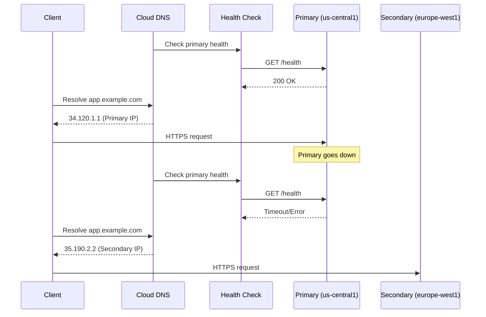

# How to Implement DNS-Based Failover for GCP Services Using Cloud DNS Routing Policies

Author: [nawazdhandala](https://www.github.com/nawazdhandala)

Tags: GCP, Cloud DNS, DNS Failover, Routing Policies, High Availability, Disaster Recovery

Description: Implement DNS-based failover for GCP services using Cloud DNS routing policies with health checks to automatically redirect traffic during regional outages.

---

DNS-based failover is one of the simplest and most effective ways to achieve high availability across regions. Instead of relying on a load balancer to route traffic, you use DNS to resolve your domain to the IP address of a healthy endpoint. When the primary endpoint goes down, DNS automatically resolves to a secondary endpoint. This approach works for any service that has an IP address - Compute Engine instances, Cloud Run custom domains, external load balancers, or even hybrid setups with on-premises servers.

Google Cloud DNS supports routing policies that combine health checks with DNS resolution to implement automatic failover. In this post, I will show you how to set it up end to end.

## How DNS-Based Failover Works

When a client resolves your domain, Cloud DNS checks the health of your primary endpoint. If it is healthy, DNS returns the primary IP. If it is unhealthy, DNS returns the secondary IP. The client never knows about the failover - it just connects to whatever IP DNS gives it.



## Setting Up Health Checks

Cloud DNS uses Compute Engine health checks to determine endpoint availability. Create health checks for each endpoint you want to monitor.

```bash
# Create a health check for the primary endpoint
gcloud compute health-checks create http primary-health-check \
  --host=app.example.com \
  --port=443 \
  --use-serving-port \
  --request-path=/health \
  --check-interval=10s \
  --timeout=5s \
  --healthy-threshold=2 \
  --unhealthy-threshold=3

# Create a health check for the secondary endpoint
gcloud compute health-checks create http secondary-health-check \
  --host=app.example.com \
  --port=443 \
  --use-serving-port \
  --request-path=/health \
  --check-interval=10s \
  --timeout=5s \
  --healthy-threshold=2 \
  --unhealthy-threshold=3
```

## Creating the DNS Zone

If you do not already have a Cloud DNS managed zone, create one.

```bash
# Create a managed DNS zone
gcloud dns managed-zones create app-zone \
  --dns-name=example.com. \
  --description="Application DNS zone" \
  --visibility=public

# Verify the zone was created
gcloud dns managed-zones describe app-zone
```

## Configuring Failover Routing Policy

Set up a DNS record set with a failover routing policy. The primary record is served when healthy, and the backup record takes over when the primary fails.

```bash
# Create the failover routing policy using a transaction
gcloud dns record-sets transaction start --zone=app-zone

# Add the record with a failover routing policy
gcloud dns record-sets create app.example.com. \
  --zone=app-zone \
  --type=A \
  --ttl=60 \
  --routing-policy-type=FAILOVER \
  --routing-policy-primary-data="34.120.1.1" \
  --routing-policy-backup-data-type=GEO \
  --routing-policy-backup-data="us-central1=35.190.2.2;europe-west1=35.190.2.2" \
  --health-check=primary-health-check \
  --backup-data-trickle-ratio=0.0

gcloud dns record-sets transaction execute --zone=app-zone
```

The `backup-data-trickle-ratio` parameter controls what percentage of traffic goes to the backup even when the primary is healthy. Setting it to 0 means all traffic goes to the primary during normal operations. You can set it to a small value like 0.1 to send 10% of traffic to the backup for continuous validation.

## Implementing Geolocation-Based Routing with Failover

For a more sophisticated setup, combine geolocation routing with failover. Users are routed to the nearest region, with failover to another region if their local one is down.

```bash
# Create health checks for each regional endpoint
for region in us-central1 europe-west1 asia-east1; do
  gcloud compute health-checks create http ${region}-health \
    --host=app.example.com \
    --port=443 \
    --request-path=/health \
    --check-interval=10s \
    --timeout=5s \
    --unhealthy-threshold=3
done

# Set up geolocation routing with health checks
gcloud dns record-sets create app.example.com. \
  --zone=app-zone \
  --type=A \
  --ttl=60 \
  --routing-policy-type=GEO \
  --routing-policy-data="us-central1=34.120.1.1;europe-west1=35.190.2.2;asia-east1=34.80.3.3" \
  --enable-health-checking
```

## Application Health Endpoint

Your health check endpoint should verify all critical dependencies, not just return 200.

```python
# health.py - Comprehensive health check endpoint
import os
from flask import Flask, jsonify
from google.cloud import firestore
import sqlalchemy
from sqlalchemy import text

app = Flask(__name__)

def check_database():
    """Verify database connectivity."""
    try:
        engine = sqlalchemy.create_engine(os.environ['DATABASE_URL'])
        with engine.connect() as conn:
            conn.execute(text('SELECT 1'))
        return True, None
    except Exception as e:
        return False, str(e)

def check_cache():
    """Verify cache connectivity."""
    try:
        import redis
        r = redis.Redis(host=os.environ.get('REDIS_HOST', 'localhost'))
        r.ping()
        return True, None
    except Exception as e:
        return False, str(e)

@app.route('/health', methods=['GET'])
def health_check():
    """Health check that Cloud DNS will use for routing decisions.

    Returns 200 only if all critical dependencies are healthy.
    Returns 503 if any critical dependency is down.
    """
    db_healthy, db_error = check_database()
    cache_healthy, cache_error = check_cache()

    # The service is only healthy if all critical dependencies are up
    all_healthy = db_healthy and cache_healthy

    status = {
        'healthy': all_healthy,
        'region': os.environ.get('REGION', 'unknown'),
        'checks': {
            'database': {'healthy': db_healthy, 'error': db_error},
            'cache': {'healthy': cache_healthy, 'error': cache_error},
        },
    }

    # Return 200 for healthy, 503 for unhealthy
    # Cloud DNS health checks consider non-200 responses as unhealthy
    return jsonify(status), 200 if all_healthy else 503
```

## Managing TTL for Fast Failover

DNS TTL (Time To Live) determines how long clients cache the DNS response. Lower TTL means faster failover but more DNS queries. Find the right balance.

```bash
# Set a low TTL for fast failover (60 seconds)
gcloud dns record-sets update app.example.com. \
  --zone=app-zone \
  --type=A \
  --ttl=60

# For less critical services, a higher TTL reduces DNS query costs
gcloud dns record-sets update docs.example.com. \
  --zone=app-zone \
  --type=A \
  --ttl=300
```

Keep in mind that some DNS resolvers and applications ignore TTL and cache longer than specified. Plan for this in your recovery time estimates.

## Monitoring DNS Health

Track health check status and DNS query patterns.

```python
# dns_monitor.py - Monitor DNS health check status
from google.cloud import monitoring_v3
import time

def monitor_dns_health_checks(project_id, health_check_name):
    """Monitor the status of DNS health checks."""
    client = monitoring_v3.MetricServiceClient()
    project_name = f'projects/{project_id}'

    now = time.time()
    interval = monitoring_v3.TimeInterval({
        'end_time': {'seconds': int(now)},
        'start_time': {'seconds': int(now - 3600)},  # Last hour
    })

    # Query health check status
    results = client.list_time_series(
        request={
            'name': project_name,
            'filter': (
                f'metric.type="compute.googleapis.com/https/health_check/healthy" '
                f'AND resource.labels.health_check_name="{health_check_name}"'
            ),
            'interval': interval,
        }
    )

    for series in results:
        for point in series.points:
            healthy = point.value.bool_value
            timestamp = point.interval.end_time
            if not healthy:
                print(f'UNHEALTHY: {health_check_name} at {timestamp}')

    return results
```

## Setting Up Alerting

Create alerts for health check failures so you know when failover occurs.

```bash
# Alert when the primary health check fails
gcloud alpha monitoring policies create \
  --display-name="Primary endpoint unhealthy" \
  --condition-display-name="Health check failing" \
  --condition-filter='metric.type="compute.googleapis.com/https/health_check/healthy" AND resource.labels.health_check_name="primary-health-check"' \
  --condition-threshold-value=1 \
  --condition-threshold-comparison=COMPARISON_LT \
  --notification-channels=CHANNEL_ID
```

## Testing DNS Failover

Regularly test that failover works by simulating a primary failure.

```bash
#!/bin/bash
# test_failover.sh - Test DNS failover by making the primary unhealthy

echo "=== DNS Failover Test ==="
echo "Step 1: Verify primary is serving traffic"
PRIMARY_IP=$(dig +short app.example.com)
echo "Current DNS resolution: $PRIMARY_IP"

echo "Step 2: Make primary unhealthy"
# You could do this by:
# - Deploying a version that returns 503 on /health
# - Blocking the health check port with a firewall rule
gcloud compute firewall-rules create block-health-check-test \
  --action=DENY \
  --rules=tcp:443 \
  --source-ranges=35.191.0.0/16,130.211.0.0/22 \
  --target-tags=primary-server

echo "Step 3: Wait for health check to detect failure (30-90 seconds)"
sleep 90

echo "Step 4: Verify DNS has switched to secondary"
NEW_IP=$(dig +short app.example.com)
echo "New DNS resolution: $NEW_IP"

if [ "$PRIMARY_IP" != "$NEW_IP" ]; then
  echo "PASS: DNS failover occurred"
else
  echo "FAIL: DNS still resolving to primary"
fi

echo "Step 5: Clean up - restore the firewall rule"
gcloud compute firewall-rules delete block-health-check-test --quiet

echo "Step 6: Wait for failback"
sleep 90
RESTORED_IP=$(dig +short app.example.com)
echo "After restore: $RESTORED_IP"
```

## Wrapping Up

DNS-based failover is an elegant solution that works at the infrastructure level without requiring application changes. Cloud DNS routing policies with health checks give you automatic failover with minimal configuration. The main consideration is DNS TTL - shorter TTL means faster failover but more DNS queries. Test your failover regularly and monitor your health check status continuously.

For comprehensive availability monitoring, combine DNS-based failover with OneUptime's uptime monitoring. OneUptime can monitor your endpoints from multiple global locations, giving you an independent view of your service availability that does not depend on the same health checks your DNS failover uses. This provides a valuable cross-check and alerts you to issues from the user's perspective.
