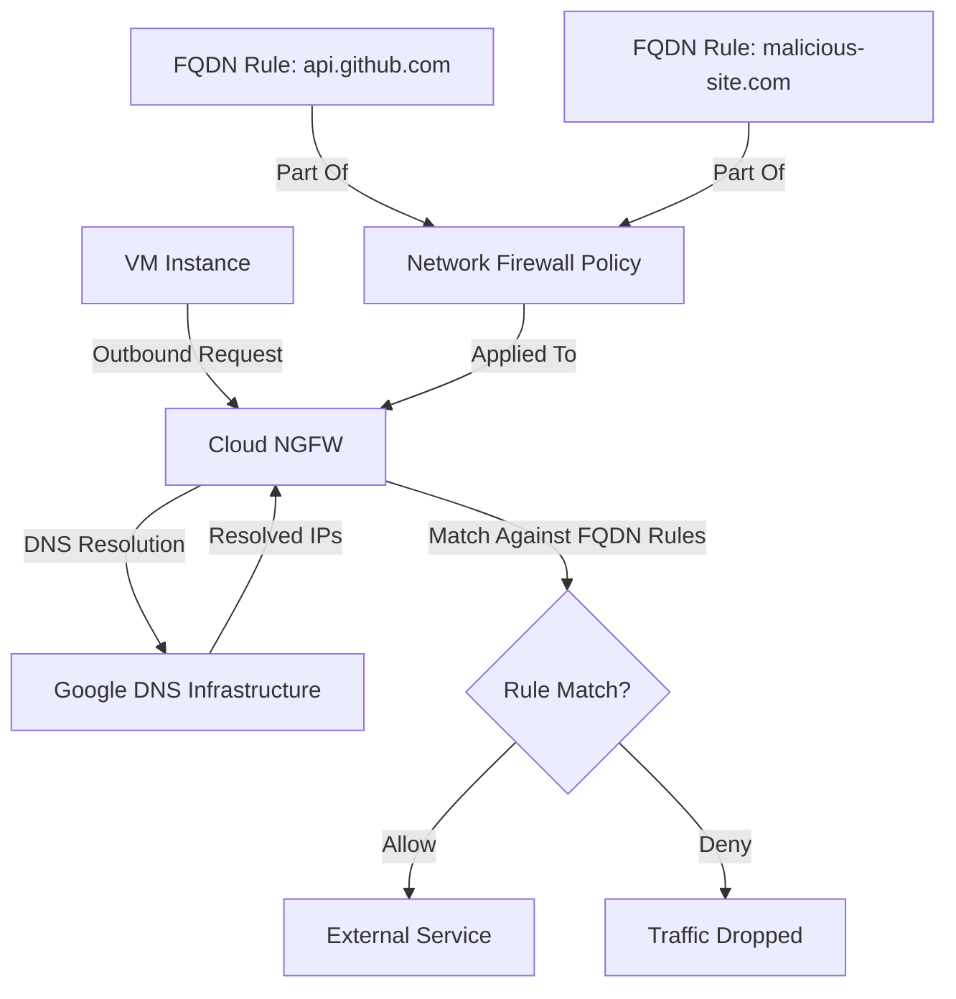

# How to Implement DNS-Based Firewall Rules Using Cloud NGFW on GCP

Author: [nawazdhandala](https://www.github.com/nawazdhandala)

Tags: GCP, Cloud NGFW, DNS Firewall, Network Security, Google Cloud

Description: Learn how to implement DNS-based firewall rules using Cloud Next Generation Firewall on Google Cloud Platform to control traffic based on domain names.

---

When you are managing network security on Google Cloud, there comes a point where IP-based firewall rules just do not cut it anymore. IP addresses change, services use CDNs with rotating addresses, and keeping track of them all is a nightmare. This is where DNS-based firewall rules come in - they let you write rules based on domain names instead of IP addresses. Google Cloud's Next Generation Firewall (Cloud NGFW) makes this possible, and in this post, I will walk you through setting it up from scratch.

## What Is Cloud NGFW?

Cloud NGFW is Google Cloud's managed firewall service that goes beyond the standard VPC firewall rules. It supports features like intrusion detection and prevention (IDPS), TLS inspection, and - most relevant to this post - fully qualified domain name (FQDN) based filtering. With FQDN objects, you can allow or deny traffic to specific domains without worrying about the underlying IP addresses.

## Prerequisites

Before we start, make sure you have the following in place:

- A GCP project with billing enabled
- A VPC network with at least one subnet
- The Compute Engine API enabled
- The `gcloud` CLI installed and authenticated
- Sufficient IAM permissions (Compute Security Admin or equivalent)

## Step 1: Enable the Required APIs

First, enable the Cloud NGFW Enterprise API if you have not already done so.

```bash
# Enable the Network Security API and Compute Engine API
gcloud services enable networksecurity.googleapis.com
gcloud services enable compute.googleapis.com
```

## Step 2: Create a Firewall Policy

Cloud NGFW uses hierarchical firewall policies or network firewall policies. For this walkthrough, we will use a network firewall policy, which is scoped to a single VPC.

```bash
# Create a global network firewall policy
gcloud compute network-firewall-policies create dns-fqdn-policy \
    --global \
    --description="Policy for DNS-based firewall rules"
```

## Step 3: Associate the Policy with Your VPC

The policy needs to be associated with the VPC network where you want it to take effect.

```bash
# Associate the policy with your VPC network
gcloud compute network-firewall-policies associations create \
    --firewall-policy=dns-fqdn-policy \
    --network=my-vpc-network \
    --global-firewall-policy \
    --name=dns-policy-association
```

## Step 4: Create FQDN-Based Rules

Now the interesting part. You can create rules that reference domain names directly. Cloud NGFW resolves these domains and applies the rules to the corresponding IP addresses automatically.

Here is a rule that allows outbound HTTPS traffic only to specific domains.

```bash
# Allow outbound HTTPS traffic to specific domains
gcloud compute network-firewall-policies rules create 1000 \
    --firewall-policy=dns-fqdn-policy \
    --global-firewall-policy \
    --direction=EGRESS \
    --action=allow \
    --dest-fqdns="api.github.com,storage.googleapis.com,registry.npmjs.org" \
    --layer4-configs=tcp:443 \
    --description="Allow HTTPS to approved external services"
```

You can also block traffic to known bad domains.

```bash
# Deny traffic to specific suspicious domains
gcloud compute network-firewall-policies rules create 2000 \
    --firewall-policy=dns-fqdn-policy \
    --global-firewall-policy \
    --direction=EGRESS \
    --action=deny \
    --dest-fqdns="malicious-example.com,phishing-site.net" \
    --layer4-configs=all \
    --description="Block traffic to known malicious domains"
```

And a default deny rule to catch everything else.

```bash
# Default deny for all other egress traffic
gcloud compute network-firewall-policies rules create 3000 \
    --firewall-policy=dns-fqdn-policy \
    --global-firewall-policy \
    --direction=EGRESS \
    --action=deny \
    --layer4-configs=all \
    --description="Default deny for all other outbound traffic"
```

## Step 5: Verify Your Rules

After creating the rules, list them to confirm everything looks right.

```bash
# List all rules in the firewall policy
gcloud compute network-firewall-policies rules list \
    --firewall-policy=dns-fqdn-policy \
    --global-firewall-policy
```

## How DNS Resolution Works in Cloud NGFW

Understanding how the DNS resolution works under the hood is important. When you specify FQDNs in your firewall rules, Cloud NGFW does not just do a one-time DNS lookup. It continuously resolves the domain names and updates the associated IP addresses. This means that if a service like `api.github.com` changes its IP addresses, your firewall rules automatically adapt.

The resolution happens at the Google Cloud infrastructure level, so it does not depend on any DNS settings within your VMs. This is a key difference from approaches where you might try to resolve domains in a script and feed IP addresses into standard firewall rules.

## Architecture Overview

Here is how the components fit together.



## Using Terraform for Infrastructure as Code

If you prefer managing your infrastructure as code, here is the Terraform equivalent.

```hcl
# Define the network firewall policy
resource "google_compute_network_firewall_policy" "dns_policy" {
  name        = "dns-fqdn-policy"
  description = "Policy for DNS-based firewall rules"
  project     = var.project_id
}

# Associate the policy with a VPC network
resource "google_compute_network_firewall_policy_association" "dns_assoc" {
  name              = "dns-policy-association"
  firewall_policy   = google_compute_network_firewall_policy.dns_policy.name
  attachment_target  = google_compute_network.my_vpc.id
  project           = var.project_id
}

# Allow HTTPS to approved domains
resource "google_compute_network_firewall_policy_rule" "allow_approved" {
  firewall_policy = google_compute_network_firewall_policy.dns_policy.name
  priority        = 1000
  direction       = "EGRESS"
  action          = "allow"
  description     = "Allow HTTPS to approved external services"
  project         = var.project_id

  match {
    # Specify the destination FQDNs for domain-based filtering
    dest_fqdns = [
      "api.github.com",
      "storage.googleapis.com",
      "registry.npmjs.org"
    ]

    layer4_configs {
      ip_protocol = "tcp"
      ports       = ["443"]
    }
  }
}

# Default deny all other egress
resource "google_compute_network_firewall_policy_rule" "default_deny" {
  firewall_policy = google_compute_network_firewall_policy.dns_policy.name
  priority        = 3000
  direction       = "EGRESS"
  action          = "deny"
  description     = "Default deny all other outbound traffic"
  project         = var.project_id

  match {
    layer4_configs {
      ip_protocol = "all"
    }
  }
}
```

## Common Gotchas

There are a few things to watch out for when using DNS-based firewall rules.

**Wildcard domains are supported but limited.** You can use patterns like `*.googleapis.com`, but the wildcard only matches one level of subdomain. So `*.googleapis.com` matches `storage.googleapis.com` but not `api.v1.googleapis.com`.

**Rule priority matters.** Lower numbers mean higher priority. Make sure your allow rules have lower priority numbers than your deny rules.

**DNS caching.** The FQDN resolution has its own TTL-based caching. If a domain's IP changes very frequently (more than once every few minutes), there might be brief windows where the old IP is still in the ruleset.

**Logging.** Enable firewall rule logging to troubleshoot issues. Without it, you will be guessing why traffic is being dropped.

```bash
# Enable logging on a firewall policy rule
gcloud compute network-firewall-policies rules update 1000 \
    --firewall-policy=dns-fqdn-policy \
    --global-firewall-policy \
    --enable-logging
```

## When to Use DNS-Based Firewall Rules

DNS-based rules work best when you need to control access to external SaaS services, APIs, or package registries - anything where the domain name is stable but the IP addresses are not. They are especially useful in environments where you need to comply with policies that require explicit allowlisting of outbound destinations.

For internal service-to-service traffic within your VPC, standard firewall rules with service accounts or tags are usually a better fit. DNS-based rules shine at the network perimeter where your workloads talk to the outside world.

## Wrapping Up

DNS-based firewall rules in Cloud NGFW give you a practical way to manage outbound traffic control without constantly chasing IP addresses. The setup is straightforward - create a policy, associate it with your VPC, and define rules using domain names. Google Cloud handles the DNS resolution and keeps your rules up to date automatically. Combined with logging and monitoring, this approach gives you solid visibility and control over what your workloads are talking to on the internet.
