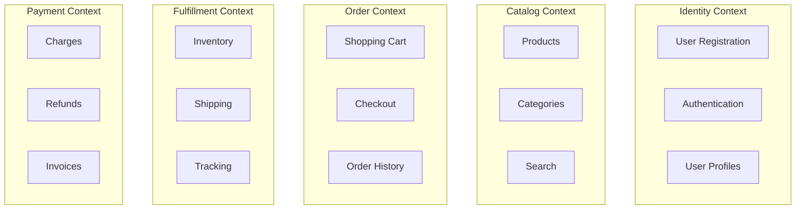

# How to Implement Domain-Driven Design Boundaries When Splitting a Monolith on GCP

Author: [nawazdhandala](https://www.github.com/nawazdhandala)

Tags: GCP, Domain-Driven Design, Microservices, Monolith Migration, Architecture, Cloud Run

Description: Apply domain-driven design principles to identify bounded contexts and define clean service boundaries when decomposing a monolithic application into microservices on Google Cloud Platform.

---

Splitting a monolith into microservices without a clear strategy leads to a distributed monolith - all the complexity of microservices with none of the benefits. Domain-Driven Design (DDD) gives you a principled way to find the right boundaries. Instead of splitting by technical layers (one service for the database, one for the API), you split by business domains.

I have used this approach on several monolith-to-microservices migrations on GCP, and the results are consistently better than the alternative of just guessing where to cut. Here is how to do it in practice.

## Starting Point: Understanding Your Monolith

Before drawing any service boundaries, you need to understand what your monolith actually does. This is not a code exercise - it is a business exercise. Talk to domain experts (product managers, customer support, business analysts) and map out the core business processes.

For this post, let us use an e-commerce platform as the example. A typical monolith might have these intertwined concerns:

- User registration and authentication
- Product catalog management
- Shopping cart and checkout
- Order processing and fulfillment
- Payment processing
- Inventory management
- Shipping and delivery tracking
- Notifications (email, SMS, push)

## Step 1: Identify Bounded Contexts

A bounded context is an area of the business where specific terms and rules apply consistently. The same word can mean different things in different contexts. For example, "product" in the catalog context has a description, images, and SEO metadata. In the inventory context, "product" is just an SKU with a quantity and warehouse location.

Map your monolith's code to bounded contexts:



## Step 2: Analyze Dependencies in the Code

Look at how the bounded contexts interact in your monolith's codebase. Find the module dependencies using static analysis:

```python
# analyze_dependencies.py - Script to find cross-module imports in a Python monolith
import ast
import os
from collections import defaultdict

def find_imports(file_path, base_package):
    """Parse a Python file and extract internal imports."""
    with open(file_path) as f:
        tree = ast.parse(f.read())

    imports = []
    for node in ast.walk(tree):
        if isinstance(node, ast.ImportFrom) and node.module:
            if node.module.startswith(base_package):
                imports.append(node.module)
    return imports

def build_dependency_graph(source_dir, base_package):
    """Build a graph of module dependencies."""
    graph = defaultdict(set)

    for root, dirs, files in os.walk(source_dir):
        for f in files:
            if f.endswith('.py'):
                path = os.path.join(root, f)
                module = path.replace('/', '.').replace('.py', '')
                for imp in find_imports(path, base_package):
                    # Map to top-level modules (bounded contexts)
                    source_context = module.split('.')[1]
                    target_context = imp.split('.')[1]
                    if source_context != target_context:
                        graph[source_context].add(target_context)

    return graph

# Run the analysis
graph = build_dependency_graph('app/', 'app')
for module, deps in sorted(graph.items()):
    print(f'{module} depends on: {", ".join(sorted(deps))}')
```

This gives you a clear picture of which contexts are tightly coupled. The ones with the fewest cross-dependencies are the best candidates to extract first.

## Step 3: Define Context Maps

A context map shows how bounded contexts relate to each other. In DDD, there are several relationship types:

- **Shared Kernel**: Two contexts share a common model (tight coupling, try to avoid)
- **Customer-Supplier**: One context provides data to another (the upstream context should not break the downstream)
- **Anti-Corruption Layer**: A translation layer that prevents one context's model from leaking into another
- **Published Language**: A well-defined API contract between contexts

For your GCP microservices, aim for Customer-Supplier relationships with published language (clear API contracts). Here is how that looks in practice:

```python
# In the Order Service, create an anti-corruption layer for the Catalog Service
# This keeps the Order Service's domain model clean and independent

class ProductReference:
    """Order Service's view of a product - only what it needs."""
    def __init__(self, sku, name, price):
        self.sku = sku
        self.name = name
        self.price = price

class CatalogAdapter:
    """Anti-corruption layer between Order Service and Catalog Service."""

    def __init__(self, catalog_service_url):
        self.base_url = catalog_service_url

    def get_product_for_order(self, product_id):
        """Fetch product details and translate to Order Service's model."""
        # Call the Catalog Service API
        response = requests.get(f'{self.base_url}/api/products/{product_id}')
        catalog_product = response.json()

        # Map to the Order Service's domain model
        # The Catalog Service has many fields we do not care about here
        return ProductReference(
            sku=catalog_product['sku'],
            name=catalog_product['title'],  # Different field name
            price=catalog_product['current_price'],  # Calculated field
        )
```

## Step 4: Design the Data Boundaries

This is where most teams struggle. In the monolith, everything shares one database. In microservices, each service owns its data. You need to figure out which tables belong to which service.

Rules of thumb:

- Each bounded context gets its own database (or at least its own schema)
- No service directly queries another service's database
- If two services need the same data, one is the owner and the other gets it through an API or event

Here is an example of data ownership mapping:

```yaml
# data_ownership.yaml - Which service owns which data
identity_service:
  owns:
    - users
    - user_profiles
    - authentication_tokens
  database: Cloud SQL (PostgreSQL)

catalog_service:
  owns:
    - products
    - categories
    - product_images
  database: Cloud Firestore

order_service:
  owns:
    - orders
    - order_items
    - shopping_carts
  database: Cloud SQL (PostgreSQL)

fulfillment_service:
  owns:
    - inventory
    - shipments
    - warehouses
  database: Cloud Spanner  # Needs strong consistency across regions

payment_service:
  owns:
    - transactions
    - invoices
    - refunds
  database: Cloud SQL (PostgreSQL)
```

## Step 5: Extract the First Service

Pick the bounded context with the fewest inbound dependencies. Often this is something like Notifications or a Catalog read service. Extract it following these steps:

1. **Create the new service** on Cloud Run with its own database.
2. **Duplicate the relevant code** into the new service (do not delete it from the monolith yet).
3. **Implement the API** that the monolith will call instead of its internal code.
4. **Use feature flags** to gradually route traffic from the monolith to the new service.
5. **Once stable**, remove the old code from the monolith.

Deploy the extracted service to Cloud Run:

```bash
# Build and deploy the catalog service
gcloud run deploy catalog-service \
  --source=services/catalog-service \
  --region=us-central1 \
  --allow-unauthenticated=false \
  --set-env-vars="DB_HOST=10.x.x.x,DB_NAME=catalog" \
  --vpc-connector=my-vpc-connector \
  --min-instances=1 \
  --max-instances=10
```

## Step 6: Handle Cross-Context Communication

Services need to communicate. For synchronous requests (one service needs data from another right now), use HTTP APIs. For asynchronous events (one service notifies others that something happened), use Pub/Sub.

```bash
# Create Pub/Sub topics for domain events
gcloud pubsub topics create order-events
gcloud pubsub topics create payment-events
gcloud pubsub topics create inventory-events

# Create subscriptions for services that need to react
gcloud pubsub subscriptions create fulfillment-on-order-created \
  --topic=order-events \
  --push-endpoint=https://fulfillment-service-xxxxx.run.app/events/order-created

gcloud pubsub subscriptions create notification-on-order-created \
  --topic=order-events \
  --push-endpoint=https://notification-service-xxxxx.run.app/events/order-created
```

## Avoiding Common Mistakes

**Do not split too small**: If two things always change together, they belong in the same service. A "nano-service" that is always deployed alongside another service is just unnecessary complexity.

**Do not share databases**: It feels convenient but it creates hidden coupling. When one service changes the schema, it breaks the other. Each service owns its data.

**Do not skip the domain analysis**: Cutting along technical boundaries (separating the API from the database layer) does not give you independent deployability. Cut along business boundaries.

**Do not try to extract everything at once**: Start with one bounded context, learn from it, and apply those lessons to the next extraction.

## Wrapping Up

Domain-Driven Design gives you a principled framework for finding microservice boundaries. The key steps are: identify bounded contexts through domain analysis, map dependencies in your existing code, define how contexts communicate (anti-corruption layers, events), separate data ownership, and then extract services one at a time starting with the least coupled. On GCP, Cloud Run handles the service hosting, Pub/Sub handles async communication, and each service gets its own managed database. The investment in getting the boundaries right up front saves you from months of refactoring a poorly decomposed distributed system later.
